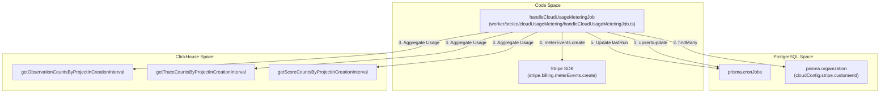
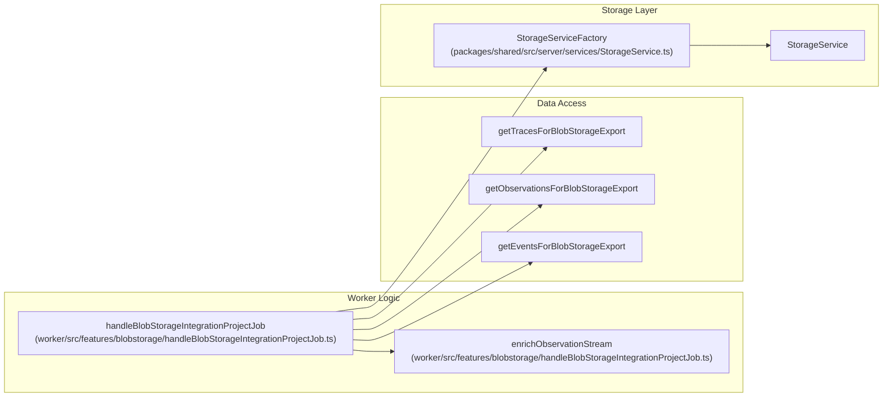
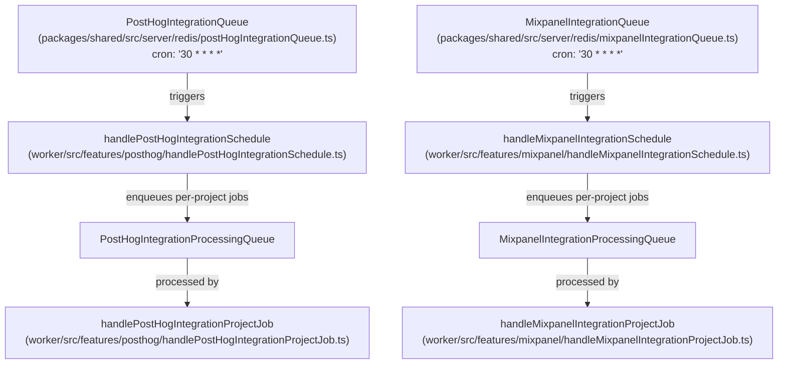

# Scheduled Jobs

<details>
<summary>Relevant source files</summary>

The following files were used as context for generating this wiki page:

- [fern/apis/server/definition/blob-storage-integrations.yml](fern/apis/server/definition/blob-storage-integrations.yml)
- [packages/shared/src/features/analytics-integrations/index.ts](packages/shared/src/features/analytics-integrations/index.ts)
- [packages/shared/src/server/analytics-integrations/types.ts](packages/shared/src/server/analytics-integrations/types.ts)
- [packages/shared/src/server/services/StorageService.ts](packages/shared/src/server/services/StorageService.ts)
- [web/src/__tests__/blob-storage-form-field-groups.clienttest.ts](web/src/__tests__/blob-storage-form-field-groups.clienttest.ts)
- [web/src/__tests__/server/blob-storage-integration-api.servertest.ts](web/src/__tests__/server/blob-storage-integration-api.servertest.ts)
- [web/src/__tests__/server/blob-storage-integration-trpc.servertest.ts](web/src/__tests__/server/blob-storage-integration-trpc.servertest.ts)
- [web/src/__tests__/server/mixpanel-integration.servertest.ts](web/src/__tests__/server/mixpanel-integration.servertest.ts)
- [web/src/__tests__/server/posthog-integration.servertest.ts](web/src/__tests__/server/posthog-integration.servertest.ts)
- [web/src/features/blobstorage-integration/blobstorage-integration-router.ts](web/src/features/blobstorage-integration/blobstorage-integration-router.ts)
- [web/src/features/blobstorage-integration/service.ts](web/src/features/blobstorage-integration/service.ts)
- [web/src/features/blobstorage-integration/types.ts](web/src/features/blobstorage-integration/types.ts)
- [web/src/features/evals/components/evaluator-table.tsx](web/src/features/evals/components/evaluator-table.tsx)
- [web/src/features/evals/components/inner-evaluator-form.tsx](web/src/features/evals/components/inner-evaluator-form.tsx)
- [web/src/features/evals/server/router.ts](web/src/features/evals/server/router.ts)
- [web/src/features/mixpanel-integration/mixpanel-integration-router.ts](web/src/features/mixpanel-integration/mixpanel-integration-router.ts)
- [web/src/features/mixpanel-integration/types.ts](web/src/features/mixpanel-integration/types.ts)
- [web/src/features/posthog-integration/posthog-integration-router.ts](web/src/features/posthog-integration/posthog-integration-router.ts)
- [web/src/features/public-api/types/blob-storage-integrations.ts](web/src/features/public-api/types/blob-storage-integrations.ts)
- [web/src/pages/api/public/integrations/blob-storage/index.ts](web/src/pages/api/public/integrations/blob-storage/index.ts)
- [web/src/pages/project/[projectId]/settings/integrations/blobstorage.tsx](web/src/pages/project/[projectId]/settings/integrations/blobstorage.tsx)
- [web/src/pages/project/[projectId]/settings/integrations/mixpanel.tsx](web/src/pages/project/[projectId]/settings/integrations/mixpanel.tsx)
- [web/src/pages/project/[projectId]/settings/integrations/posthog.tsx](web/src/pages/project/[projectId]/settings/integrations/posthog.tsx)
- [worker/src/__tests__/blobStorageIntegrationProcessing.test.ts](worker/src/__tests__/blobStorageIntegrationProcessing.test.ts)
- [worker/src/__tests__/enrichObservationStream.unit.test.ts](worker/src/__tests__/enrichObservationStream.unit.test.ts)
- [worker/src/__tests__/evalService.filtering.test.ts](worker/src/__tests__/evalService.filtering.test.ts)
- [worker/src/__tests__/evalService.test.ts](worker/src/__tests__/evalService.test.ts)
- [worker/src/__tests__/mixpanelTransformers.test.ts](worker/src/__tests__/mixpanelTransformers.test.ts)
- [worker/src/__tests__/storageservice.test.ts](worker/src/__tests__/storageservice.test.ts)
- [worker/src/ee/cloudUsageMetering/handleCloudUsageMeteringJob.ts](worker/src/ee/cloudUsageMetering/handleCloudUsageMeteringJob.ts)
- [worker/src/features/blobstorage/handleBlobStorageIntegrationProjectJob.ts](worker/src/features/blobstorage/handleBlobStorageIntegrationProjectJob.ts)
- [worker/src/features/evaluation/evalService.ts](worker/src/features/evaluation/evalService.ts)
- [worker/src/features/mixpanel/handleMixpanelIntegrationProjectJob.ts](worker/src/features/mixpanel/handleMixpanelIntegrationProjectJob.ts)
- [worker/src/features/mixpanel/mixpanelClient.ts](worker/src/features/mixpanel/mixpanelClient.ts)
- [worker/src/features/mixpanel/transformers.ts](worker/src/features/mixpanel/transformers.ts)
- [worker/src/features/posthog/handlePostHogIntegrationProjectJob.ts](worker/src/features/posthog/handlePostHogIntegrationProjectJob.ts)
- [worker/src/features/posthog/transformers.ts](worker/src/features/posthog/transformers.ts)
- [worker/src/queues/batchExportQueue.ts](worker/src/queues/batchExportQueue.ts)
- [worker/src/queues/cloudUsageMeteringQueue.ts](worker/src/queues/cloudUsageMeteringQueue.ts)
- [worker/src/queues/evalQueue.ts](worker/src/queues/evalQueue.ts)

</details>


This page documents the recurring and scheduled jobs that run in the Langfuse worker process. These are time-driven jobs as opposed to event-driven queue processors. For documentation of one-off queue processors triggered by user actions (eval execution, batch export, trace delete, etc.), see page [7.3](). For background services that start at worker boot and run continuously, see page [7.5]().

---

## Scheduled Job Inventory

All scheduled jobs are implemented as BullMQ repeating jobs. The schedule is registered when the queue singleton is initialized, typically at worker startup.

| Queue Class | Queue Name Constant | Cron Pattern | Frequency | Schedule Registered In |
|---|---|---|---|---|
| `EventPropagationQueue` | `QueueName.EventPropagationQueue` | `* * * * *` | Every minute | [packages/shared/src/server/redis/eventPropagationQueue.ts:13-68]() |
| `PostHogIntegrationQueue` | `QueueName.PostHogIntegrationQueue` | `30 * * * *` | Hourly at :30 | [packages/shared/src/server/redis/postHogIntegrationQueue.ts:15-85]() |
| `MixpanelIntegrationQueue` | `QueueName.MixpanelIntegrationQueue` | `30 * * * *` | Hourly at :30 | [packages/shared/src/server/redis/mixpanelIntegrationQueue.ts:15-85]() |
| `BlobStorageIntegrationQueue` | `QueueName.BlobStorageIntegrationQueue` | hourly | Hourly | [packages/shared/src/server/redis/blobStorageIntegrationQueue.ts:1-30]() |
| `CloudUsageMeteringQueue` | `QueueName.CloudUsageMeteringQueue` | hourly | Hourly | [packages/shared/src/server/redis/cloudUsageMeteringQueue.ts:1-30]() |

**Concurrency notes:** `EventPropagationQueue` sets a global concurrency of 1 to enforce sequential partition processing. The analytics integration queues use separate per-project processing queues (`PostHogIntegrationProcessingQueue`, `MixpanelIntegrationProcessingQueue`) for fan-out.

Sources: [packages/shared/src/server/redis/eventPropagationQueue.ts:13-68](), [packages/shared/src/server/redis/postHogIntegrationQueue.ts:15-85](), [packages/shared/src/server/redis/mixpanelIntegrationQueue.ts:15-85](), [packages/shared/src/server/redis/blobStorageIntegrationQueue.ts:1-30]()

---

## Cloud Usage Metering Cron

**Purpose:** Calculates organization-level usage metrics (traces, observations, scores) and reports them to Stripe for billing. This job is exclusive to the Langfuse Cloud (EE) environment.

**Implementation:** The `handleCloudUsageMeteringJob` function manages a custom cron state within the `CronJobs` table in PostgreSQL to ensure exactly-once processing per hour [worker/src/ee/cloudUsageMetering/handleCloudUsageMeteringJob.ts:34-42]().

### Execution Flow

1. **State Management:** Checks the `CronJobs` table for `cloud-usage-metering`. It ensures the `lastRun` was on a full hour and that no other job is currently `Processing` [worker/src/ee/cloudUsageMetering/handleCloudUsageMeteringJob.ts:34-72]().
2. **Data Collection:** Queries ClickHouse for usage counts within the last full hour interval:
    - `getObservationCountsByProjectInCreationInterval` [worker/src/ee/cloudUsageMetering/handleCloudUsageMeteringJob.ts:138-141]()
    - `getTraceCountsByProjectInCreationInterval` [worker/src/ee/cloudUsageMetering/handleCloudUsageMeteringJob.ts:142-145]()
    - `getScoreCountsByProjectInCreationInterval` [worker/src/ee/cloudUsageMetering/handleCloudUsageMeteringJob.ts:146-149]()
3. **Stripe Reporting:** For each organization with a `stripe.customerId`, it sends `meterEvents` to Stripe [worker/src/ee/cloudUsageMetering/handleCloudUsageMeteringJob.ts:162-211]().
    - **Legacy Meter:** `tracing_observations` (counts observations) [worker/src/ee/cloudUsageMetering/handleCloudUsageMeteringJob.ts:199-206]().
    - **Unified Meter:** `events` (sum of traces + observations + scores) [worker/src/ee/cloudUsageMetering/handleCloudUsageMeteringJob.ts:220-238]().
4. **Completion:** Updates the `CronJobs` record with the new `lastRun` timestamp and sets state back to `Queued` [worker/src/ee/cloudUsageMetering/handleCloudUsageMeteringJob.ts:275-285]().

**Cloud Usage Metering — Code Entities**



Sources: [worker/src/ee/cloudUsageMetering/handleCloudUsageMeteringJob.ts:27-285](), [worker/src/queues/cloudUsageMeteringQueue.ts:14-70]()

---

## Blob Storage Integration Job

**Purpose:** Periodic export of project data (traces, observations, scores, events) to customer-managed blob storage (S3, Azure, or GCS).

**Implementation:** The `handleBlobStorageIntegrationProjectJob` handles the actual data transfer for a specific project and table [worker/src/features/blobstorage/handleBlobStorageIntegrationProjectJob.ts:203-205]().

1. **Timestamp Resolution:** Determines the `minTimestamp` based on `lastSyncAt` or `exportMode` (FULL_HISTORY, FROM_TODAY, FROM_CUSTOM_DATE). For `FULL_HISTORY`, it queries ClickHouse for the minimum timestamp across all tables [worker/src/features/blobstorage/handleBlobStorageIntegrationProjectJob.ts:95-158]().
2. **Data Fetching:** Streams data from ClickHouse using specialized functions like `getTracesForBlobStorageExport`, `getObservationsForBlobStorageExport`, or `getEventsForBlobStorageExport` [worker/src/features/blobstorage/handleBlobStorageIntegrationProjectJob.ts:12-15]().
3. **Model Enrichment:** For observations, the stream is enriched with model pricing data using `createModelCache` and `enrichObservationWithModelData` within the `enrichObservationStream` generator [worker/src/features/blobstorage/handleBlobStorageIntegrationProjectJob.ts:40-81]().
4. **Compression:** Optionally pipes the stream through `createGzip()` if the integration is configured as `compressed` [worker/src/features/blobstorage/handleBlobStorageIntegrationProjectJob.ts:2-4]().
5. **Manual Trigger:** Users can trigger an immediate export via the `runNow` mutation in the `blobStorageIntegrationRouter` [web/src/features/blobstorage-integration/blobstorage-integration-router.ts:181-223]().

**Blob Storage Export — Code Entities**



Sources: [worker/src/features/blobstorage/handleBlobStorageIntegrationProjectJob.ts:38-260](), [web/src/features/blobstorage-integration/blobstorage-integration-router.ts:181-223](), [packages/shared/src/server/services/StorageService.ts:188-220]()

---

## Analytics Integration Schedulers

Both the PostHog and Mixpanel integrations use a two-tier pattern:

1. **Scheduler queue** (cron-driven, runs hourly at :30) — queries Postgres for all enabled integrations, then fans out one job per project to the **processing queue**.
2. **Processing queue** (event-driven) — each job handles one project: fetches data from ClickHouse, streams it to the external service using the service's SDK, and updates `lastSyncAt`.

**Two-tier Analytics Scheduler Architecture**



Sources: [packages/shared/src/server/redis/postHogIntegrationQueue.ts:15-85](), [packages/shared/src/server/redis/mixpanelIntegrationQueue.ts:15-85](), [worker/src/features/posthog/handlePostHogIntegrationProjectJob.ts:1-20](), [worker/src/features/mixpanel/handleMixpanelIntegrationProjectJob.ts:1-20]()

---

## Batch Export Job

**Purpose:** Handles user-initiated exports of large datasets from the UI to CSV or JSON formats. While often triggered by a user, these are background tasks processed by the worker.

**Implementation:**
- The `batchExportQueueProcessor` receives a `batchExportId` [worker/src/queues/batchExportQueue.ts:14-16]().
- It calls `handleBatchExportJob` to perform the heavy lifting [worker/src/queues/batchExportQueue.ts:19-19]().
- On failure, it updates the `batchExport` record in PostgreSQL with a `FAILED` status and the error log [worker/src/queues/batchExportQueue.ts:34-44]().

Sources: [worker/src/queues/batchExportQueue.ts:1-53]()

---

## Queue Registration Pattern

All scheduled queues follow the same singleton registration pattern. The cron job is added inside `getInstance()` so it is registered once per process lifetime:

```typescript
// Typical registration pattern in Queue classes
public static getInstance(): TQueue | null {
  if (!this.instance) {
    this.instance = new BullMQ.Queue(QueueName.X, { connection });
    this.instance.add(
      QueueJobs.ScheduledJob,
      {},
      { repeat: { pattern: "0 * * * *" } } // Hourly example
    );
  }
  return this.instance;
}
```

Sources: [packages/shared/src/server/redis/eventPropagationQueue.ts:13-67](), [packages/shared/src/server/redis/postHogIntegrationQueue.ts:15-85](), [packages/shared/src/server/redis/blobStorageIntegrationQueue.ts:1-30]()
