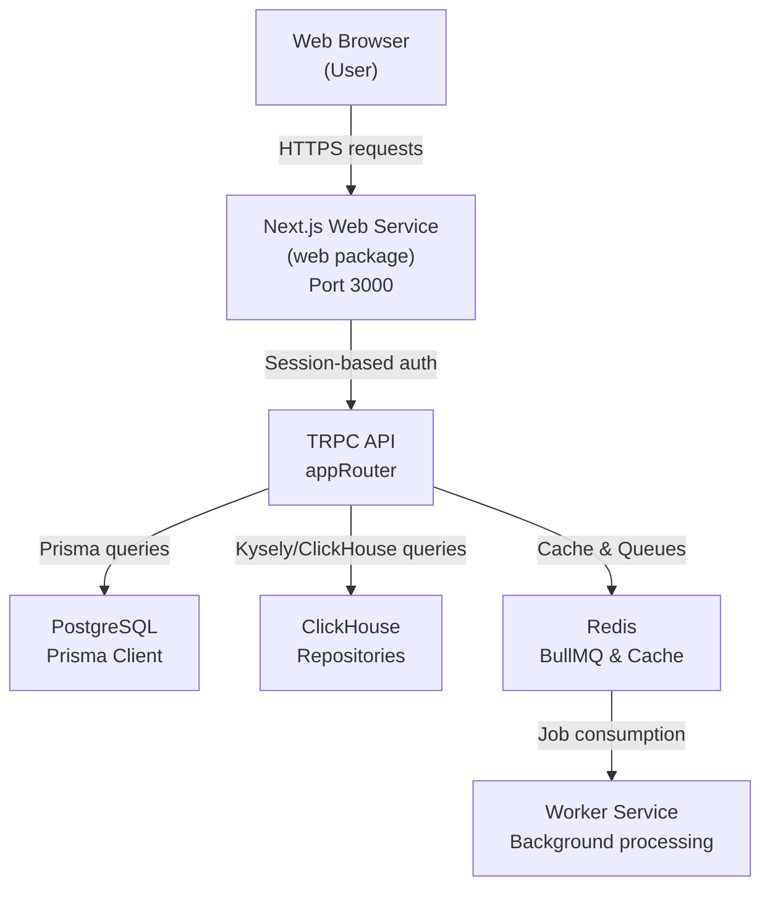
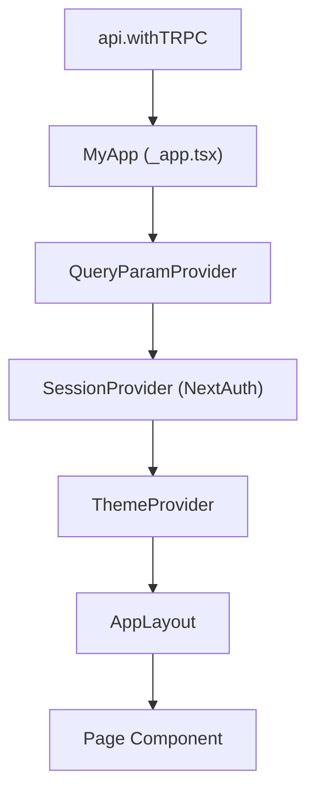
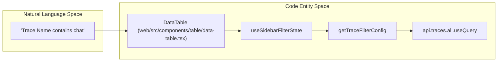
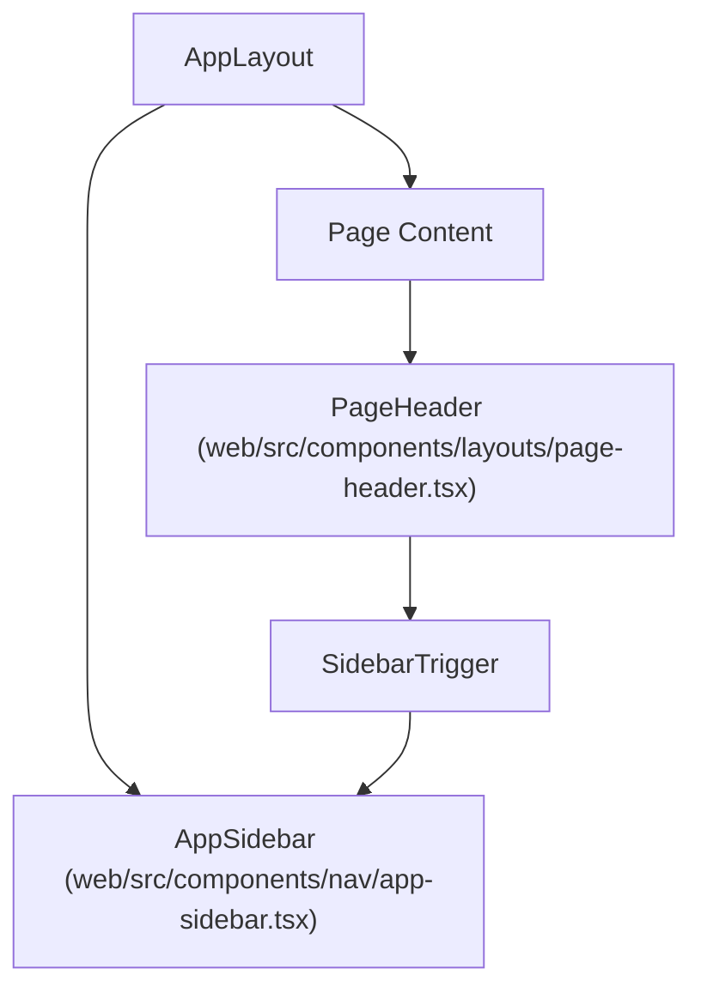

# Web Application

Relevant source files

The following files were used as context for generating this wiki page:

- [packages/shared/src/server/tableMappings/mapScoresColumnsTable.ts](packages/shared/src/server/tableMappings/mapScoresColumnsTable.ts)
- [web/instrumentation-client.ts](web/instrumentation-client.ts)
- [web/next.config.mjs](web/next.config.mjs)
- [web/playwright.config.ts](web/playwright.config.ts)
- [web/src/__e2e__/auth.spec.ts](web/src/__e2e__/auth.spec.ts)
- [web/src/__tests__/redirect.clienttest.ts](web/src/__tests__/redirect.clienttest.ts)
- [web/src/components/error-page.tsx](web/src/components/error-page.tsx)
- [web/src/components/grouped-score-badge.tsx](web/src/components/grouped-score-badge.tsx)
- [web/src/components/layouts/app-layout/hooks/useAuthGuard.ts](web/src/components/layouts/app-layout/hooks/useAuthGuard.ts)
- [web/src/components/layouts/app-layout/hooks/useAuthSession.ts](web/src/components/layouts/app-layout/hooks/useAuthSession.ts)
- [web/src/components/layouts/app-layout/hooks/useFilteredNavigation.ts](web/src/components/layouts/app-layout/hooks/useFilteredNavigation.ts)
- [web/src/components/layouts/app-layout/hooks/useLayoutConfiguration.ts](web/src/components/layouts/app-layout/hooks/useLayoutConfiguration.ts)
- [web/src/components/layouts/app-layout/hooks/useLayoutMetadata.ts](web/src/components/layouts/app-layout/hooks/useLayoutMetadata.ts)
- [web/src/components/layouts/app-layout/hooks/useProjectAccess.ts](web/src/components/layouts/app-layout/hooks/useProjectAccess.ts)
- [web/src/components/layouts/app-layout/index.tsx](web/src/components/layouts/app-layout/index.tsx)
- [web/src/components/layouts/app-layout/utils/navigationFilters.types.ts](web/src/components/layouts/app-layout/utils/navigationFilters.types.ts)
- [web/src/components/layouts/page-header.tsx](web/src/components/layouts/page-header.tsx)
- [web/src/components/nav/app-sidebar.tsx](web/src/components/nav/app-sidebar.tsx)
- [web/src/components/nav/nav-main.tsx](web/src/components/nav/nav-main.tsx)
- [web/src/components/scores-table-cell.tsx](web/src/components/scores-table-cell.tsx)
- [web/src/components/ui/hover-card.tsx](web/src/components/ui/hover-card.tsx)
- [web/src/components/ui/sidebar.tsx](web/src/components/ui/sidebar.tsx)
- [web/src/components/ui/tooltip.tsx](web/src/components/ui/tooltip.tsx)
- [web/src/features/experiments/components/ExperimentsBetaSwitch.tsx](web/src/features/experiments/components/ExperimentsBetaSwitch.tsx)
- [web/src/features/organizations/components/ProjectOverview.tsx](web/src/features/organizations/components/ProjectOverview.tsx)
- [web/src/features/scores/hooks/useScoreColumns.ts](web/src/features/scores/hooks/useScoreColumns.ts)
- [web/src/hooks/useTrpcError.tsx](web/src/hooks/useTrpcError.tsx)
- [web/src/instrumentation.ts](web/src/instrumentation.ts)
- [web/src/pages/_app.tsx](web/src/pages/_app.tsx)
- [web/src/pages/api/trpc/[trpc].ts](web/src/pages/api/trpc/[trpc].ts)
- [web/src/pages/auth/error.tsx](web/src/pages/auth/error.tsx)
- [web/src/pages/project/[projectId]/datasets/[datasetId]/compare/charts.tsx](web/src/pages/project/[projectId]/datasets/[datasetId]/compare/charts.tsx)
- [web/src/pages/project/[projectId]/datasets/[datasetId]/compare/index.tsx](web/src/pages/project/[projectId]/datasets/[datasetId]/compare/index.tsx)
- [web/src/utils/api.ts](web/src/utils/api.ts)
- [web/src/utils/redirect.ts](web/src/utils/redirect.ts)

The web application is Langfuse's primary user interface, implemented as a Next.js application. It provides the UI for observability dashboards, trace exploration, prompt management, evaluation configuration, and system administration. The application communicates with the backend through a type-safe tRPC API and renders data from both PostgreSQL (metadata) and ClickHouse (observability data).

**Relationship to the larger system:**

Sources: [web/src/pages/api/trpc/[trpc].ts:17-54](), [web/src/utils/api.ts:178-216]()

This page provides a high-level overview of the web architecture. For details on specific subsystems, see the following child pages:

- [Application Structure](#8.1) — Next.js App Router usage, middleware, and page organization.
- [Table Components System](#8.2) — Reusable `DataTable` and specialized table definitions (Traces, Observations, Scores).
- [UI State Management](#8.3) — Custom hooks for pagination, ordering, and URL persistence via `use-query-params`.
- [Trace & Session Views](#8.4) — Trace tree visualization, timelines, and the V4 Beta viewer which constructs synthetic traces from events.
- [Virtualization & Performance](#8.5) — `@tanstack/react-virtual` strategies for large datasets and lazy loading.
- [Filter & View System](#8.6) — `PopoverFilterBuilder`, operator logic, and saved `TableViewPresets`.
- [Batch Actions & Selection](#8.7) — `useSelectAll` hook and bulk operations like deletion, tagging, and dataset addition.

---

## Technology Stack

The web application resides in the `web/` workspace. It utilizes the Next.js Pages Router for the majority of its interface, while integrating modern React 19 features and Tailwind CSS for styling.

| Category | Library / Version |
|---|---|
| Framework | Next.js 15 (Pages Router) |
| UI runtime | React 19 |
| Styling | Tailwind CSS |
| Data Fetching | tRPC 11 + `@tanstack/react-query` 5 |
| State Persistence | `use-query-params` with `NextAdapterPages` |
| Tables | `@tanstack/react-table` 8 + `@tanstack/react-virtual` 3 |
| Authentication | NextAuth.js 4 |
| Error Tracking | Sentry (`@sentry/nextjs`) |
| Analytics | PostHog JS |

Sources: [web/src/pages/_app.tsx:1-30](), [web/src/utils/api.ts:178-230](), [web/next.config.mjs:49-56]()

---

## Core Architecture & Initialization

### Client-Side Entrypoint
The application is wrapped in several providers in `_app.tsx` to handle theming, tooltips, command menus, and session management. A notable polyfill is implemented in `_app.tsx` to prevent React crashes caused by Google Translate modifying the DOM by wrapping text nodes in `` elements. This polyfill catches `NotFoundError` exceptions in `removeChild` and `insertBefore`.

Sources: [web/src/pages/_app.tsx:39-70](), [web/src/pages/_app.tsx:108-171]()

### Data Table Architecture
The UI relies heavily on a centralized `DataTable` component. This component bridges the "Natural Language Space" (user filters like "Trace Name contains 'chat'") to the "Code Entity Space" (SQL filters and tRPC parameters).

Sources: [web/src/components/table/data-table.tsx:156-182](), [web/src/features/filters/hooks/useSidebarFilterState.ts:1-20]()

### Instrumentation & Observability
Server-side initialization scripts (OpenTelemetry and system initialization) are handled in `instrumentation.ts`. Client-side error tracking is managed via Sentry in `instrumentation-client.ts`. The `next.config.mjs` defines strict Content Security Policy (CSP) headers to secure the application while allowing necessary external services like PostHog and Stripe.

Sources: [web/src/instrumentation.ts:1-15](), [web/instrumentation-client.ts:8-90](), [web/next.config.mjs:13-29]()

---

## Navigation & UI Layout

### Sidebar and Header
The application uses a responsive `Sidebar` system that persists its state (expanded/collapsed) in `localStorage` using the `SIDEBAR_STORAGE_KEY`. The `PageHeader` component provides consistent breadcrumbs, action buttons, and environment labels across the app.

Sources: [web/src/components/ui/sidebar.tsx:23-48](), [web/src/components/nav/app-sidebar.tsx:43-72](), [web/src/components/layouts/page-header.tsx:57-106]()

### Project and Organization Overview
The entry point for users is the `OrganizationProjectOverview`, which renders project tiles grouped by organization. It uses `useHasOrganizationAccess` to determine if a user can create new projects or view members.

Sources: [web/src/features/organizations/components/ProjectOverview.tsx:37-77](), [web/src/features/organizations/components/ProjectOverview.tsx:109-154]()

---

## API & Error Handling

### tRPC Integration
The application uses a `splitLink` in its tRPC configuration. It currently defaults to skipping batching for all requests (`alwaysSkipBatch = true`) to optimize performance for specific query patterns, routing requests through `httpLink` to `/api/trpc`.

Sources: [web/src/utils/api.ts:194-216]()

### Global Error Management
Errors are handled via `handleTrpcError`, which:
1. Reports system errors to Sentry via `captureException`.
2. Displays user-facing toasts via `trpcErrorToast`.
3. Debounces repeated errors using `recentErrorCache` (with a 20s TTL) to prevent toast spam.
4. Detects version mismatches by comparing `x-build-id` headers from the server with the client's `NEXT_PUBLIC_BUILD_ID` to prompt users to refresh when the client cache is stale via `showVersionUpdateToast`.

Sources: [web/src/utils/api.ts:105-133](), [web/src/utils/api.ts:136-160](), [web/src/pages/api/trpc/[trpc].ts:20-44]()
