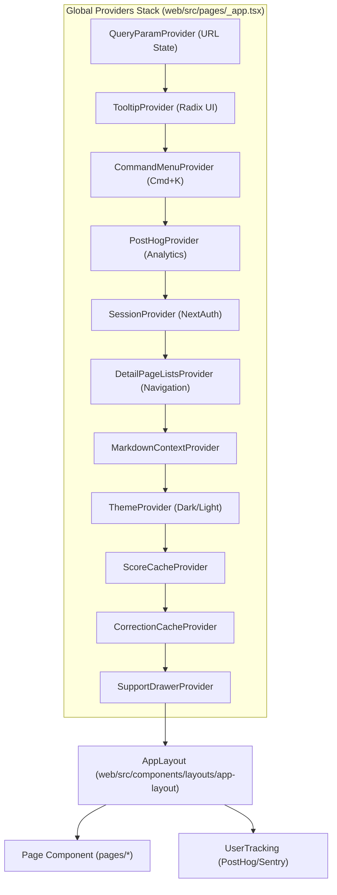
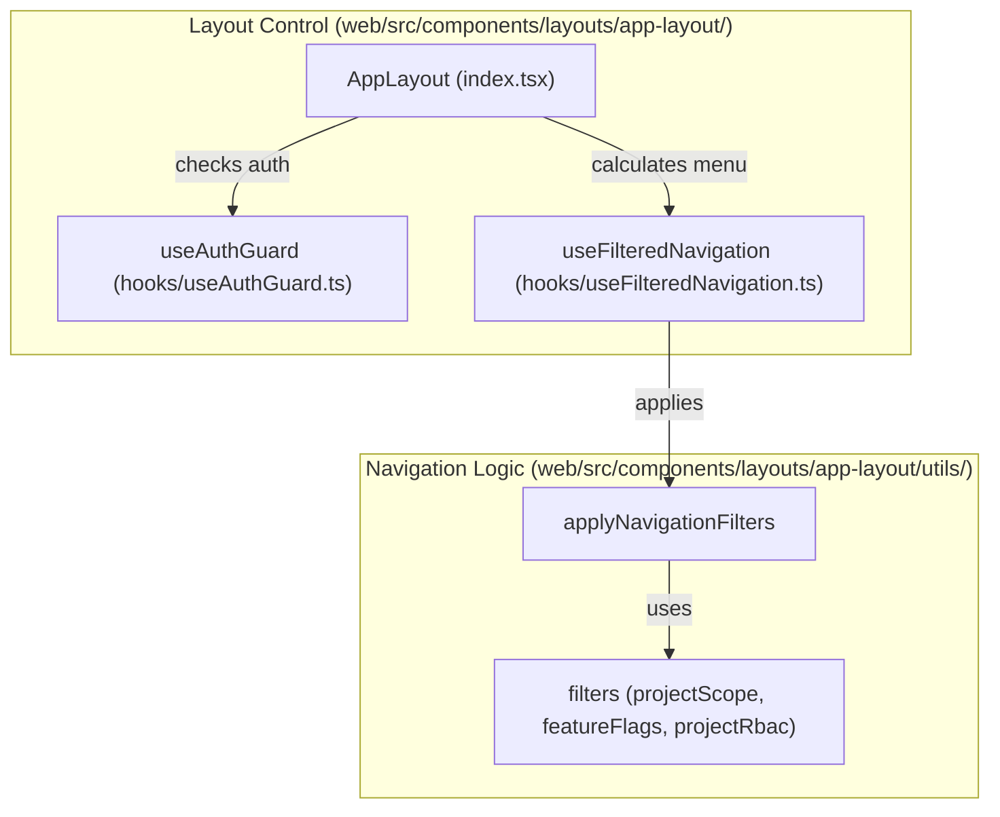
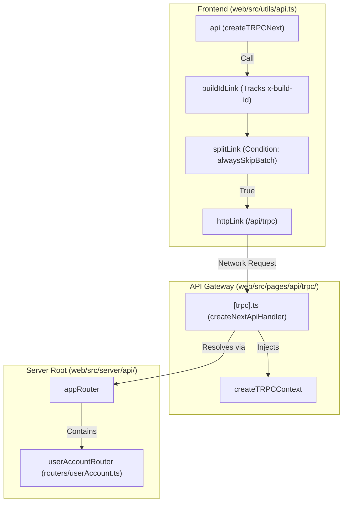

# Application Structure

Relevant source files

The following files were used as context for generating this wiki page:

- [packages/shared/prisma/migrations/20260130000000_add_v4_beta_enabled/migration.sql](packages/shared/prisma/migrations/20260130000000_add_v4_beta_enabled/migration.sql)
- [web/instrumentation-client.ts](web/instrumentation-client.ts)
- [web/next.config.mjs](web/next.config.mjs)
- [web/playwright.config.ts](web/playwright.config.ts)
- [web/src/__e2e__/auth.spec.ts](web/src/__e2e__/auth.spec.ts)
- [web/src/__e2e__/create-project.spec.ts](web/src/__e2e__/create-project.spec.ts)
- [web/src/__tests__/experiments-access.clienttest.ts](web/src/__tests__/experiments-access.clienttest.ts)
- [web/src/__tests__/redirect.clienttest.ts](web/src/__tests__/redirect.clienttest.ts)
- [web/src/components/error-page.tsx](web/src/components/error-page.tsx)
- [web/src/components/layouts/app-layout/hooks/useAuthGuard.ts](web/src/components/layouts/app-layout/hooks/useAuthGuard.ts)
- [web/src/components/layouts/app-layout/hooks/useAuthSession.ts](web/src/components/layouts/app-layout/hooks/useAuthSession.ts)
- [web/src/components/layouts/app-layout/hooks/useFilteredNavigation.ts](web/src/components/layouts/app-layout/hooks/useFilteredNavigation.ts)
- [web/src/components/layouts/app-layout/hooks/useLayoutConfiguration.ts](web/src/components/layouts/app-layout/hooks/useLayoutConfiguration.ts)
- [web/src/components/layouts/app-layout/hooks/useLayoutMetadata.ts](web/src/components/layouts/app-layout/hooks/useLayoutMetadata.ts)
- [web/src/components/layouts/app-layout/hooks/useProjectAccess.ts](web/src/components/layouts/app-layout/hooks/useProjectAccess.ts)
- [web/src/components/layouts/app-layout/index.tsx](web/src/components/layouts/app-layout/index.tsx)
- [web/src/components/layouts/app-layout/utils/navigationFilters.ts](web/src/components/layouts/app-layout/utils/navigationFilters.ts)
- [web/src/components/layouts/app-layout/utils/navigationFilters.types.ts](web/src/components/layouts/app-layout/utils/navigationFilters.types.ts)
- [web/src/components/layouts/container-page.tsx](web/src/components/layouts/container-page.tsx)
- [web/src/components/layouts/page.tsx](web/src/components/layouts/page.tsx)
- [web/src/components/ui/sheet.tsx](web/src/components/ui/sheet.tsx)
- [web/src/features/events/lib/v4Rollout.ts](web/src/features/events/lib/v4Rollout.ts)
- [web/src/features/experiments/hooks/useExperimentAccess.ts](web/src/features/experiments/hooks/useExperimentAccess.ts)
- [web/src/features/experiments/utils/experimentsAccess.ts](web/src/features/experiments/utils/experimentsAccess.ts)
- [web/src/features/organizations/components/NewOrganizationForm.tsx](web/src/features/organizations/components/NewOrganizationForm.tsx)
- [web/src/features/organizations/utils/organizationNameSchema.ts](web/src/features/organizations/utils/organizationNameSchema.ts)
- [web/src/features/projects/components/NewProjectForm.tsx](web/src/features/projects/components/NewProjectForm.tsx)
- [web/src/features/setup/components/SetupPage.tsx](web/src/features/setup/components/SetupPage.tsx)
- [web/src/features/setup/components/SetupTracingButton.tsx](web/src/features/setup/components/SetupTracingButton.tsx)
- [web/src/features/setup/setupRoutes.ts](web/src/features/setup/setupRoutes.ts)
- [web/src/hooks/useTrpcError.tsx](web/src/hooks/useTrpcError.tsx)
- [web/src/instrumentation.ts](web/src/instrumentation.ts)
- [web/src/pages/_app.tsx](web/src/pages/_app.tsx)
- [web/src/pages/api/trpc/[trpc].ts](web/src/pages/api/trpc/[trpc].ts)
- [web/src/pages/auth/error.tsx](web/src/pages/auth/error.tsx)
- [web/src/pages/project/[projectId]/experiments/analytics.tsx](web/src/pages/project/[projectId]/experiments/analytics.tsx)
- [web/src/pages/project/[projectId]/experiments/results.tsx](web/src/pages/project/[projectId]/experiments/results.tsx)
- [web/src/server/api/routers/userAccount.ts](web/src/server/api/routers/userAccount.ts)
- [web/src/utils/api.ts](web/src/utils/api.ts)
- [web/src/utils/redirect.ts](web/src/utils/redirect.ts)

## Purpose and Scope

This document describes the Next.js web application structure, including the organization of pages, components, API routes, and server-side code. It explains how the web service is architected as a Next.js application using the Pages Router pattern, how code is organized into directories, and how the application is built and deployed.

For information about the overall system architecture including the worker service and data layer, see [System Architecture](#1.1). For tRPC API implementation details, see [tRPC Internal API](#5.2). For component-specific implementations like tables and forms, see [Table Components System](#8.2).

---

## Next.js Architecture

Langfuse uses Next.js with the **Pages Router** pattern. The application entry point is `web/src/pages/_app.tsx`, which wraps the component tree with global providers for authentication, state management, and UI context [web/src/pages/_app.tsx:108-171]().

### Application Bootstrap (`_app.tsx`)

The `MyApp` component initializes the client-side environment, including polyfills for modern JavaScript features like `array/to-reversed` [web/src/pages/_app.tsx:23-29]() and a DOM manipulation patch to prevent React crashes caused by Google Translate wrapping text nodes in `` elements [web/src/pages/_app.tsx:39-70]().

#### Global Provider Stack

**Sources:** [web/src/pages/_app.tsx:130-168](), [web/src/pages/_app.tsx:108-111]()

### Instrumentation and Monitoring

The application uses a dual-instrumentation strategy for observability:
1.  **Sentry**: Initialized in `web/instrumentation-client.ts` to capture exceptions, browser profiling, and session replays [web/instrumentation-client.ts:8-90](). It includes filters to ignore benign errors like browser extension failures or invalid Next.js router hrefs [web/instrumentation-client.ts:13-33]().
2.  **PostHog**: Initialized in `_app.tsx` for product analytics [web/src/pages/_app.tsx:83-106](). It tracks page views via `router.events` [web/src/pages/_app.tsx:114-127]() and identifies users upon successful authentication in the `UserTracking` component [web/src/pages/_app.tsx:173-200]().
3.  **Server-side Init**: The `web/src/instrumentation.ts` file handles Node.js runtime initialization, importing `observability.config` and `initialize` scripts if `isInitLoadingEnabled` is true [web/src/instrumentation.ts:1-15]().

**Sources:** [web/instrumentation-client.ts:1-94](), [web/src/pages/_app.tsx:83-106](), [web/src/pages/_app.tsx:173-200](), [web/src/instrumentation.ts:1-15]()

---

## Page and Layout Organization

### Layout Management (`AppLayout`)

The `AppLayout` component serves as the primary structural controller. It utilizes `useFilteredNavigation` to determine route visibility based on project context, organization context, feature flags, and RBAC permissions [web/src/components/layouts/app-layout/index.tsx:60]().

#### Authentication Guard and Redirects

The `useAuthGuard` hook evaluates the authentication state and determines the necessary action (allow, loading, redirect, or sign-out) [web/src/components/layouts/app-layout/hooks/useAuthGuard.ts:33-123](). 
- It identifies **publishable paths** (e.g., shared traces/sessions) that can be accessed without authentication [web/src/components/layouts/app-layout/hooks/useAuthGuard.ts:53-69]().
- It handles unauthenticated users by redirecting them to the sign-in page, appending a `targetPath` query parameter to allow post-login redirection [web/src/components/layouts/app-layout/hooks/useAuthGuard.ts:83-106]().
- It prevents "invalid users" (session exists but user is deleted from the DB) from accessing protected routes by triggering a sign-out [web/src/components/layouts/app-layout/hooks/useAuthGuard.ts:73-81]().

#### Navigation Filters Logic

The `applyNavigationFilters` function processes route definitions through a sequence of pure filter functions [web/src/components/layouts/app-layout/utils/navigationFilters.ts:181-219]():
- `projectScope`: Filters routes requiring a `projectId` when none is present in the router [web/src/components/layouts/app-layout/utils/navigationFilters.ts:23-28]().
- `featureFlags`: Checks for specific user flags, such as `v4BetaEnabled` [web/src/components/layouts/app-layout/utils/navigationFilters.ts:72-93]().
- `projectRbac`: Checks if the user has the required project-level permissions using `hasProjectAccess` [web/src/components/layouts/app-layout/utils/navigationFilters.ts:119-135]().
- `uiCustomization`: Hides modules based on Enterprise UI settings [web/src/components/layouts/app-layout/utils/navigationFilters.ts:50-62]().

**Sources:** [web/src/components/layouts/app-layout/index.tsx:42-151](), [web/src/components/layouts/app-layout/hooks/useAuthGuard.ts:1-124](), [web/src/components/layouts/app-layout/utils/navigationFilters.ts:1-233]()

### Setup Flow (`SetupPage`)

The initial onboarding flow is handled by `SetupPage`, which guides users through organization and project creation [web/src/features/setup/components/SetupPage.tsx:22-114]().
1.  **Organization Creation**: Uses `NewOrganizationForm` to create a new organization entity [web/src/features/setup/components/SetupPage.tsx:84-88]().
2.  **Project Creation**: Uses `NewProjectForm` to initialize the first project within the new organization [web/src/features/setup/components/SetupPage.tsx:102-107]().

**Sources:** [web/src/features/setup/components/SetupPage.tsx:19-114](), [web/src/features/organizations/components/NewOrganizationForm.tsx:19-92]()

---

## API and Middleware Structure

### API Routes Structure

API routes are located in `web/src/pages/api/`. The internal tRPC handler is the primary communication channel for the web UI.

#### tRPC Handler (`/api/trpc/[trpc]`)
This route maps incoming requests to the `appRouter` [web/src/pages/api/trpc/[trpc].ts:17-19]().
*   **Body Limit**: Configured at 4.5mb [web/src/pages/api/trpc/[trpc].ts:11]().
*   **Error Handling**: Differentiates between user errors (logged as info) and system errors (reported to Sentry via `traceException`) [web/src/pages/api/trpc/[trpc].ts:20-44]().
*   **Build ID**: The handler attaches `x-build-id` to response headers to ensure client-server version alignment [web/src/pages/api/trpc/[trpc].ts:45-51]().

**Sources:** [web/src/pages/api/trpc/[trpc].ts:1-54]()

### tRPC Client Configuration (`web/src/utils/api.ts`)

The `api` object is built on `createTRPCNext` and `@tanstack/react-query` [web/src/utils/api.ts:178-179]().
*   **Links**: Uses `splitLink` to decide between `httpLink` and `httpBatchLink`. It currently defaults to `alwaysSkipBatch = true` for performance experimentation [web/src/utils/api.ts:194-215]().
*   **Error Debouncing**: Implements `shouldShowToast` to prevent flooding the UI with multiple toasts for the same recurring error within a 20-second window (`ERROR_DEBOUNCE_MS`) [web/src/utils/api.ts:86-103]().
*   **Version Management**: Tracks `x-build-id` from server responses via `buildIdLink` [web/src/utils/api.ts:136-160](). If the client's `NEXT_PUBLIC_BUILD_ID` differs from the server's ID during a 404/400 error, it triggers `showVersionUpdateToast` [web/src/utils/api.ts:113-122]().

**Sources:** [web/src/utils/api.ts:1-230]()

---

## Code Entity Mapping

The following diagrams bridge the natural language concepts to specific code entities within the web application.

### Layout and Route Resolution Flow

**Sources:** [web/src/components/layouts/app-layout/index.tsx:53-60](), [web/src/components/layouts/app-layout/hooks/useAuthGuard.ts:47-69](), [web/src/components/layouts/app-layout/utils/navigationFilters.ts:19-174]()

### Client-Server Communication Path

**Sources:** [web/src/utils/api.ts:178-216](), [web/src/pages/api/trpc/[trpc].ts:17-19](), [web/src/server/api/routers/userAccount.ts:74]()
