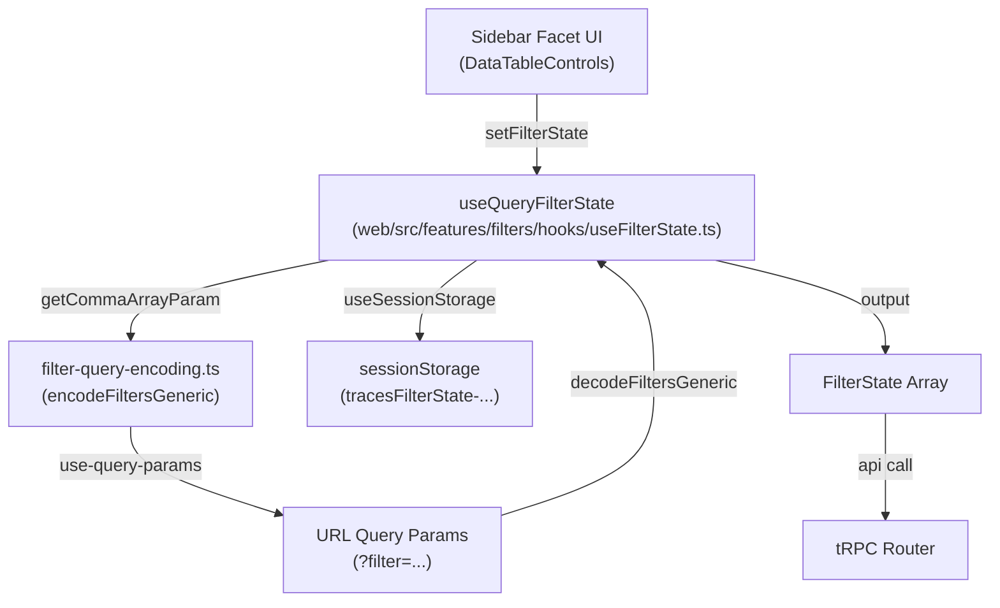

# UI State Management

Relevant source files

The following files were used as context for generating this wiki page:

- [packages/shared/src/domain/table-view-presets.ts](packages/shared/src/domain/table-view-presets.ts)
- [packages/shared/src/interfaces/filters.ts](packages/shared/src/interfaces/filters.ts)
- [packages/shared/src/server/repositories/index.ts](packages/shared/src/server/repositories/index.ts)
- [packages/shared/src/server/services/DefaultViewService/DefaultViewService.ts](packages/shared/src/server/services/DefaultViewService/DefaultViewService.ts)
- [packages/shared/src/server/services/DefaultViewService/types.ts](packages/shared/src/server/services/DefaultViewService/types.ts)
- [packages/shared/src/server/services/TableViewService/TableViewService.ts](packages/shared/src/server/services/TableViewService/TableViewService.ts)
- [packages/shared/src/server/services/TableViewService/index.ts](packages/shared/src/server/services/TableViewService/index.ts)
- [packages/shared/src/server/services/TableViewService/systemPresets.ts](packages/shared/src/server/services/TableViewService/systemPresets.ts)
- [packages/shared/src/server/services/TableViewService/types.ts](packages/shared/src/server/services/TableViewService/types.ts)
- [packages/shared/src/tableDefinitions/index.ts](packages/shared/src/tableDefinitions/index.ts)
- [packages/shared/src/types.ts](packages/shared/src/types.ts)
- [web/src/__tests__/server/table-view-namespace-compat.servertest.ts](web/src/__tests__/server/table-view-namespace-compat.servertest.ts)
- [web/src/components/table/data-table-controls.tsx](web/src/components/table/data-table-controls.tsx)
- [web/src/components/table/data-table-toolbar.tsx](web/src/components/table/data-table-toolbar.tsx)
- [web/src/components/table/table-view-presets/components/data-table-view-presets-drawer.tsx](web/src/components/table/table-view-presets/components/data-table-view-presets-drawer.tsx)
- [web/src/components/table/table-view-presets/hooks/useDefaultViewMutations.ts](web/src/components/table/table-view-presets/hooks/useDefaultViewMutations.ts)
- [web/src/components/table/table-view-presets/hooks/useTableViewManager.ts](web/src/components/table/table-view-presets/hooks/useTableViewManager.ts)
- [web/src/components/table/table-view-presets/hooks/useViewData.ts](web/src/components/table/table-view-presets/hooks/useViewData.ts)
- [web/src/features/filters/components/filter-builder.tsx](web/src/features/filters/components/filter-builder.tsx)
- [web/src/features/filters/filter-integration.clienttest.ts](web/src/features/filters/filter-integration.clienttest.ts)
- [web/src/features/filters/hooks/useFilterState.ts](web/src/features/filters/hooks/useFilterState.ts)
- [web/src/features/filters/hooks/useSidebarFilterState.tsx](web/src/features/filters/hooks/useSidebarFilterState.tsx)
- [web/src/features/filters/lib/filter-query-encoding-decoding.clienttest.ts](web/src/features/filters/lib/filter-query-encoding-decoding.clienttest.ts)
- [web/src/features/filters/lib/filter-query-encoding.ts](web/src/features/filters/lib/filter-query-encoding.ts)
- [web/src/server/api/routers/tableViewPresets.ts](web/src/server/api/routers/tableViewPresets.ts)
- [web/src/server/api/services/tableDefinitions.ts](web/src/server/api/services/tableDefinitions.ts)

This document describes how UI state is managed in the Langfuse web application, specifically focusing on table components, filters, pagination, and URL persistence. The system uses a combination of URL query parameters, browser storage (`localStorage` and `sessionStorage`), and React hooks to maintain and persist UI state across page reloads and navigation.

## State Management Architecture

The web application implements a multi-layered state management strategy where different types of UI state are persisted in different locations based on their characteristics. Each table component (e.g., `TracesTable`, `ObservationsTable`, `EventsTable`, `SessionsTable`) composes multiple custom hooks to manage pagination, filtering, sorting, and display preferences.

### State Management Hook Locations

The following diagram maps the relationship between table components, core state hooks, and their persistence layers.

**Natural Language to Code Entity Space: Table State Composition**

```mermaid
graph TB
    subgraph "Table Components"
        TracesTable["TracesTable<br/>web/src/components/table/use-cases/traces.tsx"]
        EventsTable["ObservationsEventsTable<br/>web/src/features/events/components/EventsTable.tsx"]
        SessionsTable["SessionsTable<br/>web/src/components/table/use-cases/sessions.tsx"]
        ObservationsTable["ObservationsTable<br/>web/src/components/table/use-cases/observations.tsx"]
    end
    
    subgraph "Core State Hooks"
        usePaginationState["usePaginationState<br/>web/src/hooks/usePaginationState.ts"]
        useOrderByState["useOrderByState<br/>web/src/features/orderBy/hooks/useOrderByState.ts"]
        useSidebarFilterState["useSidebarFilterState<br/>web/src/features/filters/hooks/useSidebarFilterState.tsx"]
        useTableDateRange["useTableDateRange<br/>web/src/hooks/useTableDateRange.ts"]
        useQueryFilterState["useQueryFilterState<br/>web/src/features/filters/hooks/useFilterState.ts"]
    end
    
    subgraph "Column & Display Hooks"
        useColumnVisibility["useColumnVisibility<br/>web/src/features/column-visibility/hooks/useColumnVisibility.ts"]
        useColumnOrder["useColumnOrder<br/>web/src/features/column-visibility/hooks/useColumnOrder.ts"]
        useRowHeightLocalStorage["useRowHeightLocalStorage<br/>web/src/components/table/data-table-row-height-switch.tsx"]
    end
    
    subgraph "Persistence"
        URL["URL Query Params<br/>'use-query-params'"]
        LocalStorage["localStorage<br/>Browser API"]
        SessionStorage["sessionStorage<br/>Browser API"]
    end
    
    EventsTable --> usePaginationState
    EventsTable --> useOrderByState
    EventsTable --> useSidebarFilterState
    EventsTable --> useTableDateRange
    EventsTable --> useColumnVisibility
    EventsTable --> useColumnOrder
    
    usePaginationState --> URL
    useOrderByState --> SessionStorage
    useSidebarFilterState --> URL
    useSidebarFilterState --> SessionStorage
    useQueryFilterState --> URL
    useQueryFilterState --> SessionStorage
    useTableDateRange --> SessionStorage
    useColumnVisibility --> LocalStorage
    useColumnOrder --> LocalStorage
```

**Sources:**
- [web/src/features/filters/hooks/useFilterState.ts:127-138]()
- [web/src/features/filters/hooks/useSidebarFilterState.tsx:29-30]()

## State Persistence Strategies

### URL Query Parameters
URL query parameters make state shareable via links and allow browser back/forward navigation.
- **Pagination**: `pageIndex`, `pageSize`.
- **Filters**: Encoded filter state for sharing filtered views via the `filter` parameter [web/src/features/filters/hooks/useFilterState.ts:157-160]().
- **Search**: `search` query parameter.
- **View IDs**: The `viewId` parameter identifies a specific saved Table View Preset [web/src/components/table/table-view-presets/hooks/useTableViewManager.ts:79-83]().

### Session Storage
Session storage persists state within a browser tab session but is cleared when the tab closes.
- **Filter state**: User's current filter selections, keyed by project ID and table name (e.g., `tracesFilterState-projectId`) [web/src/features/filters/hooks/useFilterState.ts:134-138]().
- **Date ranges**: Time range selections.
- **Ordering**: Sort column and direction, managed via `useOrderByState`.
- **Sidebar State**: Whether the filter sidebar is expanded or collapsed is stored per-table using `useSessionStorage` with a key like `data-table-controls-tableName` [web/src/components/table/data-table-controls.tsx:64-69]().
- **View ID Persistence**: The `useTableViewManager` stores the last used `viewId` in session storage to restore it when navigating back to a table [web/src/components/table/table-view-presets/hooks/useTableViewManager.ts:75-78]().

### Local Storage
Local storage persists state across browser sessions and tabs.
- **Column visibility**: Persists which columns the user has hidden/shown.
- **Column order**: Persists the drag-and-drop arrangement of table columns.
- **Row Height**: Persists user preference for table row density (e.g., compact vs. comfortable) [web/src/components/table/data-table-row-height-switch.tsx:21-23]().

## Filter State Management

Filter state supports sidebar facets, URL persistence, and legacy normalization.

### Hook: `useQueryFilterState`
Location: `web/src/features/filters/hooks/useFilterState.ts`

This hook provides the primary interface for managing filters that synchronize with both URL and session storage. It merges initial states with session states to ensure filters are not lost during navigation [web/src/features/filters/hooks/useFilterState.ts:140-149](). It also supports `PeekTableStateContext` for tables rendered in side-drawers where URL synchronization is bypassed [web/src/features/filters/hooks/useFilterState.ts:162-171]().

### Filter Encoding and Decoding
Langfuse uses a custom semicolon-delimited format for encoding `FilterState` into URL strings.

| Format Component | Description | Example |
| :--- | :--- | :--- |
| **Column ID** | The internal ID of the column | `name` |
| **Type** | The filter type (string, number, etc.) | `string` |
| **Key** | Optional key for object/category types | `environment` |
| **Operator** | Comparison operator | `contains` |
| **Value** | URI-encoded value | `production` |

**Full Format**: `columnId;type;key;operator;value` [web/src/features/filters/lib/filter-query-encoding.ts:111-111](). Multiple filters are joined by commas [web/src/features/filters/lib/filter-query-encoding.ts:115-115]().

**Natural Language to Code Entity Space: Filter Data Flow**

**Sources:**
- [web/src/features/filters/hooks/useFilterState.ts:39-124]()
- [web/src/features/filters/lib/filter-query-encoding.ts:76-117]()
- [web/src/features/filters/lib/filter-query-encoding.ts:123-205]()

### Normalization and Validation
The `decodeAndNormalizeFilters` function handles backward compatibility by mapping legacy column names and aliases to canonical IDs [web/src/features/filters/hooks/useSidebarFilterState.tsx:42-84](). It ensures that filters from old bookmarks or saved views remain valid even if column definitions change [web/src/features/filters/hooks/useSidebarFilterState.tsx:68-74]().

## Table View Presets

Table view presets allow users to save complete table configurations including filters, sorting, column order, and visibility.

### Hook: `useTableViewManager`
Location: `web/src/components/table/table-view-presets/hooks/useTableViewManager.ts`

This hook coordinates with multiple state updaters to apply saved configurations from the database. It walks a priority list for initialization:
1. **URL**: If a `viewId` is present in the URL query params [web/src/components/table/table-view-presets/hooks/useTableViewManager.ts:79-83]().
2. **Session Storage**: If a `viewId` was previously stored for this table/project [web/src/components/table/table-view-presets/hooks/useTableViewManager.ts:75-78]().
3. **Default View**: Resolves the user's or project's default view via the `api.TableViewPresets.getDefault` query [web/src/components/table/table-view-presets/hooks/useTableViewManager.ts:90-97]().

The hook uses `applyViewState` to trigger the provided `stateUpdaters` (e.g., `setFilters`, `setOrderBy`, `setColumnVisibility`) once a preset is loaded [web/src/components/table/table-view-presets/hooks/useTableViewManager.ts:204-245]().

### System Presets
Langfuse supports "System Presets" which are defined in code rather than the database. These IDs are prefixed with `__langfuse_` [web/src/components/table/table-view-presets/components/data-table-view-presets-drawer.tsx:93-97](). Examples include the "Default View" (`__langfuse_default__`) [web/src/components/table/table-view-presets/components/data-table-view-presets-drawer.tsx:120-126]().

| Feature | Persistence | Hook/Utility |
| :--- | :--- | :--- |
| **Filters** | URL / Session Storage | `useQueryFilterState` |
| **Sorting** | Session Storage | `useOrderByState` |
| **Pagination** | URL | `usePaginationState` |
| **Visibility** | Local Storage | `useColumnVisibility` |
| **Order** | Local Storage | `useColumnOrder` |
| **View ID** | URL / Session Storage | `useTableViewManager` |

**Sources:**
- [web/src/components/table/table-view-presets/hooks/useTableViewManager.ts:57-245]()
- [web/src/components/table/table-view-presets/components/data-table-view-presets-drawer.tsx:88-126]()

## Filter UI Components

### `PopoverFilterBuilder`
The `PopoverFilterBuilder` is the primary interface for adding complex filters. It maintains a `wipFilterState` (Work-In-Progress) to allow users to build a filter before it is applied to the table [web/src/features/filters/components/filter-builder.tsx:102-103](). It syncs with the external `filterState` but ignores updates if the user is actively editing invalid filters [web/src/features/filters/components/filter-builder.tsx:115-121]().

### `DataTableControls` (Sidebar)
The sidebar filter system uses `DataTableControls` to render facets. It supports:
- **Categorical Facets**: Checkbox lists with counts [web/src/components/table/data-table-controls.tsx:192-208]().
- **Numeric Facets**: Range sliders [web/src/components/table/data-table-controls.tsx:210-221]().
- **AI Filters**: Generating `FilterState` from natural language prompts using `DataTableAIFilters` [web/src/components/table/data-table-controls.tsx:113-134]().

**Sources:**
- [web/src/features/filters/components/filter-builder.tsx:81-153]()
- [web/src/components/table/data-table-controls.tsx:108-221]()
