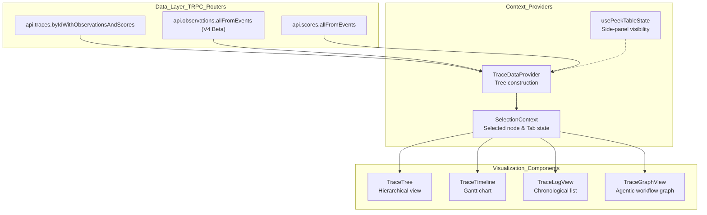
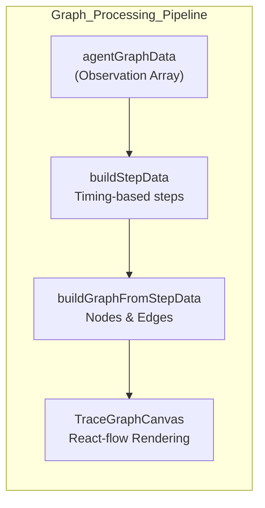

# Trace & Session Views

Relevant source files

The following files were used as context for generating this wiki page:

- [web/src/__tests__/buildStepData.clienttest.ts](web/src/__tests__/buildStepData.clienttest.ts)
- [web/src/components/ItemBadge.tsx](web/src/components/ItemBadge.tsx)
- [web/src/components/session/index.tsx](web/src/components/session/index.tsx)
- [web/src/components/table/data-table.tsx](web/src/components/table/data-table.tsx)
- [web/src/components/table/use-cases/observations.tsx](web/src/components/table/use-cases/observations.tsx)
- [web/src/components/table/use-cases/scores.tsx](web/src/components/table/use-cases/scores.tsx)
- [web/src/components/table/use-cases/sessions.tsx](web/src/components/table/use-cases/sessions.tsx)
- [web/src/components/table/use-cases/traces.tsx](web/src/components/table/use-cases/traces.tsx)
- [web/src/features/annotation-queues/components/shared/AnnotationProcessingLayout.tsx](web/src/features/annotation-queues/components/shared/AnnotationProcessingLayout.tsx)
- [web/src/features/events/components/EventsTable.tsx](web/src/features/events/components/EventsTable.tsx)
- [web/src/features/experiments/components/table/ExperimentItemsTable.tsx](web/src/features/experiments/components/table/ExperimentItemsTable.tsx)
- [web/src/features/experiments/components/table/ExperimentsTable.tsx](web/src/features/experiments/components/table/ExperimentsTable.tsx)
- [web/src/features/prompts/components/prompts-table.tsx](web/src/features/prompts/components/prompts-table.tsx)
- [web/src/features/prompts/server/actions/createPrompt.ts](web/src/features/prompts/server/actions/createPrompt.ts)
- [web/src/features/prompts/server/routers/promptRouter.ts](web/src/features/prompts/server/routers/promptRouter.ts)
- [web/src/features/trace-graph-view/buildGraphCanvasData.ts](web/src/features/trace-graph-view/buildGraphCanvasData.ts)
- [web/src/features/trace-graph-view/buildStepData.ts](web/src/features/trace-graph-view/buildStepData.ts)
- [web/src/features/trace-graph-view/components/TraceGraphCanvas.tsx](web/src/features/trace-graph-view/components/TraceGraphCanvas.tsx)
- [web/src/features/trace-graph-view/components/TraceGraphView.tsx](web/src/features/trace-graph-view/components/TraceGraphView.tsx)
- [web/src/features/trace-graph-view/types.ts](web/src/features/trace-graph-view/types.ts)
- [web/src/pages/project/[projectId]/sessions/[sessionId].tsx](web/src/pages/project/[projectId]/sessions/[sessionId].tsx)
- [web/src/pages/project/[projectId]/traces/[traceId].tsx](web/src/pages/project/[projectId]/traces/[traceId].tsx)
- [web/src/pages/project/[projectId]/users/[userId].tsx](web/src/pages/project/[projectId]/users/[userId].tsx)
- [web/src/pages/trace/[traceId].tsx](web/src/pages/trace/[traceId].tsx)
- [web/src/server/api/routers/users.ts](web/src/server/api/routers/users.ts)

This page documents the implementation of the trace and session detail views in the Langfuse web application. These views provide deep inspection of individual execution graphs (traces) and collections of related traces (sessions), supporting both legacy PostgreSQL-backed data and the V4 Beta events-first architecture.

## Trace View Architecture

The trace view is built on a modular architecture that separates data fetching, tree construction, and multiple visualization strategies (Tree, Timeline, Log, and Graph).

### Component & Data Flow

**Sources**: [web/src/components/table/use-cases/traces.tsx:88-98](), [web/src/features/events/hooks/useEventsTableData.ts:1-20](), [web/src/features/trace-graph-view/components/TraceGraphView.tsx:30-45]()

---

## Tree Visualization Implementation

The core of the trace view is the hierarchical tree structure. Langfuse uses iterative processing to build UI data to prevent stack overflows on deep traces.

### Tree Data Construction
The trace data processing transforms flat observation arrays into a structured format for the UI.

- **Traditional Traces**: Fetched via standard trace routers that join metadata from PostgreSQL and ClickHouse.
- **Events-Based Traces (V4 Beta)**: If beta is enabled via `useV4Beta`, the system uses event-backed endpoints. Synthetic traces are constructed from individual observation events [web/src/features/events/hooks/useV4Beta.ts:1-10]().
- **Subtree Metrics**: The UI aggregates costs and token usage across the trace tree. The `calculateAggregatedUsage` utility sums usage metrics from child nodes to parent spans [web/src/components/table/use-cases/observations.tsx:61-62]().

### Virtualized Rendering
To handle traces with thousands of nodes, the views use `@tanstack/react-virtual`.
- **Table Virtualization**: The main `DataTable` component uses virtualization to handle large datasets efficiently [web/src/components/table/data-table.tsx:34-43]().
- **Session Virtualization**: The session detail page uses `useVirtualizer` to render long lists of traces within a session without browser lag [web/src/components/session/index.tsx:19-19]().

**Sources**: [web/src/components/table/data-table.tsx:211-230](), [web/src/components/session/index.tsx:19-19](), [web/src/components/table/use-cases/observations.tsx:61-62]()

---

## Log View & Timeline

### Log View Implementation
The Log View provides a chronological list of observations. It leverages `IOTableCell` for rendering inputs and outputs in a condensed, expandable format [web/src/components/table/use-cases/observations.tsx:48-48]().
- **Deduplication**: In V4 mode, scores are fetched from event-backed endpoints and mapped to observations via their unique IDs [web/src/components/table/use-cases/scores.tsx:137-138]().
- **Refresh Intervals**: Tables support configurable refresh intervals (e.g., 10s, 30s) stored in session storage via `useSessionStorage` to prevent unnecessary polling [web/src/components/table/use-cases/traces.tsx:171-181]().

### Timeline View
The timeline visualizes the latency and execution order of spans. 
- **Latency Formatting**: Latency is formatted using `formatIntervalSeconds` [web/src/utils/dates.ts:1-20]().
- **Color Coding**: Observation levels (Success, Warning, Error) are visually distinguished using `LevelColors` and `LevelSymbols` [web/src/components/level-colors.tsx:33-35]().

**Sources**: [web/src/components/table/use-cases/traces.tsx:171-181](), [web/src/components/table/use-cases/scores.tsx:137-138](), [web/src/components/table/use-cases/observations.tsx:48-48]()

---

## Agent Graph Visualization

For traces involving agentic workflows (e.g., LangGraph), Langfuse provides a graph visualization.

- **Data Transformation**: `buildStepData` processes raw observations into discrete steps for the graph based on timestamps or explicit metadata [web/src/features/trace-graph-view/buildStepData.ts:1-50]().
- **Normalization**: `transformLanggraphToGeneralized` normalizes LangGraph-specific metadata into a format compatible with the general graph viewer [web/src/features/trace-graph-view/components/TraceGraphView.tsx:57-59]().
- **Interaction**: Users can cycle through multiple observations mapped to a single node by clicking the node repeatedly, which updates the `currentObservationIndices` state [web/src/features/trace-graph-view/components/TraceGraphView.tsx:147-151]().

**Sources**: [web/src/features/trace-graph-view/buildStepData.ts:1-50](), [web/src/features/trace-graph-view/components/TraceGraphView.tsx:30-64](), [web/src/features/trace-graph-view/components/TraceGraphView.tsx:147-151]()

---

## Session Detail Page

The Session view aggregates multiple traces sharing a common `sessionId`.

### Session Aggregation
The `SessionsTable` displays metrics aggregated at the session level, including total cost, token counts, and session duration [web/src/components/table/use-cases/sessions.tsx:68-84]().

### Session Detail Component (`SessionDetail`)
- **User Tracking**: Displays all users involved in a session. For sessions with massive user counts, the `SessionUsers` component paginates the display [web/src/components/session/index.tsx:76-100]().
- **Trace List**: Renders a list of traces belonging to the session using `LazyTraceRow` or `LazyTraceEventsRow` (for V4) to optimize initial page load [web/src/components/session/index.tsx:45-49]().
- **Filtering**: Supports session-specific filters and system presets (e.g., "Only Errors") via `SESSION_DETAIL_SYSTEM_PRESETS` [web/src/components/session/index.tsx:71-74]().

**Sources**: [web/src/components/table/use-cases/sessions.tsx:68-84](), [web/src/components/session/index.tsx:71-122](), [web/src/components/session/index.tsx:45-49]()

---

## V4 Beta Viewer & Synthetic Traces

The V4 Beta viewer introduces an events-first architecture where traces are derived from observation events stored in ClickHouse.

### Events-First Architecture
In V4, the system primarily interacts with the `events` table rather than the legacy `traces` table.
- **Synthetic Trace Construction**: `useEventsTableData` is used to fetch and manage the synthetic trace data derived from individual spans [web/src/features/events/hooks/useEventsTableData.ts:1-20]().
- **Score Mapping**: Scores are fetched and mapped to spans/traces using `scoreFilters` and `addPrefixToScoreKeys` [web/src/features/events/components/EventsTable.tsx:167-168]().

### Table Interaction Patterns
The viewer uses a standardized set of hooks for state management:
- `usePaginationState`: Manages server-side pagination [web/src/hooks/usePaginationState.ts:1-10]().
- `useOrderByState`: Manages column sorting [web/src/features/orderBy/hooks/useOrderByState.ts:1-10]().
- `useSidebarFilterState`: Manages complex filtering logic persisted in the URL or localStorage [web/src/features/filters/hooks/useSidebarFilterState.ts:1-15]().
- `usePeekNavigation`: Enables navigating between detail views while in a "peek" (side-panel) mode [web/src/components/table/peek/hooks/usePeekNavigation.ts:1-10]().

**Sources**: [web/src/features/events/components/EventsTable.tsx:100-169](), [web/src/components/table/use-cases/traces.tsx:38-46](), [web/src/components/table/peek/hooks/usePeekNavigation.ts:1-10]()

---

## Performance & State Management

| Feature | Implementation | File |
|---------|----------------|------|
| **Trace List** | `@tanstack/react-virtual` + `DataTable` | [web/src/components/table/data-table.tsx:1-50]() |
| **Row Height** | `useRowHeightLocalStorage` for persistence | [web/src/components/table/data-table-row-height-switch.ts:1-15]() |
| **Full Text Search** | `useFullTextSearch` with debouncing | [web/src/components/table/use-cases/useFullTextSearch.ts:1-10]() |
| **Table State** | `usePeekTableState` for side-panel detail views | [web/src/components/table/peek/contexts/PeekTableStateContext.tsx:1-10]() |

**Sources**: [web/src/components/table/data-table.tsx:211-230](), [web/src/components/table/use-cases/traces.tsx:49-49](), [web/src/components/table/use-cases/traces.tsx:91-91](), [web/src/components/table/use-cases/traces.tsx:98-98]()
