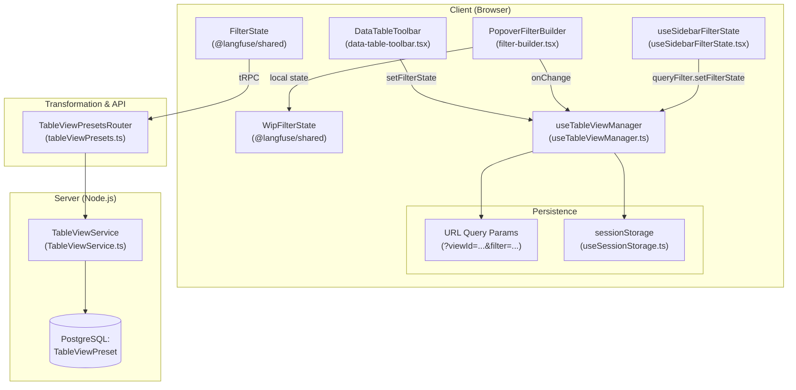
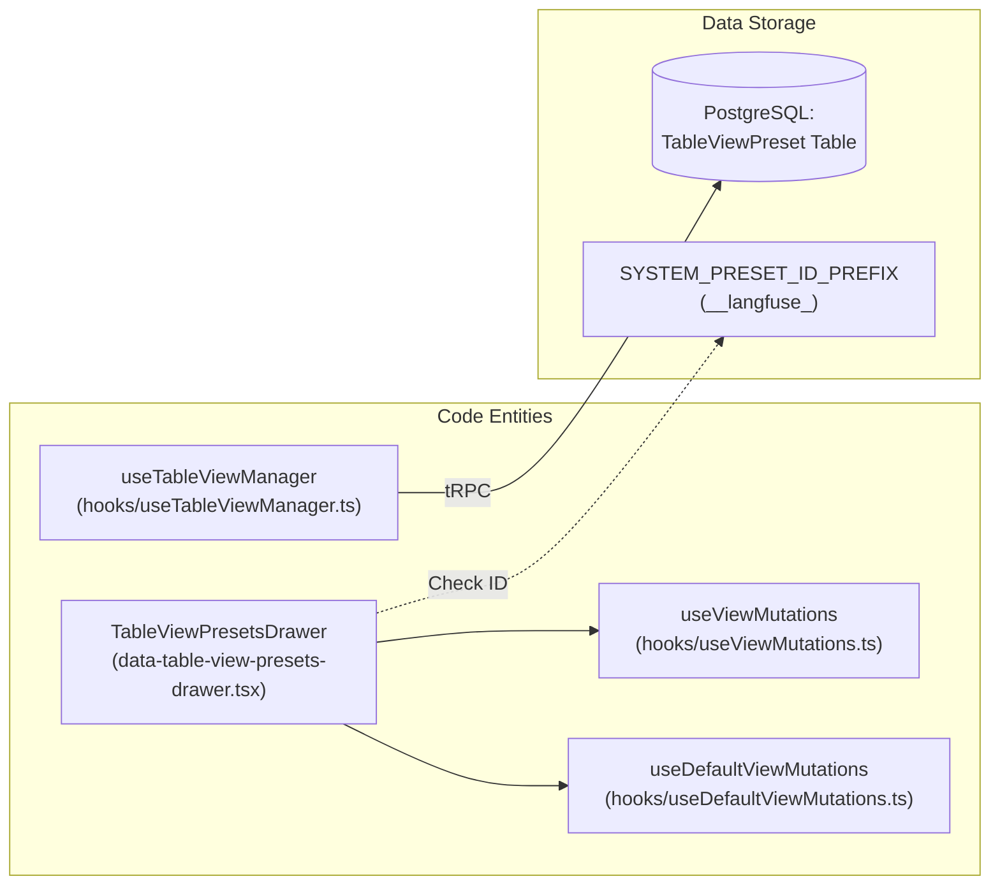

# Filter & View System

Relevant source files

The following files were used as context for generating this wiki page:

- [packages/shared/src/domain/table-view-presets.ts](packages/shared/src/domain/table-view-presets.ts)
- [packages/shared/src/interfaces/filters.ts](packages/shared/src/interfaces/filters.ts)
- [packages/shared/src/observationsTable.ts](packages/shared/src/observationsTable.ts)
- [packages/shared/src/server/repositories/index.ts](packages/shared/src/server/repositories/index.ts)
- [packages/shared/src/server/repositories/trace-sessions.ts](packages/shared/src/server/repositories/trace-sessions.ts)
- [packages/shared/src/server/services/DefaultViewService/DefaultViewService.ts](packages/shared/src/server/services/DefaultViewService/DefaultViewService.ts)
- [packages/shared/src/server/services/DefaultViewService/types.ts](packages/shared/src/server/services/DefaultViewService/types.ts)
- [packages/shared/src/server/services/TableViewService/TableViewService.ts](packages/shared/src/server/services/TableViewService/TableViewService.ts)
- [packages/shared/src/server/services/TableViewService/index.ts](packages/shared/src/server/services/TableViewService/index.ts)
- [packages/shared/src/server/services/TableViewService/systemPresets.ts](packages/shared/src/server/services/TableViewService/systemPresets.ts)
- [packages/shared/src/server/services/TableViewService/types.ts](packages/shared/src/server/services/TableViewService/types.ts)
- [packages/shared/src/tableDefinitions/index.ts](packages/shared/src/tableDefinitions/index.ts)
- [packages/shared/src/tableDefinitions/sessionsView.ts](packages/shared/src/tableDefinitions/sessionsView.ts)
- [packages/shared/src/tableDefinitions/tracesTable.ts](packages/shared/src/tableDefinitions/tracesTable.ts)
- [packages/shared/src/types.ts](packages/shared/src/types.ts)
- [web/src/__tests__/server/table-view-namespace-compat.servertest.ts](web/src/__tests__/server/table-view-namespace-compat.servertest.ts)
- [web/src/components/table/data-table-controls.tsx](web/src/components/table/data-table-controls.tsx)
- [web/src/components/table/data-table-toolbar.tsx](web/src/components/table/data-table-toolbar.tsx)
- [web/src/components/table/table-view-presets/components/data-table-view-presets-drawer.tsx](web/src/components/table/table-view-presets/components/data-table-view-presets-drawer.tsx)
- [web/src/components/table/table-view-presets/hooks/useDefaultViewMutations.ts](web/src/components/table/table-view-presets/hooks/useDefaultViewMutations.ts)
- [web/src/components/table/table-view-presets/hooks/useTableViewManager.ts](web/src/components/table/table-view-presets/hooks/useTableViewManager.ts)
- [web/src/components/table/table-view-presets/hooks/useViewData.ts](web/src/components/table/table-view-presets/hooks/useViewData.ts)
- [web/src/features/column-visibility/hooks/useColumnOrder.ts](web/src/features/column-visibility/hooks/useColumnOrder.ts)
- [web/src/features/filters/components/filter-builder.tsx](web/src/features/filters/components/filter-builder.tsx)
- [web/src/features/filters/config/evaluators-config.ts](web/src/features/filters/config/evaluators-config.ts)
- [web/src/features/filters/config/observations-config.ts](web/src/features/filters/config/observations-config.ts)
- [web/src/features/filters/config/prompts-config.ts](web/src/features/filters/config/prompts-config.ts)
- [web/src/features/filters/config/scores-config.ts](web/src/features/filters/config/scores-config.ts)
- [web/src/features/filters/config/sessions-config.ts](web/src/features/filters/config/sessions-config.ts)
- [web/src/features/filters/config/traces-config.ts](web/src/features/filters/config/traces-config.ts)
- [web/src/features/filters/filter-integration.clienttest.ts](web/src/features/filters/filter-integration.clienttest.ts)
- [web/src/features/filters/hooks/useFilterState.ts](web/src/features/filters/hooks/useFilterState.ts)
- [web/src/features/filters/hooks/useSidebarFilterState.tsx](web/src/features/filters/hooks/useSidebarFilterState.tsx)
- [web/src/features/filters/lib/filter-config.ts](web/src/features/filters/lib/filter-config.ts)
- [web/src/features/filters/lib/filter-query-encoding-decoding.clienttest.ts](web/src/features/filters/lib/filter-query-encoding-decoding.clienttest.ts)
- [web/src/features/filters/lib/filter-query-encoding.ts](web/src/features/filters/lib/filter-query-encoding.ts)
- [web/src/server/api/definitions/scoresTable.ts](web/src/server/api/definitions/scoresTable.ts)
- [web/src/server/api/routers/tableViewPresets.ts](web/src/server/api/routers/tableViewPresets.ts)
- [web/src/server/api/services/tableDefinitions.ts](web/src/server/api/services/tableDefinitions.ts)

## Purpose & Scope

The Filter & View System provides a comprehensive filtering and view management infrastructure for all data tables in the Langfuse web application. It enables users to interactively filter table data, save filter configurations as reusable views (presets), and persist filter state across sessions. This system is used across traces, observations, scores, sessions, prompts, and user tables.

For information about the underlying table components that render filtered data, see [Table Components System](8.2). For state management patterns used by filters, see [UI State Management](8.3).

---

## Architecture Overview

The filter system operates as a coordinated client-server architecture where filter state is managed on the client, persisted to URLs and session storage, transformed for backend consumption, and executed as SQL queries on the server.

### System Data Flow

The following diagram bridges the Natural Language UI concepts to the Code Entities that implement them.

**Title: Filter Data Flow: UI to Database**

**Sources:** [web/src/features/filters/components/filter-builder.tsx:81-153](), [web/src/components/table/table-view-presets/hooks/useTableViewManager.ts:57-88](), [web/src/features/filters/hooks/useSidebarFilterState.tsx:1-40]()

---

## Filter State Management

### Core State Hooks
The system's primary mechanism for filter persistence and view resolution is the `useTableViewManager` hook. It synchronizes the table's state across three locations:
1.  **React State**: Managed via `stateUpdaters` passed from the parent table [web/src/components/table/table-view-presets/hooks/useTableViewManager.ts:22-29]().
2.  **URL Query Parameters**: Using `useQueryParam` with the `viewId` and `filter` keys [web/src/components/table/table-view-presets/hooks/useTableViewManager.ts:79-83](), [web/src/features/filters/hooks/useFilterState.ts:157-160]().
3.  **Session Storage**: To preserve the last selected view for a specific table within a project [web/src/components/table/table-view-presets/hooks/useTableViewManager.ts:75-78]().

### Work-in-Progress (WIP) State
The `PopoverFilterBuilder` manages a local `wipFilterState`. This allows users to add or modify filters (e.g., adding an empty row) without immediately triggering a table reload or updating the global URL state until the filter is valid [web/src/features/filters/components/filter-builder.tsx:102-153](). Valid filters are parsed using the `singleFilter` schema from `@langfuse/shared` [web/src/features/filters/components/filter-builder.tsx:137-142]().

### Encoding & Decoding
Filters are encoded into a semicolon-delimited string format: `columnId;type;key;operator;value` [web/src/features/filters/hooks/useFilterState.ts:50-57](). Multiple filters are separated by commas [web/src/features/filters/hooks/useFilterState.ts:75-76]().
- **Array Values**: Joined with the pipe `|` character [web/src/features/filters/hooks/useFilterState.ts:63]().
- **Escaping**: Literal pipe characters in values are escaped as `\|` to prevent delimiter collisions [web/src/features/filters/lib/filter-query-encoding.ts:11-13]().

**Sources:** [web/src/components/table/table-view-presets/hooks/useTableViewManager.ts:57-114](), [web/src/features/filters/components/filter-builder.tsx:102-153](), [web/src/features/filters/hooks/useFilterState.ts:39-124](), [web/src/features/filters/lib/filter-query-encoding.ts:11-43]()

---

## Filter Components & Operators

### Column Definitions & Facets
Tables are driven by `ColumnDefinition` objects which specify the data type and internal SQL/ClickHouse mapping. Feature-specific configurations, such as `observationsTableCols`, define available facets (categorical, numeric, boolean, string) for the UI [packages/shared/src/observationsTable.ts:10-272]().

### Sidebar Filter System
The `useSidebarFilterState` hook generates UI-ready filter objects (`CategoricalUIFilter`, `NumericUIFilter`, etc.) that power the collapsible filter sidebar [web/src/features/filters/hooks/useSidebarFilterState.tsx:116-194](). This system supports:
- **Categorical Facets**: Checkbox selection with "any of", "all of", or "none of" logic [web/src/features/filters/hooks/useSidebarFilterState.tsx:137-159]().
- **Text Filters**: Mutual exclusion with checkbox selections, allowing "contains" or "does not contain" logic on categorical columns [web/src/features/filters/hooks/useSidebarFilterState.tsx:161-179]().
- **Key-Value Filters**: Used for dynamic metadata or score filtering where users select a specific key and then a value [web/src/features/filters/hooks/useSidebarFilterState.tsx:198-208]().

### Filter Operators
| Type | Operators | UI Component |
| :--- | :--- | :--- |
| `string` | `contains`, `does not contain`, `=`, `!=` | `Input` / `Textarea` [web/src/features/filters/components/filter-builder.tsx:2-3]() |
| `categorical` | `any of`, `none of`, `all of` | `MultiSelect` or `CategoricalFacet` [web/src/components/table/data-table-controls.tsx:192]() |
| `datetime` | `>`, `<` | `DatePicker` [web/src/features/filters/components/filter-builder.tsx:11]() |
| `number` | `=`, `>`, `<`, `>=`, `<=` | `Input` (number) or `Slider` [web/src/features/filters/components/filter-builder.tsx:2](), [web/src/components/table/data-table-controls.tsx:24]() |

**Sources:** [web/src/features/filters/hooks/useSidebarFilterState.tsx:116-208](), [packages/shared/src/observationsTable.ts:10-272](), [web/src/components/table/data-table-controls.tsx:189-220]()

---

## Saved Views (TableViewPresets)

The View System allows users to save a specific combination of filters, sorting, and column visibility as a "Preset" stored in PostgreSQL.

### View Preset Logic
**Title: View Preset Management Entities**

**Sources:** [web/src/components/table/table-view-presets/components/data-table-view-presets-drawer.tsx:172-189](), [web/src/components/table/table-view-presets/hooks/useTableViewManager.ts:57-88]()

### TableViewPresetsDrawer
The `TableViewPresetsDrawer` component [web/src/components/table/table-view-presets/components/data-table-view-presets-drawer.tsx:172]() manages the lifecycle of views:
- **System Presets**: Hardcoded views defined in code (e.g., `__langfuse_default__`). They use the `SYSTEM_PRESET_ID_PREFIX` to bypass database lookups [web/src/components/table/table-view-presets/components/data-table-view-presets-drawer.tsx:93-126]().
- **Default Views**: Users can assign a view as their personal default or a project-wide default. The system resolves these in order: User Default > Project Default > System Default [web/src/components/table/table-view-presets/hooks/useTableViewManager.ts:89-97]().

### View Lifecycle & Bootstrapping
The `useTableViewManager` hook coordinates the application of saved views upon page load [web/src/components/table/table-view-presets/hooks/useTableViewManager.ts:144-201](). It follows a priority list for bootstrapping:
1. **URL Parameters**: If `viewId` is present in the URL query string [web/src/components/table/table-view-presets/hooks/useTableViewManager.ts:152-156]().
2. **Session Storage**: Restores the last used view for that specific table/project if no URL param is present [web/src/components/table/table-view-presets/hooks/useTableViewManager.ts:165-171]().
3. **Database Default**: Fetches the designated default view for the user/project [web/src/components/table/table-view-presets/hooks/useTableViewManager.ts:176-184]().

**Sources:** [web/src/components/table/table-view-presets/components/data-table-view-presets-drawer.tsx:89-215](), [web/src/components/table/table-view-presets/hooks/useTableViewManager.ts:57-201]()

---

## Natural Language Filter Generation (Cloud-Only)

On Langfuse Cloud, the filter system integrates with AI to generate complex filter states from natural language descriptions.

1. **User Interface**: The `DataTableAIFilters` component provides a text input for natural language prompts [web/src/components/table/data-table-controls.tsx:174-177]().
2. **Generation**: When a prompt is submitted, the system generates a `FilterState` based on the natural language request.
3. **Application**: The generated filters are applied via `handleFiltersGenerated`, which updates the table's filter state and automatically expands the relevant sidebar filter categories [web/src/components/table/data-table-controls.tsx:115-134]().
4. **Visibility**: This feature is conditionally rendered based on `filterWithAI` and `isLangfuseCloud` checks [web/src/components/table/data-table-controls.tsx:161]().

**Sources:** [web/src/components/table/data-table-controls.tsx:108-181](), [web/src/features/filters/components/filter-builder.tsx:87-98]()
