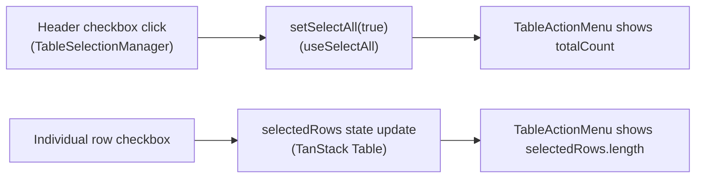
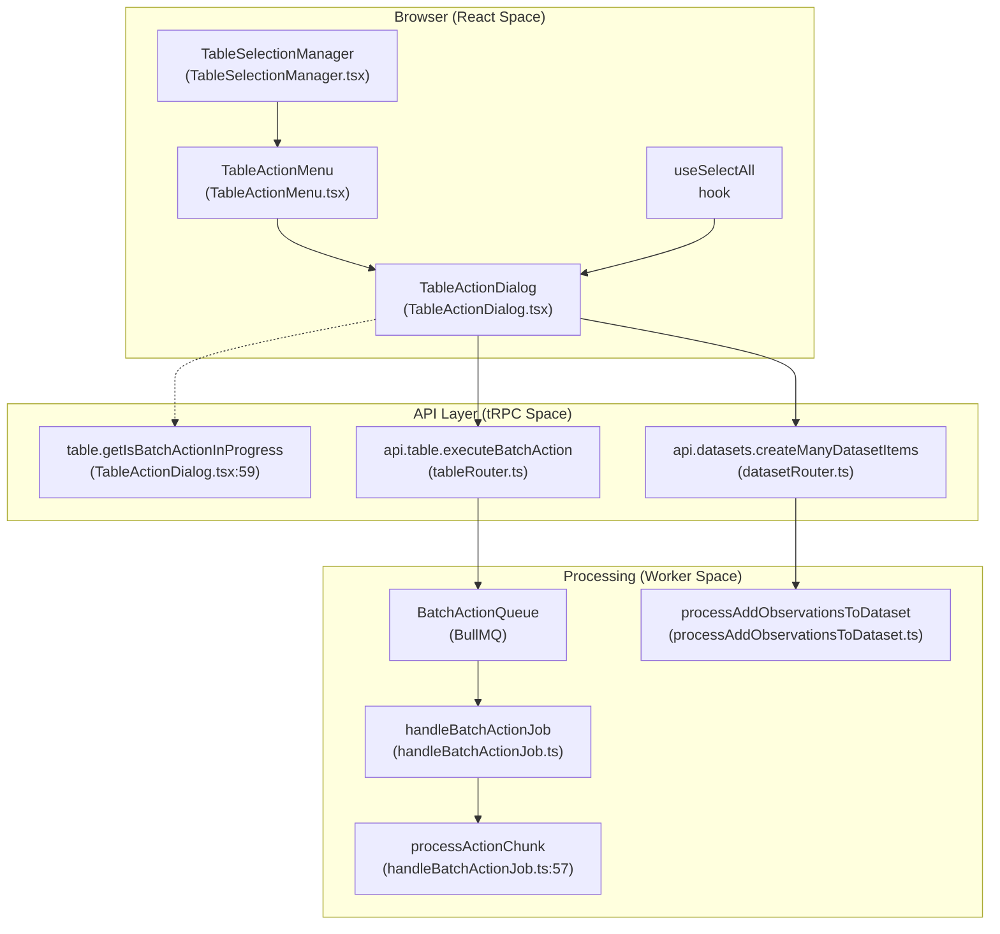
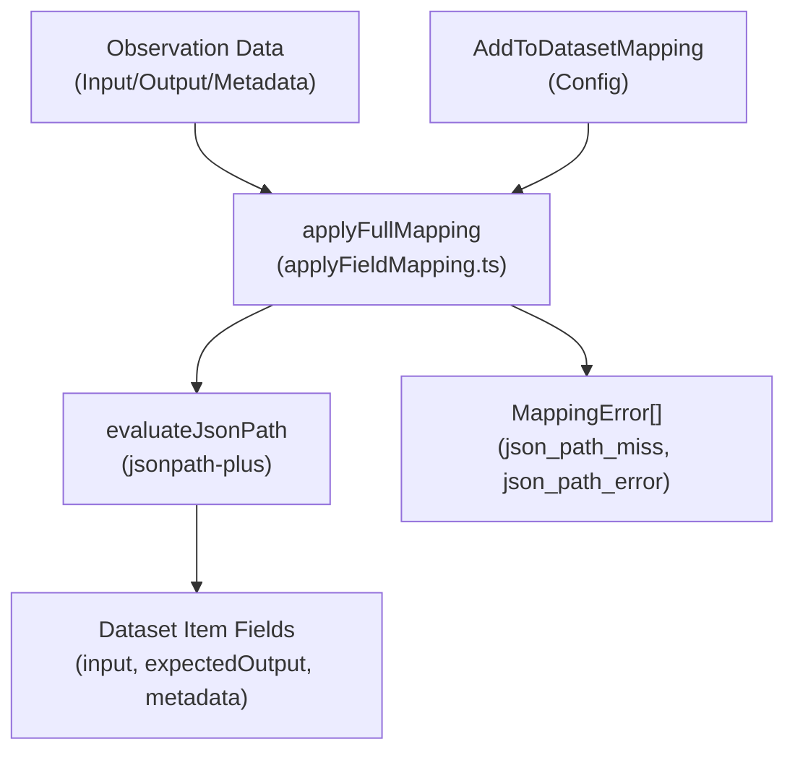
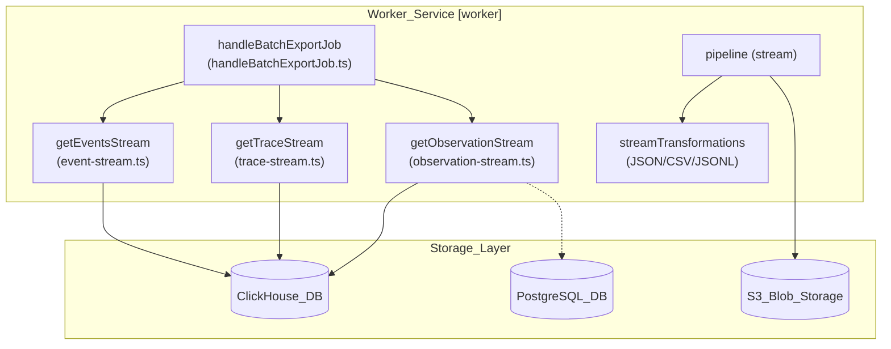

# Batch Actions & Selection

Relevant source files

The following files were used as context for generating this wiki page:

- [packages/shared/src/features/batchAction/applyFieldMapping.ts](packages/shared/src/features/batchAction/applyFieldMapping.ts)
- [packages/shared/src/features/batchAction/types.ts](packages/shared/src/features/batchAction/types.ts)
- [packages/shared/src/features/batchExport/types.ts](packages/shared/src/features/batchExport/types.ts)
- [packages/shared/src/interfaces/tableNames.ts](packages/shared/src/interfaces/tableNames.ts)
- [web/src/__tests__/server/observations-comment-filter.servertest.ts](web/src/__tests__/server/observations-comment-filter.servertest.ts)
- [web/src/components/table/data-table-multi-select-actions/data-table-select-all-banner.tsx](web/src/components/table/data-table-multi-select-actions/data-table-select-all-banner.tsx)
- [web/src/features/batch-actions/components/AddObservationsToDatasetDialog/FinalPreviewStep.tsx](web/src/features/batch-actions/components/AddObservationsToDatasetDialog/FinalPreviewStep.tsx)
- [web/src/features/batch-actions/components/AddObservationsToDatasetDialog/components/CustomMappingEditor.tsx](web/src/features/batch-actions/components/AddObservationsToDatasetDialog/components/CustomMappingEditor.tsx)
- [web/src/features/batch-actions/components/AddObservationsToDatasetDialog/components/IssueBanner.tsx](web/src/features/batch-actions/components/AddObservationsToDatasetDialog/components/IssueBanner.tsx)
- [web/src/features/batch-actions/components/AddObservationsToDatasetDialog/components/JsonPathInput.tsx](web/src/features/batch-actions/components/AddObservationsToDatasetDialog/components/JsonPathInput.tsx)
- [web/src/features/batch-actions/components/AddObservationsToDatasetDialog/components/MappingPreviewPanel.tsx](web/src/features/batch-actions/components/AddObservationsToDatasetDialog/components/MappingPreviewPanel.tsx)
- [web/src/features/batch-actions/components/RunEvaluationDialog/ConfirmationStep.tsx](web/src/features/batch-actions/components/RunEvaluationDialog/ConfirmationStep.tsx)
- [web/src/features/batch-actions/components/RunEvaluationDialog/CreateEvaluatorDialog.tsx](web/src/features/batch-actions/components/RunEvaluationDialog/CreateEvaluatorDialog.tsx)
- [web/src/features/batch-actions/components/RunEvaluationDialog/EvaluatorSelectionStep.tsx](web/src/features/batch-actions/components/RunEvaluationDialog/EvaluatorSelectionStep.tsx)
- [web/src/features/batch-actions/components/RunEvaluationDialog/utils.ts](web/src/features/batch-actions/components/RunEvaluationDialog/utils.ts)
- [web/src/features/batch-actions/server/addToDatasetRouter.ts](web/src/features/batch-actions/server/addToDatasetRouter.ts)
- [web/src/features/batch-actions/server/runEvaluationRouter.ts](web/src/features/batch-actions/server/runEvaluationRouter.ts)
- [web/src/features/batch-actions/validation.ts](web/src/features/batch-actions/validation.ts)
- [web/src/features/entitlements/hooks.ts](web/src/features/entitlements/hooks.ts)
- [web/src/features/evals/components/evaluation-prompt-preview.tsx](web/src/features/evals/components/evaluation-prompt-preview.tsx)
- [web/src/features/evals/hooks/useExtractVariables.ts](web/src/features/evals/hooks/useExtractVariables.ts)
- [web/src/features/table/components/TableActionDialog.tsx](web/src/features/table/components/TableActionDialog.tsx)
- [web/src/features/table/components/TableActionTargetOptions.tsx](web/src/features/table/components/TableActionTargetOptions.tsx)
- [web/src/features/table/components/TableSelectionManager.tsx](web/src/features/table/components/TableSelectionManager.tsx)
- [web/src/features/table/components/targetOptionsQueryMap.tsx](web/src/features/table/components/targetOptionsQueryMap.tsx)
- [web/src/features/table/server/createBatchActionJob.ts](web/src/features/table/server/createBatchActionJob.ts)
- [web/src/features/table/types.ts](web/src/features/table/types.ts)
- [worker/src/__tests__/applyFieldMapping.test.ts](worker/src/__tests__/applyFieldMapping.test.ts)
- [worker/src/__tests__/batchAction.test.ts](worker/src/__tests__/batchAction.test.ts)
- [worker/src/__tests__/batchExport.test.ts](worker/src/__tests__/batchExport.test.ts)
- [worker/src/features/batchAction/handleBatchActionJob.ts](worker/src/features/batchAction/handleBatchActionJob.ts)
- [worker/src/features/batchAction/processAddToQueue.ts](worker/src/features/batchAction/processAddToQueue.ts)
- [worker/src/features/batchExport/handleBatchExportJob.ts](worker/src/features/batchExport/handleBatchExportJob.ts)
- [worker/src/features/database-read-stream/event-stream.ts](worker/src/features/database-read-stream/event-stream.ts)
- [worker/src/features/database-read-stream/getDatabaseReadStream.ts](worker/src/features/database-read-stream/getDatabaseReadStream.ts)
- [worker/src/features/database-read-stream/observation-stream.ts](worker/src/features/database-read-stream/observation-stream.ts)
- [worker/src/features/database-read-stream/trace-stream.ts](worker/src/features/database-read-stream/trace-stream.ts)

This page documents the batch action system used in Langfuse's data tables: row selection state management, the "select all" pattern, and bulk operations such as deletion, annotation, and adding items to datasets.

---

## Selection Model

Tables that support batch actions maintain two independent selection states to handle both local (page-level) and global (filter-level) selection.

| State | Type | Source | Scope |
|---|---|---|---|
| `selectedRows` | `RowSelectionState` | `useState` in table component | Explicitly checked rows on the current page. |
| `selectAll` | `boolean` | `useSelectAll` hook | All rows matching the current filter across all pages. |

`TableSelectionManager` is a generic component used in tables (Traces, Observations, Sessions, Experiments) to produce a selection checkbox column [web/src/features/table/components/TableSelectionManager.tsx:16-21](). It provides the `selectActionColumn` definition, which includes logic for toggling page-level rows and clearing global selection [web/src/features/table/components/TableSelectionManager.tsx:23-69]().

### Selection UI Components

- **`DataTableSelectAllBanner`**: Appears when all items on the current page are selected. It offers the user the option to "Select all X items across Y pages", which sets the `selectAll` state to `true` [web/src/components/table/data-table-multi-select-actions/data-table-select-all-banner.tsx:5-52]().
- **`TableActionMenu`**: A floating bar that appears when `selectedCount > 0`. It displays the count of selected items and renders available `TableAction` buttons [web/src/features/table/components/TableActionMenu.tsx:64-116]().
- **`BatchExportTableButton`**: A specialized button for triggering data exports. It displays warnings if certain filters (like comments or cross-table filters) are not supported for the specific export table [web/src/components/BatchExportTableButton.tsx:76-92]().

### Selection Data Flow

Title: Selection State Logic

Sources: [web/src/features/table/components/TableSelectionManager.tsx:30-51](), [web/src/components/table/data-table-multi-select-actions/data-table-select-all-banner.tsx:15-50](), [web/src/features/table/components/TableActionMenu.tsx:67-72]()

---

## Batch Action Pipeline

The system bridges UI selection to background processing via tRPC mutations. UI components like `TableActionMenu` and `TableActionDialog` manage the transition from user intent to execution.

Title: Batch Action Pipeline (Natural Language to Code Entities)

Sources: [web/src/features/table/components/TableActionMenu.tsx:35-42](), [web/src/features/table/components/TableActionDialog.tsx:44-51](), [web/src/features/table/components/TableActionDialog.tsx:88-97](), [worker/src/features/batchAction/handleBatchActionJob.ts:141-148]()

### `TableAction` Type

Each table component assembles a `TableAction[]` array. `TableActionMenu` reads this to render the action buttons [web/src/features/table/components/TableActionMenu.tsx:83-113]().

| Field | Type | Purpose |
|---|---|---|
| `id` | `ActionId` | String constant identifying the operation (e.g., `ActionId.DeleteTraces`) [web/src/features/table/types.ts:7](). |
| `type` | `BatchActionType` | Determines UI styling and default icons (`create` or `delete`) [web/src/features/table/types.ts:18-30](). |
| `execute` | `async function` | Mutation trigger; receives `{ projectId, targetId? }` [web/src/features/table/types.ts:20-26](). |
| `accessCheck` | `object` | Defines required RBAC `scope` and `entitlement` [web/src/features/table/types.ts:11-14](). |
| `customDialog` | `boolean?` | If `true`, the menu delegates to a specialized component instead of `TableActionDialog` [web/src/features/table/components/TableActionMenu.tsx:49](). |

---

## Add to Dataset Mapping

Adding items to datasets via batch actions involves a complex mapping system that allows users to extract specific fields from traces or observations using JSONPath selectors.

### Field Mapping Configuration
The mapping logic is defined in `applyFieldMapping.ts` and supports three modes [packages/shared/src/features/batchAction/applyFieldMapping.ts:137-211]():
- **`full`**: Maps the entire source field (input, output, or metadata) to the dataset item field [packages/shared/src/features/batchAction/applyFieldMapping.ts:138-139]().
- **`none`**: Sets the dataset item field to null [packages/shared/src/features/batchAction/applyFieldMapping.ts:141-143]().
- **`custom`**: Allows for `root` extraction (single JSONPath) or `keyValueMap` (building a new object from multiple JSONPaths) [packages/shared/src/features/batchAction/applyFieldMapping.ts:145-208]().

### JSONPath Evaluation
The system uses `jsonpath-plus` to evaluate selectors against observation data [packages/shared/src/features/batchAction/applyFieldMapping.ts:1-62]().
- `evaluateJsonPath`: Extracts values from a JSON object based on a path starting with `$` [packages/shared/src/features/batchAction/applyFieldMapping.ts:62-72]().
- `testJsonPath`: Validates the syntax of a JSONPath string [packages/shared/src/features/batchAction/applyFieldMapping.ts:42-57]().

Title: Field Mapping Data Flow

Sources: [packages/shared/src/features/batchAction/applyFieldMapping.ts:101-105](), [packages/shared/src/features/batchAction/applyFieldMapping.ts:221-232](), [worker/src/features/batchAction/processAddObservationsToDataset.ts:38-40]()

---

## Experiment Table Selection

The `ExperimentItemsTable` utilizes the selection system to allow batch operations on experiment runs, such as running evaluations across selected items.

- It integrates `TableSelectionManager` to provide checkboxes [web/src/features/experiments/components/table/ExperimentItemsTable.tsx:41]().
- It uses the `useSelectAll` hook to track global selection state across the experiment's items [web/src/features/experiments/components/table/ExperimentItemsTable.tsx:42]().
- The `ExperimentGridView` and `ExperimentCompareTable` both accept selection states to maintain consistency between different visualizations [web/src/features/experiments/components/table/ExperimentGridView.tsx:38](), [web/src/features/experiments/components/table/ExperimentCompareTable.tsx:61]().

Sources: [web/src/features/experiments/components/table/ExperimentItemsTable.tsx:41-43](), [web/src/features/experiments/components/table/ExperimentItemsTable.tsx:320-330]()

---

## Worker-Side Execution

When a batch action is triggered for a large set of data (via `selectAll`), the web client creates a `BatchAction` record. The worker service handles execution via `handleBatchActionJob` [worker/src/features/batchAction/handleBatchActionJob.ts:141-144]().

### Job Processing Flow
1.  **Job Dispatch**: The tRPC mutation adds a job to the `BatchActionQueue`.
2.  **Streaming**: The worker uses `getDatabaseReadStreamPaginated`, `getObservationStream`, or `getTraceIdentifierStream` to fetch records matching the original UI filters [worker/src/features/batchAction/handleBatchActionJob.ts:176-202]().
3.  **Chunking**: Records are collected and processed in batches defined by `CHUNK_SIZE` (default 1000) [worker/src/features/batchAction/handleBatchActionJob.ts:43](), [worker/src/features/batchAction/handleBatchActionJob.ts:211-220]().
4.  **Execution**: `processActionChunk` routes the batch to specific processors like `traceDeletionProcessor`, `processAddTracesToQueue`, or `processClickhouseScoreDelete` [worker/src/features/batchAction/handleBatchActionJob.ts:58-101]().
5.  **Status Polling**: The UI polls `getIsBatchActionInProgress` to show a loader and disable further actions until completion [web/src/features/table/components/TableActionDialog.tsx:59-68]().

### Batch Export Processing
Batch Exports (handled by `handleBatchExportJob.ts`) stream data to S3 in CSV, JSON, or JSONL formats [worker/src/features/batchExport/handleBatchExportJob.ts:34-40](), [packages/shared/src/features/batchExport/types.ts:18-22]().
- **Comment Filters**: If a comment filter is applied, the worker calls `applyCommentFilters` to resolve object IDs before starting the stream [worker/src/features/batchExport/handleBatchExportJob.ts:145-150]().
- **Streaming**: Data is read via specialized streams like `getObservationStream`, `getTraceStream`, or `getEventsStream` which perform complex ClickHouse joins to include scores and metadata [worker/src/features/batchExport/handleBatchExportJob.ts:174-202]().
- **Score Handling**: Numeric and categorical scores are aggregated in ClickHouse using CTEs like `scores_agg` and then flattened for the export output [worker/src/features/database-read-stream/observation-stream.ts:136-181](), [worker/src/features/database-read-stream/getDatabaseReadStream.ts:68-97]().
- **Transformation**: A pipeline transforms database rows into the target format using `streamTransformations` [worker/src/features/batchExport/handleBatchExportJob.ts:220-223]().

Title: Batch Export Data Flow (System Entities)

Sources: [worker/src/features/batchExport/handleBatchExportJob.ts:34-40](), [worker/src/features/batchExport/handleBatchExportJob.ts:174-202](), [worker/src/features/database-read-stream/observation-stream.ts:34-42](), [worker/src/features/database-read-stream/trace-stream.ts:29-36](), [worker/src/features/database-read-stream/event-stream.ts:46-53]()
