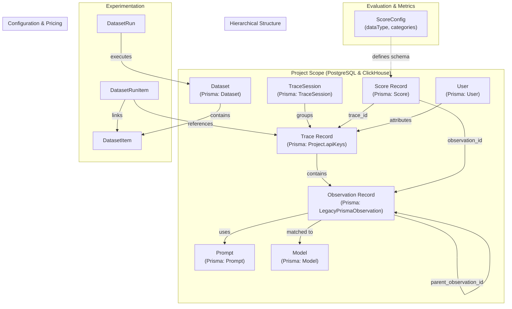
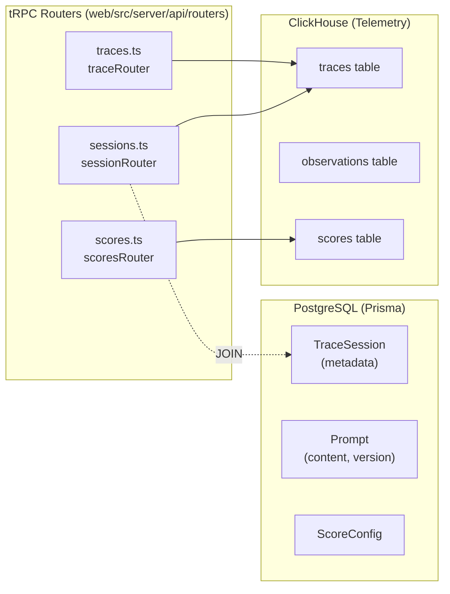

# Core Domain Features

Relevant source files

The following files were used as context for generating this wiki page:

- [packages/shared/prisma/schema.prisma](packages/shared/prisma/schema.prisma)
- [packages/shared/src/server/queries/clickhouse-sql/search.ts](packages/shared/src/server/queries/clickhouse-sql/search.ts)
- [packages/shared/src/server/repositories/observations.ts](packages/shared/src/server/repositories/observations.ts)
- [packages/shared/src/server/repositories/scores.ts](packages/shared/src/server/repositories/scores.ts)
- [packages/shared/src/server/repositories/traces.ts](packages/shared/src/server/repositories/traces.ts)
- [packages/shared/src/server/services/sessions-ui-table-service.ts](packages/shared/src/server/services/sessions-ui-table-service.ts)
- [packages/shared/src/server/services/traces-ui-table-service.ts](packages/shared/src/server/services/traces-ui-table-service.ts)
- [web/src/__tests__/organization-settings-pages.clienttest.tsx](web/src/__tests__/organization-settings-pages.clienttest.tsx)
- [web/src/__tests__/server/clickhouseSearchCondition.servertest.ts](web/src/__tests__/server/clickhouseSearchCondition.servertest.ts)
- [web/src/features/audit-logs/auditLog.ts](web/src/features/audit-logs/auditLog.ts)
- [web/src/features/models/components/ModelSettings.tsx](web/src/features/models/components/ModelSettings.tsx)
- [web/src/pages/organization/[organizationId]/settings/index.tsx](web/src/pages/organization/[organizationId]/settings/index.tsx)
- [web/src/pages/project/[projectId]/settings/index.tsx](web/src/pages/project/[projectId]/settings/index.tsx)
- [web/src/server/api/root.ts](web/src/server/api/root.ts)
- [web/src/server/api/routers/generations/filterOptionsQuery.ts](web/src/server/api/routers/generations/filterOptionsQuery.ts)
- [web/src/server/api/routers/public.ts](web/src/server/api/routers/public.ts)
- [web/src/server/api/routers/scores.ts](web/src/server/api/routers/scores.ts)
- [web/src/server/api/routers/sessions.ts](web/src/server/api/routers/sessions.ts)
- [web/src/server/api/routers/traces.ts](web/src/server/api/routers/traces.ts)

This page describes the core domain entities in Langfuse's observability platform. These entities form the foundation for tracing LLM applications, evaluating their outputs, and analyzing performance. For detailed information on each entity type, refer to the sub-pages [Traces & Observations](#9.1) through [Monitors & Alerting](#9.9).

For information about how these entities are ingested and stored, see [Data Ingestion Pipeline](#6). For details on the database architecture, see [Data Architecture](#3).

## Domain Model Overview

The following diagram illustrates the relationships between the primary domain entities. It bridges the natural language concepts to the specific code entities used in the repository layer and database schemas.

**Sources:**
- [packages/shared/prisma/schema.prisma:116-153]()
- [packages/shared/prisma/schema.prisma:344-386]()
- [packages/shared/prisma/schema.prisma:415-451]()
- [packages/shared/src/server/repositories/traces.ts:198-204]()

## Entity Storage and Access Patterns

Langfuse utilizes a dual-database architecture. Metadata and configurations are stored in PostgreSQL via Prisma, while high-volume telemetry data (traces, observations, scores) is stored in ClickHouse for analytical performance. The UI layer fetches this data through specialized tRPC routers.

**Sources:**
- [web/src/server/api/root.ts:1-60]()
- [web/src/server/api/root.ts:70-76]()
- [packages/shared/src/server/repositories/traces.ts:173-182]()
- [packages/shared/src/server/repositories/observations.ts:183-188]()

## Traces

**Primary Entity:** `TraceRecordReadType` represents the trace data structure used in the repository layer, aggregating core fields and metrics [packages/shared/src/server/repositories/definitions.ts:1-100]().

Traces represent the top-level execution unit. Each trace captures a complete workflow, such as a single user request or an autonomous agent run. Traces track latency, total cost, and token usage across all nested observations. The `traceRouter` provides the primary interface for exploring this data in the UI [web/src/server/api/routers/traces.ts:97-152]().

### Key Attributes
- `id`: Unique trace identifier [packages/shared/src/server/repositories/traces.ts:159]().
- `timestamp`: Start time of the trace [packages/shared/src/server/repositories/traces.ts:161]().
- `metadata`: Flexible JSON storage for custom attributes.
- `tags`: Array of strings for categorization [packages/shared/src/server/services/traces-ui-table-service.ts:45]().

**Detailed coverage:** See [Traces & Observations](#9.1)

## Observations

**Primary Entity:** `ObservationRecordReadType` represents individual steps within a trace hierarchy [packages/shared/src/server/repositories/definitions.ts:1-100]().

Observations include generic spans and specific `GENERATION` types that track LLM usage. Observations are linked to traces via `trace_id` and can be nested using `parent_observation_id` [packages/shared/src/server/repositories/observations.ts:151-156]().

### Observation Types
- `SPAN`: Generic operation with duration.
- `GENERATION`: LLM completion calls, tracking `usage_details` and `cost_details` [packages/shared/src/server/repositories/observations.ts:168-171]().
- `EVENT`: Point-in-time event.
- `TOOL`: External tool or function execution.

**Detailed coverage:** See [Traces & Observations](#9.1)

## Scores

**Primary Entity:** `Score` (PostgreSQL) and `ScoreRecordReadType` (ClickHouse) [packages/shared/prisma/schema.prisma:344]().

Scores represent evaluations of traces or observations. They are categorized by `dataType` (NUMERIC, CATEGORICAL, BOOLEAN) and `source` (API, ANNOTATION, EVAL) [packages/shared/src/server/repositories/scores.ts:1-10](). Scores are often aggregated to provide high-level metrics for quality analysis. The `ScoreConfig` entity defines the schema and valid ranges/categories for scores [packages/shared/prisma/schema.prisma:388-406]().

**Detailed coverage:** See [Scores & Scoring](#9.2)

## Sessions

**Dual Storage:** Metadata in PostgreSQL (`TraceSession` model) and aggregated trace data in ClickHouse [packages/shared/prisma/schema.prisma:297-313]().

Sessions group related traces (e.g., a multi-turn chat). The `sessionRouter` fetches session-level metrics such as `totalCost` and associated `users` by aggregating traces in ClickHouse [web/src/server/api/routers/sessions.ts:71-149]().

**Detailed coverage:** See [Sessions](#9.3)

## Users

**Primary Entity:** `User` (PostgreSQL) and `userId` (ClickHouse/Trace context) [packages/shared/prisma/schema.prisma:48-82]().

Langfuse tracks end-users of LLM applications. Users are identified by a `userId` string in traces [packages/shared/src/server/services/traces-ui-table-service.ts:42](). The system aggregates metrics per user, including token usage and total cost, allowing for user-centric analysis and cost tracking.

**Detailed coverage:** See [Sessions](#9.3)

## Prompts & Templates

Langfuse provides a Prompt Management system where prompts are versioned and can be organized into folders.
- `Prompt`: PostgreSQL model storing the prompt string, type (`text` or `chat`), and version [packages/shared/prisma/schema.prisma:415-451]().
- `PromptLabel`: Used for version management (e.g., "production", "latest") [packages/shared/prisma/schema.prisma:482-493]().
- `promptRouter`: tRPC router for prompt management [web/src/server/api/root.ts:18]().

**Detailed coverage:** See [Prompts & Templates](#9.5)

## Models & Pricing

Models are defined in PostgreSQL to enable cost calculation and token tracking.
- `Model`: PostgreSQL model defining pricing per unit (tokens, characters, etc.) [packages/shared/prisma/schema.prisma:315-342]().
- `ModelsSettings`: UI component for managing model definitions and pricing tiers [web/src/pages/project/[projectId]/settings/index.tsx:26]().

**Detailed coverage:** See [Models & Pricing](#9.6)

## Dashboard & Analytics

The dashboard provides a high-level view of project performance. It uses specialized routers like `dashboardRouter` and `scoreAnalyticsRouter` to aggregate data across traces, observations, and scores [web/src/server/api/root.ts:6-7](). Widgets visualize metrics like cost, latency, and quality scores over time.

**Detailed coverage:** See [Dashboard & Analytics](#9.7)

## Automation System

Automations allow for event-driven workflows, such as triggering webhooks or Slack notifications. These are configured via `Trigger`, `Action`, and `Automation` models in the database [packages/shared/prisma/schema.prisma:731-768]().

**Detailed coverage:** See [Automation System](#9.8)

## Monitors & Alerting

Monitors provide threshold-based alerting on observability metrics. They track specific views and filters, notifying users when metrics (like error rates or latency) exceed defined thresholds [packages/shared/prisma/schema.prisma:842-868]().

**Detailed coverage:** See [Monitors & Alerting](#9.9)
