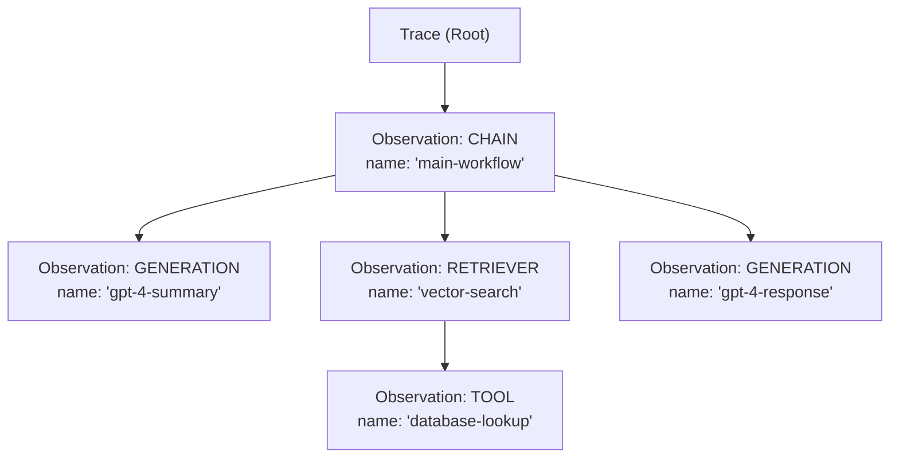
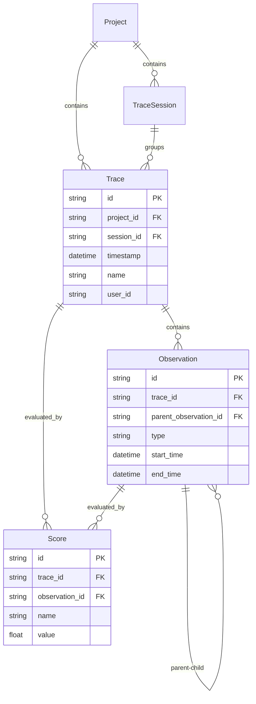
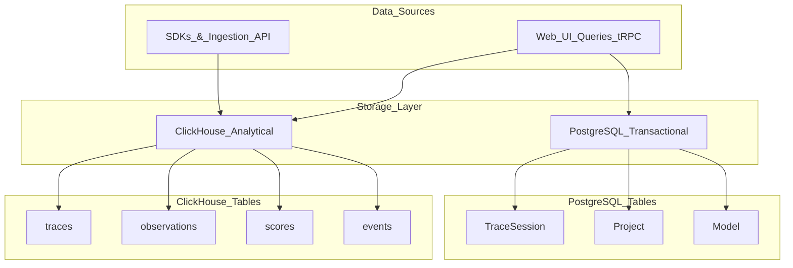
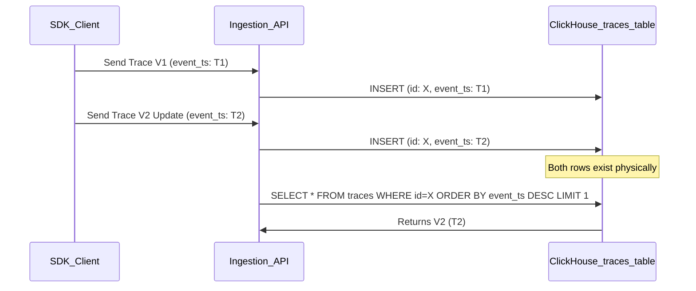
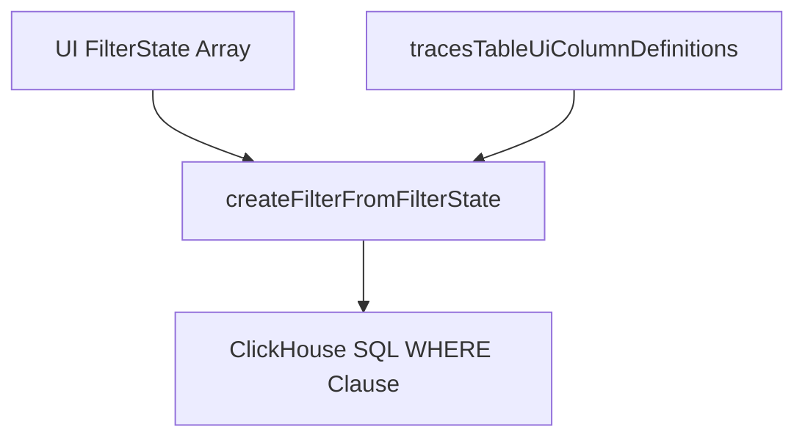

# Traces & Observations

Relevant source files

The following files were used as context for generating this wiki page:

- [fern/apis/server/definition/trace.yml](fern/apis/server/definition/trace.yml)
- [packages/shared/src/domain/observations.ts](packages/shared/src/domain/observations.ts)
- [packages/shared/src/eventsTable.ts](packages/shared/src/eventsTable.ts)
- [packages/shared/src/server/clickhouse/schema.ts](packages/shared/src/server/clickhouse/schema.ts)
- [packages/shared/src/server/queries/clickhouse-sql/event-query-builder.ts](packages/shared/src/server/queries/clickhouse-sql/event-query-builder.ts)
- [packages/shared/src/server/queries/clickhouse-sql/query-fragments.ts](packages/shared/src/server/queries/clickhouse-sql/query-fragments.ts)
- [packages/shared/src/server/queries/clickhouse-sql/search.ts](packages/shared/src/server/queries/clickhouse-sql/search.ts)
- [packages/shared/src/server/queries/index.ts](packages/shared/src/server/queries/index.ts)
- [packages/shared/src/server/queries/public-api-filter-builder.ts](packages/shared/src/server/queries/public-api-filter-builder.ts)
- [packages/shared/src/server/repositories/events.ts](packages/shared/src/server/repositories/events.ts)
- [packages/shared/src/server/repositories/observations.ts](packages/shared/src/server/repositories/observations.ts)
- [packages/shared/src/server/repositories/observations_converters.ts](packages/shared/src/server/repositories/observations_converters.ts)
- [packages/shared/src/server/repositories/scores.ts](packages/shared/src/server/repositories/scores.ts)
- [packages/shared/src/server/repositories/traces.ts](packages/shared/src/server/repositories/traces.ts)
- [packages/shared/src/server/services/sessions-ui-table-service.ts](packages/shared/src/server/services/sessions-ui-table-service.ts)
- [packages/shared/src/server/services/traces-ui-table-service.ts](packages/shared/src/server/services/traces-ui-table-service.ts)
- [packages/shared/src/server/tableMappings/mapEventsTable.ts](packages/shared/src/server/tableMappings/mapEventsTable.ts)
- [web/src/__tests__/server/clickhouseSearchCondition.servertest.ts](web/src/__tests__/server/clickhouseSearchCondition.servertest.ts)
- [web/src/__tests__/server/observations-api-v2.servertest.ts](web/src/__tests__/server/observations-api-v2.servertest.ts)
- [web/src/__tests__/server/repositories/event-repository.servertest.ts](web/src/__tests__/server/repositories/event-repository.servertest.ts)
- [web/src/__tests__/server/unit/observations-converters.servertest.ts](web/src/__tests__/server/unit/observations-converters.servertest.ts)
- [web/src/components/table/peek/hooks/usePeekData.ts](web/src/components/table/peek/hooks/usePeekData.ts)
- [web/src/features/events/config/filter-config.ts](web/src/features/events/config/filter-config.ts)
- [web/src/features/events/hooks/useEventsFilterOptions.ts](web/src/features/events/hooks/useEventsFilterOptions.ts)
- [web/src/features/events/hooks/useEventsTableData.ts](web/src/features/events/hooks/useEventsTableData.ts)
- [web/src/features/events/hooks/useEventsTraceData.ts](web/src/features/events/hooks/useEventsTraceData.ts)
- [web/src/features/events/lib/eventsToTraceAdapter.clienttest.ts](web/src/features/events/lib/eventsToTraceAdapter.clienttest.ts)
- [web/src/features/events/lib/eventsToTraceAdapter.ts](web/src/features/events/lib/eventsToTraceAdapter.ts)
- [web/src/features/events/server/eventsRouter.ts](web/src/features/events/server/eventsRouter.ts)
- [web/src/features/events/server/eventsService.ts](web/src/features/events/server/eventsService.ts)
- [web/src/features/public-api/types/observations.ts](web/src/features/public-api/types/observations.ts)
- [web/src/features/public-api/types/traces.ts](web/src/features/public-api/types/traces.ts)
- [web/src/hooks/useParsedObservation.ts](web/src/hooks/useParsedObservation.ts)
- [web/src/pages/api/public/events.ts](web/src/pages/api/public/events.ts)
- [web/src/pages/api/public/generations.ts](web/src/pages/api/public/generations.ts)
- [web/src/pages/api/public/observations/[observationId].ts](web/src/pages/api/public/observations/[observationId].ts)
- [web/src/pages/api/public/observations/index.ts](web/src/pages/api/public/observations/index.ts)
- [web/src/pages/api/public/spans.ts](web/src/pages/api/public/spans.ts)
- [web/src/pages/api/public/traces/[traceId].ts](web/src/pages/api/public/traces/[traceId].ts)
- [web/src/pages/api/public/traces/index.ts](web/src/pages/api/public/traces/index.ts)
- [web/src/server/api/routers/generations/filterOptionsQuery.ts](web/src/server/api/routers/generations/filterOptionsQuery.ts)
- [web/src/server/api/routers/scores.ts](web/src/server/api/routers/scores.ts)
- [web/src/server/api/routers/sessions.ts](web/src/server/api/routers/sessions.ts)
- [web/src/server/api/routers/traces.ts](web/src/server/api/routers/traces.ts)
- [web/src/utils/clientSideDomainTypes.ts](web/src/utils/clientSideDomainTypes.ts)

## Purpose and Scope

This document describes the core observability data model in Langfuse, focusing on **Traces** and **Observations**. These are the primary entities that capture execution flows and function calls within applications being monitored.

- **Traces** represent complete execution contexts (e.g., a single API request, a batch job, or an agent session).
- **Observations** represent individual operations within a trace (e.g., LLM calls, function executions, tool invocations).

For information about how traces are ingested and processed, see [Data Ingestion Pipeline](#6). For scoring and evaluation of traces and observations, see [Scores & Scoring](#9.2). For grouping traces into conversations, see [Sessions](#9.3).

## Data Model

### Trace Structure

A trace is the top-level container for an execution flow. Traces are stored primarily in ClickHouse and have the following key attributes:

| Field | Type | Description |
|-------|------|-------------|
| `id` | String | Unique identifier |
| `project_id` | String | Project ownership |
| `timestamp` | DateTime | Trace start time |
| `name` | String (optional) | User-defined trace name |
| `user_id` | String (optional) | End-user identifier |
| `session_id` | String (optional) | Groups related traces |
| `input` | JSON (optional) | Trace input data |
| `output` | JSON (optional) | Trace output data |
| `metadata` | JSON (optional) | Custom metadata |
| `tags` | Array[String] | Classification tags |
| `release` | String (optional) | Application version |
| `version` | String (optional) | Trace version |
| `public` | Boolean | Public visibility flag |
| `bookmarked` | Boolean | User bookmark flag |
| `environment` | String | Environment identifier |

**Sources**: [packages/shared/src/server/repositories/traces.ts:198-206](), [packages/shared/src/server/services/traces-ui-table-service.ts:33-47](), [packages/shared/src/server/repositories/definitions.ts:127-143]()

### Observation Structure and Types

Observations are hierarchical spans within traces. Each observation has a type that defines its semantic meaning:

**Trace and Observation Hierarchy**

**Observation Types** ([packages/shared/src/domain/observations.ts:1-15]()):

| Type | Purpose | Typical Use Case |
|------|---------|------------------|
| `GENERATION` | LLM completions | OpenAI, Anthropic API calls |
| `SPAN` | Generic operations | Function execution, processing steps |
| `EVENT` | Point-in-time events | Logging, state changes |
| `AGENT` | Autonomous agents | LangChain agents, AutoGPT |
| `TOOL` | Tool invocations | Function calling, API calls |
| `CHAIN` | Sequential operations | LangChain chains, workflows |
| `RETRIEVER` | Document retrieval | Vector search, database queries |
| `EVALUATOR` | Quality assessment | Evaluation runs |
| `EMBEDDING` | Vector generation | Embedding API calls |
| `GUARDRAIL` | Safety checks | Content filtering, validation |

**Key Observation Fields**:

| Field | Type | Description |
|-------|------|-------------|
| `id` | String | Unique identifier |
| `trace_id` | String | Parent trace reference |
| `parent_observation_id` | String (optional) | Parent observation for nesting |
| `type` | ObservationType | Semantic type |
| `name` | String (optional) | Operation name |
| `start_time` | DateTime | Start timestamp |
| `end_time` | DateTime (optional) | Completion timestamp |
| `input` | JSON (optional) | Operation input |
| `output` | JSON (optional) | Operation output |
| `metadata` | JSON (optional) | Custom metadata |
| `level` | Enum | Log level: DEBUG, DEFAULT, WARNING, ERROR |
| `status_message` | String (optional) | Status or error message |
| `provided_model_name` | String (optional) | User-specified model |
| `internal_model_id` | String (optional) | Matched model ID |
| `usage_details` | Map[String, Number] | Token/credit usage by type |
| `cost_details` | Map[String, Number] | Cost breakdown |
| `total_cost` | Decimal (optional) | Total calculated cost |

**Sources**: [packages/shared/src/server/repositories/observations.ts:151-182](), [packages/shared/src/server/repositories/definitions.ts:63-74](), [packages/shared/src/server/repositories/observations_converters.ts:150-220]()

### Relationships

**Core Entity Relationships**

**Key Relationships**:

1. **Trace → Session**: Traces can optionally belong to a session, enabling multi-turn conversation grouping ([web/src/server/api/routers/sessions.ts:92-95]()).
2. **Trace → Observations**: One-to-many relationship where observations are contained within traces ([packages/shared/src/server/repositories/observations.ts:151-184]()).
3. **Observation → Observation**: Parent-child hierarchy for nested operations via `parent_observation_id` ([packages/shared/src/server/repositories/observations.ts:156]()).
4. **Trace/Observation → Scores**: Both can be evaluated with multiple scores ([packages/shared/src/server/repositories/scores.ts:172-175]()).

**Sources**: [packages/shared/src/server/repositories/observations.ts:151-184](), [packages/shared/src/server/repositories/scores.ts:172-175](), [web/src/server/api/routers/sessions.ts:92-95]()

## Storage Architecture

### Dual-Database Design

Langfuse uses a hybrid storage approach optimized for different access patterns:

**Storage Layer and Table Association**

**ClickHouse (Primary Storage)**:
- **Purpose**: High-volume analytical queries, trace/observation data.
- **Tables**: `traces`, `observations`, `scores`, and `events` (for V4/OTel data).
- **Deduplication**: Uses `LIMIT 1 BY id, project_id ORDER BY event_ts DESC` to get the latest version ([packages/shared/src/server/repositories/observations.ts:187-188]()).
- **Performance**: Optimized for time-series queries with partition pruning.

**PostgreSQL (Metadata)**:
- **Purpose**: ACID-compliant metadata, relationships, and configuration.
- **Tables**: `TraceSession`, `Project`, `Model`.
- **Key Fields**: `bookmarked`, `public`, `environment` flags are frequently checked in Prisma before enriching ClickHouse data ([web/src/server/api/routers/sessions.ts:200-213]()).

**Sources**: [packages/shared/src/server/repositories/traces.ts:1-40](), [packages/shared/src/server/repositories/observations.ts:1-49](), [web/src/server/api/routers/sessions.ts:200-213](), [packages/shared/src/server/repositories/clickhouse.ts:1-7]()

### Deduplication Strategy

ClickHouse tables support **upserts** through a deduplication pattern where multiple versions of a record are stored, but only the latest is queried:

**Deduplication Pattern**

**Optimization for OTel Projects**: Projects using OpenTelemetry produce immutable spans, so deduplication can be skipped entirely via `shouldSkipObservationsFinal()` to improve query performance ([packages/shared/src/server/repositories/observations.ts:148-188](), [packages/shared/src/server/services/traces-ui-table-service.ts:220]()).

**Sources**: [packages/shared/src/server/repositories/observations.ts:148-189](), [packages/shared/src/server/repositories/traces.ts:198-206](), [packages/shared/src/server/services/traces-ui-table-service.ts:220]()

## Repository Layer

### Trace Repository Functions

The trace repository ([packages/shared/src/server/repositories/traces.ts]()) provides core CRUD operations:

| Function | Purpose | Return Type |
|----------|---------|-------------|
| `upsertTrace()` | Insert or update trace | `Promise<void>` |
| `checkTraceExistsAndGetTimestamp()` | Validate existence and get time | `{ exists: boolean, timestamp?: Date }` |
| `getTracesByIds()` | Batch fetch traces | `Promise<TraceDomain[]>` |

**Timestamp Filtering Optimization**: Queries use time windows like `TRACE_TO_OBSERVATIONS_INTERVAL` (2 days) to scope searches and prune partitions ([packages/shared/src/server/repositories/traces.ts:166-168]()).

**Sources**: [packages/shared/src/server/repositories/traces.ts:58-192](), [packages/shared/src/server/repositories/traces.ts:198-206](), [packages/shared/src/server/repositories/traces.ts:211-215]()

### Observation Repository Functions

The observation repository ([packages/shared/src/server/repositories/observations.ts]()) manages the observation lifecycle:

| Function | Purpose | Key Features |
|----------|---------|--------------|
| `upsertObservation()` | Insert or update observation | Validates required core fields |
| `getObservationsForTrace()` | Get all observations in trace | Supports `includeIO` flag |
| `checkObservationExists()` | Validate observation presence | Filters with lookback window |

**Input/Output Handling**: Observations can be fetched with or without input/output fields to optimize payload size. The system enforces a size limit (`env.LANGFUSE_API_TRACE_OBSERVATIONS_SIZE_LIMIT_BYTES`) to prevent high memory consumption during parsing ([packages/shared/src/server/repositories/observations.ts:207-236]()).

**Sources**: [packages/shared/src/server/repositories/observations.ts:64-97](), [packages/shared/src/server/repositories/observations.ts:103-126](), [packages/shared/src/server/repositories/observations.ts:136-252]()

## UI Integration & Aggregations

### Table Services

Table views use specialized service functions that construct optimized ClickHouse queries with joins for metrics:

**`getTracesTableMetrics`** ([packages/shared/src/server/services/traces-ui-table-service.ts:65-84]()):
- Constructs a CTE `observations_agg` to aggregate metrics per trace ([packages/shared/src/server/repositories/traces.ts:102-126]()).
- **Latency**: Computed as `date_diff('millisecond', least(min(start_time), min(end_time)), greatest(max(start_time), max(end_time)))` ([packages/shared/src/server/repositories/traces.ts:115]()).
- **Cost/Usage**: Aggregated via `sumMap(usage_details)` and `sumMap(cost_details)` ([packages/shared/src/server/repositories/traces.ts:116-117]()).
- **Level Aggregation**: Uses `multiIf` to determine the highest severity level across all observations in a trace (`ERROR` > `WARNING` > `DEFAULT` > `DEBUG`) ([packages/shared/src/server/repositories/traces.ts:105-110]()).

**Sources**: [packages/shared/src/server/repositories/traces.ts:102-126](), [packages/shared/src/server/services/traces-ui-table-service.ts:65-84](), [packages/shared/src/server/services/traces-ui-table-service.ts:105-145]()

### Filter System

The UI uses `FilterState` arrays that map to ClickHouse SQL filters via factory functions:

**Filter Transformation**

**Sources**: [packages/shared/src/server/repositories/traces.ts:82-94](), [packages/shared/src/server/services/traces-ui-table-service.ts:225-231](), [packages/shared/src/server/queries/clickhouse-sql/factory.ts:13-14]()

### Cost & Usage Aggregation

Langfuse aggregates costs and token usage from individual observations up to the trace level:

1. **Observation Level**: `usage_details` and `cost_details` are stored as maps in ClickHouse ([packages/shared/src/server/repositories/observations.ts:169-170]()).
2. **Aggregation**: ClickHouse `sumMap` aggregates these details across all observations linked to a `trace_id` ([packages/shared/src/server/repositories/traces.ts:116-117]()).
3. **UI Conversion**: `convertToUITableMetrics` transforms these maps into structured decimals and bigints for the frontend, calculating total, input, and output costs ([packages/shared/src/server/services/traces-ui-table-service.ts:105-145]()).

**Sources**: [packages/shared/src/server/repositories/traces.ts:116-117](), [packages/shared/src/server/services/traces-ui-table-service.ts:105-145](), [packages/shared/src/server/repositories/observations.ts:169-170](), [packages/shared/src/server/repositories/definitions.ts:13-31]()
