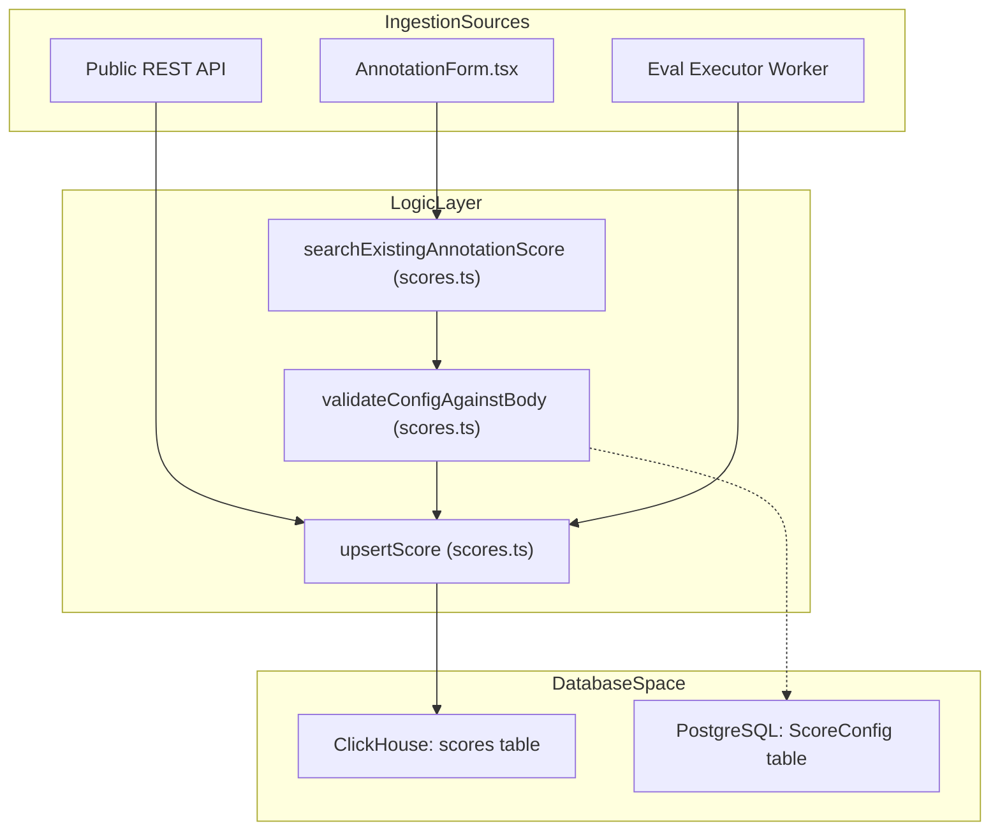
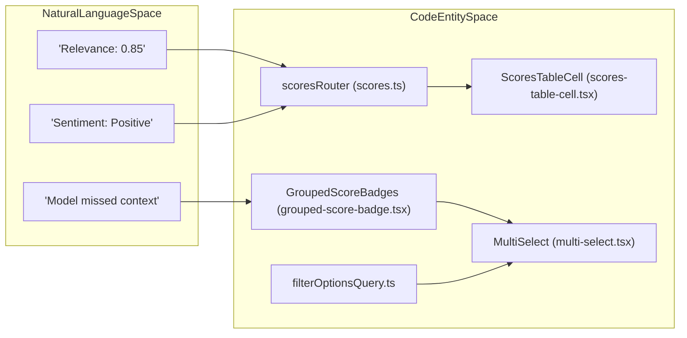

# Scores & Scoring

Relevant source files

The following files were used as context for generating this wiki page:

- [fern/apis/server/definition/score-configs.yml](fern/apis/server/definition/score-configs.yml)
- [packages/shared/src/domain/score-configs.ts](packages/shared/src/domain/score-configs.ts)
- [packages/shared/src/features/annotation/types.ts](packages/shared/src/features/annotation/types.ts)
- [packages/shared/src/features/scores/interfaces/ui/types.ts](packages/shared/src/features/scores/interfaces/ui/types.ts)
- [packages/shared/src/server/queries/clickhouse-sql/search.ts](packages/shared/src/server/queries/clickhouse-sql/search.ts)
- [packages/shared/src/server/repositories/observations.ts](packages/shared/src/server/repositories/observations.ts)
- [packages/shared/src/server/repositories/scores.ts](packages/shared/src/server/repositories/scores.ts)
- [packages/shared/src/server/repositories/scores_converters.ts](packages/shared/src/server/repositories/scores_converters.ts)
- [packages/shared/src/server/repositories/traces.ts](packages/shared/src/server/repositories/traces.ts)
- [packages/shared/src/server/services/sessions-ui-table-service.ts](packages/shared/src/server/services/sessions-ui-table-service.ts)
- [packages/shared/src/server/services/traces-ui-table-service.ts](packages/shared/src/server/services/traces-ui-table-service.ts)
- [web/src/__tests__/server/clickhouseSearchCondition.servertest.ts](web/src/__tests__/server/clickhouseSearchCondition.servertest.ts)
- [web/src/components/ui/combobox.tsx](web/src/components/ui/combobox.tsx)
- [web/src/components/ui/command.tsx](web/src/components/ui/command.tsx)
- [web/src/components/ui/table.tsx](web/src/components/ui/table.tsx)
- [web/src/features/filters/components/multi-select.tsx](web/src/features/filters/components/multi-select.tsx)
- [web/src/features/navigation/utils/scores-tabs.ts](web/src/features/navigation/utils/scores-tabs.ts)
- [web/src/features/public-api/server/scores-api-service.ts](web/src/features/public-api/server/scores-api-service.ts)
- [web/src/features/public-api/types/score-configs.ts](web/src/features/public-api/types/score-configs.ts)
- [web/src/features/scores/components/AnnotationForm.tsx](web/src/features/scores/components/AnnotationForm.tsx)
- [web/src/features/scores/contexts/ScoreCacheContext.tsx](web/src/features/scores/contexts/ScoreCacheContext.tsx)
- [web/src/features/scores/hooks/useScoreMutations.ts](web/src/features/scores/hooks/useScoreMutations.ts)
- [web/src/features/scores/lib/aggregateScores.ts](web/src/features/scores/lib/aggregateScores.ts)
- [web/src/features/scores/lib/transformScores.ts](web/src/features/scores/lib/transformScores.ts)
- [web/src/features/scores/schema.ts](web/src/features/scores/schema.ts)
- [web/src/features/scores/types.ts](web/src/features/scores/types.ts)
- [web/src/pages/api/public/score-configs/[configId].ts](web/src/pages/api/public/score-configs/[configId].ts)
- [web/src/pages/api/public/score-configs/index.ts](web/src/pages/api/public/score-configs/index.ts)
- [web/src/pages/api/public/scores/[scoreId].ts](web/src/pages/api/public/scores/[scoreId].ts)
- [web/src/server/api/routers/generations/filterOptionsQuery.ts](web/src/server/api/routers/generations/filterOptionsQuery.ts)
- [web/src/server/api/routers/scoreConfigs.ts](web/src/server/api/routers/scoreConfigs.ts)
- [web/src/server/api/routers/scores.ts](web/src/server/api/routers/scores.ts)
- [web/src/server/api/routers/sessions.ts](web/src/server/api/routers/sessions.ts)
- [web/src/server/api/routers/traces.ts](web/src/server/api/routers/traces.ts)

This page documents the scoring system in Langfuse: the score data model, creation flows (API, manual annotation, and automated evaluators), the ClickHouse repository layer, tRPC routers, and the UI components used for display and aggregation.

---

## Score Data Model

A score is a named measurement attached to a **trace**, **observation**, **session**, or **dataset run**. Scores are primarily stored in ClickHouse as `ScoreRecordReadType` rows and are converted to `ScoreDomain` objects for application use.

### Score Fields

| Field | Type | Description |
|---|---|---|
| `id` | string | UUID [packages/shared/src/server/repositories/scores.ts:152-152]() |
| `project_id` | string | Owning project [packages/shared/src/server/repositories/scores.ts:152-152]() |
| `timestamp` | DateTime64(3) | When the score was created [packages/shared/src/server/repositories/scores.ts:152-152]() |
| `trace_id` | string? | Associated trace [packages/shared/src/server/repositories/scores.ts:82-82]() |
| `observation_id` | string? | Associated observation (sub-span) [packages/shared/src/server/repositories/scores.ts:83-83]() |
| `session_id` | string? | Associated session [packages/shared/src/server/repositories/scores.ts:84-84]() |
| `name` | string | Score name (e.g. `relevance`) [packages/shared/src/server/repositories/scores.ts:152-152]() |
| `value` | float? | Numeric value for `NUMERIC` or `BOOLEAN` scores [packages/shared/src/server/repositories/scores_converters.ts:32-33]() |
| `string_value` | string? | String value for `CATEGORICAL` scores [packages/shared/src/server/repositories/scores_converters.ts:32-33]() |
| `data_type` | enum | `NUMERIC`, `BOOLEAN`, `CATEGORICAL` [packages/shared/src/domain/scores.ts:2-10]() |
| `source` | enum | `ANNOTATION`, `API`, `EVAL` [packages/shared/src/domain/scores.ts:4-4]() |
| `config_id` | string? | Reference to a `ScoreConfig` in PostgreSQL [packages/shared/src/server/repositories/scores.ts:69-69]() |
| `metadata` | map | Arbitrary key-value metadata [packages/shared/src/server/repositories/scores.ts:210-222]() |

### Data Types

| `data_type` | Description |
|---|---|
| `NUMERIC` | Numeric score (e.g. 0–1 range) [packages/shared/src/domain/scores.ts:2-10]() |
| `BOOLEAN` | Boolean score (stored as 0 or 1) [packages/shared/src/domain/scores.ts:2-10]() |
| `CATEGORICAL` | Named category (e.g. `positive`) [packages/shared/src/domain/scores.ts:2-10]() |

Langfuse also supports a special `CORRECTION` score name, which represents human corrections to model outputs [web/src/server/api/routers/scores.ts:34-35](). `AGGREGATABLE_SCORE_TYPES` specifically includes `NUMERIC`, `BOOLEAN`, and `CATEGORICAL` [packages/shared/src/domain/scores.ts:5-6]().

Sources: [packages/shared/src/server/repositories/scores.ts:1-166](), [packages/shared/src/domain/scores.ts:1-10](), [web/src/server/api/routers/scores.ts:32-35](), [packages/shared/src/server/repositories/scores_converters.ts:30-33]()

---

## Score Configurations (ScoreConfig)

`ScoreConfig` objects define the schema and constraints for scores. They are stored in PostgreSQL and used to validate score creation in the UI.

The `validateConfigAgainstBody` function ensures that incoming score data adheres to the defined `ScoreConfig` (e.g., checking if a numeric value is within the range) [web/src/server/api/routers/scores.ts:64-65](). In the UI, configurations allow for structured data entry, providing consistent scales for numeric types and predefined options for categorical types.

Sources: [web/src/server/api/routers/scores.ts:64-65](), [packages/shared/src/server/repositories/scores.ts:69-71]()

---

## Score Storage (ClickHouse Repository)

Scores are persisted in ClickHouse. The repository layer provides high-level functions to interact with the `scores` table.

**Score Persistence Diagram**

Sources: [packages/shared/src/server/repositories/scores.ts:148-166](), [web/src/server/api/routers/scores.ts:52-65]()

### Key Repository Functions

| Function | Description |
|---|---|
| `upsertScore` | Writes a score record to ClickHouse. Requires `id`, `project_id`, `name`, and `timestamp` [packages/shared/src/server/repositories/scores.ts:151-166](). |
| `getScoreById` | Fetches a single score by its UUID [packages/shared/src/server/repositories/scores.ts:116-131](). |
| `getScoresForTraces` | Retrieves scores for a list of trace IDs, with an optional lookback interval defined by `SCORE_TO_TRACE_OBSERVATIONS_INTERVAL` [packages/shared/src/server/repositories/scores.ts:168-182](). |
| `getScoresForSessions` | Retrieves scores associated with specific session IDs [packages/shared/src/server/repositories/scores.ts:224-246](). |
| `searchExistingAnnotationScore` | Used to find an existing manual annotation for a specific object (trace/observation/session) to allow updates instead of duplicates [packages/shared/src/server/repositories/scores.ts:63-114](). |

Sources: [packages/shared/src/server/repositories/scores.ts:63-246]()

---

## tRPC Scores Router (`scoresRouter`)

The `scoresRouter` in `web/src/server/api/routers/scores.ts` exposes scoring functionality to the frontend.

### Procedures

*   **`all`**: Fetches a paginated list of scores. It enriches the ClickHouse data with metadata from PostgreSQL, such as `authorUserName` from the `User` table and `jobConfigurationId` from `JobExecution` [web/src/server/api/routers/scores.ts:107-168]().
*   **`allFromEvents`**: A v4 procedure that retrieves scores from the events table [web/src/server/api/routers/scores.ts:211-260]().
*   **`byId`**: Returns a single score, stringifying its metadata for client consumption [web/src/server/api/routers/scores.ts:169-188]().
*   **`countAll`**: Returns the total count of scores matching specific filters [web/src/server/api/routers/scores.ts:189-207]().
*   **`getScoreMetadataById`**: Fetches detailed metadata for a specific score [web/src/server/api/routers/scores.ts:61-61]().

Sources: [web/src/server/api/routers/scores.ts:61-260]()

---

## Score Aggregation & Metrics

Scores are aggregated across traces and sessions to provide performance metrics.

### Traces Table Aggregation
The `getTracesTableMetrics` function in the `traces-ui-table-service.ts` calculates average scores for traces. It returns a `scores_avg` array containing `{ name, avg_value }` for each unique score name associated with the trace [packages/shared/src/server/services/traces-ui-table-service.ts:147-161]().

### Sessions Table Aggregation
The `getSessionsWithMetrics` function calculates session-level score aggregates. It computes `scores_avg` (average numeric values) and `score_categories` (distribution of categorical values) for all traces within a session [packages/shared/src/server/services/sessions-ui-table-service.ts:19-43]().

Sources: [packages/shared/src/server/services/traces-ui-table-service.ts:65-161](), [packages/shared/src/server/services/sessions-ui-table-service.ts:19-112]()

---

## UI Components & Rendering

Langfuse provides specialized components for manual scoring and viewing aggregated metrics.

**Score Rendering Entity Map**

### Rendering Logic
*   **`GroupedScoreBadges`**: Groups multiple scores by name and renders them as badges. It handles comments and metadata via hover cards [web/src/components/grouped-score-badge.tsx:125-190]().
*   **`ScoresTableCell`**: Used in data tables to display score aggregates. It uses `smart` formatting to show single values or averages (`Ø`) and supports categorical value counts [web/src/components/scores-table-cell.tsx:46-157]().
*   **`MultiSelect`**: A generic component used in filters to select multiple score names or values [web/src/features/filters/components/multi-select.tsx:36-56]().
*   **`filterOptionsQuery`**: Fetches available numeric and categorical score names to populate filter dropdowns in the generations view [web/src/server/api/routers/generations/filterOptionsQuery.ts:68-83]().

Sources: [web/src/components/grouped-score-badge.tsx:125-190](), [web/src/components/scores-table-cell.tsx:46-157](), [web/src/features/filters/components/multi-select.tsx:36-190](), [web/src/server/api/routers/generations/filterOptionsQuery.ts:68-110]()

---

## Score Analytics Dashboard

The Score Analytics dashboard provides a statistical overview of scores across projects. It leverages the ClickHouse repository functions to fetch aggregated data.

### Statistical Metrics
*   **Numeric Scores**: Aggregated via `getNumericScoresGroupedByName` which calculates averages over time [web/src/server/api/routers/generations/filterOptionsQuery.ts:81-81]().
*   **Categorical Scores**: Aggregated via `getCategoricalScoresGroupedByName` to show the distribution of categories [web/src/server/api/routers/generations/filterOptionsQuery.ts:83-83]().

### Data Flow for Analytics
1.  **Request**: UI calls `scoresRouter.all` or specialized analytics procedures [web/src/server/api/routers/scores.ts:107-109]().
2.  **ClickHouse Query**: Repository functions like `getScoresUiTable` execute SQL against the ClickHouse `scores` table, applying filters for time ranges and score names [web/src/server/api/routers/scores.ts:114-122]().
3.  **Aggregation**: ClickHouse performs on-the-fly aggregation (AVG, COUNT) for numeric and categorical types [packages/shared/src/server/repositories/scores.ts:30-33]().
4.  **UI Rendering**: The dashboard widgets render the resulting statistical metrics using chart libraries [packages/shared/src/server/repositories/scores.ts:25-28]().

Sources: [web/src/server/api/routers/scores.ts:107-260](), [packages/shared/src/server/repositories/scores.ts:1-246](), [web/src/server/api/routers/generations/filterOptionsQuery.ts:68-110]()
