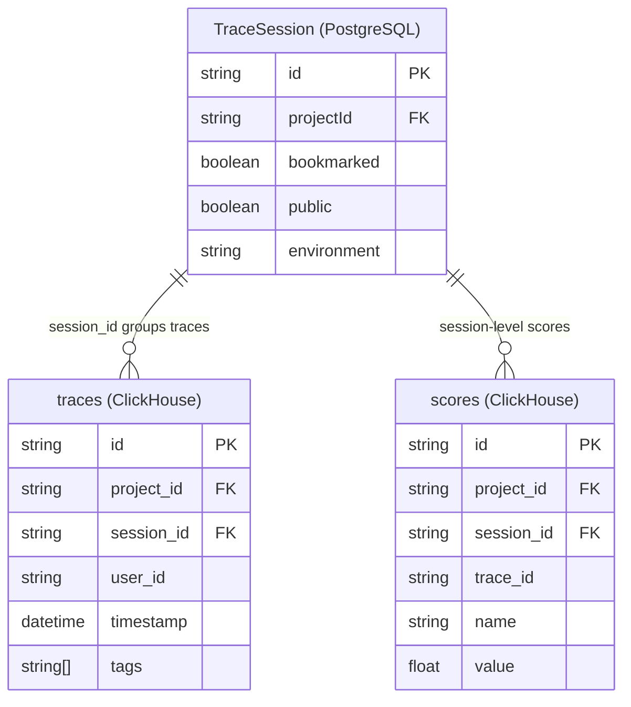
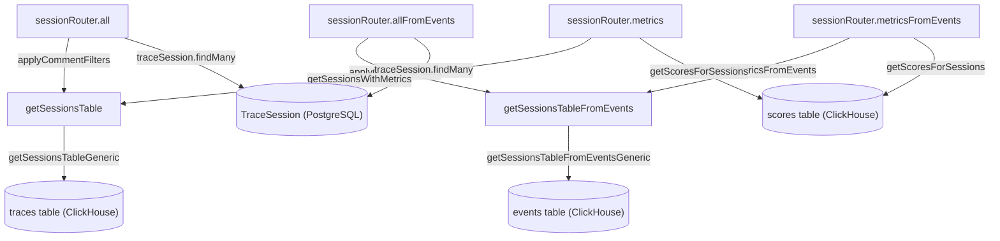
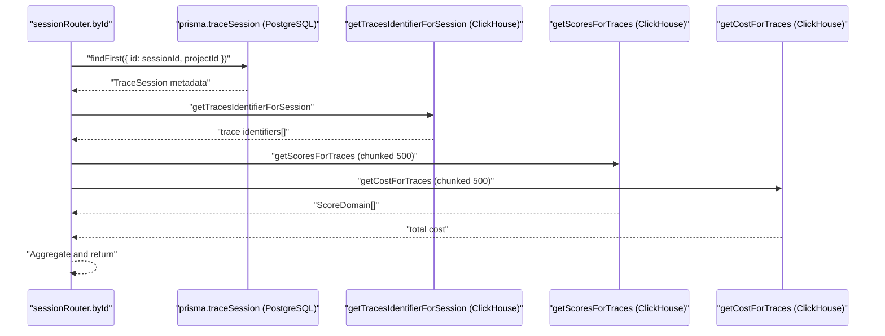

# Sessions

Relevant source files

The following files were used as context for generating this wiki page:

- [packages/shared/src/server/queries/clickhouse-sql/search.ts](packages/shared/src/server/queries/clickhouse-sql/search.ts)
- [packages/shared/src/server/repositories/observations.ts](packages/shared/src/server/repositories/observations.ts)
- [packages/shared/src/server/repositories/scores.ts](packages/shared/src/server/repositories/scores.ts)
- [packages/shared/src/server/repositories/traces.ts](packages/shared/src/server/repositories/traces.ts)
- [packages/shared/src/server/services/sessions-ui-table-service.ts](packages/shared/src/server/services/sessions-ui-table-service.ts)
- [packages/shared/src/server/services/traces-ui-table-service.ts](packages/shared/src/server/services/traces-ui-table-service.ts)
- [web/src/__tests__/server/clickhouseSearchCondition.servertest.ts](web/src/__tests__/server/clickhouseSearchCondition.servertest.ts)
- [web/src/components/session/index.tsx](web/src/components/session/index.tsx)
- [web/src/components/table/data-table.tsx](web/src/components/table/data-table.tsx)
- [web/src/components/table/use-cases/observations.tsx](web/src/components/table/use-cases/observations.tsx)
- [web/src/components/table/use-cases/scores.tsx](web/src/components/table/use-cases/scores.tsx)
- [web/src/components/table/use-cases/sessions.tsx](web/src/components/table/use-cases/sessions.tsx)
- [web/src/components/table/use-cases/traces.tsx](web/src/components/table/use-cases/traces.tsx)
- [web/src/features/events/components/EventsTable.tsx](web/src/features/events/components/EventsTable.tsx)
- [web/src/features/experiments/components/table/ExperimentItemsTable.tsx](web/src/features/experiments/components/table/ExperimentItemsTable.tsx)
- [web/src/features/experiments/components/table/ExperimentsTable.tsx](web/src/features/experiments/components/table/ExperimentsTable.tsx)
- [web/src/features/prompts/components/prompts-table.tsx](web/src/features/prompts/components/prompts-table.tsx)
- [web/src/features/prompts/server/actions/createPrompt.ts](web/src/features/prompts/server/actions/createPrompt.ts)
- [web/src/features/prompts/server/routers/promptRouter.ts](web/src/features/prompts/server/routers/promptRouter.ts)
- [web/src/server/api/routers/generations/filterOptionsQuery.ts](web/src/server/api/routers/generations/filterOptionsQuery.ts)
- [web/src/server/api/routers/scores.ts](web/src/server/api/routers/scores.ts)
- [web/src/server/api/routers/sessions.ts](web/src/server/api/routers/sessions.ts)
- [web/src/server/api/routers/traces.ts](web/src/server/api/routers/traces.ts)

This page documents the session concept in Langfuse: how traces are grouped into sessions, the dual-database storage model, the service layer that queries session data, and the tRPC and public API endpoints. For trace and observation internals, see [9.1](). For the scores that can be attached to sessions, see [9.2](). For the events table architecture that backs the `*FromEvents` query variants, see [3.4]().

---

## What Is a Session?

A **session** is a grouping of one or more traces that share the same `session_id` string. There is no separate ClickHouse table for sessions; a session is a logical entity derived by grouping rows in the `traces` table or the `events` table. Mutable session metadata (bookmarked, public) is stored in a PostgreSQL `TraceSession` record.

**Session data model across both stores:**

| Field | Store | Notes |
|---|---|---|
| `id` / `session_id` | PostgreSQL (`TraceSession`) + ClickHouse (derived) | The grouping key on `traces.session_id` [web/src/server/api/routers/sessions.ts:78-83]() |
| `bookmarked` | PostgreSQL `TraceSession` | User-defined bookmark flag [web/src/server/api/routers/sessions.ts:209-209]() |
| `public` | PostgreSQL `TraceSession` | Controls public share access [web/src/server/api/routers/sessions.ts:210-210]() |
| `environment` | PostgreSQL `TraceSession` | Denormalized from traces [web/src/server/api/routers/sessions.ts:211-211]() |
| Aggregated metrics | ClickHouse (computed at query time) | Trace count, user IDs, tags, cost, token usage, duration [packages/shared/src/server/services/sessions-ui-table-service.ts:19-30]() |
| Scores | ClickHouse `scores` table | Scores referencing `session_id` directly [packages/shared/src/server/repositories/scores.ts:245-247]() |

Traces are associated with a session at ingestion time by setting `session_id` on the trace event.

**Entity relationship:**

Sources: [web/src/server/api/routers/sessions.ts:78-83](), [packages/shared/src/server/repositories/scores.ts:245-247](), [web/src/server/api/routers/sessions.ts:200-213]()

---

## Session Table Services

Session list queries are served by two parallel service implementations: the original **traces-table** path and a newer **events-table** path (v4 architecture). Both expose the same logical interface and are selected at the tRPC router level based on feature flags or versioning.

### Traces-Table Service (`sessions-ui-table-service.ts`)

`getSessionsTableGeneric` is the internal workhorse function with three `select` modes:

| Mode | Returns | Called by |
|---|---|---|
| `"count"` | `{ count: string }` | `getSessionsTableCount` [packages/shared/src/server/services/sessions-ui-table-service.ts:52-63]() |
| `"rows"` | `SessionDataReturnType` | `getSessionsTable` [packages/shared/src/server/services/sessions-ui-table-service.ts:72-86]() |
| `"metrics"` | `SessionWithMetricsReturnType` | `getSessionsWithMetrics` [packages/shared/src/server/services/sessions-ui-table-service.ts:96-112]() |

The SQL query groups traces by `session_id` using CTEs. The service applies filters using `createFilterFromFilterState` against `sessionCols` and `sessionsViewCols` [packages/shared/src/server/services/sessions-ui-table-service.ts:179-181]().

**`SessionDataReturnType` fields:**
`session_id`, `max_timestamp`, `min_timestamp`, `trace_ids`, `user_ids`, `trace_count`, `trace_tags`, `trace_environment`, `scores_avg`, `score_categories` [packages/shared/src/server/services/sessions-ui-table-service.ts:19-30]().

Sources: [packages/shared/src/server/services/sessions-ui-table-service.ts:19-43](), [packages/shared/src/server/services/sessions-ui-table-service.ts:126-250]()

### Events-Table Service (`sessions-ui-table-events-service.ts`)

This service uses the `events` ClickHouse table via composable query builders. It replaces direct `traces` table scans with pre-aggregated event data.

Key functions:
- `getSessionsTableFromEvents`: List sessions using pre-aggregated event data [web/src/server/api/routers/sessions.ts:31-31]().
- `getSessionsTableCountFromEvents`: Count sessions from events [web/src/server/api/routers/sessions.ts:32-32]().
- `getSessionTracesFromEvents`: Get individual traces for a session [web/src/server/api/routers/sessions.ts:34-34]().

Sources: [web/src/server/api/routers/sessions.ts:31-34]()

### Query Architecture Diagram

**Session list query paths — data flow and code entities:**

Sources: [web/src/server/api/routers/sessions.ts:172-232](), [web/src/server/api/routers/sessions.ts:233-294](), [packages/shared/src/server/services/sessions-ui-table-service.ts:65-112]()

---

## tRPC Session Router

The `sessionRouter` is defined in `web/src/server/api/routers/sessions.ts` and handles session lifecycle and retrieval.

### Procedure Reference

| Procedure | Type | Key behavior |
|---|---|---|
| `hasAny` | query | `hasAnySession(projectId)` — checks ClickHouse `traces` table [web/src/server/api/routers/sessions.ts:152-160](). |
| `hasAnyFromEvents` | query | `hasAnySessionFromEventsTable(projectId)` — checks events table [web/src/server/api/routers/sessions.ts:161-169](). |
| `all` | query | Applies comment filters + `getSessionsTable`; merges bookmarked/public from PostgreSQL [web/src/server/api/routers/sessions.ts:170-232](). |
| `allFromEvents` | query | Same logic using `getSessionsTableFromEvents` [web/src/server/api/routers/sessions.ts:233-294](). |
| `byId` | query | `handleGetSessionById`: PostgreSQL lookup + `getTracesIdentifierForSession` + scores + costs [web/src/server/api/routers/sessions.ts:71-149](). |

### `handleGetSessionById` Internals

The `handleGetSessionById` helper function implements the dual-database fetch pattern:

Traces are chunked into groups of 500 before querying scores and costs to avoid ClickHouse parameter size limits [web/src/server/api/routers/sessions.ts:97-124]().

---

## Trace and Score Repository Integration

The session feature relies on specialized repository functions to bridge trace and score data:

| Function | File | Purpose |
|---|---|---|
| `getTracesIdentifierForSession` | `packages/shared/src/server/repositories/traces.ts` | Fetch identifiers for traces in a session [web/src/server/api/routers/sessions.ts:92-95](). |
| `getScoresForSessions` | `packages/shared/src/server/repositories/scores.ts` | Fetch scores where `session_id IN (...)` from the `scores` table [packages/shared/src/server/repositories/scores.ts:224-260](). |
| `searchExistingAnnotationScore` | `packages/shared/src/server/repositories/scores.ts` | Finds existing human annotations for a session to prevent duplicates [packages/shared/src/server/repositories/scores.ts:63-114](). |

`getScoresForSessions` specifically filters the `scores` table by `session_id` and `data_type` using `LISTABLE_SCORE_TYPES` [packages/shared/src/server/repositories/scores.ts:245-247]().

---

## Session Metrics and Aggregation

Session-level metrics are aggregated across all associated traces and observations.

- **Usage and Cost**: Aggregated in `getSessionsWithMetrics` via the `metrics` select mode which returns `session_usage_details`, `session_cost_details`, and totals [packages/shared/src/server/services/sessions-ui-table-service.ts:96-112]().
- **Scores**: Categorical and numeric scores are grouped by name for session-level analysis [web/src/server/api/routers/sessions.ts:46-47]().
- **Duration**: Calculated as a `duration` field in ClickHouse representing the delta between trace timestamps within the session [packages/shared/src/server/services/sessions-ui-table-service.ts:34]().
- **User Tracking**: Users associated with a session are identified by collecting unique `user_id` values from all traces within that session [web/src/server/api/routers/sessions.ts:143-148]().

Sources: [packages/shared/src/server/services/sessions-ui-table-service.ts:19-43](), [web/src/server/api/routers/sessions.ts:101-124](), [packages/shared/src/server/repositories/scores.ts:224-260]()
