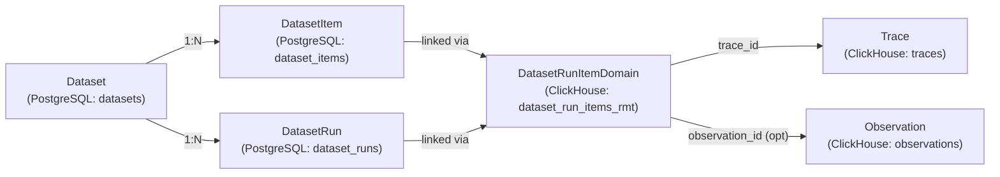
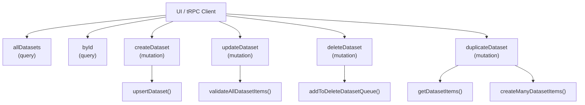
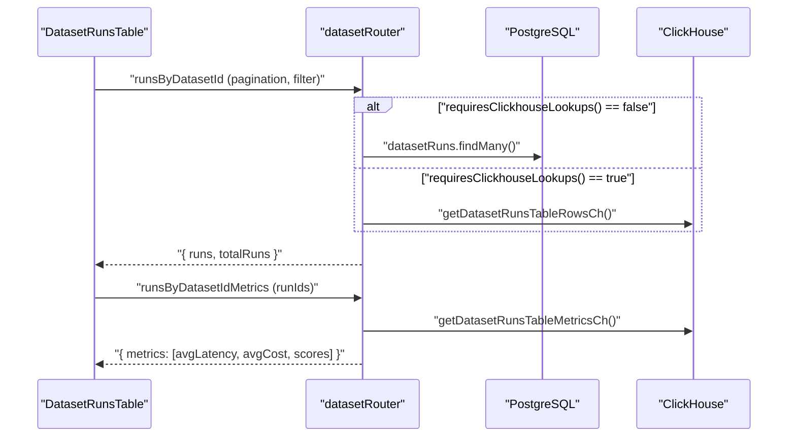
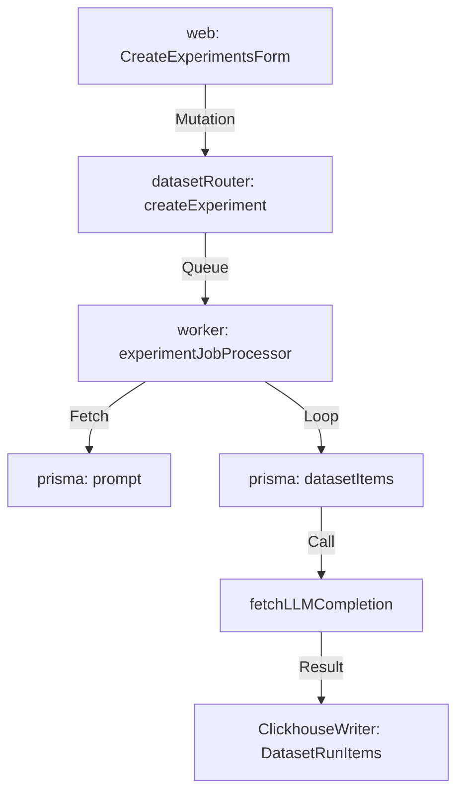

# Datasets & Experiments

Relevant source files

The following files were used as context for generating this wiki page:

- [fern/apis/server/definition/dataset-run-items.yml](fern/apis/server/definition/dataset-run-items.yml)
- [fern/apis/server/definition/datasets.yml](fern/apis/server/definition/datasets.yml)
- [fern/apis/server/definition/utils/pagination.yml](fern/apis/server/definition/utils/pagination.yml)
- [packages/shared/prisma/migrations/20260423084654_add_datasets_remote_experiment_enabled_col/migration.sql](packages/shared/prisma/migrations/20260423084654_add_datasets_remote_experiment_enabled_col/migration.sql)
- [packages/shared/src/features/experiments/utils.ts](packages/shared/src/features/experiments/utils.ts)
- [packages/shared/src/server/clickhouse/client.ts](packages/shared/src/server/clickhouse/client.ts)
- [packages/shared/src/server/llm/getInternalTracingHandler.ts](packages/shared/src/server/llm/getInternalTracingHandler.ts)
- [packages/shared/src/server/llm/testModelCall.ts](packages/shared/src/server/llm/testModelCall.ts)
- [packages/shared/src/server/repositories/dataset-items.ts](packages/shared/src/server/repositories/dataset-items.ts)
- [packages/shared/src/server/repositories/dataset-run-items.ts](packages/shared/src/server/repositories/dataset-run-items.ts)
- [web/src/__tests__/server/datasets-api.servertest.ts](web/src/__tests__/server/datasets-api.servertest.ts)
- [web/src/features/annotation-queues/components/CreateOrEditAnnotationQueueButton.tsx](web/src/features/annotation-queues/components/CreateOrEditAnnotationQueueButton.tsx)
- [web/src/features/annotation-queues/components/DeleteAnnotationQueueButton.tsx](web/src/features/annotation-queues/components/DeleteAnnotationQueueButton.tsx)
- [web/src/features/datasets/components/DatasetItemsTable.tsx](web/src/features/datasets/components/DatasetItemsTable.tsx)
- [web/src/features/datasets/components/DatasetRunsTable.tsx](web/src/features/datasets/components/DatasetRunsTable.tsx)
- [web/src/features/datasets/components/DatasetsTable.tsx](web/src/features/datasets/components/DatasetsTable.tsx)
- [web/src/features/datasets/server/actions/createDataset.ts](web/src/features/datasets/server/actions/createDataset.ts)
- [web/src/features/datasets/server/dataset-router.ts](web/src/features/datasets/server/dataset-router.ts)
- [web/src/features/datasets/server/service.ts](web/src/features/datasets/server/service.ts)
- [web/src/features/experiments/components/CreateExperimentsForm.tsx](web/src/features/experiments/components/CreateExperimentsForm.tsx)
- [web/src/features/experiments/components/RemoteExperimentTriggerModal.tsx](web/src/features/experiments/components/RemoteExperimentTriggerModal.tsx)
- [web/src/features/experiments/components/RemoteExperimentUpsertForm.tsx](web/src/features/experiments/components/RemoteExperimentUpsertForm.tsx)
- [web/src/features/experiments/server/router.ts](web/src/features/experiments/server/router.ts)
- [web/src/features/experiments/types.ts](web/src/features/experiments/types.ts)
- [web/src/features/natural-language-filters/server/router.ts](web/src/features/natural-language-filters/server/router.ts)
- [web/src/features/natural-language-filters/server/utils.ts](web/src/features/natural-language-filters/server/utils.ts)
- [web/src/features/playground/page/components/CreateOrEditLLMSchemaDialog.tsx](web/src/features/playground/page/components/CreateOrEditLLMSchemaDialog.tsx)
- [web/src/features/playground/page/components/CreateOrEditLLMToolDialog.tsx](web/src/features/playground/page/components/CreateOrEditLLMToolDialog.tsx)
- [web/src/features/public-api/server/dataset-runs.ts](web/src/features/public-api/server/dataset-runs.ts)
- [web/src/features/public-api/types/datasets.ts](web/src/features/public-api/types/datasets.ts)
- [web/src/pages/api/public/dataset-items/[datasetItemId].ts](web/src/pages/api/public/dataset-items/[datasetItemId].ts)
- [web/src/pages/api/public/dataset-items/index.ts](web/src/pages/api/public/dataset-items/index.ts)
- [web/src/pages/api/public/dataset-run-items.ts](web/src/pages/api/public/dataset-run-items.ts)
- [web/src/pages/api/public/datasets/[name]/index.ts](web/src/pages/api/public/datasets/[name]/index.ts)
- [web/src/pages/api/public/datasets/[name]/runs/[runName].ts](web/src/pages/api/public/datasets/[name]/runs/[runName].ts)
- [web/src/pages/api/public/datasets/[name]/runs/index.ts](web/src/pages/api/public/datasets/[name]/runs/index.ts)
- [web/src/pages/api/public/v2/datasets/[datasetName]/index.ts](web/src/pages/api/public/v2/datasets/[datasetName]/index.ts)
- [web/src/pages/api/public/v2/datasets/index.ts](web/src/pages/api/public/v2/datasets/index.ts)
- [worker/src/__tests__/experimentsService.test.ts](worker/src/__tests__/experimentsService.test.ts)
- [worker/src/backgroundMigrations/migrateDatasetRunItemsFromPostgresToClickhouse.ts](worker/src/backgroundMigrations/migrateDatasetRunItemsFromPostgresToClickhouse.ts)
- [worker/src/backgroundMigrations/migrateDatasetRunItemsFromPostgresToClickhouseRmt.ts](worker/src/backgroundMigrations/migrateDatasetRunItemsFromPostgresToClickhouseRmt.ts)
- [worker/src/features/experiments/__tests__/scheduleExperimentEvals.test.ts](worker/src/features/experiments/__tests__/scheduleExperimentEvals.test.ts)
- [worker/src/features/experiments/experimentServiceClickhouse.ts](worker/src/features/experiments/experimentServiceClickhouse.ts)
- [worker/src/features/experiments/scheduleExperimentEvals.ts](worker/src/features/experiments/scheduleExperimentEvals.ts)
- [worker/src/features/experiments/utils.ts](worker/src/features/experiments/utils.ts)
- [worker/src/features/utils/utilities.ts](worker/src/features/utils/utilities.ts)
- [worker/src/services/ClickhouseWriter/ClickhouseWriter.unit.test.ts](worker/src/services/ClickhouseWriter/ClickhouseWriter.unit.test.ts)
- [worker/src/services/ClickhouseWriter/index.ts](worker/src/services/ClickhouseWriter/index.ts)

This page covers the dataset management system in Langfuse: how datasets and their items are created and managed, how experiments (dataset runs) are executed and compared, and the API surface that supports these operations. For prompt management and linking prompts to experiments, see [9.5](). For the automated evaluation system that scores dataset runs, see [10]().

---

## Overview

A **dataset** is a named collection of input/output example pairs (`DatasetItem`s). Each item can optionally be linked back to the trace or observation it was derived from. An **experiment** is a `DatasetRun`: a named execution of a model or pipeline over a dataset where each item's processing produces a trace that is recorded as a `DatasetRunItem`. Multiple runs over the same dataset can then be compared on latency, cost, and score dimensions.

### Entity Relationship Diagram
This diagram bridges the natural language concepts to the specific code entities and database tables used in the implementation.

Sources: [web/src/features/datasets/server/dataset-router.ts:1-80](), [packages/shared/src/server/repositories/dataset-run-items.ts:1-100](), [packages/shared/src/server/repositories/dataset-items.ts:1-18]()

---

## Data Model

### PostgreSQL Entities
The metadata and configuration for datasets are stored in PostgreSQL via Prisma [packages/shared/src/server/repositories/dataset-items.ts:1-18]().

| Entity | Table | Key Fields |
|---|---|---|
| `Dataset` | `datasets` | `id`, `projectId`, `name`, `description`, `metadata`, `inputSchema`, `expectedOutputSchema`, `sortPriority` |
| `DatasetItem` | `dataset_items` | `id`, `projectId`, `datasetId`, `input`, `expectedOutput`, `metadata`, `sourceTraceId`, `sourceObservationId`, `status`, `validFrom` |
| `DatasetRun` | `dataset_runs` | `id`, `projectId`, `datasetId`, `name`, `description`, `metadata` |

`DatasetItem.validFrom` is a timestamp used for point-in-time versioning: querying items at a specific `version` date returns the state of the dataset as it existed at that moment [packages/shared/src/server/repositories/dataset-items.ts:132-135]().

`DatasetItem.status` is an enum of `ACTIVE` or `ARCHIVED`. Archived items are excluded from new experiment runs but remain queryable [packages/shared/src/server/repositories/dataset-items.ts:129]().

### ClickHouse Entity
`dataset_run_items_rmt` (ReplicatedMergeTree) stores the linkage between experiment runs and the traces/observations produced. It drives all latency, cost, and score aggregations for the experiment comparison view [packages/shared/src/server/repositories/dataset-run-items.ts:200-227]().

| Field | Description |
|---|---|
| `project_id` | Project scope |
| `dataset_id` | Parent dataset |
| `dataset_run_id` | Which run this item belongs to |
| `dataset_run_name` | Name of the run for UI display |
| `dataset_item_id` | Which dataset item was used |
| `trace_id` | Resulting trace in ClickHouse |
| `observation_id` | Optional observation within the trace |
| `dataset_run_created_at` | Timestamp of the run |

Sources: [packages/shared/src/server/repositories/dataset-run-items.ts:89-155](), [packages/shared/src/server/repositories/dataset-items.ts:123-157](), [worker/src/services/ClickhouseWriter/index.ts:57]()

---

## Folder Support

Datasets support hierarchical organization using `/` as a path separator in the dataset name (e.g., `experiments/qa/v2`). The `allDatasets` tRPC procedure uses Common Table Expressions (CTEs) in PostgreSQL to present a virtual folder tree at each path level. The `generateDatasetQuery` function in the router builds these CTEs dynamically [web/src/features/datasets/server/dataset-router.ts:143-213]().

- **Root level:** Returns individual datasets whose names contain no `/`, plus one representative row per unique top-level folder prefix [web/src/features/datasets/server/dataset-router.ts:154-161]().
- **Inside a folder (pathPrefix set):** Returns datasets whose relative name contains no further `/`, plus representatives for any deeper subfolders [web/src/features/datasets/server/dataset-router.ts:174-213]().

The search logic uses `ILIKE` for case-insensitive filtering [web/src/features/datasets/server/dataset-router.ts:90]() and `LIKE` with escaped path prefixes for folder isolation [web/src/features/datasets/server/dataset-router.ts:98]().

Sources: [web/src/features/datasets/server/dataset-router.ts:86-272]()

---

## tRPC API (`datasetRouter`)

Internal UI communication goes through `datasetRouter` in [web/src/features/datasets/server/dataset-router.ts](). Every procedure is a `protectedProjectProcedure`, requiring authenticated project access.

### Dataset CRUD Logic

### Key Procedures

| Procedure | Type | Description |
|---|---|---|
| `itemsByDatasetId` | query | Paginated item list with filter, search, and version support [web/src/features/datasets/server/dataset-router.ts:335]() |
| `listDatasetVersions` | query | All distinct version timestamps for a dataset [web/src/features/datasets/server/dataset-router.ts:468]() |
| `runsByDatasetId` | query | Paginated run list. Uses PostgreSQL or ClickHouse based on `requiresClickhouseLookups` [web/src/features/datasets/server/dataset-router.ts:553]() |
| `runsByDatasetIdMetrics` | query | Latency, cost, and score aggregates per run from ClickHouse [web/src/features/datasets/server/dataset-router.ts:608]() |
| `deleteDatasetRuns` | mutation | Batch delete runs from both PG and CH [web/src/features/datasets/server/dataset-router.ts:771]() |

Sources: [web/src/features/datasets/server/dataset-router.ts:274-1200](), [web/src/features/datasets/server/service.ts:1-233]()

---

## Ingestion & ClickHouse Writing

Dataset Run Items are ingested via the standard ingestion pipeline but routed to the ClickHouse `dataset_run_items` table.

### ClickhouseWriter
The `ClickhouseWriter` singleton manages buffered writes to ClickHouse to ensure high throughput and reliability [worker/src/services/ClickhouseWriter/index.ts:32-78]().

- **Batching:** Flushes queues based on `LANGFUSE_INGESTION_CLICKHOUSE_WRITE_BATCH_SIZE` or `LANGFUSE_INGESTION_CLICKHOUSE_WRITE_INTERVAL_MS` [worker/src/services/ClickhouseWriter/index.ts:44-45]().
- **Error Handling:** Implements retries for network issues (`socket hang up`) and handles JS string length errors by splitting batches [worker/src/services/ClickhouseWriter/index.ts:134-206]().
- **Data Flow:** Ingestion events (like `dataset-run-item-create`) are processed in the `ingestionQueue`, which downloads payloads from S3 and adds them to the `ClickhouseWriter` queue [worker/src/services/ClickhouseWriter/index.ts:57]().

Sources: [worker/src/services/ClickhouseWriter/index.ts:1-212](), [packages/shared/src/server/clickhouse/client.ts:35-135]()

---

## Dataset Items

### Schema Validation
Datasets can define `inputSchema` and `expectedOutputSchema` (JSON Schema). The `DatasetItemValidator` class compiles these schemas once per operation for performance [packages/shared/src/server/repositories/dataset-items.ts:33-36]().

### Versioning
Versioning is tracked via the `validFrom` timestamp.
- `listDatasetVersions`: Returns all distinct `validFrom` timestamps [web/src/features/datasets/server/dataset-router.ts:468]().
- `getDatasetItemById` with `version`: Returns the state of an item as it existed at that point in time [packages/shared/src/server/repositories/dataset-items.ts:111-159]().
- The UI allows browsing and selecting historical versions via the `useDatasetVersion` hook in `DatasetItemsTable` [web/src/features/datasets/components/DatasetItemsTable.tsx:86-101]().

Sources: [packages/shared/src/server/repositories/dataset-items.ts:49-217](), [web/src/features/datasets/components/DatasetItemsTable.tsx:144-217]()

---

## Experiments (Dataset Runs)

### Metrics Pipeline
Run metrics are fetched in separate calls to avoid blocking the main UI on slow ClickHouse aggregations.

The ClickHouse metrics query in `getDatasetRunsTableInternal` uses a chain of CTEs to aggregate scores and compute latency/cost from observations [packages/shared/src/server/repositories/dataset-run-items.ts:231-255]().

### Compare View
The compare view uses `enrichAndMapToDatasetItemId` to build a matrix of dataset items vs. experiment runs [web/src/features/datasets/server/service.ts:199-233](). This service:
1. Groups run items by run ID [web/src/features/datasets/server/service.ts:204]().
2. Enriches them with scores and latency in parallel via `getRunItemsByRunIdOrItemId` [web/src/features/datasets/server/service.ts:207-218]().
3. Maps them back to `datasetItemId` for the side-by-side UI [web/src/features/datasets/server/service.ts:223-230]().

`getRunItemsByRunIdOrItemId` calculates recursive metrics (latency/cost) for observation-level run items using `calculateRecursiveMetricsForRunItems` [web/src/features/datasets/server/service.ts:137-140]().

Sources: [web/src/features/datasets/server/service.ts:95-233](), [packages/shared/src/server/repositories/dataset-run-items.ts:231-255](), [web/src/features/datasets/components/DatasetRunsTable.tsx:116-127]()

---

## Remote Experiments Feature

Langfuse supports running experiments at scale by triggering model calls directly from the platform. This feature allows comparing different prompts or models against a dataset without writing custom evaluation scripts.

### Execution Flow
When an experiment is triggered, a job is dispatched to the worker system.

1. **Validation:** The `createExperimentJobClickhouse` function validates the experiment configuration, ensuring the required `prompt_id`, `provider`, and `model` are present in the `DatasetRun` metadata [worker/src/features/experiments/experimentServiceClickhouse.ts]().
2. **Execution:** For each item in the dataset, the worker compiles the prompt using the item's `input` as variables, calls the LLM via `fetchLLMCompletion`, and records the result as a `DatasetRunItem` [worker/src/__tests__/experimentsService.test.ts:104-118]().
3. **Error Handling:** If validation fails (e.g., missing `prompt_id`), the system logs the error but ensures the job state remains consistent [worker/src/__tests__/experimentsService.test.ts:168-172]().

Sources: [worker/src/__tests__/experimentsService.test.ts:1-260](), [web/src/features/datasets/server/dataset-router.ts:82]()

---

## UI Architecture

The UI is organized around specialized tables for Datasets, Items, and Runs.

| Component | File | Responsibility |
|---|---|---|
| `DatasetItemsTable` | `DatasetItemsTable.tsx` | Item listing, version selection, and source trace linking [web/src/features/datasets/components/DatasetItemsTable.tsx:54]() |
| `DatasetRunsTable` | `DatasetRunsTable.tsx` | Experiment metrics, comparison selection, and deletion [web/src/features/datasets/components/DatasetRunsTable.tsx:181]() |
| `DatasetsTable` | `DatasetsTable.tsx` | Top-level dataset and folder navigation [web/src/features/datasets/components/DatasetsTable.tsx:74]() |

### Experiment Management
The UI allows users to select multiple runs and trigger a "Compare" view [web/src/features/datasets/components/DatasetRunsTable.tsx:119-130](). This view renders `DatasetCompareRunsTable`, which fetches data via `datasetItemsWithRunData` [web/src/features/datasets/server/service.ts:199-233]().

Sources: [web/src/features/datasets/components/DatasetItemsTable.tsx](), [web/src/features/datasets/components/DatasetRunsTable.tsx](), [web/src/features/datasets/components/DatasetsTable.tsx]()
