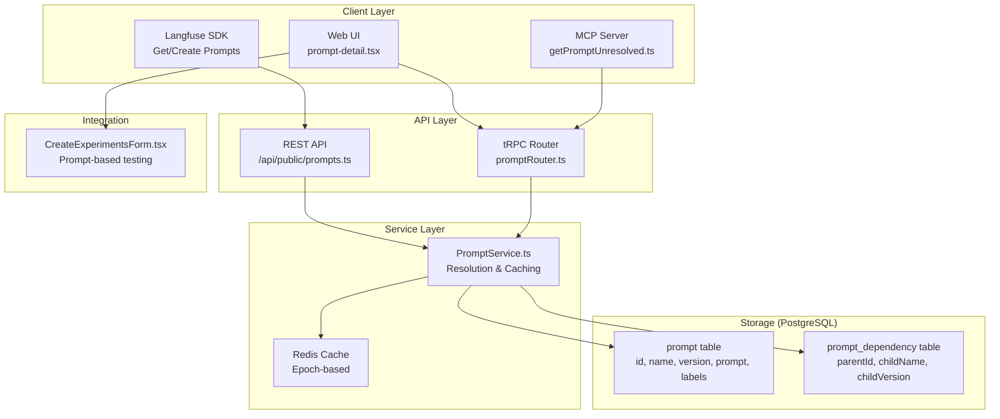
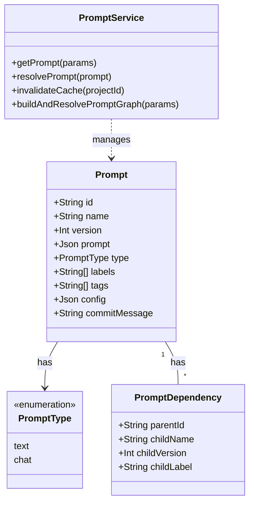
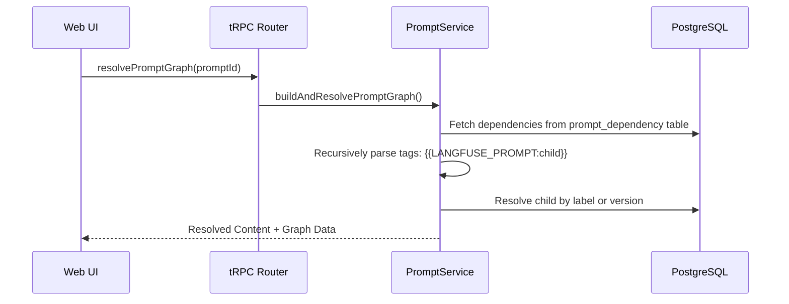

# Prompts & Templates

Relevant source files

The following files were used as context for generating this wiki page:

- [packages/shared/prisma/migrations/20250128163035_add_nullable_commit_message_prompts/migration.sql](packages/shared/prisma/migrations/20250128163035_add_nullable_commit_message_prompts/migration.sql)
- [packages/shared/src/features/prompts/types.ts](packages/shared/src/features/prompts/types.ts)
- [packages/shared/src/server/dataset-run-items/addToDeleteQueue.ts](packages/shared/src/server/dataset-run-items/addToDeleteQueue.ts)
- [packages/shared/src/server/redis/datasetDelete.ts](packages/shared/src/server/redis/datasetDelete.ts)
- [packages/shared/src/server/services/PromptService/index.ts](packages/shared/src/server/services/PromptService/index.ts)
- [packages/shared/src/server/services/PromptService/types.ts](packages/shared/src/server/services/PromptService/types.ts)
- [web/src/__tests__/server/promptCache.servertest.ts](web/src/__tests__/server/promptCache.servertest.ts)
- [web/src/components/ActionButton.tsx](web/src/components/ActionButton.tsx)
- [web/src/components/DiffViewer.tsx](web/src/components/DiffViewer.tsx)
- [web/src/components/TruncatedLabels.tsx](web/src/components/TruncatedLabels.tsx)
- [web/src/components/layouts/doc-popup.tsx](web/src/components/layouts/doc-popup.tsx)
- [web/src/components/session/index.tsx](web/src/components/session/index.tsx)
- [web/src/components/table/data-table.tsx](web/src/components/table/data-table.tsx)
- [web/src/components/table/use-cases/observations.tsx](web/src/components/table/use-cases/observations.tsx)
- [web/src/components/table/use-cases/scores.tsx](web/src/components/table/use-cases/scores.tsx)
- [web/src/components/table/use-cases/sessions.tsx](web/src/components/table/use-cases/sessions.tsx)
- [web/src/components/table/use-cases/traces.tsx](web/src/components/table/use-cases/traces.tsx)
- [web/src/components/ui/input-command.tsx](web/src/components/ui/input-command.tsx)
- [web/src/features/annotation-queues/components/AnnotationQueueItemsTable.tsx](web/src/features/annotation-queues/components/AnnotationQueueItemsTable.tsx)
- [web/src/features/annotation-queues/components/AnnotationQueuesTable.tsx](web/src/features/annotation-queues/components/AnnotationQueuesTable.tsx)
- [web/src/features/automations/components/DeleteAutomationButton.tsx](web/src/features/automations/components/DeleteAutomationButton.tsx)
- [web/src/features/datasets/components/DatasetAnalytics.tsx](web/src/features/datasets/components/DatasetAnalytics.tsx)
- [web/src/features/datasets/components/DeleteDatasetRunButton.tsx](web/src/features/datasets/components/DeleteDatasetRunButton.tsx)
- [web/src/features/evals/hooks/useEvalConfigMappingData.ts](web/src/features/evals/hooks/useEvalConfigMappingData.ts)
- [web/src/features/events/components/EventsTable.tsx](web/src/features/events/components/EventsTable.tsx)
- [web/src/features/experiments/components/table/ExperimentItemsTable.tsx](web/src/features/experiments/components/table/ExperimentItemsTable.tsx)
- [web/src/features/experiments/components/table/ExperimentsTable.tsx](web/src/features/experiments/components/table/ExperimentsTable.tsx)
- [web/src/features/mcp/features/prompts/index.ts](web/src/features/mcp/features/prompts/index.ts)
- [web/src/features/mcp/features/prompts/tools/getPrompt.ts](web/src/features/mcp/features/prompts/tools/getPrompt.ts)
- [web/src/features/mcp/features/prompts/tools/getPromptUnresolved.ts](web/src/features/mcp/features/prompts/tools/getPromptUnresolved.ts)
- [web/src/features/mcp/features/prompts/tools/promptReadToolFactory.ts](web/src/features/mcp/features/prompts/tools/promptReadToolFactory.ts)
- [web/src/features/navigate-detail-pages/DetailPageNav.tsx](web/src/features/navigate-detail-pages/DetailPageNav.tsx)
- [web/src/features/prompts/components/NewPromptForm/ReviewPromptDialog.tsx](web/src/features/prompts/components/NewPromptForm/ReviewPromptDialog.tsx)
- [web/src/features/prompts/components/NewPromptForm/index.tsx](web/src/features/prompts/components/NewPromptForm/index.tsx)
- [web/src/features/prompts/components/NewPromptForm/validation.ts](web/src/features/prompts/components/NewPromptForm/validation.ts)
- [web/src/features/prompts/components/PromptSelectionDialog.tsx](web/src/features/prompts/components/PromptSelectionDialog.tsx)
- [web/src/features/prompts/components/PromptVersionDiffDialog.tsx](web/src/features/prompts/components/PromptVersionDiffDialog.tsx)
- [web/src/features/prompts/components/SetPromptVersionLabels/index.tsx](web/src/features/prompts/components/SetPromptVersionLabels/index.tsx)
- [web/src/features/prompts/components/delete-prompt-version.tsx](web/src/features/prompts/components/delete-prompt-version.tsx)
- [web/src/features/prompts/components/delete-prompt.tsx](web/src/features/prompts/components/delete-prompt.tsx)
- [web/src/features/prompts/components/prompt-detail.tsx](web/src/features/prompts/components/prompt-detail.tsx)
- [web/src/features/prompts/components/prompt-history.tsx](web/src/features/prompts/components/prompt-history.tsx)
- [web/src/features/prompts/components/prompts-table.tsx](web/src/features/prompts/components/prompts-table.tsx)
- [web/src/features/prompts/server/actions/createPrompt.ts](web/src/features/prompts/server/actions/createPrompt.ts)
- [web/src/features/prompts/server/actions/deletePrompt.ts](web/src/features/prompts/server/actions/deletePrompt.ts)
- [web/src/features/prompts/server/actions/getPromptByName.ts](web/src/features/prompts/server/actions/getPromptByName.ts)
- [web/src/features/prompts/server/handlers/promptNameHandler.ts](web/src/features/prompts/server/handlers/promptNameHandler.ts)
- [web/src/features/prompts/server/routers/promptRouter.ts](web/src/features/prompts/server/routers/promptRouter.ts)
- [web/src/features/scores/components/multi-select-key-values.tsx](web/src/features/scores/components/multi-select-key-values.tsx)
- [web/src/features/tag/components/TagCommandItem.tsx](web/src/features/tag/components/TagCommandItem.tsx)
- [web/src/features/telemetry/index.ts](web/src/features/telemetry/index.ts)
- [web/src/pages/api/public/projects/[projectId]/apiKeys/[apiKeyId].ts](web/src/pages/api/public/projects/[projectId]/apiKeys/[apiKeyId].ts)
- [web/src/pages/api/public/projects/[projectId]/apiKeys/index.ts](web/src/pages/api/public/projects/[projectId]/apiKeys/index.ts)
- [web/src/pages/api/public/prompts.ts](web/src/pages/api/public/prompts.ts)
- [web/src/pages/project/[projectId]/datasets/[datasetId]/index.tsx](web/src/pages/project/[projectId]/datasets/[datasetId]/index.tsx)
- [web/src/pages/project/[projectId]/datasets/[datasetId]/runs/[runId].tsx](web/src/pages/project/[projectId]/datasets/[datasetId]/runs/[runId].tsx)
- [web/src/pages/project/[projectId]/prompts/[[...folder]].tsx](web/src/pages/project/[projectId]/prompts/[[...folder]].tsx)
- [web/src/pages/project/[projectId]/prompts/metrics.tsx](web/src/pages/project/[projectId]/prompts/metrics.tsx)
- [web/src/utils/string.ts](web/src/utils/string.ts)

This document describes the prompt management system in Langfuse. Prompts are versioned templates (text or chat format) that can be organized in folders, labeled for deployment, and tracked for usage across observations. The system supports recursive prompt dependencies, protected labels for access control, and an epoch-based Redis caching strategy.

---

## System Architecture

The prompt management system consists of PostgreSQL storage for metadata and versioning, a service layer with Redis caching, dual API surfaces (REST and tRPC), and a folder-based UI.

### High-Level Component Diagram

**Sources:**
- [web/src/features/prompts/server/routers/promptRouter.ts:75-101]()
- [web/src/features/prompts/components/prompt-detail.tsx:109-142]()
- [packages/shared/src/server/services/PromptService/index.ts:20-45]()
- [web/src/features/mcp/features/prompts/tools/getPromptUnresolved.ts:10-25]()

---

## Data Model

Prompts are stored in PostgreSQL. Each record represents a specific version of a prompt. The `PromptService` acts as the primary orchestrator for lifecycle events.

### Code Entity Association

**Key Characteristics:**

| Field | Type | Description |
|-------|------|-------------|
| `name` | `string` | Unique identifier within a project. Supports folder paths (e.g., `folder/prompt-name`) [web/src/features/prompts/components/prompt-detail.tsx:116-120](). |
| `version` | `number` | Auto-incrementing integer per prompt name [web/src/features/prompts/components/prompt-detail.tsx:121-124](). |
| `type` | `PromptType` | Either `text` or `chat` [web/src/features/prompts/server/actions/createPrompt.ts:78-78](). |
| `labels` | `string[]` | Deployment targets (e.g., `production`). Managed via `SetPromptVersionLabels` [web/src/features/prompts/components/SetPromptVersionLabels/index.tsx:30-46](). |
| `tags` | `string[]` | Organizational tags consistent across all versions of a prompt [web/src/features/prompts/server/actions/createPrompt.ts:186-200](). |
| `config` | `json` | Model parameters (temperature, max_tokens) and metadata [web/src/features/prompts/server/actions/createPrompt.ts:153-153](). |
| `commitMessage` | `string` | Optional description of changes for a specific version [web/src/features/prompts/server/actions/createPrompt.ts:154-154](). |

**Sources:**
- [web/src/features/prompts/components/prompt-detail.tsx:155-163]()
- [web/src/features/prompts/server/actions/createPrompt.ts:74-115]()
- [web/src/features/prompts/components/SetPromptVersionLabels/index.tsx:59-65]()

---

## Prompt Resolution & Caching

The `PromptService` handles the logic of finding the correct prompt version and resolving its dependencies.

### Resolution Logic
1. **By Version**: Fetches a specific integer version [web/src/features/prompts/components/prompt-detail.tsx:155-158]().
2. **By Label**: Fetches the version tagged with a specific label (e.g., `production`). Newly created prompts are automatically labeled as `latest` [web/src/features/prompts/server/actions/createPrompt.ts:110-110]().
3. **Unresolved vs Resolved**: The UI allows toggling between `tagged` (raw template) and `resolved` (nested dependencies replaced) modes using the `resolutionMode` state [web/src/features/prompts/components/prompt-detail.tsx:136-138]().

### Epoch-based Caching
To ensure consistency across distributed nodes, Langfuse uses an "Epoch" strategy in Redis:
- **Cache Key Generation**: The key includes a project-specific epoch token to isolate namespaces [packages/shared/src/server/services/PromptService/index.ts:192-206]().
- **Invalidation**: Rotating the cache epoch in Redis namespaces all subsequent lookups, effectively invalidating old entries after a successful database commit [packages/shared/src/server/services/PromptService/index.ts:177-190]().

**Sources:**
- [web/src/features/prompts/server/actions/createPrompt.ts:208-209]()
- [packages/shared/src/server/services/PromptService/index.ts:47-79]()
- [packages/shared/src/server/services/PromptService/index.ts:214-232]()

---

## Prompt Dependencies

Langfuse supports recursive prompt templates. A prompt can include another prompt using the `{{LANGFUSE_PROMPT:name}}` syntax.

### Dependency Graph Resolution
The system performs a recursive search to construct a `ResolvedPromptGraph`. Dependencies are stored in the `PromptDependency` table, linking a parent version to a child by name and either a specific version or a label [web/src/features/prompts/server/actions/createPrompt.ts:157-168]().

**Sources:**
- [web/src/features/prompts/server/actions/createPrompt.ts:117-139]()
- [web/src/features/prompts/components/prompt-detail.tsx:165-173]()
- [packages/shared/src/server/services/PromptService/index.ts:234-252]()

---

## ChatPrompt vs TextPrompt

The system handles two primary prompt formats. `ChatPrompt` is specifically designed for chat completion models.

| Feature | `TextPrompt` | `ChatPrompt` |
|---------|--------------|--------------|
| **Data Type** | `string` | `Array<ChatMessage>` |
| **Structure** | Single template string | List of messages (System, User, Assistant, Tool) |
| **Validation** | String validation | `ChatMlArraySchema` [web/src/features/prompts/components/prompt-detail.tsx:35-35]() |
| **UI Editor** | `CodeMirrorEditor` | `PromptChatMessages` component [web/src/features/prompts/components/NewPromptForm/index.tsx:34-34]() |

### Variable & Placeholder Extraction
For `ChatPrompt`, variables (e.g., `{{name}}`) and placeholders (e.g., `{{chat_history}}`) are extracted from all message contents using `extractVariables` [web/src/features/prompts/components/NewPromptForm/index.tsx:105-109](). The system prevents naming collisions between these two types to ensure unambiguous resolution [web/src/features/prompts/server/actions/createPrompt.ts:98-108]().

**Sources:**
- [web/src/features/prompts/components/prompt-detail.tsx:175-189]()
- [web/src/features/prompts/server/actions/createPrompt.ts:52-72]()
- [web/src/features/prompts/components/NewPromptForm/index.tsx:34-34]()

---

## Folder Organization & UI

### Folders
Prompts can be organized using a path-based naming convention (e.g., `marketing/emails/welcome`). The `PromptTable` uses `row_type: "folder" | "prompt"` metadata returned by `promptRouter.ts` to render directory structures and manage navigation via `currentFolderPath` [web/src/features/prompts/components/prompts-table.tsx:158-176]().

### Metrics & Monitoring
Prompt usage is tracked via ClickHouse events. The `PromptTable` component joins core prompt metadata with usage metrics fetched via `api.prompts.metrics.useQuery` [web/src/features/prompts/components/prompts-table.tsx:122-140](). Metrics include:
- **Observation Count**: Total number of generations/spans using the prompt [web/src/features/prompts/components/prompts-table.tsx:189-189]().
- **Latency & Scores**: Aggregated performance metrics for prompt versions [web/src/features/prompts/server/routers/promptRouter.ts:36-37]().

### Comparison & Diffing
The `PromptVersionDiffDialog` allows users to compare two versions of a prompt, highlighting changes in both the template content and the JSON configuration [web/src/features/prompts/components/prompt-history.tsx:154-164]().

**Sources:**
- [web/src/features/prompts/server/routers/promptRouter.ts:141-164]()
- [web/src/features/prompts/components/prompts-table.tsx:147-156]()

---

## LLM Schemas & Tools

Langfuse supports structured definitions for LLM interactions, which are utilized in the **Playground** and for **Automated Evaluations**.

### LLM Tools
Reusable tool definitions (e.g., JSON schemas for function calling) can be linked to prompts or used independently in the playground. These definitions ensure that the model outputs are constrained to specific structures. The system tracks `toolDefinitions` and `toolCalls` in observation tables [web/src/components/table/use-cases/observations.tsx:134-135]().

### Playground Integration
The Playground allows developers to:
- Test prompts with real-time variable injection [web/src/features/prompts/components/NewPromptForm/index.tsx:105-109]().
- Configure model parameters (temperature, top_p) stored in the prompt's `config` field [web/src/features/prompts/components/NewPromptForm/index.tsx:153-153]().
- Simulate tool calls using structured schemas defined in the project. Lookups are often cached or restored via `usePlaygroundCache` [web/src/features/prompts/components/NewPromptForm/index.tsx:188-190]().

### Automated Evaluations
Prompt templates are frequently used as the "judge" in LLM-as-a-judge workflows. The `CreateExperimentsForm` facilitates running these evaluations by mapping dataset inputs to prompt variables [web/src/features/prompts/components/prompt-detail.tsx:46-46](). This is triggered via `RunEvaluationDialog` or during experiment creation [web/src/pages/project/[projectId]/datasets/[datasetId]/index.tsx:195-197]().

**Sources:**
- [web/src/features/prompts/components/NewPromptForm/index.tsx:129-154]()
- [web/src/components/table/use-cases/observations.tsx:134-135]()
- [web/src/pages/project/[projectId]/datasets/[datasetId]/index.tsx:181-197]()
