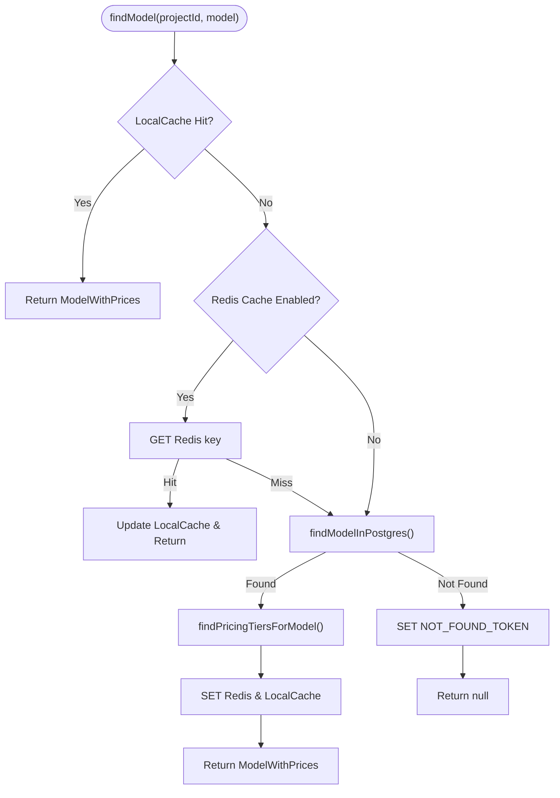
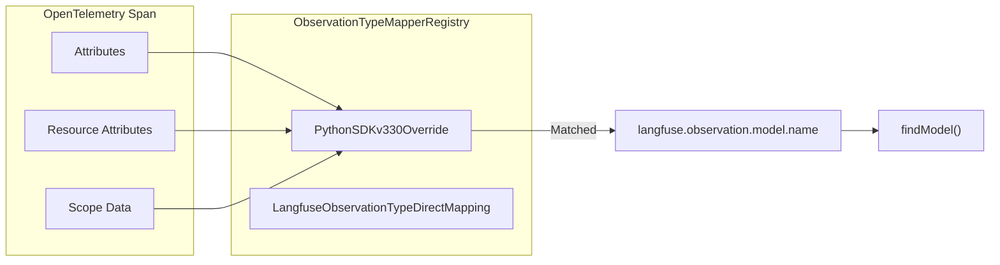

# Models & Pricing

<details>
<summary>Relevant source files</summary>

The following files were used as context for generating this wiki page:

- [packages/shared/AGENTS.md](packages/shared/AGENTS.md)
- [packages/shared/prisma/migrations/20241029130802_prices_drop_excess_index/migration.sql](packages/shared/prisma/migrations/20241029130802_prices_drop_excess_index/migration.sql)
- [packages/shared/src/encryption/signature.ts](packages/shared/src/encryption/signature.ts)
- [packages/shared/src/server/cache/index.ts](packages/shared/src/server/cache/index.ts)
- [packages/shared/src/server/cache/localCache.ts](packages/shared/src/server/cache/localCache.ts)
- [packages/shared/src/server/ingestion/modelMatch.ts](packages/shared/src/server/ingestion/modelMatch.ts)
- [packages/shared/src/server/ingestion/processEventBatch.ts](packages/shared/src/server/ingestion/processEventBatch.ts)
- [packages/shared/src/server/otel/ObservationTypeMapper.ts](packages/shared/src/server/otel/ObservationTypeMapper.ts)
- [packages/shared/src/server/otel/OtelIngestionProcessor.ts](packages/shared/src/server/otel/OtelIngestionProcessor.ts)
- [packages/shared/src/server/redis/otelIngestionQueue.ts](packages/shared/src/server/redis/otelIngestionQueue.ts)
- [web/src/__tests__/server/api/otel/otelMapping.servertest.ts](web/src/__tests__/server/api/otel/otelMapping.servertest.ts)
- [web/src/components/table/use-cases/models.tsx](web/src/components/table/use-cases/models.tsx)
- [web/src/components/table/use-cases/score-configs.tsx](web/src/components/table/use-cases/score-configs.tsx)
- [web/src/features/models/components/CloneModelButton.tsx](web/src/features/models/components/CloneModelButton.tsx)
- [web/src/features/models/components/EditModelButton.tsx](web/src/features/models/components/EditModelButton.tsx)
- [web/src/features/models/components/PriceBreakdownTooltip.tsx](web/src/features/models/components/PriceBreakdownTooltip.tsx)
- [web/src/features/models/components/pricing-tiers/TierPrefillButtons.tsx](web/src/features/models/components/pricing-tiers/TierPrefillButtons.tsx)
- [web/src/features/models/validation.ts](web/src/features/models/validation.ts)
- [web/src/features/public-api/types/models.ts](web/src/features/public-api/types/models.ts)
- [web/src/pages/api/public/models/[modelId]/index.ts](web/src/pages/api/public/models/[modelId]/index.ts)
- [web/src/pages/api/public/models/index.ts](web/src/pages/api/public/models/index.ts)
- [web/src/pages/api/public/otel/v1/traces/index.ts](web/src/pages/api/public/otel/v1/traces/index.ts)
- [web/src/server/api/routers/models.ts](web/src/server/api/routers/models.ts)
- [worker/AGENTS.md](worker/AGENTS.md)
- [worker/src/__tests__/localCache.test.ts](worker/src/__tests__/localCache.test.ts)
- [worker/src/__tests__/modelMatch.test.ts](worker/src/__tests__/modelMatch.test.ts)
- [worker/src/__tests__/signature.test.ts](worker/src/__tests__/signature.test.ts)
- [worker/src/constants/default-model-prices.json](worker/src/constants/default-model-prices.json)
- [worker/src/features/entityChange/entityChangeWorker.ts](worker/src/features/entityChange/entityChangeWorker.ts)
- [worker/src/queues/__tests__/otelDirectEventWrite.test.ts](worker/src/queues/__tests__/otelDirectEventWrite.test.ts)
- [worker/src/queues/entityChangeQueue.ts](worker/src/queues/entityChangeQueue.ts)
- [worker/src/queues/otelIngestionQueue.ts](worker/src/queues/otelIngestionQueue.ts)
- [worker/src/queues/shardedQueueRegistry.ts](worker/src/queues/shardedQueueRegistry.ts)
- [worker/src/scripts/upsertDefaultModelPrices.ts](worker/src/scripts/upsertDefaultModelPrices.ts)

</details>


This page documents the model definition and pricing system: how Langfuse stores model configurations, matches observation `model` fields to those configurations, applies pricing tiers to compute costs, and exposes management through the UI and API.

For how token counts are computed during ingestion, see [Data Ingestion Pipeline (6)](). For the PostgreSQL schema of the `Model`, `PricingTier`, and `Price` tables, see [Data Architecture (3)]().

---

## Overview

Langfuse maintains a library of model definitions. Each definition contains:
- A **regex match pattern** used to associate incoming observations with the model.
- A **tokenizer configuration** used for server-side token counting when counts are not provided.
- One or more **pricing tiers** that determine per-token cost for different usage types and usage conditions.

There are two categories of model definitions:

| Category | `projectId` in DB | Maintainer | Editable |
|---|---|---|---|
| Langfuse-managed (built-in) | `NULL` | Langfuse | Clone only |
| User-managed (custom) | Project UUID | User | Edit / Delete |

Sources: [packages/shared/src/server/ingestion/modelMatch.ts:222-223](), [web/src/components/table/use-cases/models.tsx:59-60]()

---

## Data Architecture & Code Entities

The model matching and pricing logic bridges the gap between raw ingestion strings and database entities.

**Model Entity Mapping:**

```mermaid
classDiagram
    class "IngestionEventType" {
        +string model
        +UsageDetails usage
    }
    class "findModel()" {
        <<Function>>
        +ModelMatchProps p
        +findModelInPostgres()
    }
    class "Model" {
        <<Prisma Entity>>
        +string modelName
        +string matchPattern
        +string tokenizerId
        +Json tokenizerConfig
    }
    class "PricingTier" {
        <<Prisma Entity>>
        +string name
        +boolean isDefault
        +PricingTierCondition[] conditions
        +int priority
    }
    class "Price" {
        <<Prisma Entity>>
        +string usageType
        +Decimal price
    }

    "IngestionEventType" ..> "findModel()" : "provides model string"
    "findModel()" --> "Model" : "matches via Regex"
    "Model" *-- "PricingTier" : "has many"
    "PricingTier" *-- "Price" : "has many"
```

Sources: [packages/shared/src/server/ingestion/modelMatch.ts:17-25](), [web/src/features/models/validation.ts:48-59](), [worker/src/constants/default-model-prices.json:1-28]()

---

## Default Model Prices

Built-in model definitions are defined in a JSON file and seeded into the database via a synchronization script.

**Source of truth**: `worker/src/constants/default-model-prices.json` [worker/src/constants/default-model-prices.json:1]()

The `upsertDefaultModelPrices` script processes this file in batches (default size 10) to ensure the PostgreSQL `models` table stays synchronized with the codebase [worker/src/scripts/upsertDefaultModelPrices.ts:81-141]().

### Pricing Tiers & Usage Types
Prices are expressed as cost-per-token in USD. A single model can have multiple `pricingTiers` [worker/src/constants/default-model-prices.json:14](). Every model must have exactly one default tier [worker/src/scripts/upsertDefaultModelPrices.ts:41-45]().

| Provider | Common Usage Types |
|---|---|
| OpenAI | `input`, `output`, `input_cached_tokens`, `input_cache_read` |
| Anthropic | `input`, `output`, `input_cache_read`, `input_cache_creation` |
| Legacy | `total` |

Example tier for `gpt-4o`:
```json
{
  "id": "b9854a5c92dc496b997d99d20_tier_default",
  "name": "Standard",
  "isDefault": true,
  "prices": {
    "input": 0.0000025,
    "input_cached_tokens": 0.00000125,
    "input_cache_read": 0.00000125,
    "output": 0.00001
  }
}
```
Sources: [worker/src/constants/default-model-prices.json:14-28](), [worker/src/scripts/upsertDefaultModelPrices.ts:32-46]()

---

## Model Matching Algorithm

When an observation is ingested (via REST or OTel), the pipeline calls `findModel` to resolve pricing.

**Model Match Data Flow:**



### Multi-Level Caching
Langfuse implements a two-level caching strategy for model matching to handle high-volume ingestion:
1.  **L1 Local Cache**: An in-memory `LocalCache` instance with a short TTL (default 10s) to reduce Redis roundtrips [packages/shared/src/server/ingestion/modelMatch.ts:28-43]().
2.  **L2 Redis Cache**: Shared cache across containers to maintain consistency [packages/shared/src/server/ingestion/modelMatch.ts:179-206]().

### Regex Matching in Postgres
The function `findModelInPostgres` uses a POSIX regex match (`~` operator) to find a model whose `match_pattern` matches the ingested model string [packages/shared/src/server/ingestion/modelMatch.ts:284-286]().

The query prioritizes project-specific models over global models (`project_id ASC`) and selects the most recent `start_date` to allow for price versioning [packages/shared/src/server/ingestion/modelMatch.ts:306-312]().

### Cache Invalidation
- **Locking**: If `isModelMatchCacheLocked()` returns true, Redis is skipped to prevent reading stale data during bulk updates [packages/shared/src/server/ingestion/modelMatch.ts:187-193]().
- **Negative Caching**: Uses `NOT_FOUND_TOKEN` (`LANGFUSE_MODEL_MATCH_NOT_FOUND`) to prevent database hammering for unknown models [packages/shared/src/server/ingestion/modelMatch.ts:204-206]().
- **Manual Clearing**: `clearModelCacheForProject` is called when models are updated via the UI or API [web/src/server/api/routers/models.ts:18]().

Sources: [packages/shared/src/server/ingestion/modelMatch.ts:45-157](), [packages/shared/src/server/ingestion/modelMatch.ts:179-240](), [packages/shared/src/server/ingestion/modelMatch.ts:278-318]()

---

## OTel Model Mapping

For OpenTelemetry ingestion, the `OtelIngestionProcessor` uses a registry of mappers to extract model information from span attributes.

**OTel Attribute Mapping:**



The `ObservationTypeMapperRegistry` manages multiple mappers that are evaluated in priority order. For example, the `PythonSDKv330Override` mapper (Priority 0) handles cases where older Python SDK versions (<= 3.3.0) might incorrectly set observation types as "span" while including generation-like attributes like `model_parameters` or `usage_details` [packages/shared/src/server/otel/ObservationTypeMapper.ts:165-214]().

Sources: [packages/shared/src/server/otel/OtelIngestionProcessor.ts:115-142](), [packages/shared/src/server/otel/ObservationTypeMapper.ts:165-214](), [web/src/__tests__/server/api/otel/otelMapping.servertest.ts:126-128]()

---

## UI Components & Management

Models are managed in the Langfuse Settings UI. The `ModelTable` component provides a searchable interface for both built-in and custom models [web/src/components/table/use-cases/models.tsx:64-88]().

### Table Columns
The model table displays key configuration attributes:
- **Maintainer**: Distinguishes between "Langfuse" (built-in) and "User" (custom) models using icons [web/src/components/table/use-cases/models.tsx:135-151]().
- **Match Pattern**: The regex used for ingestion matching [web/src/components/table/use-cases/models.tsx:156-170]().
- **Prices**: A breakdown of costs per usage type (e.g., input, output) [web/src/components/table/use-cases/models.tsx:172-192]().
- **Last Used**: The start time of the latest generation using that model, queried from ClickHouse `observations` table [web/src/components/table/use-cases/models.tsx:92-101](), [web/src/server/api/routers/models.ts:206-215]().

### Actions
- **Clone**: Users can clone Langfuse-managed models to create custom versions [web/src/components/table/use-cases/models.tsx:16]().
- **Test Match**: A specialized button `TestModelMatchButton` to verify if a specific string will match a model's pattern [web/src/components/table/use-cases/models.tsx:30]().
- **Upsert**: `UpsertModelFormDialog` for creating or editing models [web/src/components/table/use-cases/models.tsx:29]().

Sources: [web/src/components/table/use-cases/models.tsx:110-212](), [web/src/server/api/routers/models.ts:194-222]()

---

## Configuration Reference

| Environment Variable | Description |
|---|---|
| `LANGFUSE_CACHE_MODEL_MATCH_ENABLED` | Enables/disables Redis (L2) caching for model matching [packages/shared/src/server/ingestion/modelMatch.ts:182](). |
| `LANGFUSE_LOCAL_CACHE_MODEL_MATCH_ENABLED` | Enables/disables in-memory (L1) caching for model matching [packages/shared/src/server/ingestion/modelMatch.ts:34](). |
| `LANGFUSE_LOCAL_CACHE_MODEL_MATCH_TTL_MS` | TTL for the L1 local cache (default 10,000ms) [packages/shared/src/server/ingestion/modelMatch.ts:28](). |
| `LANGFUSE_LOCAL_CACHE_MODEL_MATCH_MAX` | Maximum number of items in the L1 local cache (default 20,000) [packages/shared/src/server/ingestion/modelMatch.ts:29](). |

Sources: [packages/shared/src/server/ingestion/modelMatch.ts:27-43](), [packages/shared/src/server/ingestion/modelMatch.ts:182]()
