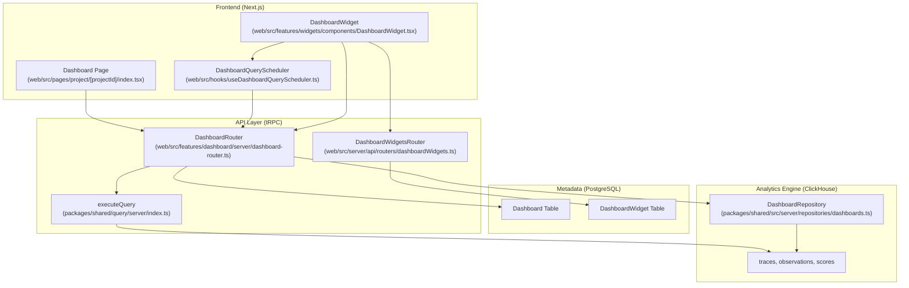
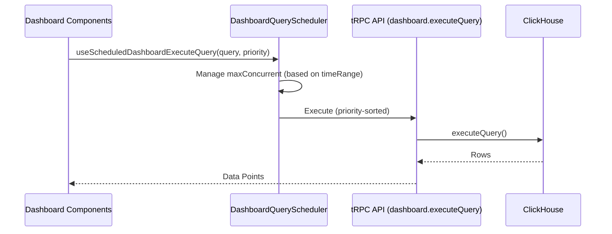

# Dashboard & Analytics

Relevant source files

The following files were used as context for generating this wiki page:

- [packages/shared/prisma/migrations/20250519145128_resize_dashboard_y_axis_components/migration.sql](packages/shared/prisma/migrations/20250519145128_resize_dashboard_y_axis_components/migration.sql)
- [packages/shared/prisma/migrations/20250520123737_add_single_aggregate_chart_type/migration.sql](packages/shared/prisma/migrations/20250520123737_add_single_aggregate_chart_type/migration.sql)
- [packages/shared/src/features/query/dataModel.ts](packages/shared/src/features/query/dataModel.ts)
- [packages/shared/src/index.ts](packages/shared/src/index.ts)
- [packages/shared/src/server/repositories/dashboards.ts](packages/shared/src/server/repositories/dashboards.ts)
- [packages/shared/src/server/services/DashboardService/DashboardService.ts](packages/shared/src/server/services/DashboardService/DashboardService.ts)
- [packages/shared/src/server/services/DashboardService/types.ts](packages/shared/src/server/services/DashboardService/types.ts)
- [packages/shared/src/tableDefinitions/mapDashboards.ts](packages/shared/src/tableDefinitions/mapDashboards.ts)
- [web/src/__tests__/server/dashboard-widget-version.servertest.ts](web/src/__tests__/server/dashboard-widget-version.servertest.ts)
- [web/src/__tests__/server/queryBuilderDashboards.servertest.ts](web/src/__tests__/server/queryBuilderDashboards.servertest.ts)
- [web/src/components/ui/chart.tsx](web/src/components/ui/chart.tsx)
- [web/src/features/dashboard/components/ChartScores.tsx](web/src/features/dashboard/components/ChartScores.tsx)
- [web/src/features/dashboard/components/LatencyChart.tsx](web/src/features/dashboard/components/LatencyChart.tsx)
- [web/src/features/dashboard/components/LatencyTables.tsx](web/src/features/dashboard/components/LatencyTables.tsx)
- [web/src/features/dashboard/components/ModelCostTable.tsx](web/src/features/dashboard/components/ModelCostTable.tsx)
- [web/src/features/dashboard/components/ModelSelector.tsx](web/src/features/dashboard/components/ModelSelector.tsx)
- [web/src/features/dashboard/components/ModelUsageChart.tsx](web/src/features/dashboard/components/ModelUsageChart.tsx)
- [web/src/features/dashboard/components/ScoresTable.tsx](web/src/features/dashboard/components/ScoresTable.tsx)
- [web/src/features/dashboard/components/SelectDashboardDialog.tsx](web/src/features/dashboard/components/SelectDashboardDialog.tsx)
- [web/src/features/dashboard/components/TracesBarListChart.tsx](web/src/features/dashboard/components/TracesBarListChart.tsx)
- [web/src/features/dashboard/components/TracesTimeSeriesChart.tsx](web/src/features/dashboard/components/TracesTimeSeriesChart.tsx)
- [web/src/features/dashboard/components/UserChart.tsx](web/src/features/dashboard/components/UserChart.tsx)
- [web/src/features/dashboard/components/hooks.ts](web/src/features/dashboard/components/hooks.ts)
- [web/src/features/dashboard/components/score-analytics/CategoricalScoreChart.tsx](web/src/features/dashboard/components/score-analytics/CategoricalScoreChart.tsx)
- [web/src/features/dashboard/components/score-analytics/NumericScoreHistogram.tsx](web/src/features/dashboard/components/score-analytics/NumericScoreHistogram.tsx)
- [web/src/features/dashboard/components/score-analytics/NumericScoreTimeSeriesChart.tsx](web/src/features/dashboard/components/score-analytics/NumericScoreTimeSeriesChart.tsx)
- [web/src/features/dashboard/components/score-analytics/ScoreAnalytics.tsx](web/src/features/dashboard/components/score-analytics/ScoreAnalytics.tsx)
- [web/src/features/dashboard/lib/chart-data-adapters.ts](web/src/features/dashboard/lib/chart-data-adapters.ts)
- [web/src/features/dashboard/lib/dashboard-utils.ts](web/src/features/dashboard/lib/dashboard-utils.ts)
- [web/src/features/dashboard/lib/dashboardUiTableToViewMapping.ts](web/src/features/dashboard/lib/dashboardUiTableToViewMapping.ts)
- [web/src/features/dashboard/server/dashboard-router.ts](web/src/features/dashboard/server/dashboard-router.ts)
- [web/src/features/widgets/chart-library/AreaChartTimeSeries.tsx](web/src/features/widgets/chart-library/AreaChartTimeSeries.tsx)
- [web/src/features/widgets/chart-library/BigNumber.tsx](web/src/features/widgets/chart-library/BigNumber.tsx)
- [web/src/features/widgets/chart-library/Chart.tsx](web/src/features/widgets/chart-library/Chart.tsx)
- [web/src/features/widgets/chart-library/DownloadButton.tsx](web/src/features/widgets/chart-library/DownloadButton.tsx)
- [web/src/features/widgets/chart-library/HistogramChart.tsx](web/src/features/widgets/chart-library/HistogramChart.tsx)
- [web/src/features/widgets/chart-library/HorizontalBarChart.tsx](web/src/features/widgets/chart-library/HorizontalBarChart.tsx)
- [web/src/features/widgets/chart-library/LineChartTimeSeries.tsx](web/src/features/widgets/chart-library/LineChartTimeSeries.tsx)
- [web/src/features/widgets/chart-library/PieChart.tsx](web/src/features/widgets/chart-library/PieChart.tsx)
- [web/src/features/widgets/chart-library/PivotTable.tsx](web/src/features/widgets/chart-library/PivotTable.tsx)
- [web/src/features/widgets/chart-library/VerticalBarChart.tsx](web/src/features/widgets/chart-library/VerticalBarChart.tsx)
- [web/src/features/widgets/chart-library/VerticalBarChartTimeSeries.tsx](web/src/features/widgets/chart-library/VerticalBarChartTimeSeries.tsx)
- [web/src/features/widgets/chart-library/utils.ts](web/src/features/widgets/chart-library/utils.ts)
- [web/src/features/widgets/components/DashboardGrid.tsx](web/src/features/widgets/components/DashboardGrid.tsx)
- [web/src/features/widgets/components/DashboardWidget.tsx](web/src/features/widgets/components/DashboardWidget.tsx)
- [web/src/features/widgets/components/SelectWidgetDialog.tsx](web/src/features/widgets/components/SelectWidgetDialog.tsx)
- [web/src/features/widgets/components/WidgetForm.tsx](web/src/features/widgets/components/WidgetForm.tsx)
- [web/src/features/widgets/components/WidgetTable.tsx](web/src/features/widgets/components/WidgetTable.tsx)
- [web/src/features/widgets/components/widgetFilterColumns.ts](web/src/features/widgets/components/widgetFilterColumns.ts)
- [web/src/features/widgets/constants/widgetFilterPresets.ts](web/src/features/widgets/constants/widgetFilterPresets.ts)
- [web/src/features/widgets/utils.ts](web/src/features/widgets/utils.ts)
- [web/src/features/widgets/utils/import-export-utils.clienttest.ts](web/src/features/widgets/utils/import-export-utils.clienttest.ts)
- [web/src/features/widgets/utils/import-export-utils.ts](web/src/features/widgets/utils/import-export-utils.ts)
- [web/src/features/widgets/utils/pivot-table-utils.ts](web/src/features/widgets/utils/pivot-table-utils.ts)
- [web/src/pages/project/[projectId]/dashboards/[dashboardId]/index.tsx](web/src/pages/project/[projectId]/dashboards/[dashboardId]/index.tsx)
- [web/src/pages/project/[projectId]/index.tsx](web/src/pages/project/[projectId]/index.tsx)
- [web/src/pages/project/[projectId]/widgets/[widgetId]/index.tsx](web/src/pages/project/[projectId]/widgets/[widgetId]/index.tsx)
- [web/src/pages/project/[projectId]/widgets/new.tsx](web/src/pages/project/[projectId]/widgets/new.tsx)
- [web/src/server/api/routers/dashboardWidgets.ts](web/src/server/api/routers/dashboardWidgets.ts)
- [web/src/utils/numbers.ts](web/src/utils/numbers.ts)

## Purpose and Scope

The Dashboard & Analytics system in Langfuse provides a flexible infrastructure for visualizing and analyzing LLM observability data. It enables users to create custom dashboards composed of widgets that execute complex aggregations over traces, observations, and scores. The system is built on a dual-database architecture: PostgreSQL stores configuration (dashboards, widget definitions, and layouts), while ClickHouse serves as the high-performance engine for time-series and multi-dimensional analytics.

---

## System Architecture & Data Flow

The analytics engine bridges the gap between structured configuration in PostgreSQL and high-cardinality event data in ClickHouse. The system supports both a "Home" dashboard with fixed cards and custom user-defined dashboards.

### Dashboard Data Flow

Title: Dashboard Data Request Flow

**Sources:** [web/src/features/dashboard/server/dashboard-router.ts:1-41](), [web/src/pages/project/[projectId]/index.tsx:187-199](), [web/src/features/widgets/components/DashboardWidget.tsx:201-213](), [packages/shared/src/server/repositories/dashboards.ts:37-102](), [web/src/features/dashboard/server/dashboard-router.ts:23-29]()

---

## Data Modeling & View Declarations

Langfuse uses "View Declarations" to abstract ClickHouse table complexities. A view defines available dimensions (grouping fields), measures (aggregatable metrics), and filters.

### View Versioning (V1 vs V2)
The system supports two versions of the analytics engine. Components determine the `ViewVersion` ("v1" or "v2") based on feature flags or widget requirements [web/src/features/widgets/components/DashboardWidget.tsx:94-99]().
- **v1**: Standard views mapping to legacy ClickHouse schema.
- **v2**: Modern views often utilizing the `events` table aggregation or updated `traces`/`observations` logic [web/src/features/widgets/components/DashboardWidget.tsx:94-99]().
- **Automatic Upgrades**: Widgets requiring v2 features (detected via `requiresV2`) or having a `minVersion >= 2` automatically force the v2 engine [web/src/features/widgets/components/DashboardWidget.tsx:85-99]().

### Key Views
| View Name | Source Table | Primary Use Case |
| :--- | :--- | :--- |
| `traces` | `traces` | High-level request analytics and latency [web/src/features/widgets/components/DashboardWidget.tsx:118-120](). |
| `observations` | `observations` | Model usage, token costs, and span-level latency [web/src/features/dashboard/components/ModelUsageChart.tsx:73-74](). |
| `scores-numeric` | `scores` | Evaluation trends and numeric feedback analysis [web/src/features/dashboard/server/dashboard-router.ts:193-200](). |
| `scores-categorical` | `scores` | Categorical evaluation distributions [web/src/features/dashboard/server/dashboard-router.ts:207-212](). |

**Sources:** [web/src/features/widgets/components/DashboardWidget.tsx:85-99](), [web/src/features/dashboard/components/ModelUsageChart.tsx:73-74](), [web/src/features/dashboard/server/dashboard-router.ts:193-212]()

---

## Custom Dashboard & Widget Model

Custom dashboards are defined by a `definition` JSON containing `WidgetPlacement` objects [web/src/pages/project/[projectId]/dashboards/[dashboardId]/index.tsx:37-45]().

### Widget Placement and Grid
Dashboards use a 12-column grid system. A `WidgetPlacement` defines:
- `x`, `y`: Position in the grid [web/src/pages/project/[projectId]/dashboards/[dashboardId]/index.tsx:40-41]().
- `x_size`, `y_size`: Dimensions of the widget [web/src/pages/project/[projectId]/dashboards/[dashboardId]/index.tsx:42-43]().
- `widgetId`: Foreign key to the `DashboardWidget` configuration [web/src/pages/project/[projectId]/dashboards/[dashboardId]/index.tsx:39]().

### Widget Types & Aggregations
The `WidgetForm` allows users to configure metrics and chart types [web/src/features/widgets/components/WidgetForm.tsx:122-179]():
- **Time-Series**: `LINE_TIME_SERIES`, `BAR_TIME_SERIES` [web/src/features/widgets/components/WidgetForm.tsx:131-143]().
- **Total Value**: `NUMBER` (Big Number), `HORIZONTAL_BAR`, `VERTICAL_BAR`, `PIE`, `PIVOT_TABLE` [web/src/features/widgets/components/WidgetForm.tsx:123-130, 145-158, 166-178]().
- **Statistical**: `HISTOGRAM` [web/src/features/widgets/components/WidgetForm.tsx:159-165]().

The `resolveAggregationAndChartType` function ensures consistency between selected measures and chart types. For example, it forces `histogram` aggregation for HISTOGRAM charts and reverts to `NUMBER` if the measure does not support histograms [web/src/features/widgets/components/WidgetForm.tsx:198-230]().

**Sources:** [web/src/pages/project/[projectId]/dashboards/[dashboardId]/index.tsx:37-45](), [web/src/features/widgets/components/WidgetForm.tsx:122-179, 198-230]()

---

## Filter Integration

Analytics queries integrate filters from multiple sources to provide scoped views.

### Filter Mapping
UI filters (e.g., "Trace Name") must be mapped to the correct database columns depending on the view being queried. This is handled by `mapLegacyUiTableFilterToView` [web/src/features/dashboard/lib/dashboardUiTableToViewMapping.ts:30](). This layer translates legacy UI labels to canonical view fields [web/src/features/dashboard/server/dashboard-router.ts:121-125]().

### Common Filters
- **Time Range**: Applied as `startTime` or `timestamp` filters across all widgets [web/src/pages/project/[projectId]/index.tsx:142-156]().
- **Environment**: Handled specifically via `extractEnvironmentFilterFromFilters` and `convertEnvFilterToClickhouseFilter` to ensure ClickHouse consistency [packages/shared/src/server/repositories/dashboards.ts:17-35]().
- **Global Dashboard Filters**: Users can save persistent filters to a specific dashboard which are merged with active UI filters [web/src/pages/project/[projectId]/dashboards/[dashboardId]/index.tsx:81-82, 152-160]().

**Sources:** [web/src/features/dashboard/lib/dashboardUiTableToViewMapping.ts:30](), [packages/shared/src/server/repositories/dashboards.ts:17-35](), [web/src/pages/project/[projectId]/index.tsx:142-166](), [web/src/pages/project/[projectId]/dashboards/[dashboardId]/index.tsx:152-160]()

---

## Query Scheduling & Performance

To prevent UI lag and database exhaustion during heavy dashboard loads, Langfuse implements a `DashboardQueryScheduler`.

Title: Dashboard Query Scheduling Sequence

- **Concurrency Control**: `getDashboardQuerySchedulerMaxConcurrent` adjusts the limit based on the complexity/range of the dashboard [web/src/pages/project/[projectId]/index.tsx:187-190]().
- **Priority**: Critical metrics like "Model Usage" can be assigned specific priorities (e.g., 1001) to load before secondary charts [web/src/features/dashboard/components/ModelUsageChart.tsx:118]().
- **SSE Support**: For long-running queries, the system supports Server-Sent Events (SSE) via `shouldUseWidgetSSE` [web/src/features/widgets/components/DashboardWidget.tsx:216-221]().

**Sources:** [web/src/pages/project/[projectId]/index.tsx:187-190](), [web/src/features/dashboard/components/ModelUsageChart.tsx:118](), [web/src/features/widgets/components/DashboardWidget.tsx:216-221]()

---

## Specialized Analytics Logic

### Scores & Numeric Histograms
Scores are aggregated via `getScoreAggregate` or the V2 `getScoreAggregateV2` [web/src/features/dashboard/server/dashboard-router.ts:163-169]().
- **Histogram Conversion**: `clickhouseHistogramToChartData` converts ClickHouse's `histogram()` output (an array of tuples: `lower_bound, upper_bound, count`) into the `{ chartData, chartLabels }` shape required by the UI [web/src/features/dashboard/server/dashboard-router.ts:137-161]().

### Cost and Latency Breakdown
- **Cost by Type**: `getObservationCostByTypeByTime` performs an `ARRAY JOIN` on `cost_details` in ClickHouse to provide per-key cost breakdowns over time [packages/shared/src/server/repositories/dashboards.ts:134-160]().
- **Latency Percentiles**: Views like `generationsLatenciesQuery` utilize percentiles (p50, p90, p95, p99) to visualize performance distributions [web/src/features/dashboard/components/LatencyTables.tsx:34-42]().

**Sources:** [web/src/features/dashboard/server/dashboard-router.ts:137-169](), [packages/shared/src/server/repositories/dashboards.ts:134-160](), [web/src/features/dashboard/components/LatencyTables.tsx:34-42]()
