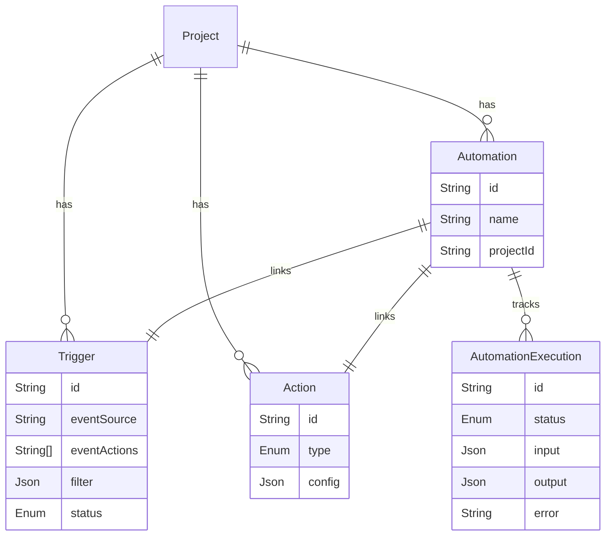
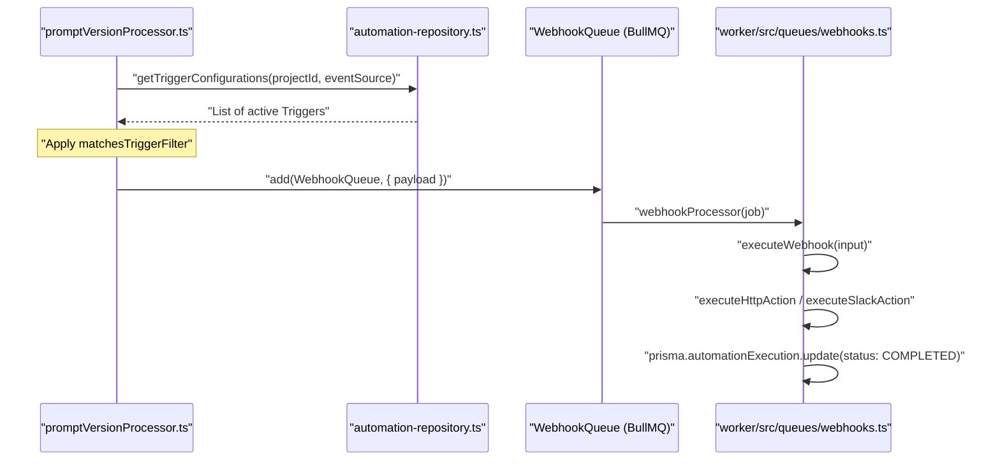

# Automation System

<details>
<summary>Relevant source files</summary>

The following files were used as context for generating this wiki page:

- [packages/shared/src/domain/automations.ts](packages/shared/src/domain/automations.ts)
- [packages/shared/src/domain/webhooks.ts](packages/shared/src/domain/webhooks.ts)
- [packages/shared/src/server/automations.test.ts](packages/shared/src/server/automations.test.ts)
- [packages/shared/src/server/automations.ts](packages/shared/src/server/automations.ts)
- [packages/shared/src/server/llm/baseUrlValidation.ts](packages/shared/src/server/llm/baseUrlValidation.ts)
- [packages/shared/src/server/outbound-url/fetch.ts](packages/shared/src/server/outbound-url/fetch.ts)
- [packages/shared/src/server/outbound-url/validation.ts](packages/shared/src/server/outbound-url/validation.ts)
- [packages/shared/src/server/repositories/automation-repository.ts](packages/shared/src/server/repositories/automation-repository.ts)
- [packages/shared/src/server/services/SlackService.ts](packages/shared/src/server/services/SlackService.ts)
- [packages/shared/src/server/webhooks/ipBlocking.ts](packages/shared/src/server/webhooks/ipBlocking.ts)
- [packages/shared/src/server/webhooks/validation.ts](packages/shared/src/server/webhooks/validation.ts)
- [web/src/__tests__/server/automations-trpc.servertest.ts](web/src/__tests__/server/automations-trpc.servertest.ts)
- [web/src/__tests__/server/datasets-trpc.servertest.ts](web/src/__tests__/server/datasets-trpc.servertest.ts)
- [web/src/__tests__/server/llm-api-key.servertest.ts](web/src/__tests__/server/llm-api-key.servertest.ts)
- [web/src/__tests__/server/slack-integration.servertest.ts](web/src/__tests__/server/slack-integration.servertest.ts)
- [web/src/__tests__/server/unit/utilities.servertest.ts](web/src/__tests__/server/unit/utilities.servertest.ts)
- [web/src/features/automations/components/actions/SlackActionForm.tsx](web/src/features/automations/components/actions/SlackActionForm.tsx)
- [web/src/features/automations/server/router.ts](web/src/features/automations/server/router.ts)
- [web/src/features/slack/app_manifest.json](web/src/features/slack/app_manifest.json)
- [web/src/features/slack/components/ChannelSelector.tsx](web/src/features/slack/components/ChannelSelector.tsx)
- [web/src/features/slack/components/SlackTestMessageButton.tsx](web/src/features/slack/components/SlackTestMessageButton.tsx)
- [web/src/features/slack/server/oauth-handlers.ts](web/src/features/slack/server/oauth-handlers.ts)
- [web/src/features/slack/server/router.ts](web/src/features/slack/server/router.ts)
- [web/src/pages/api/public/slack/install/index.ts](web/src/pages/api/public/slack/install/index.ts)
- [web/src/pages/api/public/slack/oauth/index.ts](web/src/pages/api/public/slack/oauth/index.ts)
- [web/src/pages/project/[projectId]/settings/integrations/slack.tsx](web/src/pages/project/[projectId]/settings/integrations/slack.tsx)
- [web/src/server/api/routers/utilities.ts](web/src/server/api/routers/utilities.ts)
- [worker/src/__tests__/ip-blocking.test.ts](worker/src/__tests__/ip-blocking.test.ts)
- [worker/src/__tests__/llm-base-url-validation.test.ts](worker/src/__tests__/llm-base-url-validation.test.ts)
- [worker/src/__tests__/outbound-connection-validation.test.ts](worker/src/__tests__/outbound-connection-validation.test.ts)
- [worker/src/__tests__/promptVersionProcessor.test.ts](worker/src/__tests__/promptVersionProcessor.test.ts)
- [worker/src/__tests__/slack-message-builder.test.ts](worker/src/__tests__/slack-message-builder.test.ts)
- [worker/src/__tests__/slack-processor.test.ts](worker/src/__tests__/slack-processor.test.ts)
- [worker/src/__tests__/url-normalization.test.ts](worker/src/__tests__/url-normalization.test.ts)
- [worker/src/__tests__/webhook-redirect-headers.test.ts](worker/src/__tests__/webhook-redirect-headers.test.ts)
- [worker/src/__tests__/webhook-redirect.test.ts](worker/src/__tests__/webhook-redirect.test.ts)
- [worker/src/__tests__/webhook-validation.test.ts](worker/src/__tests__/webhook-validation.test.ts)
- [worker/src/__tests__/webhooks.test.ts](worker/src/__tests__/webhooks.test.ts)
- [worker/src/features/entityChange/promptVersionProcessor.ts](worker/src/features/entityChange/promptVersionProcessor.ts)
- [worker/src/features/slack/slackMessageBuilder.ts](worker/src/features/slack/slackMessageBuilder.ts)
- [worker/src/queues/webhooks.ts](worker/src/queues/webhooks.ts)

</details>


This page documents the automation system, which enables event-driven actions triggered by changes to prompts and other domain entities. The system consists of triggers (event matchers with filters), actions (webhooks, Slack notifications, GitHub dispatches), and automations (trigger-action pairs). Executions are tracked for monitoring and debugging.

---

## Overview

The **automation system** implements an event-driven architecture where domain events (e.g., prompt updates) are matched against configured triggers, and when matched, execute associated actions. The system supports three action types: webhooks (HTTP POST to external URLs), Slack messages (channel notifications), and GitHub workflow dispatches.

**Key Components:**

- **Trigger**: Defines when an automation should fire (event source + event actions + optional filters). [packages/shared/prisma/schema.prisma:1476-1498]()
- **Action**: Defines what should happen (webhook, Slack, GitHub dispatch with configuration). [packages/shared/prisma/schema.prisma:1454-1474]()
- **Automation**: Links a trigger to an action with a user-friendly name. [packages/shared/prisma/schema.prisma:1500-1515]()
- **AutomationExecution**: Tracks individual execution instances with status, input/output, and errors. [packages/shared/prisma/schema.prisma:1531-1560]()

**Execution Flow:**

1. Domain event occurs (e.g., a new prompt version is created). [worker/src/features/entityChange/promptVersionProcessor.ts:26-28]()
2. System queries for active triggers matching the event source and status via `getTriggerConfigurations`. [worker/src/features/entityChange/promptVersionProcessor.ts:38-42]()
3. For each matching trigger, applies `matchesTriggerFilter` to evaluate conditions against the event payload. [worker/src/features/entityChange/promptVersionProcessor.ts:53-56]()
4. If filter matches, the system enqueues a job to the `WebhookQueue`. [worker/src/features/entityChange/promptVersionProcessor.ts:180-199]()
5. `webhookProcessor` in the worker service processes the action. [worker/src/queues/webhooks.ts:49-58]()
6. Execution status updated in the `AutomationExecution` table to `COMPLETED` or `ERROR`. [worker/src/queues/webhooks.ts:246-258]()

Sources: [worker/src/features/entityChange/promptVersionProcessor.ts:26-200](), [worker/src/queues/webhooks.ts:49-258](), [packages/shared/prisma/schema.prisma:1454-1560]()

---

## Data Model

The automation system stores configurations and execution history in PostgreSQL.

### Core Entities

**Diagram: Automation Entity Relationship**


Sources: [packages/shared/prisma/schema.prisma:1454-1560](), [packages/shared/src/domain/automations.ts:24-29]()

### Action Configuration

The `Action.config` field stores type-specific parameters. For security, sensitive fields like `secretKey` or `githubToken` are stored encrypted in the database. [packages/shared/src/domain/automations.ts:51-125]()

| ActionType | Key Config Fields | Code Entity |
|---|---|---|
| `WEBHOOK` | `url`, `apiVersion`, `secretKey`, `headers` | `WebhookActionConfigSchema` |
| `SLACK` | `channelId`, `channelName` | `SlackActionConfigSchema` |
| `GITHUB_DISPATCH` | `url`, `eventType`, `githubToken` | `GitHubDispatchActionConfigSchema` |

Sources: [packages/shared/src/domain/automations.ts:51-125]()

---

## Execution Logic

Automations are executed asynchronously via the `webhookProcessor` which routes to specific handlers based on the action type. [worker/src/queues/webhooks.ts:61-113]()

### Webhook Execution
Webhooks use `fetchWithSecureRedirects` to ensure requests do not hit internal metadata services or unauthorized IPs. [worker/src/queues/webhooks.ts:183-192]()
- **Signatures**: Requests include an `x-langfuse-signature` header generated using the `secretKey` and the request payload via `createSignatureHeader`. [worker/src/queues/webhooks.ts:14-15](), [worker/src/queues/webhooks.ts:262-267]()
- **Payload**: Follows the `PromptWebhookOutboundSchema`. [packages/shared/src/domain/webhooks.ts:18-42]()
- **Headers**: Custom headers can be configured and are decrypted at execution time. [worker/src/queues/webhooks.ts:250-252]()

### Slack Execution
Slack actions use the `SlackService` to send messages to configured channels. [worker/src/queues/webhooks.ts:89-93]()
- **Templates**: Messages are built using `SlackMessageBuilder`, which supports Block Kit formatting for events like `prompt-version`. [worker/src/features/slack/slackMessageBuilder.ts:17-159]()
- **Escaping**: The builder uses `escapeSlackMrkdwn` to prevent markdown injection. [worker/src/features/slack/slackMessageBuilder.ts:7-12]()
- **Integration Mapping**: Installations are stored in the `SlackIntegration` table, mapping a `projectId` to a Slack `teamId`. [packages/shared/src/server/services/SlackService.ts:143-158]()

### GitHub Dispatch Execution
Triggers a `repository_dispatch` event on a GitHub repository. [worker/src/queues/webhooks.ts:94-99]()
- **Auth**: Uses the decrypted `githubToken` provided in the action config. [worker/src/queues/webhooks.ts:379-381]()
- **Payload Truncation**: Payloads are truncated if they exceed the 64KB GitHub limit. [worker/src/queues/webhooks.ts:40-46]()

### Execution Tracking & Auto-Disabling
Individual runs are tracked in the `AutomationExecution` table. [packages/shared/prisma/schema.prisma:1531-1560]()
The system tracks consecutive failures via `getConsecutiveAutomationFailures` to monitor unreliable automations. [web/src/features/automations/server/router.ts:49-70]()

Sources: [worker/src/queues/webhooks.ts:61-413](), [worker/src/features/slack/slackMessageBuilder.ts:17-159](), [packages/shared/src/domain/webhooks.ts:18-49](), [packages/shared/src/server/services/SlackService.ts:143-158]()

---

## Trigger Matching

Triggers are matched against domain events using the `getTriggerConfigurations` repository function. [packages/shared/src/server/repositories/automation-repository.ts:105-135]()

**Diagram: Event to Execution Flow**


Sources: [worker/src/features/entityChange/promptVersionProcessor.ts:38-42](), [packages/shared/src/server/repositories/automation-repository.ts:105-135](), [worker/src/queues/webhooks.ts:49-113](), [worker/src/queues/webhooks.ts:246-258]()

---

## UI Components

The automation management interface is located in `web/src/features/automations`.

- **AutomationsPage**: Main container managing list/create/edit views. [web/src/features/automations/components/automations.tsx]()
- **AutomationSidebar**: Displays the list of configured automations. [web/src/features/automations/components/AutomationSidebar.tsx]()
- **AutomationForm**: Unified form for creating and updating triggers and actions. [web/src/features/automations/components/automationForm.tsx]()
- **WebhookActionForm**: Specialized form for webhook configuration, including header management. [web/src/features/automations/components/actions/WebhookActionForm.tsx]()

**Diagram: Frontend Component Architecture**

```mermaid
graph TD
    "AutomationsPage" --> "AutomationSidebar"
    "AutomationsPage" --> "AutomationDetails"
    "AutomationsPage" --> "AutomationForm"
    "AutomationForm" --> "InlineFilterBuilder"
    "AutomationForm" --> "WebhookActionForm"
    "AutomationForm" --> "SlackActionForm"
```
Sources: [web/src/features/automations/components/automations.tsx](), [web/src/features/automations/components/automationForm.tsx](), [web/src/features/automations/components/actions/WebhookActionForm.tsx]()

---

## Security

Security is central to the automation system, particularly for outbound requests and credential storage.

- **SSRF Protection**: Webhook and LLM base URLs are validated using `validateWebhookURL` and `validateLlmConnectionBaseURL`. [packages/shared/src/server/webhooks/validation.ts:30-52](), [packages/shared/src/server/llm/baseUrlValidation.ts:26-56]()
- **IP Blocking**: The `isIPBlocked` function checks destinations against a static deny-list of private/internal CIDRs defined in `BLOCKED_CIDRS` (e.g., `127.0.0.0/8`, `169.254.0.0/16`). [packages/shared/src/server/webhooks/ipBlocking.ts:4-90]()
- **Hostname Blocking**: Hostnames like `localhost`, `host.docker.internal`, and cloud metadata endpoints are explicitly blocked via `isHostnameBlocked`. [packages/shared/src/server/webhooks/ipBlocking.ts:109-144]()
- **Secure Fetch**: `fetchWithSecureRedirects` ensures that redirects are also validated, preventing redirect-based SSRF. [packages/shared/src/server/outbound-url/fetch.ts:120-230]()
- **Encryption**: Sensitive credentials (secrets, tokens, `secretKey`) are encrypted before storage using `encrypt()` and decrypted at execution time. [web/src/features/automations/server/router.ts:125-130](), [worker/src/queues/webhooks.ts:250-252]()
- **RBAC**: Access to view or modify automations is restricted by scopes `automations:read` and `automations:CUD`. [web/src/features/automations/server/router.ts:58-62](), [web/src/features/automations/server/router.ts:82-86]()

Sources: [packages/shared/src/server/webhooks/validation.ts](), [packages/shared/src/server/webhooks/ipBlocking.ts](), [packages/shared/src/server/llm/baseUrlValidation.ts](), [packages/shared/src/server/outbound-url/fetch.ts](), [web/src/features/automations/server/router.ts]()
