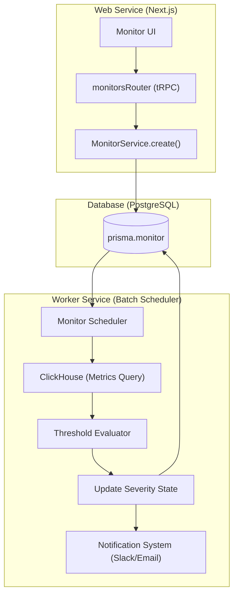
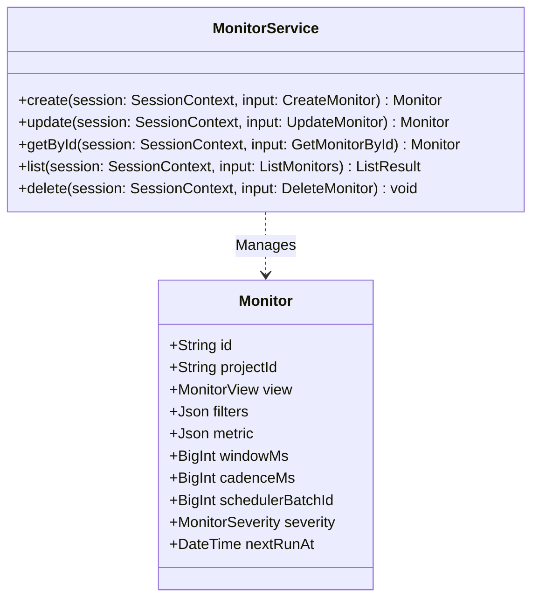

# Monitors & Alerting

Relevant source files

The following files were used as context for generating this wiki page:

- [packages/shared/AGENTS.md](packages/shared/AGENTS.md)
- [packages/shared/src/encryption/signature.ts](packages/shared/src/encryption/signature.ts)
- [packages/shared/src/features/monitors/service/helpers.test.ts](packages/shared/src/features/monitors/service/helpers.test.ts)
- [packages/shared/src/features/monitors/service/helpers.ts](packages/shared/src/features/monitors/service/helpers.ts)
- [packages/shared/src/features/monitors/service/service.ts](packages/shared/src/features/monitors/service/service.ts)
- [packages/shared/src/features/monitors/service/types.test.ts](packages/shared/src/features/monitors/service/types.test.ts)
- [packages/shared/src/features/monitors/service/types.ts](packages/shared/src/features/monitors/service/types.ts)
- [packages/shared/src/server/cache/index.ts](packages/shared/src/server/cache/index.ts)
- [packages/shared/src/server/cache/localCache.ts](packages/shared/src/server/cache/localCache.ts)
- [packages/shared/src/server/ingestion/modelMatch.ts](packages/shared/src/server/ingestion/modelMatch.ts)
- [web/src/__tests__/server/monitorService.servertest.ts](web/src/__tests__/server/monitorService.servertest.ts)
- [web/src/__tests__/server/monitors.servertest.ts](web/src/__tests__/server/monitors.servertest.ts)
- [web/src/features/feature-flags/available-flags.ts](web/src/features/feature-flags/available-flags.ts)
- [web/src/features/rbac/constants/projectAccessRights.ts](web/src/features/rbac/constants/projectAccessRights.ts)
- [worker/AGENTS.md](worker/AGENTS.md)
- [worker/src/__tests__/localCache.test.ts](worker/src/__tests__/localCache.test.ts)
- [worker/src/__tests__/modelMatch.test.ts](worker/src/__tests__/modelMatch.test.ts)
- [worker/src/__tests__/signature.test.ts](worker/src/__tests__/signature.test.ts)
- [worker/src/features/entityChange/entityChangeWorker.ts](worker/src/features/entityChange/entityChangeWorker.ts)
- [worker/src/queues/entityChangeQueue.ts](worker/src/queues/entityChangeQueue.ts)

The Monitors feature provides threshold-based alerting on observability metrics within Langfuse. It allows users to define periodic checks on traces and observations, evaluate them against specific thresholds, and trigger notifications when metrics exceed defined limits.

## Overview

Monitors are built on a dual-service architecture where the Web service manages configuration (CRUD) and the Worker service handles periodic evaluation via a sharded batch system. 

### Monitor Model
The `Monitor` entity is stored in PostgreSQL and consists of several key components:
- **View**: The data source to query (`observations`, `scores-numeric`, or `scores-categorical`). [packages/shared/src/features/monitors/service/helpers.ts:135-144]()
- **Filters**: A set of criteria to scope the data (e.g., `environment = production`). [packages/shared/src/features/monitors/service/service.ts:48]()
- **Metric**: The specific measure and aggregation (e.g., `count`, `p95 latency`, `sum of tokens`). [packages/shared/src/features/monitors/service/service.ts:70]()
- **Window**: The lookback period for evaluation (e.g., `5m`, `1h`, `1d`). [packages/shared/src/features/monitors/service/service.ts:49]()
- **Thresholds**: Defined `alert` (critical) and `warning` values. [packages/shared/src/features/monitors/service/service.ts:74-75]()
- **Severity**: The current state of the monitor (`ok`, `warning`, `alert`, `no-data`, or `unknown`). [packages/shared/src/features/monitors/service/helpers.ts:159-174]()
- **Renotify**: Configuration for repeated alerts if the state remains unhealthy. [packages/shared/src/features/monitors/service/service.ts:77]()

Sources: [packages/shared/src/features/monitors/service/service.ts:44-86](), [packages/shared/src/features/monitors/service/helpers.ts:135-174]()

---

## System Architecture & Data Flow

The monitoring system bridges the PostgreSQL metadata layer with ClickHouse metrics.

### Code to Entity Mapping

| System Name | Code Entity | File Path |
|:---|:---|:---|
| **Monitor Service** | `MonitorService` | `packages/shared/src/features/monitors/service/service.ts` |
| **Monitor Schema** | `MonitorSchema` | `packages/shared/src/features/monitors/service/types.ts` |
| **Prisma Model** | `model Monitor` | `packages/shared/prisma/schema.prisma` |
| **Scheduler Batch ID** | `calculateSchedulerBatchId` | `packages/shared/src/features/monitors/service/helpers.ts` |

### Evaluation Data Flow

The following diagram illustrates how a Monitor transitions from configuration to periodic evaluation.

Sources: [packages/shared/src/features/monitors/service/service.ts:43-86](), [packages/shared/src/features/monitors/service/helpers.ts:88-114]()

---

## MonitorService CRUD Operations

The `MonitorService` encapsulates the logic for managing monitors. It handles the normalization of filters and the calculation of derived scheduling fields.

### Key Functions
- `create(session, input)`: Creates a new monitor. It calculates the `schedulerBatchId` based on the query shape and determines the `nextRunAt` timestamp. [packages/shared/src/features/monitors/service/service.ts:44-86]()
- `update(session, input)`: Updates user-editable fields. It intentionally avoids overwriting worker-owned lifecycle columns like `severity` or `alertedAt`. [packages/shared/src/features/monitors/service/service.ts:88-135]()
- `getById(session, input)`: Retrieves a specific monitor by ID, enforcing project-level scoping. [packages/shared/src/features/monitors/service/service.ts:137-148]()
- `list(session, input)`: Fetches paginated monitors for a project, supporting sorting by columns like `severity`, `status`, and `alertedAt`. [packages/shared/src/features/monitors/service/service.ts:150-175]()

### Filter Canonicalization
To optimize worker execution, filters are sorted "canonically" before hashing into a `schedulerBatchId`. This ensures that two monitors with the same filters in different orders share the same batch ID, allowing the worker to deduplicate ClickHouse queries. For set-semantics operators (e.g., `any of`), the value arrays are also sorted.
Sources: [packages/shared/src/features/monitors/service/helpers.ts:48-82](), [packages/shared/src/features/monitors/service/service.ts:48-56]()

---

## Scheduler & Batch System

Monitors are evaluated periodically based on a calculated **Cadence**.

### Cadence Calculation
The system automatically determines evaluation frequency based on the monitor's window:
- **Sub-day windows**: Evaluated every **1 minute**. [packages/shared/src/features/monitors/service/helpers.ts:141-144]()
- **Day-to-Week windows**: Evaluated every **30 minutes**. [packages/shared/src/features/monitors/service/helpers.ts:147-152]()
- **Week+ windows**: Evaluated every **48 hours**. [packages/shared/src/features/monitors/service/helpers.ts:154-157]()

Sources: [packages/shared/src/features/monitors/service/helpers.ts:88-92](), [packages/shared/src/features/monitors/service/helpers.test.ts:140-158]()

### State Management
Monitors track their health via `MonitorSeverity`. The state machine transitions between:
- `ok`: Metric is within normal bounds.
- `warning`: Metric exceeded `warningThreshold`.
- `alert`: Metric exceeded `alertThreshold`.
- `no-data`: No data was returned for the window.
- `unknown`: Initial state before first evaluation.

Sources: [packages/shared/src/features/monitors/service/helpers.ts:159-174]()

### Implementation Details

Sources: [packages/shared/src/features/monitors/service/service.ts:43-189](), [packages/shared/src/features/monitors/service/types.ts:42-56]()

---

## Integration with Notifications

When a monitor changes state, the worker triggers the notification system.
- **Severity States**: Transitions are recorded in `severityChangedAt`. [packages/shared/src/features/monitors/service/service.ts:143]()
- **Renotify Logic**: The `renotify` field in the `Monitor` model configures if alerts should be repeated. [packages/shared/src/features/monitors/service/service.ts:77]()
- **In-App & External**: Integrations are managed via the automation and notification systems.

## Permissions & RBAC

Monitor access is governed by the following project-level scopes:
- `monitors:read`: View monitors and their current status.
- `monitors:CUD`: Create, Update, and Delete monitor configurations.

These are assigned to `OWNER`, `ADMIN`, and `MEMBER` roles by default. `VIEWER` roles only possess `monitors:read`.

Sources: [web/src/features/rbac/constants/projectAccessRights.ts:81-82](), [web/src/features/rbac/constants/projectAccessRights.ts:142-143](), [web/src/features/rbac/constants/projectAccessRights.ts:259]()
