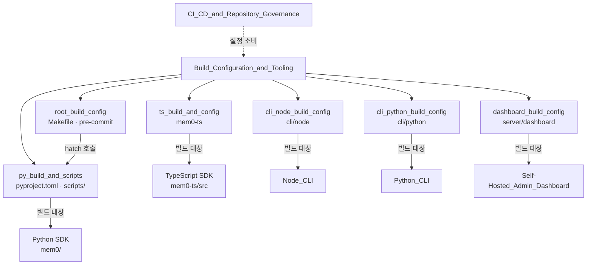
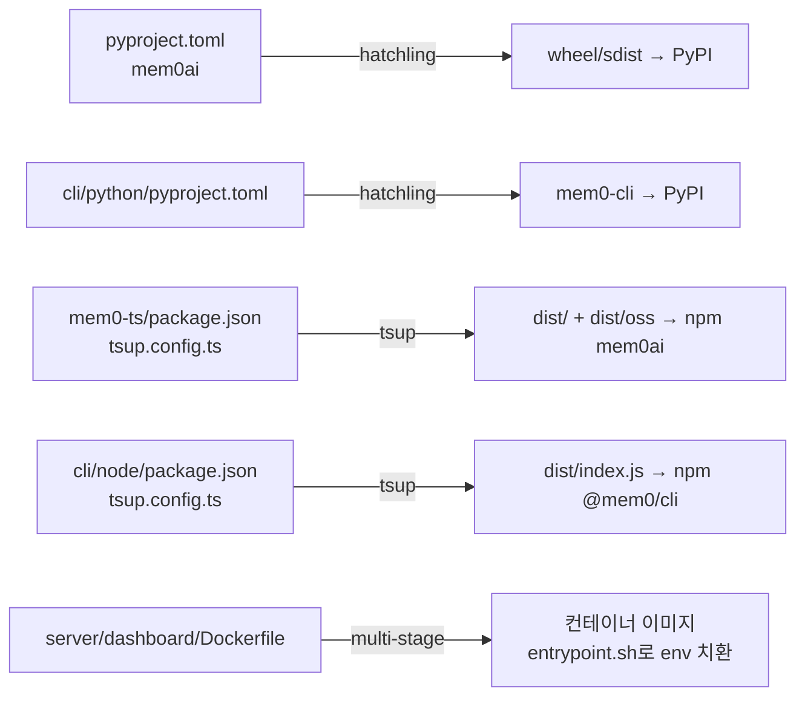
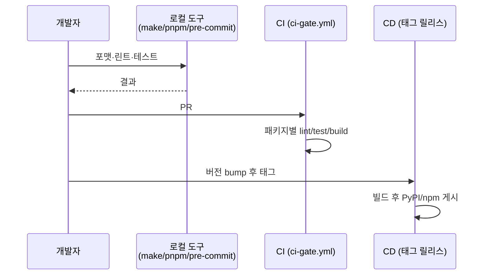

# Build_Configuration_and_Tooling 개요

## 1. 목적

`Build_Configuration_and_Tooling`은 mem0 폴리글랏 모노레포의 **패키지별 빌드·패키징·린트·테스트·컨테이너화 설정**을 모은 모듈입니다. 런타임 로직은 없고 설정 파일과 보조 스크립트로 이루어져 있습니다. 루트 `CLAUDE.md`가 "패키지마다 도구와 규칙이 다르다"고 명시하므로, 이 모듈은 각 패키지가 어떤 도구 체인을 쓰는지 한눈에 보여 줍니다.

| 패키지 | 빌드/패키징 | 린트·포맷 | 테스트 | 패키지 매니저 |
|--------|-------------|-----------|--------|---------------|
| 루트 Python SDK (`mem0ai`) | hatchling (`hatch build`) | ruff (line 120) + isort | pytest | hatch |
| `mem0-ts` | tsup (cjs+esm, dts) | Prettier | jest (ts-jest) | pnpm |
| `cli/node` (`@mem0/cli`) | tsup (ESM) | Biome | vitest | pnpm |
| `cli/python` (`mem0-cli`) | hatchling | ruff (line **100**) | pytest | pip/hatch |
| `server/dashboard` | Next.js standalone + Docker 멀티스테이지 | Prettier | `tsc --noEmit` | pnpm |

공통 특징은 다음과 같습니다.
- 코어 의존성은 최소로 유지하고 provider 의존성은 optional extra(Python) 또는 optional peer dependency(TS)로 분리합니다.
- 버전의 단일 출처는 `pyproject.toml` 또는 `package.json`이며, tsup/vitest `define`으로 코드에 주입됩니다.
- pnpm `overrides`로 취약 전이 의존성을 상향 고정합니다. `package.json`과 `pnpm-workspace.yaml`에 중복 선언된 곳이 있어 함께 수정해야 합니다.
- 이 설정을 `.github/workflows/`의 CI/CD가 그대로 소비합니다. 워크플로 수정은 메인테이너 승인이 필요합니다.

## 2. 아키텍처

### 2.1 모듈 구성

### 2.2 빌드 산출물 흐름

### 2.3 개발자 워크플로

## 3. 하위 모듈 요약

| 하위 모듈 | 핵심 내용 | 문서 |
|-----------|-----------|------|
| `root_build_config` | 루트 `Makefile`(format/sort/lint/test/build/publish)과 `.pre-commit-config.yaml`(ruff, isort 훅). Python 버전별 테스트 환경 매트릭스 | [root_build_config.md](root_build_config.md) |
| `py_build_and_scripts` | `pyproject.toml`(의존성 extras, hatch 환경, ruff/isort/pytest), `check-llms-txt-coverage.py`, `oss-to-platform-migrate.sh` | [py_build_and_scripts.md](py_build_and_scripts.md) |
| `ts_build_and_config` | `mem0-ts`의 `tsup.config.ts`(client/oss 두 타깃), `exports`, 선택적 peer 의존성, jest/tsconfig, `@mem0/community`·`mem0ai-oss` 보조 패키지 | [ts_build_and_config.md](ts_build_and_config.md) |
| `cli_node_build_config` | `@mem0/cli`의 tsup/vitest/Biome 설정, `__CLI_VERSION__` 주입, npm OIDC 게시 연계 | [cli_node_build_config.md](cli_node_build_config.md) |
| `cli_python_build_config` | `mem0-cli`의 `pyproject.toml`과 venv 기반 `Makefile`, ruff 100 설정 | [cli_python_build_config.md](cli_python_build_config.md) |
| `dashboard_build_config` | Next.js 대시보드의 4단계 `Dockerfile`, `NEXT_PUBLIC_*` 런타임 치환(`entrypoint.sh`), pnpm/tsconfig 설정 | [dashboard_build_config.md](dashboard_build_config.md) |

## 4. 주요 주의사항

- **린터 혼용 금지**: 루트 ruff 120, `cli/python` ruff 100, `cli/node` Biome, `mem0-ts` Prettier, 대시보드 Prettier(`lint` 스크립트).
- **새 provider 추가**: Python은 `pyproject.toml`의 해당 extra에, TS는 `peerDependencies`(optional)와 `tsup.config.ts`의 `external`에 함께 추가합니다.
- **버전 일관성 확인 필요**: 문서에서 관찰된 불일치로는 `pyproject.toml`의 `requires-python >=3.10` 대 `CLAUDE.md`의 3.9+ 언급, `@mem0/community`의 `mem0ai ^2.1.8` 의존 범위 대 루트 패키지 버전이 있습니다.
- **대시보드 새 공개 변수**: `Dockerfile`에 `ENV NAME=NAME`을 추가해야 런타임 치환이 동작합니다.
- **Makefile의 `.PHONY` 범위**: 루트 `Makefile`은 `format sort lint`만 선언하므로 `make docs`가 `docs/` 디렉터리 때문에 건너뛰어질 수 있습니다.

## 5. 관련 문서

- CI/CD 워크플로: [CI_CD_and_Repository_Governance](CI_CD_and_Repository_Governance.md)
- 빌드 대상 소스: [Python_SDK_Core_(Memory_Engine_and_Hosted_Client)](Python_SDK_Core_(Memory_Engine_and_Hosted_Client).md), [Python_Pluggable_Provider_Layer](Python_Pluggable_Provider_Layer.md), [TypeScript_SDK_Core_(Hosted_Client_and_OSS_Engine)](TypeScript_SDK_Core_(Hosted_Client_and_OSS_Engine).md), [TypeScript_Pluggable_Provider_Layer](TypeScript_Pluggable_Provider_Layer.md), [Node_CLI](Node_CLI.md), [Python_CLI](Python_CLI.md), [Self-Hosted_Admin_Dashboard](Self-Hosted_Admin_Dashboard.md)
- 배포 오케스트레이션: [Self-Hosted_Server_(API,_Auth,_Persistence,_Deployment)](Self-Hosted_Server_(API,_Auth,_Persistence,_Deployment).md)