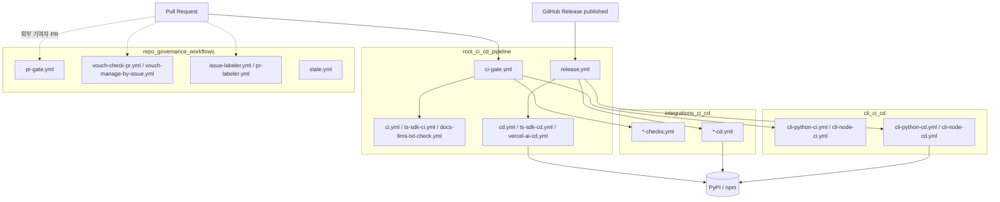
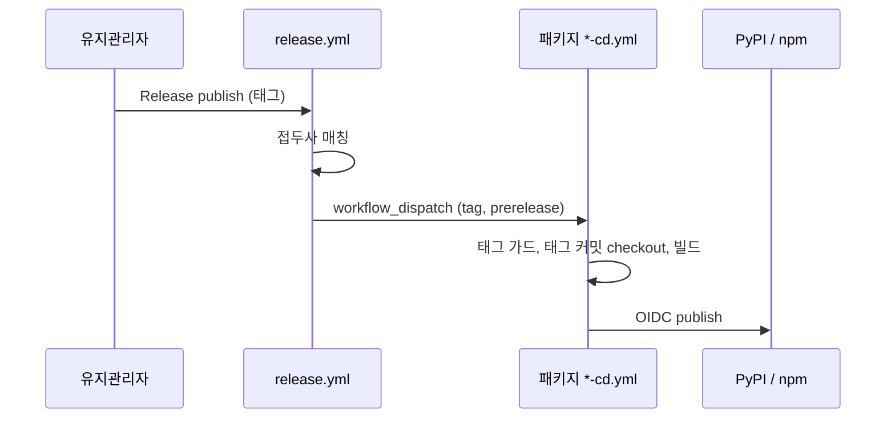
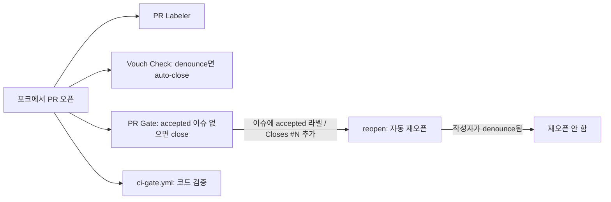

# CI_CD_and_Repository_Governance 개요

## 1. 목적

`CI_CD_and_Repository_Governance`는 mem0 모노레포의 `.github/workflows/`에 있는 GitHub Actions 워크플로우를 모은 모듈입니다. 하는 일은 세 가지입니다.

- **CI 통합 게이트**: 모든 PR을 `CI Gate`라는 필수 상태 체크 하나로 모읍니다. 변경된 패키지만 검증합니다.
- **릴리스 라우팅과 배포**: 릴리스 태그의 접두사를 보고 해당 패키지의 CD 워크플로우를 실행합니다. PyPI와 npm에는 OIDC trusted publishing과 provenance로 게시합니다.
- **기여 거버넌스**: `accepted` 이슈가 없는 외부 PR을 닫고, 계정 신뢰도(vouch)를 확인하고, 라벨을 붙이고, 오래된 이슈를 정리합니다.

> 주의: 게시 자격 증명(trusted publisher 설정)이 워크플로우 **파일명**에 고정되어 있습니다. 파일명을 바꾸거나 `.github/workflows/`를 수정할 때는 유지관리자의 명시적 승인이 필요합니다.

## 2. 아키텍처

### 2.1 전체 구조

### 2.2 설계 원칙

| 원칙 | 구현 |
|------|------|
| 필수 체크는 하나 | `ci-gate.yml`이 `dorny/paths-filter`로 변경 패키지를 감지하고 재사용 워크플로우(`workflow_call`)를 호출합니다. 마지막 `gate` job이 결과를 집계하며, `skipped`는 통과로 보고 `failure`/`cancelled`만 실패로 처리합니다. |
| 패키지 CI에는 `pull_request` 트리거가 없음 | PR 검증은 `ci-gate.yml`만 담당합니다. 각 패키지 CI는 `workflow_call`, `workflow_dispatch`, `main` push 트리거만 가집니다. |
| 릴리스는 한 번만 실행 | `release.yml`이 태그 접두사를 매칭해 `gh workflow run --ref refs/tags/<tag>`로 CD를 디스패치합니다. `v*`는 반드시 마지막에 둡니다. |
| 이중 가드 | 각 CD job에도 `startsWith(inputs.tag, ...)` 조건이 있어 잘못된 태그로는 게시되지 않습니다. |
| 비밀 토큰 없는 게시 | `id-token: write`로 OIDC trusted publishing을 쓰고 npm에는 `--provenance`를 붙입니다. 예외는 Zapier의 `ZAPIER_DEPLOY_KEY`입니다. |
| 게이트 둘은 독립 | PR Gate는 변경을, Vouch는 계정을 판단합니다. 다만 `reopen` job은 denounce된 작성자의 PR을 다시 열지 않습니다. |
| `pull_request_target` 안전 사용 | 거버넌스 워크플로우는 PR 코드를 checkout하거나 실행하지 않고 API 호출만 합니다. |

### 2.3 릴리스 태그 라우팅

| 태그 접두사 | CD 워크플로우 | 배포처 |
|-------------|---------------|--------|
| `v*` (마지막 arm) | `cd.yml` | PyPI `mem0ai` |
| `ts-v*` | `ts-sdk-cd.yml` | npm `mem0ai` |
| `vercel-ai-v*` | `vercel-ai-cd.yml` | npm `@mem0/vercel-ai-provider` |
| `cli-v*` / `cli-node-v*` | `cli-python-cd.yml` / `cli-node-cd.yml` | PyPI `mem0-cli` / npm `@mem0/cli` |
| `openclaw-v*`, `opencode-v*`, `pi-agent-v*`, `deepseek-plugin-v*`, `n8n-nodes-mem0-v*`, `mem0-strands-v*` | 각 `*-cd.yml` | npm 또는 PyPI |

Zapier(`zapier-mem0-cd.yml`)는 라우터를 거치지 않고 수동으로 디스패치합니다.

### 2.4 외부 기여자 PR 생애주기

문서 전용 PR, 드래프트, 같은 저장소 브랜치의 PR, OWNER/MEMBER/COLLABORATOR, Bot은 PR Gate 대상에서 제외됩니다.

## 3. 하위 모듈과 상세 문서

| 하위 모듈 | 범위 | 상세 문서 |
|-----------|------|-----------|
| `root_ci_cd_pipeline` | `ci-gate.yml`, `ci.yml`, `ts-sdk-ci.yml`, `docs-llms-txt-check.yml`, `release.yml`, `cd.yml`, `ts-sdk-cd.yml`, `vercel-ai-cd.yml` | [root_ci_cd_pipeline.md](root_ci_cd_pipeline.md) |
| `repo_governance_workflows` | `pr-gate.yml`, `vouch-check-pr.yml`, `vouch-manage-by-issue.yml`, `issue-labeler.yml`, `pr-labeler.yml`, `stale.yml` | [repo_governance_workflows.md](repo_governance_workflows.md) |
| `integrations_ci_cd` | agent-plugins, deepseek, mem0-strands, n8n, openclaw, opencode, pi-agent, zapier의 `*-checks.yml`과 `*-cd.yml` | [integrations_ci_cd.md](integrations_ci_cd.md) |
| `cli_ci_cd` | `cli-python-ci.yml`, `cli-python-cd.yml`, `cli-node-ci.yml`, `cli-node-cd.yml` | [cli_ci_cd.md](cli_ci_cd.md) |

## 4. 다른 모듈과의 관계

- **빌드 설정**: CI가 실행하는 `make lint`, `make test`, `hatch build`, `pnpm run build` 등은 `Build_Configuration_and_Tooling`에 정의되어 있습니다.
- **검증 대상**: Python/TypeScript SDK, Python/Node CLI, 에이전트 플러그인, 프레임워크 및 워크플로우 도구 통합(`integrations/`)입니다.
- **정책 원문**: 거버넌스 규칙(CLA, `accepted` 라벨, vouch)은 루트 `CLAUDE.md`(AGENTS.md)와 `CONTRIBUTING.md`에 있습니다. 워크플로우는 이를 구현한 것입니다.

## 5. 운영 시 유의사항

- 브랜치 보호의 필수 체크는 `CI Gate` 하나만 지정합니다.
- 새 패키지를 추가하려면 `*-checks.yml`(`workflow_call` 포함)을 만들고, `ci-gate.yml`에 필터, 호출 job, `gate.needs` 항목을 추가합니다. 배포가 필요하면 `*-cd.yml`(`workflow_dispatch` 전용)을 만들고 `release.yml`의 `case`에 접두사를 넣습니다. 구체적인 접두사를 먼저 두고 `v*`는 마지막에 둡니다.
- 버전을 올리는 PR은 `docs/changelog/sdk.mdx`를 함께 수정해야 합니다(Python/TS SDK CI가 검사합니다).
- 재배포는 Release를 지우고 다시 만들지 말고 `gh workflow run <package>-cd.yml --ref refs/tags/<tag> -f tag=<tag>`로 수동 디스패치합니다.
- `prerelease=true`로 npm에 게시할 때 버전에 `-beta.1` 같은 preid가 없으면 게시 단계가 실패합니다.
- 하위 문서에서 확인된 불일치가 있습니다. `ci-gate.yml`의 `n8n_nodes_mem0` 필터에는 `ci-gate.yml` 자체가 없고, `n8n-nodes-mem0`와 `agent-plugins-python` 호출 job에는 `secrets: inherit`가 없습니다.