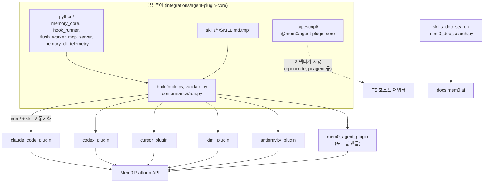
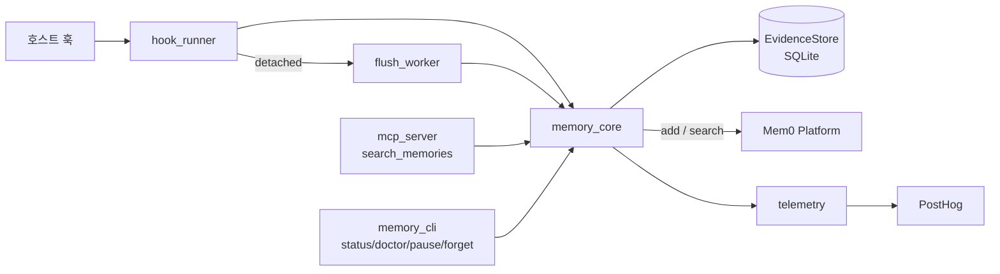

# Coding-Agent Memory Plugins and Shared Plugin Core

## 목적

이 모듈은 Claude Code, Codex, Cursor, Kimi, Antigravity 같은 코딩 에이전트에 **Mem0 메모리 기능을 플러그인으로 붙이는 코드 묶음**입니다. 구성은 다음과 같습니다.

- 모든 플러그인이 공유하는 코어: Python과 TypeScript 두 가지
- 코어를 각 호스트용 번들로 만들고 검증하는 빌드·적합성 계층
- 호스트별 플러그인
- 포터블 번들 `mem0-agent-plugin`
- 스킬이 최신 문서를 조회하는 도구 `skills_doc_search`

플러그인은 세션 중 일어난 일을 로컬 SQLite(`evidence.sqlite3`)에 기록합니다. 체크포인트나 세션 종료 시점에는 Mem0 플랫폼(`/v3/memories/add/`)으로 보내 메모리를 추출합니다. 이후 작업에서는 `search_memories` MCP 도구나 첫 프롬프트 자동 주입으로 그 메모리를 돌려줍니다.

핵심 설계는 두 가지입니다.

- **한 곳에서 관리**: 비밀값 마스킹, 저장소·범위 식별, flush 정책, 텔레메트리를 코어에 둡니다.
- **호스트 사본은 생성물**: 호스트별 `core/`는 빌더가 만든 결과물이므로 직접 편집하지 않습니다. `agent-plugin-core/python/`을 수정한 뒤 `--sync` 합니다.

## 아키텍처

### 런타임 흐름 (Python 코어)

호스트 종료와 상관없이 flush가 끝나도록 별도 프로세스(`flush_worker`)로 분리합니다. 모든 훅 예외는 기록만 하고 exit 0으로 끝내므로, 플러그인 오류가 에이전트를 막지 않습니다.

### 빌드 흐름

`build.py`는 임시 디렉터리에 번들을 만들고, `validate_bundle`을 통과해야만 출력 경로에 원자적으로 교체합니다.

- `--output`: 번들 생성
- `--check`: 설치된 플러그인과의 드리프트 검사
- `--sync`: 생성된 `core/`와 `skills/`를 각 플러그인에 덮어쓰기

`core/_harness_id.py`를 호스트별로 생성해 `HARNESS_ID`, `SOURCE_TAG` 등의 식별 정보를 주입합니다. 포터블 번들은 호스트 훅이 없으므로 `hook_runner.py`와 `flush_worker.py`를 제외합니다.

## 하위 모듈과 문서

| 모듈 | 경로 | 역할 | 문서 |
|---|---|---|---|
| agent_plugin_core_build_conformance | `integrations/agent-plugin-core` | 빌더, 번들 검증기, JSON Schema, 적합성 러너, 마켓플레이스 매니페스트 | [문서](agent_plugin_core_build_conformance.md) |
| agent_plugin_core_python | `integrations/agent-plugin-core/python` | 공유 Python 코어 원본(표준 라이브러리만 사용). 증거 저장소, flush, MCP 서버, 텔레메트리 | [문서](agent_plugin_core_python.md) |
| agent_plugin_core_typescript | `integrations/agent-plugin-core/typescript` | TypeScript 호스트 어댑터용 공유 라이브러리. 마스킹, 스코프·엔티티 해석, 회상 컨텍스트, 포맷, 텔레메트리 | [문서](agent_plugin_core_typescript.md) |
| claude_code_plugin | `integrations/claude-code-plugin` | Claude Code 어댑터(`adapters/claude/`). 트랜스크립트 파싱과 sidekick 서브에이전트 지원 | [문서](claude_code_plugin.md) |
| codex_plugin | `integrations/codex-plugin` | Codex 호스트용 플러그인 | [문서](codex_plugin.md) |
| cursor_plugin | `integrations/cursor-plugin` | Cursor 호스트용 플러그인 | [문서](cursor_plugin.md) |
| kimi_plugin | `integrations/kimi-plugin` | Kimi 호스트용 플러그인 | [문서](kimi_plugin.md) |
| antigravity_plugin | `integrations/antigravity-plugin` | Antigravity 호스트용 플러그인 | [문서](antigravity_plugin.md) |
| mem0_agent_plugin | `integrations/mem0-agent-plugin` | 호스트에 종속되지 않는 포터블 번들(훅 러너·flush 워커 제외) | [문서](mem0_agent_plugin.md) |
| skills_doc_search | `skills/mem0/scripts/mem0_doc_search.py` | `docs.mem0.ai`를 필요할 때마다 검색·조회하는 CLI(`--query`, `--page`, `--section`, `--index`) | [문서](skills_doc_search.md) |

## 핵심 개념 요약

- **저장소 식별**: git remote로 `app_id`, `project_id`, `directory`를 만들고, 와일드카드(`*`) 범위는 거부합니다.
- **두 레인 저장**: 프로젝트 공유 메모리(`agent_id=project_id`)와 개인 메모리(`user_id`)를 나눠 저장합니다. 검색 범위는 `repo | dir | mine`입니다.
- **체크포인트**: 완료된 교환 5회, 메시지 10개, 원문 40,000자 중 하나에 도달하면 플러시하며, 실패 시 최대 5회 재시도합니다.
- **보안**: API 키는 `0600` 파일로 캐시하고, 모든 텍스트는 `redact`와 `bounded`를 거칩니다.
- **TypeScript 코어**: 의존 방향은 `telemetry → lifecycle → (formatting, prompts)`로 단방향입니다.
- **CI**: 코어와 플러그인은 `integrations_ci_cd`의 워크플로(예: `agent-plugins-typescript-checks.yml`)로 검증합니다.