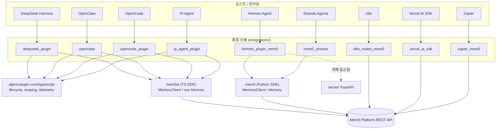
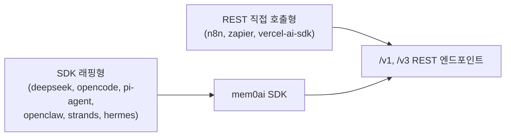

# Framework_and_Workflow-Tool_Integrations 개요

## 1. 목적

`integrations/` 아래에서 Mem0 장기 기억을 외부 에이전트 프레임워크, 코딩 에이전트 하네스, 워크플로 자동화 도구에 연결하는 어댑터 모듈 모음입니다. 각 하위 모듈은 대상 호스트의 확장 규약(플러그인, 노드, provider, MemoryStore 등)을 구현하고, 내부에서는 Mem0 Platform API 또는 자체 호스팅 OSS를 호출합니다. 공통 기능은 다음과 같습니다.

- 메모리 추가·검색·수정·삭제를 호스트 고유의 도구, 노드, 액션으로 노출
- 자동 회상(recall)과 자동 캡처(capture) 라이프사이클 훅
- `user_id`, `agent_id`, `run_id`, `app_id` 및 `project`/`session`/`global` 범위 지정
- 익명 텔레메트리와 `source` 헤더 또는 태그를 통한 사용 출처 귀속

## 2. 하위 모듈 요약

| 모듈 | 대상 호스트 | 구현 형태 | 백엔드 |
|------|-------------|-----------|--------|
| `deepseek_plugin` | DeepSeek Harness (Cordis) | `search_memory`/`add_memory` 도구와 훅 | `mem0ai` `MemoryClient` |
| `hermes_plugin_mem0` | Hermes Agent | `MemoryProvider` 구현, 설정 마법사 | Platform, 자체 호스팅 서버, 로컬 OSS |
| `mem0_strands` | Strands Agents | `Mem0MemoryStore` (`MemoryStore` 프로토콜) | `MemoryClient` 또는 `Memory` |
| `n8n_nodes_mem0` | n8n | 커뮤니티 노드 `Mem0` + `Mem0Api` 자격 증명 | REST 직접 호출 |
| `openclaw` | OpenClaw 게이트웨이 | 플러그인(Provider/Backend 추상화, skills 모드) | Platform 또는 `mem0ai/oss` |
| `opencode_plugin` | OpenCode | 네이티브 도구와 훅, 번들 스킬 | `MemoryClient` |
| `pi_agent_plugin` | Pi Agent | 확장, `mem0_memory` 도구, 슬래시 명령 | `MemoryClient` |
| `vercel_ai_sdk` | Vercel AI SDK (`ai` v6) | `LanguageModelV3` provider 래퍼 | REST 직접 호출 (`fetch`) |
| `zapier_mem0` | Zapier | Zapier Platform CLI 앱 (creates/searches) | REST 직접 호출 (`z.request`) |

## 3. 아키텍처

### 연동 방식

- **SDK 래핑형**: 호스트 API와 `MemoryClient`/`Memory`를 연결합니다. 이 중 `openclaw`와 `hermes_plugin_mem0`는 OSS 모드도 지원합니다.
- **REST 직접 호출형**: SDK 없이 `Authorization: Token <apiKey>` 헤더로 `/v3/memories/add/`, `/v3/memories/search/` 등을 호출합니다.
- **공유 코어 재사용**: TypeScript 에이전트 플러그인(`deepseek_plugin`, `openclaw`, `opencode_plugin`, `pi_agent_plugin`)은 `agent-plugin-core/typescript`의 라이프사이클, 스코핑, 텔레메트리 코드를 가져다 씁니다.
- **자체 호스팅**: `host` 또는 `baseUrl` 설정으로 대상을 바꿉니다. `hermes_plugin_mem0`는 `server/` FastAPI 서버를 전용 백엔드로 지원합니다.

## 4. 핵심 컴포넌트 문서

| 모듈 | 문서 |
|------|------|
| `deepseek_plugin` | [deepseek_plugin.md](deepseek_plugin.md) |
| `hermes_plugin_mem0` | [hermes_plugin_mem0.md](hermes_plugin_mem0.md) |
| `mem0_strands` | [mem0_strands.md](mem0_strands.md) |
| `n8n_nodes_mem0` | [n8n_nodes_mem0.md](n8n_nodes_mem0.md) |
| `openclaw` | [openclaw.md](openclaw.md) |
| `opencode_plugin` | [opencode_plugin.md](opencode_plugin.md) |
| `pi_agent_plugin` | [pi_agent_plugin.md](pi_agent_plugin.md) |
| `vercel_ai_sdk` | [vercel_ai_sdk.md](vercel_ai_sdk.md) |
| `zapier_mem0` | [zapier_mem0.md](zapier_mem0.md) |

## 5. 관련 모듈

- [Coding-Agent_Memory_Plugins_and_Shared_Plugin_Core](Coding-Agent_Memory_Plugins_and_Shared_Plugin_Core.md): 공유 플러그인 코어
- [TypeScript_SDK_Core_(Hosted_Client_and_OSS_Engine)](TypeScript_SDK_Core_(Hosted_Client_and_OSS_Engine).md): TypeScript SDK
- [Python_SDK_Core_(Memory_Engine_and_Hosted_Client)](Python_SDK_Core_(Memory_Engine_and_Hosted_Client).md): Python SDK
- [Self-Hosted_Server_(API,_Auth,_Persistence,_Deployment)](Self-Hosted_Server_(API,_Auth,_Persistence,_Deployment).md): 자체 호스팅 서버
- [CI_CD_and_Repository_Governance](CI_CD_and_Repository_Governance.md): 통합별 CI/CD