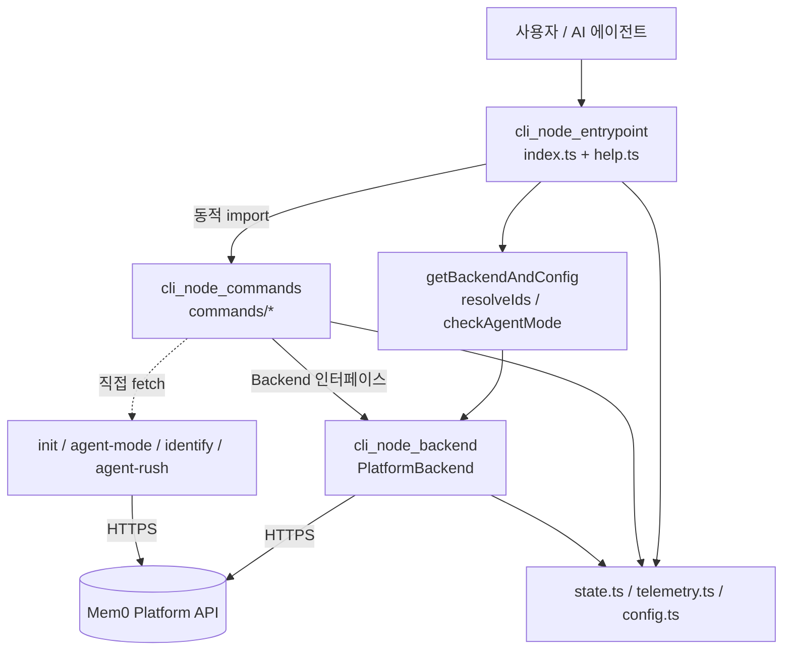
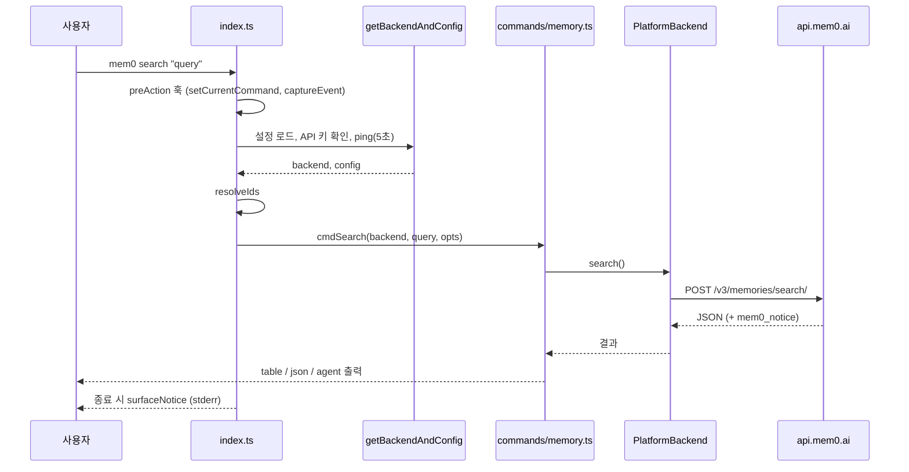

# Node_CLI 모듈 개요

## 1. 목적

`Node_CLI`(`cli/node/src`)는 Mem0 Platform을 터미널과 AI 에이전트에서 쓰기 위한 Node.js 커맨드라인 도구인 `@mem0/cli`입니다. 실행 파일 이름은 `mem0`입니다. 이 모듈이 하는 일은 다음과 같습니다.

- 메모리를 추가, 검색, 조회, 수정, 삭제합니다.
- 엔티티(user/agent/app/run)와 비동기 이벤트를 관리합니다.
- 인증과 초기 설정을 처리합니다. 처리 방식은 API 키, 이메일 OTP, Agent Mode 부트스트랩입니다.
- 사람이 읽는 출력(table/text)과 에이전트용 JSON 봉투(`agent`/`json`) 출력을 모두 제공합니다.

현재 Node CLI의 백엔드는 Mem0 Platform(`api.mem0.ai`) 하나뿐입니다. OSS 모드는 없습니다. 같은 기능을 하는 Python 구현은 `Python_CLI`(`cli_python_app`, `cli_python_backend`)에 있으며, 두 CLI의 동작은 서로 맞춰 두어야 합니다.

툴체인은 pnpm, tsup(ESM), Biome, vitest이고 Node 18 이상이 필요합니다.

## 2. 아키텍처

세 하위 모듈이 계층을 이룹니다.

| 계층 | 하위 모듈 | 경로 | 역할 |
|------|-----------|------|------|
| 진입점 | `cli_node_entrypoint` | `cli/node/src/index.ts`, `help.ts` | Commander 프로그램 조립, 전역 옵션, 텔레메트리 훅, 백엔드 초기화, ID 해석, 도움말 포매팅 |
| 명령 | `cli_node_commands` | `cli/node/src/commands/` | 입력 검증, 확인 프롬프트, 출력 모드 분기, 인증 부트스트랩 |
| 백엔드 | `cli_node_backend` | `cli/node/src/backend/platform.ts` | Platform REST API 호출, 헤더 구성, 에러 매핑, 공지(notice) 추출 |

명령 핸들러는 두 부류로 나뉩니다.

- **Backend 추상화 사용**: `memory.ts`, `entities.ts`, `events.ts`, `utils.ts`는 첫 인자로 `Backend`를 받습니다.
- **인증과 부트스트랩 계열**: `init.ts`, `agent-mode.ts`, `identify.ts`, `agent-rush.ts`는 API 키가 아직 없거나 전용 엔드포인트를 쓰기 때문에 `fetch`를 직접 호출합니다.

### 일반 명령 실행 흐름 (`mem0 search`)

### 주요 설계 포인트

- **지연 로딩**: 명령 모듈은 `await import(...)`로 불러오므로, 쓰지 않는 명령의 코드는 시작할 때 로드되지 않습니다.
- **ID 해석 우선순위**: `CLI 플래그 > config.defaults > undefined`입니다. 명시한 ID가 하나라도 있으면 그것만 쓰고 기본값은 섞지 않습니다.
- **Agent Mode**: `--json`/`--agent`가 있으면 출력은 `agent` 봉투 형식이 됩니다. 서버가 보낸 `mem0_notice`는 JSON에 포함하고, 사람용 출력에서는 종료할 때 stderr로 보여 줍니다.
- **파괴적 명령의 안전장치**: agent 모드에서는 `--force`가 필수입니다. `--dry-run` 미리보기와 TTY y/N 확인도 지원합니다.
- **에러 매핑**: 백엔드는 HTTP 401, 404, 400을 각각 `AuthError`, `NotFoundError`, `APIError`로 바꿉니다. 재시도는 없고 타임아웃은 30초입니다.
- **키 재사용**: init 중 키 검증(`pingKey`)은 401/403일 때만 무효로 판정합니다. 일시적인 네트워크 장애 때문에 새 키가 만들어지는 일을 막기 위한 규칙입니다.

## 3. 하위 모듈 문서

| 하위 모듈 | 문서 | 다루는 내용 |
|-----------|------|-------------|
| `cli_node_entrypoint` | [cli_node_entrypoint.md](cli_node_entrypoint.md) | 명령 트리, `getBackendAndConfig`, `resolveIds`, 텔레메트리 훅, `richFormatHelp`, 새 명령 추가 체크리스트 |
| `cli_node_commands` | [cli_node_commands.md](cli_node_commands.md) | 파일별 커맨드 핸들러, 공통 핸들러 패턴, `runInit` 인증 흐름, Agent Mode 상태 변화, agent-rush |
| `cli_node_backend` | [cli_node_backend.md](cli_node_backend.md) | `Backend` 인터페이스, `_request` 공통 처리, 메서드별 API 매핑, 필터 구성, 에러 타입 |

## 4. 관련 모듈

- Python 대응 구현: [Python_CLI](Python_CLI.md)
- 빌드와 테스트 설정(`cli/node/package.json`, `tsup.config.ts`, `vitest.config.ts`): [Build_Configuration_and_Tooling](Build_Configuration_and_Tooling.md)
- CI/CD(`cli-node-ci.yml`, 태그 `cli-node-v*`로 `cli-node-cd.yml` 실행): [CI_CD_and_Repository_Governance](CI_CD_and_Repository_Governance.md)
- 같은 구조의 백엔드 구현: [Framework_and_Workflow-Tool_Integrations](Framework_and_Workflow-Tool_Integrations.md) (`integrations/openclaw`)