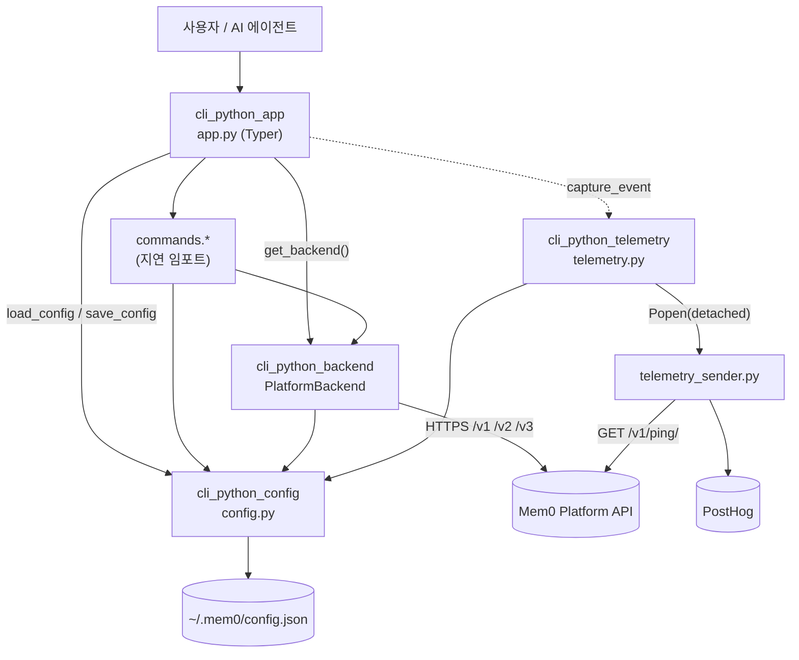
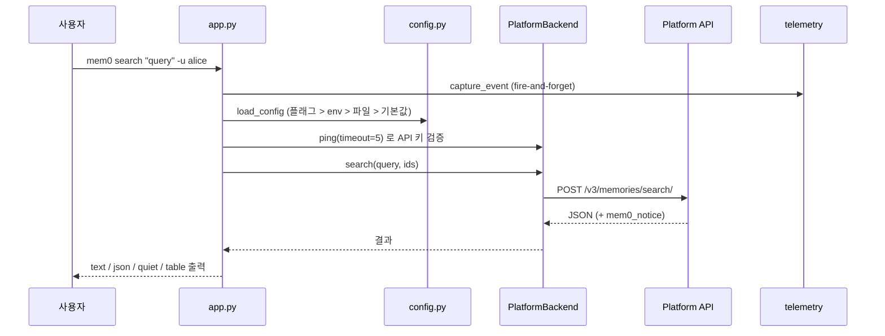

# Python_CLI 모듈 개요

## 1. 목적

`Python_CLI`(`cli/python/src/mem0_cli`)는 Mem0 Platform API(`api.mem0.ai`)를 터미널에서 다루는 Python 커맨드라인 도구입니다. 패키지 이름은 `mem0-cli`, 엔트리 포인트는 `mem0`입니다. 사람 사용자와 AI 에이전트가 모두 사용할 수 있게 설계되었습니다.

- **메모리 관리**: `add`, `search`, `get`, `list`, `update`, `delete`
- **관리·설정**: `entity`, `event`, `config`, `init`, `status`, `import`, `help`
- **에이전트용 기능**: `--json`/`--agent` 기계 판독 출력, `identify`, `whoami`, `agent-rush`
- **익명 텔레메트리**: PostHog로 전송하며 `MEM0_TELEMETRY=false`로 끌 수 있습니다.

Python 3.10 이상이 필요하며, 린터는 ruff(줄 길이 **100**)를 사용합니다. 같은 기능을 하는 Node 구현은 `Node_CLI` 모듈에 있습니다.

## 2. 아키텍처

`app.py`는 명령 라우팅, 전역 옵션, 인증 검증을 맡는 얇은 레이어입니다. 실제 로직은 `commands.*`에 위임하고, HTTP 통신은 `PlatformBackend`가, 설정 저장은 `config.py`가, 사용량 수집은 `telemetry.py`가 담당합니다.

### 명령 실행 흐름

## 3. 핵심 컴포넌트

| 컴포넌트 | 파일 | 역할 | 상세 문서 |
|---|---|---|---|
| `cli_python_app` | `app.py` | Typer 명령 트리, 전역 옵션(`--json`/`--agent`), 엔티티 ID 해석, API 키 검증, stdin 폴백 | [cli_python_app](cli_python_app.md) |
| `cli_python_backend` | `backend/platform.py` | `httpx` 기반 `PlatformBackend`, 요청 헤더, 오류 변환(`AuthError`/`NotFoundError`/`APIError`), 필터 구성, Agent Mode notice 수집 | [cli_python_backend](cli_python_backend.md) |
| `cli_python_config` | `config.py` | `~/.mem0/config.json` 읽기/쓰기, 환경 변수 오버라이드, 점 표기 키 조회·수정, API 키 마스킹 | [cli_python_config](cli_python_config.md) |
| `cli_python_telemetry` | `telemetry.py`, `telemetry_sender.py` | 익명 이벤트를 분리된 서브프로세스로 PostHog에 전송 | [cli_python_telemetry](cli_python_telemetry.md) |

## 4. 주요 설계 포인트

- **설정 우선순위**: CLI 플래그 > 환경 변수(`MEM0_API_KEY`, `MEM0_BASE_URL`, `MEM0_USER_ID` 등) > `~/.mem0/config.json` > 기본값. 설정 파일 권한은 디렉터리 0700, 파일 0600입니다.
- **엔티티 ID 해석**: 플래그로 하나라도 지정하면 config 기본값을 섞지 않습니다. 과도한 필터링을 막기 위해서입니다.
- **에이전트 모드**: `--json`/`--agent`를 켜면 출력이 기계 판독용이 되고, 요청에 `X-Mem0-Caller-Type: agent` 헤더가 붙습니다. 서버가 보낸 notice는 명령 종료 시 한 번만 표시합니다.
- **오류 처리**: 401은 `AuthError`, 404는 `NotFoundError`, 400은 `APIError`로 변환합니다. 그 외 오류는 `httpx.HTTPStatusError`로 전파됩니다.
- **텔레메트리는 fire-and-forget**: 부모 프로세스는 네트워크를 기다리지 않고, 모든 오류를 무시합니다.
- **시작 속도**: `commands.*`는 함수 내부에서 지연 임포트합니다.

## 5. 관련 모듈

- `Node_CLI`: 같은 API와 헤더 규약을 쓰는 Node 구현
- `Build_Configuration_and_Tooling`: `cli/python/pyproject.toml`, `Makefile`