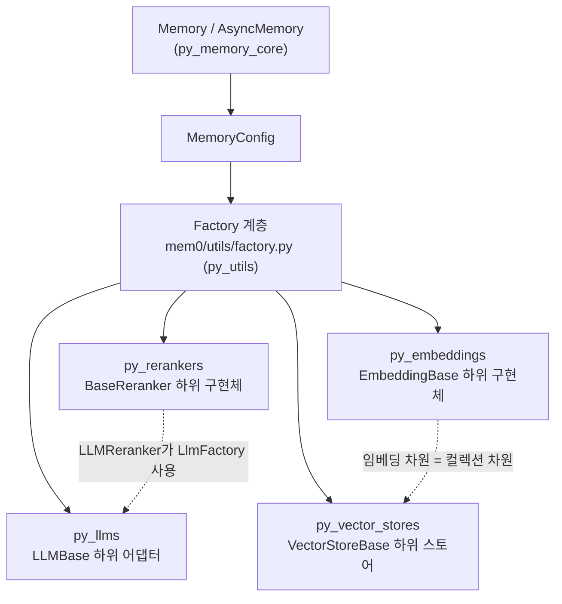
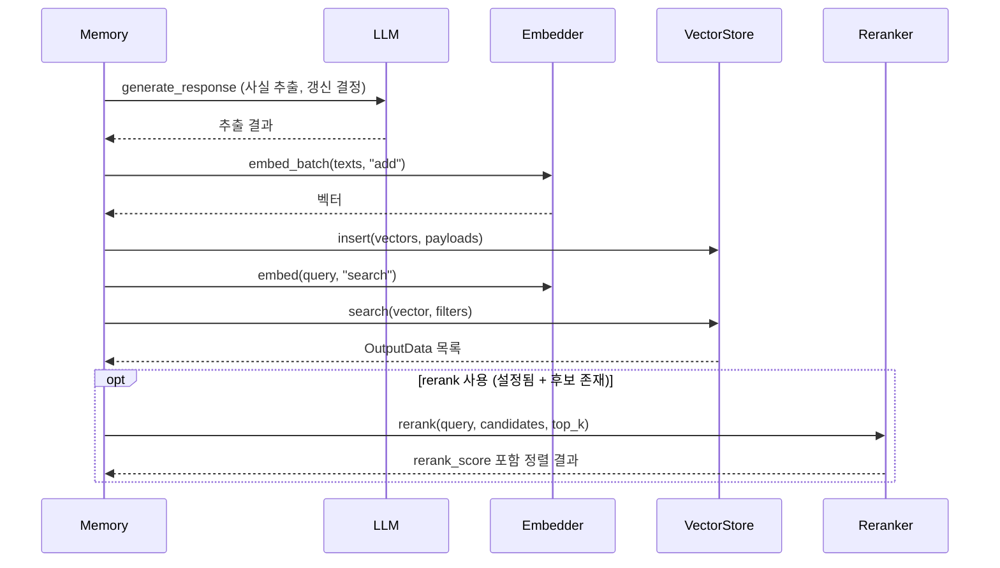
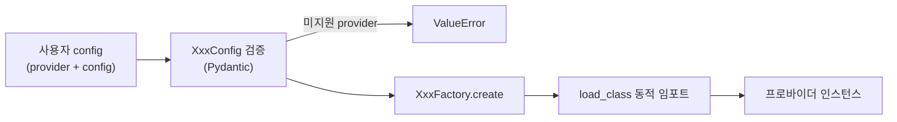

# Python_Pluggable_Provider_Layer 개요

## 1. 목적

`Python_Pluggable_Provider_Layer`(`mem0/`)는 Mem0 Python SDK(`mem0ai`)에서 외부 서비스에 의존하는 네 가지 기능을 **교체 가능한 프로바이더**로 분리한 계층입니다. `Memory`와 `AsyncMemory`는 `LLMBase`, `EmbeddingBase`, `VectorStoreBase`, `BaseReranker` 같은 추상 인터페이스만 호출합니다. 그래서 설정의 `provider` 값만 바꿔 백엔드를 교체할 수 있습니다.

| 하위 모듈 | 경로 | 역할 | 프로바이더 수 |
|---|---|---|---|
| `py_llms` | `mem0/llms` | 사실 추출과 메모리 갱신 결정에 쓰는 LLM 호출. `generate_response()`로 통일 | 18종(`LlmConfig` 허용 목록 기준) |
| `py_embeddings` | `mem0/embeddings` | 텍스트를 벡터로 변환. `embed()`와 `embed_batch()` 제공 | 11종 |
| `py_vector_stores` | `mem0/vector_stores` | 임베딩 저장, 검색, 필터링. 결과는 `OutputData`로 통일 | 25종(5개 그룹) |
| `py_rerankers` | `mem0/reranker` | 벡터 검색 후보의 재정렬. `rerank_score`를 부여 | 5종 |

네 모듈에는 공통점이 있습니다.

- **설정 레지스트리**: Pydantic 설정 클래스(`LlmConfig`, `EmbedderConfig`, `VectorStoreConfig`, `RerankerConfig`)가 `provider`와 `config`를 검증하고, 지원하지 않는 provider는 `ValueError`로 거부합니다.
- **팩토리**: `mem0/utils/factory.py`의 팩토리가 provider 이름으로 구현 클래스를 동적으로 로드합니다.
- **선택 의존성**: 각 SDK는 `pyproject.toml`의 optional 그룹에서 관리하고, 없으면 설치 안내가 담긴 `ImportError`를 냅니다.

## 2. 아키텍처

### 2.1 계층 구조

### 2.2 메모리 추가·검색 시 프로바이더 협업

### 2.3 설정 해석 흐름 (공통 패턴)

## 3. 하위 모듈 요약

- **LLM** ([py_llms](py_llms.md))
  - DeepSeek, LM Studio, MiniMax, vLLM, xAI는 OpenAI 호환 클라이언트에 `base_url`만 바꿔 재사용합니다.
  - 추론 모델의 샘플링 파라미터 제약, Anthropic의 `temperature`/`top_p` 동시 전송 금지 같은 공급자별 차이를 어댑터가 처리합니다.
  - 응답은 `tools`가 없으면 `str`, 있으면 `{"content", "tool_calls"}`로 통일됩니다.
- **임베딩** ([py_embeddings](py_embeddings.md))
  - 프로바이더 전용 필드를 `BaseEmbedderConfig` 한 곳에 모으고, 각 구현체는 자기에게 해당하는 필드만 읽습니다.
  - OpenAI, Azure, Gemini, Vertex AI, HuggingFace 등은 네이티브 배치를 구현하고, 나머지는 순차 호출로 폴백합니다.
  - 모델이나 차원을 바꾸면 기존 벡터와 호환되지 않으므로 컬렉션을 다시 만들어야 합니다.
- **벡터 스토어** ([py_vector_stores](py_vector_stores.md))
  - 5개 하위 그룹으로 나뉩니다.
    - [vector_store_config_registry](vector_store_config_registry.md)
    - [local_and_adapter_vector_stores](local_and_adapter_vector_stores.md)
    - [dedicated_vector_database_stores](dedicated_vector_database_stores.md)
    - [search_engine_and_keyvalue_stores](search_engine_and_keyvalue_stores.md)
    - [database_backed_vector_stores](database_backed_vector_stores.md)
    - [cloud_platform_vector_stores](cloud_platform_vector_stores.md)
  - 쿼리 문자열이나 SQL/Cypher를 조립하는 스토어에서는 키·값·식별자 검증이 보안 경계입니다.
  - `reset()`은 컬렉션을 삭제 후 재생성하므로 파괴적입니다.
- **리랭커** ([py_rerankers](py_rerankers.md))
  - 실패해도 예외를 전파하지 않고, 경고 로그를 남긴 채 원래 순서로 폴백합니다.
  - 점수 척도가 프로바이더마다 달라 서로 비교할 수 없습니다.
  - `LLMReranker`는 문서 수만큼 LLM을 호출하므로 지연과 비용이 늘어납니다.

## 4. 공통 설계 원칙과 유의점

- **이중 등록**: 새 프로바이더는 설정 쪽 허용 목록(또는 레지스트리)과 팩토리 매핑 두 곳에 모두 등록해야 합니다. 한쪽만 등록하면 설정은 통과해도 생성 단계에서 실패합니다.
- **새 프로바이더 추가 절차**: 설정 클래스 → 구현 클래스(`base.py` 상속) → 설정 허용 목록 → `mem0/utils/factory.py` → optional 의존성 그룹 → `tests/` → `docs/` 순서로 진행합니다. 자세한 규칙은 `mem0/AGENTS.md`의 "Adding a provider"를 따릅니다.
- **차원 일치**: 임베딩 차원은 벡터 스토어 컬렉션 차원과 일치해야 합니다.
- **로컬 스토어 경로**: 로컬 스토어의 기본 `path`는 `/tmp`이므로 운영 환경에서는 명시적으로 지정해야 합니다.

## 5. 핵심 컴포넌트 문서 참조

| 문서 | 내용 |
|---|---|
| [py_llms](py_llms.md) | LLM 어댑터, `LlmConfig`, 공급자별 설정과 주의점 |
| [py_embeddings](py_embeddings.md) | `EmbedderConfig`, 프로바이더별 배치·인증·특이점 |
| [py_vector_stores](py_vector_stores.md) | `VectorStoreBase` 계약, 25종 스토어, 하위 그룹 문서 링크 |
| [py_rerankers](py_rerankers.md) | `BaseReranker` 계약, 5종 리랭커, 폴백 동작 |

관련 모듈:
- `py_utils`: 팩토리
- `py_memory_core`: 소비자인 `Memory`
- TypeScript 대응 계층: `TypeScript_Pluggable_Provider_Layer`