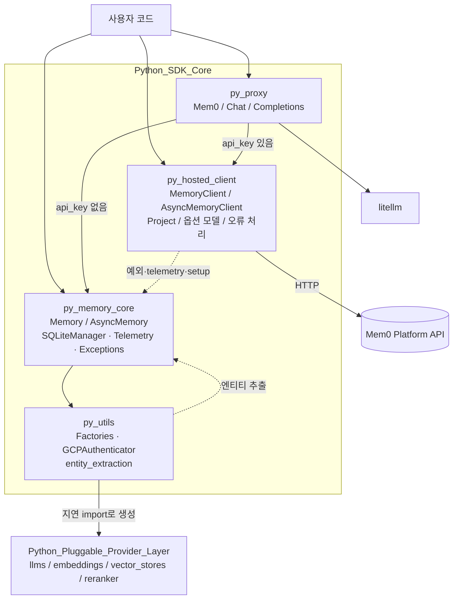
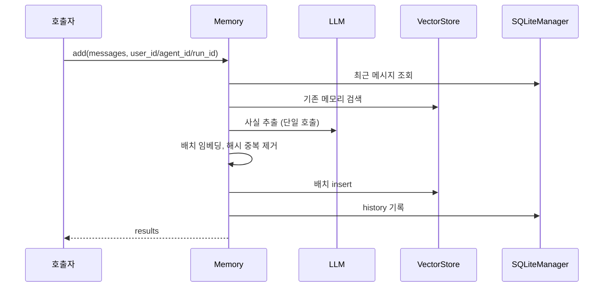
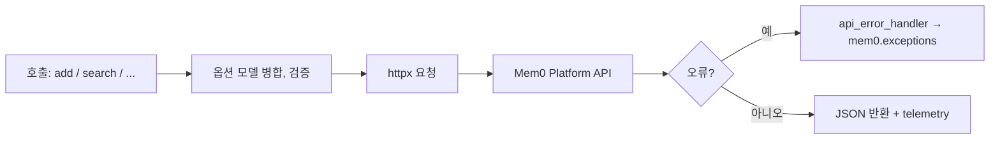

# Python_SDK_Core_(Memory_Engine_and_Hosted_Client) 개요

## 1. 목적

이 모듈(`mem0/`)은 Mem0 Python SDK(`mem0ai`)의 핵심입니다. 에이전트에 지속적이고 개인화된 메모리를 제공하며, 사용 방식은 두 가지입니다.

- **로컬(OSS) 엔진**: `Memory`와 `AsyncMemory`가 LLM으로 대화에서 사실을 추출합니다. 추출한 사실은 벡터 스토어에 저장하고, 하이브리드 검색(의미 검색, BM25, 엔티티 부스트)으로 조회합니다. 변경 이력은 SQLite에 기록합니다.
- **호스티드 클라이언트**: `MemoryClient`와 `AsyncMemoryClient`가 Mem0 플랫폼 API(`https://api.mem0.ai`)를 호출합니다. 처리는 모두 원격에 위임하며, 프로젝트, 웹훅, 프로필 같은 플랫폼 전용 기능도 제공합니다.
- **보조 계층**: `py_proxy`는 OpenAI 호환 `chat.completions` 프록시입니다. `py_utils`는 provider 팩토리, GCP 인증, 엔티티 추출을 담당합니다.

## 2. 아키텍처

### 2.1 전체 구성

### 2.2 `Memory.add()` 흐름 (OSS)

### 2.3 호스티드 요청 흐름

## 3. 하위 모듈과 핵심 컴포넌트 문서

| 하위 모듈 | 경로 | 핵심 컴포넌트 | 문서 |
|---|---|---|---|
| `py_memory_core` | `mem0/memory` | `Memory`, `AsyncMemory`, `SQLiteManager`, `AnonymousTelemetry`, 예외 계층 | [py_memory_core](py_memory_core.md) |
| `py_hosted_client` | `mem0/client` | `MemoryClient`, `AsyncMemoryClient`, `Project`, `AsyncProject`, `api_error_handler` | [py_hosted_client](py_hosted_client.md) |
| `py_proxy` | `mem0/proxy` | `Mem0`, `Chat`, `Completions` | [py_proxy](py_proxy.md) |
| `py_utils` | `mem0/utils` | `LlmFactory`, `EmbedderFactory`, `VectorStoreFactory`, `RerankerFactory`, `GCPAuthenticator`, `extract_entities` | [py_utils](py_utils.md) |

`py_memory_core`의 세부 문서는 다음과 같습니다.

- [memory_engine](memory_engine.md)
- [memory_prompts_and_text_utils](memory_prompts_and_text_utils.md)
- [history_storage_and_setup](history_storage_and_setup.md)
- [telemetry_and_notices](telemetry_and_notices.md)
- [infrastructure_exceptions](infrastructure_exceptions.md)
- [memory_and_access_exceptions](memory_and_access_exceptions.md)

## 4. 설계상 주의할 점

- **스코프 필수**: 로컬 엔진에서는 `user_id`, `agent_id`, `run_id` 중 하나가 필요합니다. 호스티드 클라이언트는 `search`와 `get_all`에서 이 값들을 최상위 인자가 아니라 `filters`로 받습니다.
- **지연 로딩**: 팩토리는 provider 클래스를 문자열 경로로 보관하다가 필요할 때 import 합니다. 그래서 선택 의존성이 없어도 코어 SDK는 동작합니다.
- **오류 정책**: 모든 예외는 `mem0/exceptions.py`의 `MemoryError`를 상속합니다. 호스티드 클라이언트는 HTTP 오류를 이 예외들로 변환합니다. 텔레메트리와 setup은 예외를 삼켜서 본 기능을 막지 않습니다.
- **텔레메트리**: `MEM0_TELEMETRY=false`로 끕니다. 프롬프트와 메모리 내용은 전송하지 않습니다.
- **import 시점 부수 효과**: `setup_config()`가 import 때 `~/.mem0`(`MEM0_DIR`)를 만듭니다.
- **이력 DB**: `SQLiteManager`의 기본 `db_path`는 `:memory:`입니다. 영속화하려면 파일 경로를 지정해야 합니다.

## 5. 관련 모듈

- `Python_Pluggable_Provider_Layer`: `py_llms`, `py_embeddings`, `py_vector_stores`, `py_rerankers`
- TypeScript 대응 구현: `ts_hosted_client`, `ts_oss_core`
- 이 SDK를 사용하는 CLI와 통합: `cli_python_backend` 등