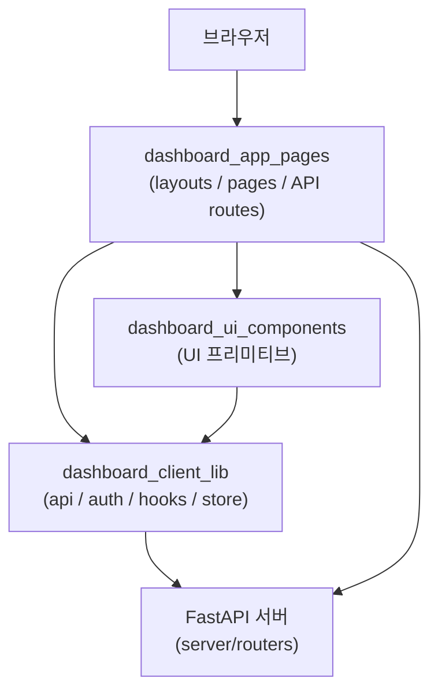
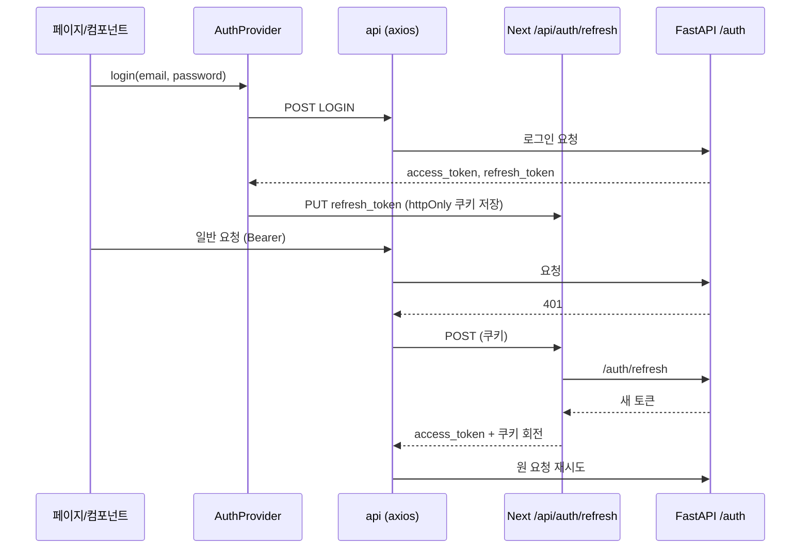
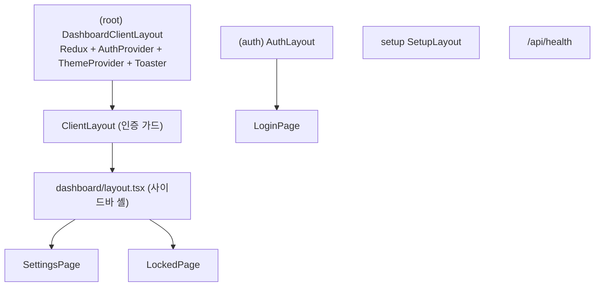

# Self-Hosted_Admin_Dashboard 개요

## 목적

`Self-Hosted_Admin_Dashboard`(`server/dashboard/src`)는 셀프호스팅 Mem0 서버를 관리하기 위한 **Next.js(App Router) 기반 관리자 웹 UI**입니다. 이 모듈이 담당하는 일은 다음과 같습니다.

- 로그인과 최초 설정(온보딩) 화면 제공
- 사용자 프로필, 비밀번호, 테마 설정 페이지 제공
- 인증된 사용자만 대시보드에 접근하도록 가드 적용
- 메모리, API 키, 엔터티, 요청 로그 등 서버 REST API 응답을 소비하는 클라이언트 계층 제공
- 오픈소스 버전에서 제공하지 않는 기능을 `LockedPage`로 막고, Cloud/Enterprise 안내로 연결

백엔드는 FastAPI 서버(`server/`)이며, 이 대시보드는 그 서버의 `/auth/*` 등 REST API를 호출합니다.

## 아키텍처

모듈은 세 개의 하위 모듈로 나뉩니다.

| 하위 모듈 | 경로 | 책임 |
|---|---|---|
| `dashboard_app_pages` | `src/app` | 라우트 그룹 `(root)`, `(auth)`, `setup`, 레이아웃, 인증 가드, 설정 페이지, `/api/auth/refresh`·`/api/health` 라우트 |
| `dashboard_ui_components` | `src/components` | shadcn/ui 스타일 프리미티브와 공용 컴포넌트(`DataTable`, `EventBadge`, `DeleteConfirmationModal`, `Form`, `Toaster`, `ThemeProvider` 등) |
| `dashboard_client_lib` | `src` (`utils`, `lib`, `hooks`, `types`, `store`) | `api` axios 클라이언트, `AuthProvider`, `useApiQuery`, API 타입, `layoutReducer`, 유틸리티 |

### 계층 구조

`dashboard_ui_components`는 `cn` 같은 유틸리티를 `dashboard_client_lib`에서 가져오므로, UI 계층도 `Lib`에 의존합니다.

### 인증 흐름

액세스 토큰은 `utils/api.ts`의 모듈 메모리에만 보관합니다. 리프레시 토큰은 Next.js 라우트 `/api/auth/refresh`가 `mem0_refresh_token` httpOnly 쿠키로 저장하고 백엔드로 중계합니다. 페이지를 새로고침하면 `AuthProvider`가 이 쿠키로 세션을 복원합니다.

### 라우트와 가드 구성

`(root)`, `(auth)`, `setup` 그룹은 각각 자체 루트 레이아웃을 가집니다. `/login`과 `/setup`을 제외한 모든 경로는 `ClientLayout`이 `useAuth()` 결과로 보호하며, 사용자가 없으면 `/login`으로 이동시킵니다. Redux `Provider`는 `(root)`에만 있고, 사이드바 접힘 상태(`layoutReducer`)를 관리합니다.

## 핵심 컴포넌트 문서

| 문서 | 다루는 내용 |
|---|---|
| [dashboard_app_pages](dashboard_app_pages.md) | 라우트 그룹과 레이아웃, 인증 가드, 설정 페이지, 리프레시 쿠키 프록시, 헬스체크, `LockedPage` |
| [dashboard_ui_components](dashboard_ui_components.md) | UI 프리미티브, `DataTable`, `EventBadge`, 토스트, 폼, 테마 계층 |
| [dashboard_client_lib](dashboard_client_lib.md) | `api` 클라이언트와 401 자동 갱신, `AuthProvider`, `useApiQuery`, API 타입, 유틸리티 |

## 관련 모듈

- 백엔드 인증과 라우터: `server_auth_and_routers`, `server_api_core`
- 컨테이너와 빌드 설정: `server_deployment`, `dashboard_build_config` (`server/dashboard/Dockerfile`, `entrypoint.sh`, `package.json`)

## 유지보수 시 유의점

- 401 갱신 로직이 `utils/api.ts`(`refreshAccessToken`)와 `lib/auth.tsx`(`refreshSession`)에 중복되어 있으므로, 변경할 때는 양쪽을 함께 확인해야 합니다.
- `api` 클라이언트는 서버가 `{ error }`를 반환하면 에러 객체 대신 **문자열**로 reject합니다.
- `types/api.ts`는 서버 라우터 응답에 맞춰 수작업으로 유지되므로, 서버 스키마를 바꾸면 함께 수정해야 합니다.
- HTTP로 접근하는 프로덕션 배포에서는 `DASHBOARD_URL`을 `http://...`로 명시해야 리프레시 쿠키(`secure` 옵션)가 저장됩니다.
- `/api/health`는 백엔드 연결 상태를 보지 않는 단순 liveness 체크입니다.