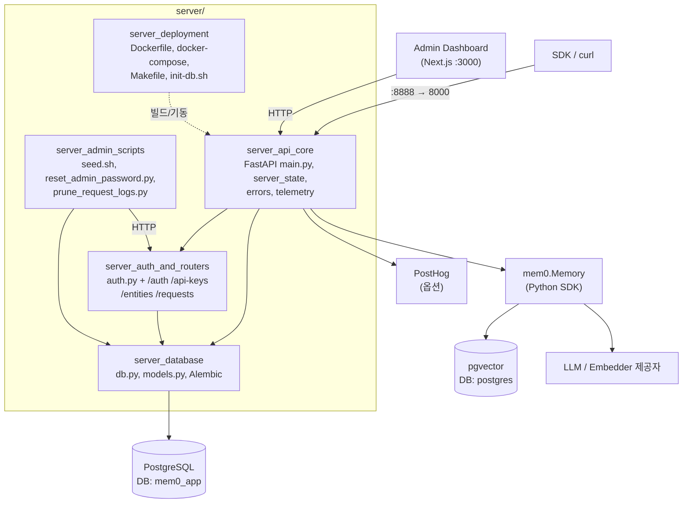
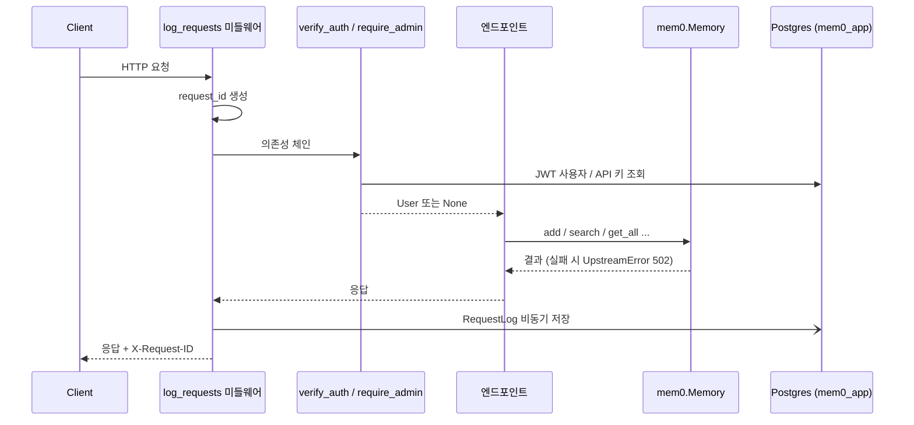
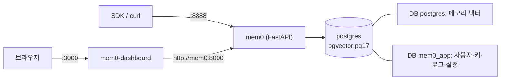

# Self-Hosted Server (API, Auth, Persistence, Deployment) 개요

## 1. 목적

`server/` 모듈은 Mem0를 **자가 호스팅**하기 위한 REST 서버입니다. Python SDK의 `mem0.Memory`를 FastAPI로 감싸 HTTP API로 노출합니다. 여기에 서버 운영에 필요한 기능을 더했습니다.

- **API**: 메모리 CRUD, 검색, 설정 변경, 요청 로깅, 업스트림 오류 분류, 익명 텔레메트리
- **인증/인가**: JWT(액세스/리프레시), `X-API-Key`, 레거시 `ADMIN_API_KEY`, `AUTH_DISABLED` 개발 모드
- **영속성**: PostgreSQL에 사용자, API 키, 요청 로그, 설정, 리프레시 토큰 JTI 저장(SQLAlchemy + Alembic). 메모리 벡터는 pgvector에 저장
- **배포/운영**: Docker Compose 스택(API, Postgres/pgvector, 대시보드), Makefile 타깃, 시드·비밀번호 복구·로그 정리 스크립트

관리 UI는 [Self-Hosted_Admin_Dashboard](Self-Hosted_Admin_Dashboard.md)가 담당하며, 이 서버의 API를 소비합니다.

## 2. 전체 아키텍처

### 요청 처리 흐름

### 배포 토폴로지 (`docker-compose`, 프로젝트 `mem0-dev`)

## 3. 하위 모듈과 핵심 컴포넌트

| 모듈 | 주요 파일 | 책임 | 문서 |
|------|-----------|------|------|
| `server_api_core` | `main.py`, `server_state.py`, `errors.py`, `telemetry.py` | 앱 부팅, 메모리/검색/설정 엔드포인트, 요청 로깅, 오류 분류, 런타임 설정 영속화 | [server_api_core](server_api_core.md) |
| `server_auth_and_routers` | `auth.py`, `routers/{auth,api_keys,entities,requests}.py` | 인증 의존성(`verify_auth`/`require_auth`/`require_admin`), 계정·API 키·엔티티·요청 로그 API | [server_auth_and_routers](server_auth_and_routers.md) |
| `server_database` | `db.py`, `models.py`, `alembic/` | 엔진·세션, ORM 모델 5개, 마이그레이션 001~006 | [server_database](server_database.md) |
| `server_admin_scripts` | `scripts/` | 시드, 관리자 비밀번호 재설정, 요청 로그 정리 | [server_admin_scripts](server_admin_scripts.md) |
| `server_deployment` | `Dockerfile`, `docker-compose.yaml`, `Makefile`, `init-db.sh`, `requirements.txt` | 컨테이너 빌드·기동·부트스트랩 | [server_deployment](server_deployment.md) |

## 4. 핵심 설계 포인트

- **인증 판정 순서**: Bearer JWT → `ADMIN_API_KEY` → 사용자 API 키(`m0sk_…`, bcrypt 해시 저장) → `AUTH_DISABLED`. 아무것도 없으면 401입니다. `/auth/register`는 최초 admin 1명만 허용하고, DB 부분 유니크 인덱스(마이그레이션 004)로도 보장합니다.
- **리프레시 토큰 1회용**: `RefreshTokenJti`에 대한 조건부 `UPDATE`로 동시 재사용을 차단합니다.
- **설정 영속화**: `POST /configure`는 `Memory`를 재생성하고 오버라이드를 `Settings` 테이블에 저장합니다. 응답에서는 민감 키를 마스킹합니다.
- **오류 분류**: 제공자, 데이터스토어, 벡터 스토어 오류를 `UpstreamError`(502, 코드 포함)로 일관되게 반환합니다.
- **두 개의 DB**: 메모리 벡터는 `postgres`, 앱 메타데이터는 `mem0_app`에 둡니다. `init-db.sh`가 후자를 멱등 생성하고, 컨테이너 시작 시 `alembic upgrade head`를 자동 실행합니다.

## 5. 운영 시 주의

- 번들된 LLM/embedder(`openai`, `anthropic`, `gemini`) 외 제공자를 쓰려면 이미지에 패키지를 설치하고 `BUNDLED_*_PROVIDERS`를 확장해야 합니다.
- compose 스택과 `--reload`는 **개발용**입니다. 운영에는 시크릿 관리, TLS, `--reload` 제거 등 별도 하드닝이 필요합니다.
- `JWT_SECRET`(`AUTH_DISABLED=false`일 때)과 `POSTGRES_PASSWORD`는 필수입니다. 운영 환경에서 `AUTH_DISABLED`는 사용하지 않습니다.
- `server/CLAUDE.md`는 Neo4j를 언급하지만 현재 `docker-compose.yaml`에는 해당 서비스가 없습니다. 배포 전에 확인하세요.

## 6. 관련 모듈

- SDK 코어(`Memory`): [py_memory_core](py_memory_core.md)
- 벡터 스토어 등 제공자: [Python_Pluggable_Provider_Layer](Python_Pluggable_Provider_Layer.md)
- 관리 대시보드: [Self-Hosted_Admin_Dashboard](Self-Hosted_Admin_Dashboard.md)
- 대시보드 빌드 설정: [Build_Configuration_and_Tooling](Build_Configuration_and_Tooling.md)