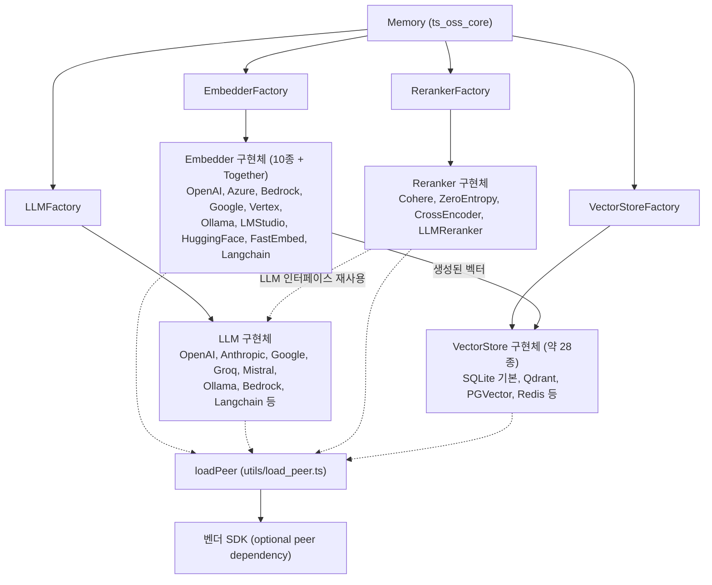
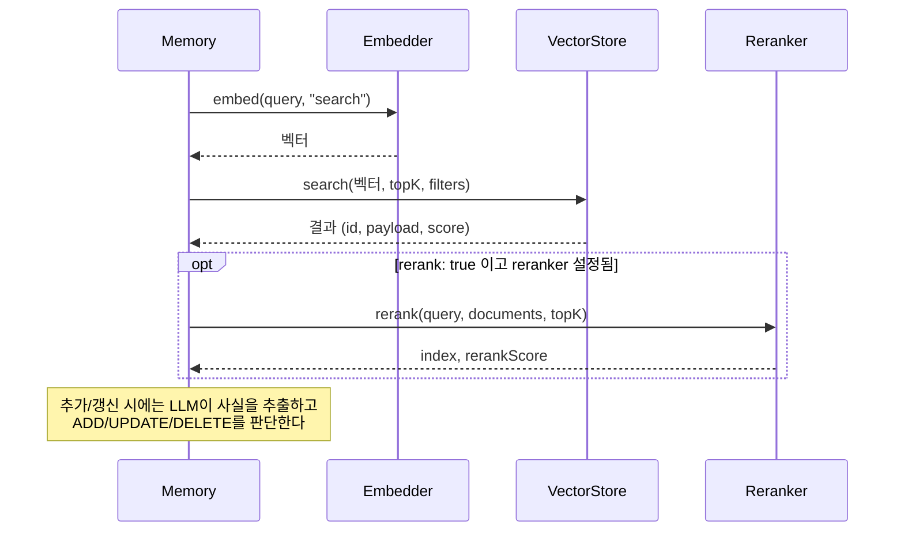

# TypeScript_Pluggable_Provider_Layer 개요

## 1. 목적

`TypeScript_Pluggable_Provider_Layer`(`mem0-ts/src/oss/src`)는 TypeScript OSS SDK의 자체 호스팅 `Memory` 엔진이 쓰는 외부 서비스를 공통 인터페이스 뒤로 감춥니다. 대상은 임베딩, LLM, 리랭킹, 벡터 저장소 네 가지입니다. 사용자는 설정의 `provider` 문자열만 바꿔 백엔드를 교체할 수 있습니다. 구현체는 `utils/factory.ts`의 팩토리가 만듭니다.

| 계층 | 인터페이스 | 팩토리 | 역할 |
|---|---|---|---|
| `ts_oss_embeddings` | `Embedder` | `EmbedderFactory` | 텍스트를 벡터로 변환 |
| `ts_oss_llms` | `LLM` | `LLMFactory` | 사실 추출과 메모리 갱신 판단 |
| `ts_oss_rerankers` | `Reranker` | `RerankerFactory` | 검색 결과를 쿼리 관련도순으로 재정렬 |
| `ts_oss_vector_stores` | `VectorStore` | `VectorStoreFactory` | 벡터와 payload의 저장·검색 |

Python 대응 계층은 `Python_Pluggable_Provider_Layer`입니다. 기본값과 필터 로직 등이 서로 맞춰져 있으므로 한쪽을 고치면 다른 쪽도 확인해야 합니다. 상위 호출자는 [ts_oss_core](ts_oss_core.md)의 `Memory`입니다.

## 2. 아키텍처

### 검색 시 협력 흐름

### 공통 설계 원칙

- **인터페이스 + 팩토리**: 알 수 없는 provider는 `Unsupported ... provider` 오류를 던집니다.
- **지연 로딩**: 벤더 SDK는 optional peer dependency입니다. `loadPeer`나 동적 `import()`로 처음 쓸 때만 로드하며, 설치되지 않았으면 `npm install` 안내 오류를 냅니다. tsup ESM 번들 때문에 `require()`는 쓰지 않습니다.
- **초기화 Promise 캐시**: 클라이언트나 `initialize()`의 Promise를 캐시해 동시 호출이 하나의 클라이언트를 공유하게 합니다.
- **실패 시 폴백**: 리랭커는 원래 순서로 되돌리고, `keywordSearch`는 `null`을 반환합니다.
- **클라이언트 주입**: 대부분 `config.client`로 사전 구성한 클라이언트를 받으며, 테스트에 씁니다.

## 3. 핵심 컴포넌트 문서

| 모듈 | 경로 | 내용 | 문서 |
|---|---|---|---|
| `ts_oss_embeddings` | `mem0-ts/src/oss/src/embeddings` | `Embedder` 인터페이스, 배치 전략, 작업 유형별 임베딩 타입 | [ts_oss_embeddings](ts_oss_embeddings.md) |
| `ts_oss_llms` | `mem0-ts/src/oss/src/llms` | `LLM` 인터페이스, 프로바이더별 메시지·툴 변환 | [ts_oss_llms](ts_oss_llms.md) |
| `ts_oss_rerankers` | `mem0-ts/src/oss/src/rerankers` | `Reranker` 계약, 폴백 정책, cross-encoder와 LLM 점수화 | [ts_oss_rerankers](ts_oss_rerankers.md) |
| `ts_oss_vector_stores` | `mem0-ts/src/oss/src/vector_stores` | `VectorStore` 인터페이스와 5개 백엔드 그룹 | [ts_oss_vector_stores](ts_oss_vector_stores.md) |

벡터 저장소의 하위 문서:
- [ts_oss_vector_stores_local_and_adapter_vector_stores](ts_oss_vector_stores_local_and_adapter_vector_stores.md)
- [ts_oss_vector_stores_dedicated_vector_database_stores](ts_oss_vector_stores_dedicated_vector_database_stores.md)
- [ts_oss_vector_stores_search_engine_and_keyvalue_stores](ts_oss_vector_stores_search_engine_and_keyvalue_stores.md)
- [ts_oss_vector_stores_database_backed_vector_stores](ts_oss_vector_stores_database_backed_vector_stores.md)
- [ts_oss_vector_stores_cloud_platform_vector_stores](ts_oss_vector_stores_cloud_platform_vector_stores.md)

관련 모듈: [ts_oss_core](ts_oss_core.md), Python 대응 계층(`py_embeddings`, `py_llms`, `py_rerankers`, `py_vector_stores`).

## 4. 확장 시 주의

1. 구현체 파일을 만들고 해당 인터페이스를 구현합니다.
2. `utils/factory.ts`에 provider를 등록하고 `types`의 설정 타입에 필드를 추가합니다.
3. 선택 SDK는 `loadPeer`로 지연 로드합니다.
4. 공개 API가 바뀌면 `docs/`도 같은 PR에서 갱신합니다(저장소 규칙). 도구는 pnpm, Prettier, jest, tsup을 씁니다.