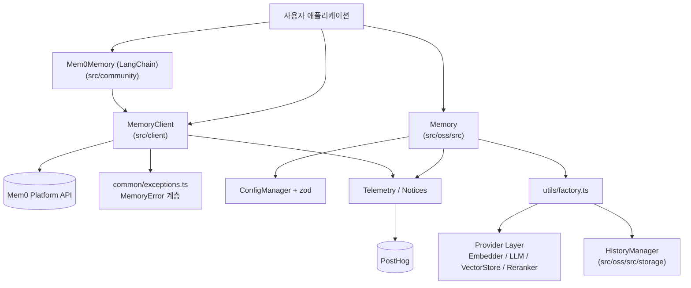
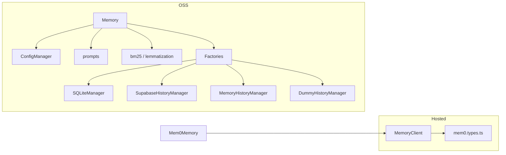

# TypeScript SDK Core (Hosted Client and OSS Engine) 개요

## 목적

이 모듈은 `mem0ai` npm 패키지(`mem0-ts/src`)의 핵심 계층입니다. 같은 "메모리 레이어" 기능을 두 가지 방식으로 제공합니다.

- **호스팅 클라이언트(`MemoryClient`)**: Mem0 플랫폼(`https://api.mem0.ai`)의 REST API를 호출합니다. 메모리 CRUD, 검색, 엔터티, 프로젝트, 웹훅, 프로필, 내보내기를 지원합니다.
- **OSS 엔진(`Memory`)**: 자체 호스팅용 엔진입니다. LLM 기반 사실 추출, 임베딩, 벡터 스토어 저장, 하이브리드 검색(시맨틱 + BM25 + 엔티티 부스트), 변경 이력 기록을 직접 수행합니다.
- **커뮤니티 통합**: LangChain.js용 `Mem0Memory` 어댑터입니다. 호스팅 클라이언트를 LangChain 체인의 대화 메모리로 연결합니다.

개별 임베딩, LLM, 리랭커, 벡터 스토어 구현은 별도 모듈인 `TypeScript_Pluggable_Provider_Layer`가 담당합니다. 이 모듈은 그 구현들을 팩토리로 조합하는 오케스트레이션만 맡습니다.

## 아키텍처

### 구성 요소 관계

### 핵심 흐름

- **호스팅 검색**: `MemoryClient`가 최상위 엔터티 파라미터를 거부하고(`filters: { user_id }`만 허용), camelCase를 snake_case로 변환해 `POST /v3/memories/search/`를 호출합니다. 실패 응답은 `createExceptionFromResponse`가 `MemoryError` 하위 예외로 바꿉니다.
- **OSS 추가(`add`)**: 입력 검증 → 최근 메시지 조회 → 기존 메모리 검색 → LLM 1회 추출 → 배치 임베딩 → 해시 중복 제거 → 벡터 및 이력 기록 → 엔티티 링크 순서로 진행하는 V3 단계별 배치 파이프라인입니다.
- **OSS 검색(`search`)**: 벡터 검색, 키워드(BM25) 검색, 엔티티 부스트를 합산해 점수화합니다. 선택적으로 리랭킹합니다.
- **이력**: `Memory`가 `add`, `update`, `delete` 때마다 `HistoryManager`에 기록합니다. 백엔드는 설정(`historyStore.provider`)으로 교체합니다.

## 하위 모듈과 문서

| 모듈 | 경로 | 역할 | 문서 |
|------|------|------|------|
| `ts_hosted_client` | `mem0-ts/src/client` | `MemoryClient`(호스팅 REST), 헤더, 키 변환, 예외 매핑, 텔레메트리 | [ts_hosted_client](ts_hosted_client.md) |
| `ts_oss_core` | `mem0-ts/src/oss/src` | `Memory` 엔진, `ConfigManager`, 팩토리, 프롬프트, BM25, 알림, 텔레메트리 | [ts_oss_core](ts_oss_core.md) |
| `ts_oss_history_storage` | `mem0-ts/src/oss/src/storage` | `HistoryManager` 인터페이스와 SQLite, Supabase, 메모리, Dummy 구현 | [ts_oss_history_storage](ts_oss_history_storage.md) |
| `ts_community_integrations` | `mem0-ts/src/community/src/integrations` | LangChain `Mem0Memory` 어댑터 | [ts_community_integrations](ts_community_integrations.md) |

## 선택 가이드와 주의점

| 상황 | 사용할 구성 요소 |
|------|------------------|
| 관리형 플랫폼 사용 | `MemoryClient` |
| 자체 호스팅, 로컬 제어 | `Memory` (`mem0ai/oss`) |
| LangChain 체인에 장기 기억 연결 | `Mem0Memory` (호스팅 전용) |

- 텔레메트리는 `MEM0_TELEMETRY=false`로 끕니다. 부수 기능(텔레메트리, 알림, 엔티티 링크, 이력)은 실패해도 핵심 연산을 중단시키지 않는 best-effort 방식입니다.
- OSS `Memory`는 `timestamp`, `referenceDate`, `updateProject`를 지원하지 않고 오류를 던집니다.
- 이력 백엔드를 바꾸면 조회 상한(SQLite는 제한 없음, Supabase와 Memory는 100건)과 타임스탬프 기본값이 달라져 `history()` 결과가 달라질 수 있습니다.
- `Mem0Memory.clear()`는 로컬 chat history만 비우며 원격 메모리는 삭제하지 않습니다.
- 빌드와 테스트는 `mem0-ts`의 pnpm, tsup, jest 설정을 따릅니다. 관련 문서는 `Build_Configuration_and_Tooling`, `CI_CD_and_Repository_Governance`, `TypeScript_Pluggable_Provider_Layer`입니다.
- Python 대응 구현은 `Python_SDK_Core_(Memory_Engine_and_Hosted_Client)`에 있습니다.