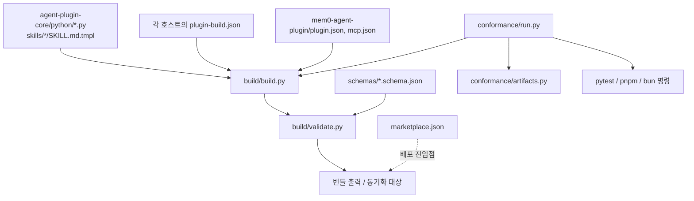
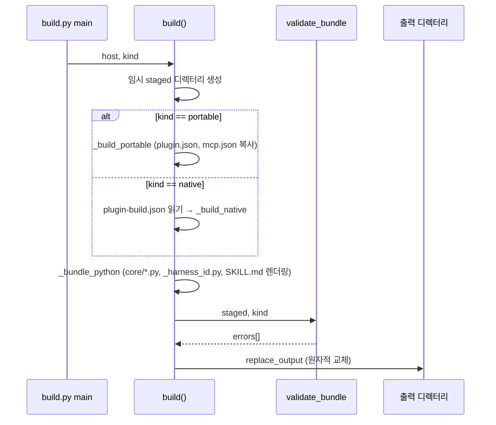

# agent_plugin_core_build_conformance

`integrations/agent-plugin-core/`의 **빌드·검증·적합성(conformance)** 계층이다. 공유 코어(`python/`, `skills/`)를 각 코딩 에이전트 호스트(Claude Code, Cursor, Codex, Kimi, Antigravity)와 포터블 번들(`mem0-agent-plugin`)에 복사해 넣는 빌더, 번들 검증기, 전체 플러그인 적합성 러너, 마켓플레이스 매니페스트로 구성된다.

공유 런타임 코드 자체는 [agent_plugin_core_python](agent_plugin_core_python.md), [agent_plugin_core_typescript](agent_plugin_core_typescript.md)에서, 호스트별 플러그인은 [claude_code_plugin](claude_code_plugin.md), [cursor_plugin](cursor_plugin.md), [codex_plugin](codex_plugin.md), [kimi_plugin](kimi_plugin.md), [antigravity_plugin](antigravity_plugin.md), [mem0_agent_plugin](mem0_agent_plugin.md)에서 다룬다. CI 연동은 [integrations_ci_cd](integrations_ci_cd.md)를 참고한다.

## 구성 요소

| 파일 | 역할 |
|------|------|
| `build/build.py` (`main`) | 번들 생성(`--output`), 드리프트 검사(`--check`), 동기화(`--sync`) |
| `build/validate.py` (`main`) | 생성된 번들의 스키마·스킬·심볼릭 링크 검증 |
| `build/schemas/plugin.schema.json` | `plugin.json` JSON Schema (Agent Plugins 1.0.0) |
| `build/schemas/mcp.schema.json` | `mcp.json` JSON Schema (stdio / streamable-http / sse) |
| `conformance/run.py` (`main`) | 모든 그룹의 검사를 실행하고 단일 리포트를 출력 |
| `conformance/artifacts.py` (`main`) | TypeScript 플러그인 산출물이 자체 완결적인지 검증 |
| `requirements-dev.txt` | `jsonschema`, `pytest`, `skills-ref==0.1.1` |
| `marketplace.json` (저장소 루트) | `mem0-plugins` 마켓플레이스 목록 (현재 `mem0` → `./integrations/claude-code-plugin`, 버전 `0.3.3`) |

## 아키텍처



## 빌드 흐름 (`build/build.py`)

`build(host, kind, output)`은 임시 디렉터리에 번들을 만든 뒤 `validate_bundle`을 통과해야만 출력 경로에 반영한다.



핵심 동작:

- **코어 복사**: `python/*.py`를 번들의 `core/`로 복사한다. 포터블 번들은 `flush_worker.py`, `hook_runner.py`를 제외한다(호스트 훅이 없으므로).
- **`core/_harness_id.py` 생성**: 호스트마다 `HARNESS_ID`, `SOURCE_TAG`(예: `CLAUDE_CODE_PLUGIN`), `PLATFORM_SOURCE="MEM0_PLUGIN"`, `PLATFORM_APPLICATION`을 한 곳에서 정의한다. 포터블 번들은 호스트를 알 수 없으므로 `HARNESS_ID="coding-agent"`, `PLATFORM_APPLICATION=""`(헤더 생략)이다. 진입점이 `telemetry.init()`을 호출하지 않아도 식별이 어긋나지 않게 하기 위함이다.
- **스킬 템플릿 렌더링**: `skills/*/SKILL.md.tmpl`의 `{{PLUGIN_ROOT}}`, `{{PLUGIN_DATA}}`, `{{PLUGIN_DATA_ARG}}`, `{{COMMAND_PREFIX}}`, `{{HARNESS_ID}}`, `{{HARNESS_NAME}}` 토큰을 치환한다. 알 수 없거나 해결되지 않은 토큰은 `ValueError`. 포터블은 `argument-hint:`, `disable-model-invocation:` 줄을 제거한다.
- **선언 파일 복사**: 네이티브 빌드는 `plugin-build.json`의 `native.pluginRoot`, `native.pluginData`, `native.files`를 따른다. 경로가 루트 밖으로 나가면 거부한다.
- **출력 보호**: `replace_output`은 저장소 루트, `integrations/`, 코어 루트, 각 플러그인 루트를 `PROTECTED_OUTPUTS`로 막고, 임시 디렉터리에 복사한 뒤 교체한다.

### 모드

| 옵션 | 동작 |
|------|------|
| `--output PATH` | 지정 경로에 번들 생성 |
| `--check` | `bundle_drift`: 새로 빌드한 `core/`, `skills/`와 설치된 플러그인 디렉터리를 비교(누락·잔존·내용 차이). 차이가 있으면 종료 코드 1 |
| `--sync` | `sync_generated`: 생성된 `core/`, `skills/`를 각 플러그인 디렉터리에 덮어씀 |

```bash
python integrations/agent-plugin-core/build/build.py claude-code --kind native --check
python integrations/agent-plugin-core/build/build.py mem0-agent-plugin --kind portable --sync
```

각 호스트의 `core/` 디렉터리는 이 빌더가 만든 **생성물**이므로 직접 편집하지 말고 `agent-plugin-core/python/`를 수정한 뒤 `--sync` 한다.

## 검증 (`build/validate.py`)

`validate_bundle(root, kind)`:

1. 모든 종류: 심볼릭 링크 금지.
2. `portable`: `plugin.json`은 필수이며 `plugin.schema.json`으로, `mcp.json`은 존재 시 `mcp.schema.json`으로 `Draft202012Validator` 검증. `skills/*` 각각을 `skills_ref.validate`로 검증.
3. `native`: 모든 `*.json`이 파싱 가능한지만 확인.

스키마 요점: `plugin.json`은 `$schema`와 `name`(소문자/숫자/`.`/`-`, 최대 64자, `--`·`..` 금지)이 필수이며 추가 속성은 금지, 클라이언트 전용 데이터는 `extensions`에 둔다. `mcp.json`의 서버는 `stdio`(`command`, `args`, `env`, `cwd`), `streamable-http`, `sse` 중 하나이며, `env`에 `PLUGIN_ROOT`/`PLUGIN_DATA` 키는 금지, `cwd`는 `./`, `${PLUGIN_ROOT}`, `${PLUGIN_DATA}`로 시작해야 한다.

## 적합성 러너 (`conformance/run.py`)

그룹별 검사를 실행하고 `{status, checks[]}` 리포트를 만든다.

| 그룹 | 내용 |
|------|------|
| `python-bundles` | 5개 네이티브 호스트 + 포터블 번들을 `build()`로 실제 빌드 |
| `python-tests` | 코어 및 5개 호스트 플러그인의 `pytest` (`test_conformance.py`와 claude-code `integration`은 제외) |
| `typescript-core` | `pnpm test`, `pnpm typecheck` |
| `openclaw`, `pi-agent`, `deepseek` | `pnpm test` / typecheck / `build` + 산출물 검사 |
| `opencode` | `bun test` / `type-check` / `build` + 산출물 검사 |
| `live-platform` | `--live` 지정 시에만, `MEM0_API_KEY` 필요. claude-code 통합 테스트 |

옵션: `--group`(반복 가능, 기본 전체), `--list`(실행 없이 계획만 출력), `--install`(`pnpm`/`bun install --frozen-lockfile`, `CI=true`), `--artifacts-dir`, `--report`(JSON 저장). 출력과 명령은 `memory_core.redact`로 비밀값을 가리고, 출력은 마지막 8,000자만 보관한다. 하나라도 실패하면 종료 코드 1.

### 산출물 검사 (`conformance/artifacts.py`)

`TYPESCRIPT_ARTIFACTS`에 정의된 `openclaw`, `opencode`, `pi-agent`, `deepseek` 패키지에 대해 (1) 필수 파일(`dist/index.js`, `dist/index.d.ts` 등)의 존재, (2) `dist/` 안의 `.js/.mjs/.cjs/.d.ts`에 `agent-plugin-core`를 가리키는 import/require가 없는지(모노레포 소스 import 누출 방지)를 확인한다. 즉 게시된 npm 패키지가 자체 완결적이어야 한다는 규칙을 강제한다.

```bash
python integrations/agent-plugin-core/conformance/run.py --list
python integrations/agent-plugin-core/conformance/run.py --group python-bundles --report out/report.json
python integrations/agent-plugin-core/conformance/artifacts.py openclaw
```

## 마켓플레이스 (`marketplace.json`)

`mem0-plugins` 마켓플레이스에 `mem0` 플러그인 하나를 등록한다: `source: ./integrations/claude-code-plugin`, `installation: AVAILABLE`, `authentication: ON_INSTALL`, 카테고리 `Productivity`. 플러그인 버전을 올릴 때 이 파일도 함께 갱신해야 한다.

## 개발 의존성

`requirements-dev.txt`: `jsonschema>=4.23,<5`, `pytest>=8,<10`, `skills-ref==0.1.1`. CI에서의 실행은 `.github/workflows/agent-plugins-python-checks.yml`, `agent-plugins-typescript-checks.yml`과 `ci-gate.yml` 흐름에서 이루어진다([root_ci_cd_pipeline](root_ci_cd_pipeline.md) 참조).
