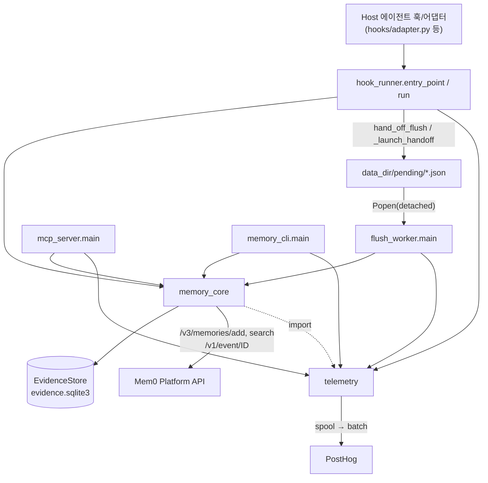
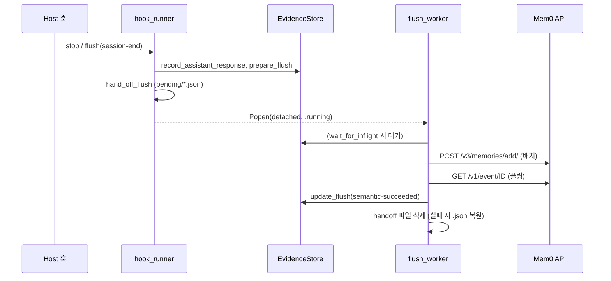

# agent_plugin_core_python

`integrations/agent-plugin-core/python/`는 모든 Mem0 코딩 에이전트 플러그인(Claude Code, Codex, Cursor, Kimi, Antigravity, mem0-agent-plugin)이 공유하는 Python 코어의 **원본 소스**입니다. 빌드 시 각 플러그인의 `core/` 디렉터리로 복사됩니다([agent_plugin_core_build_conformance](agent_plugin_core_build_conformance.md) 참고). 표준 라이브러리만 사용하며, 훅에서 세션 이벤트를 로컬 SQLite에 기록하고, 체크포인트 시점에 Mem0 플랫폼으로 전송해 메모리를 추출하며, 이후 작업에서 검색(MCP 도구/첫 프롬프트 자동 주입)으로 되돌려줍니다.

## 파일 구성

| 파일 | 역할 |
|---|---|
| `memory_core.py` | 핵심 로직: 저장소 식별, `EvidenceStore`(SQLite), 훅 기록 함수, flush/검색/forget/doctor, 비밀값 마스킹 |
| `hook_runner.py` | 훅 액션 디스패처(`session-start`, `user-prompt`, `post-tool`, `stop`, `flush`)와 분리 실행(handoff) 관리 |
| `flush_worker.py` | 호스트가 종료돼도 살아남는 분리(detached) 프로세스. 원격 체크포인트 수행 |
| `mcp_server.py` | stdio JSON-RPC MCP 서버. `search_memories` 도구 하나만 노출 |
| `memory_cli.py` | `status`/`doctor`/`pause`/`resume`/`forget` 사용자 제어 CLI |
| `telemetry.py` | 로컬 스풀 + 분리 sender 방식의 PostHog 텔레메트리 |

## 아키텍처

`memory_core`와 `telemetry`는 서로 import합니다(`telemetry.record`는 `memory_core.redact/data_dir`를 사용). 빌드가 생성하는 `_harness_id.py`가 있으면 하네스 식별(`HARNESS_ID`, `PLATFORM_SOURCE`, `PLATFORM_APPLICATION`, `SOURCE_TAG`)을 주입하고, 없으면 `generic`/`MEM0_PLUGIN` 기본값을 씁니다.

## 핵심 컴포넌트

### 하네스 설정과 경로
- `configure_harness(name, env_prefix, data_dir_name, source_tag)` / `harness_config()`: 모듈 전역에 호스트 이름·데이터 디렉터리명·소스 태그 저장. 기본 데이터 디렉터리는 `~/.mem0/<name>-plugin`이며 `MEM0_CODE_DATA_DIR`, `MEM0_PLUGIN_DATA_DIR`, `PLUGIN_DATA`, `CLAUDE_PLUGIN_DATA`로 재정의 가능.
- `_bool_option`: `PLUGIN_OPTION_*`/`CLAUDE_PLUGIN_OPTION_*`/폴백 환경변수에서 불리언 옵션을 읽음.
- `detached_process_kwargs()`: POSIX는 `start_new_session=True`, Windows는 `DETACHED_PROCESS | CREATE_NEW_PROCESS_GROUP`.

### API 키 관리
- `api_key()`: `MEM0_API_KEY` → 플러그인 옵션 환경변수 → `data_dir/api-key` 파일 순서.
- `cache_plugin_api_key()`: 훅 전용 민감 설정을 `0600` 파일로 원자적 저장(임시 파일 + `os.replace`).
- `clear_stale_api_key_cache()`: 모든 키 소스가 사라지면 캐시 파일 삭제(`session-start`에서 호출).

### 저장소/범위 식별
`resolve_repo(cwd)`(LRU 캐시)가 `RepoContext`를 만듭니다: git remote 정규화 → `identity`(없으면 `local:<root>`), 레거시 호환 `app_id`, 호스트 해시가 포함된 `project_id`, 루트 기준 상대 `directory`. `directory_app_id()`는 루트면 `app_id`, 하위면 `app_id/directory`를 반환합니다. 와일드카드(`*`) 값은 필터 확장을 막기 위해 `_scope_value`가 거부합니다.

검색 범위(`SEARCH_SCOPES = repo | dir | mine`)는 `_search_filters`가 `app_id`로 제한한 뒤 공유 레인(`agent_id=project_id`)과 개인 레인(`user_id`)을 OR로 결합합니다. `dir`은 `metadata.dirs contains`로 좁힙니다.

### EvidenceStore (SQLite, WAL)
테이블: `events`, `session_scopes`, `flushes`, `retrievals`, `operations`, `sidekick_runs`(서브에이전트), `settings`. 손상된 DB는 `_quarantine`으로 `.corrupt-<ts>`로 옮기고 재생성합니다. 주요 메서드:

- `record_event`, `record_assistant_response`(`BEGIN IMMEDIATE`로 중복 Stop/SessionEnd 응답 무시)
- `repo_for_session`: 세션당 하나의 프로젝트 범위 고정
- `prepare_flush` / `checkpoint_due` / `has_inflight_flush` / `update_flush`: flush 패킷 상태 머신(`prepared → semantic-queued → semantic-succeeded`, 실패 시 `attempts` 증가, `MAX_FLUSH_ATTEMPTS=5` 초과 시 `gave-up`)
- `unseen` / `mark_injected` / `injected_memories`: 세션 내 중복 주입 방지와 서브에이전트 컨텍스트 재사용
- `start_subagent` / `stop_subagent`, `set_setting`/`is_paused`, `forget_local_repo`, `status`

### 훅 기록 함수
`record_session_start`, `record_user_prompt`(첫 프롬프트 여부 반환), `record_tool`(도구 종류별 요약; 명령은 test/build/shell 분류), `record_subagent_start`(첫 시작이면 앞서 주입된 메모리 컨텍스트를 반환), `record_subagent_stop`. 모든 텍스트는 `redact`(API 키, 토큰, 비밀번호, PEM, GitHub/Slack/AWS 토큰 패턴)와 `bounded`(길이 제한)를 거칩니다.

### 체크포인트와 flush
`select_checkpoint_events`는 완료된 교환 5회, 메시지 10개, 원문 40,000자 중 하나에 도달하면 한 블록을 선택하며 교환을 쪼개지 않습니다(`force`면 전부). `flush_session`(`checkpoint_session`이 위임):

1. API 키·세션 ID·범위 검증(와일드카드 거부)
2. `prepare_flush` → `build_episode`로 구조화 → `build_extraction_messages`
3. `extraction_message_batches`로 토큰 예산(24,000, 추정치) 내 배치 분할
4. 각 배치를 `POST /v3/memories/add/`(`infer: true`, 프로젝트/개인 커스텀 지침, `custom_categories`)로 전송, 이벤트 ID를 `flushes.semantic_event_id`(JSON 배열)에 저장
5. `_wait_for_event`가 `/v1/event/<id>/`를 폴링(`MEM0_CODE_EXTRACTION_WAIT_SECONDS`, 기본 120초)하며 `touch_handoff_heartbeat`로 복구 방지
6. 재시도 시 저장된 이벤트 ID부터 재개하고, 남은 미flush 이벤트가 있으면 재귀 flush

### 검색과 컨텍스트
`search_memories`는 `POST /v3/memories/search/`(`rerank: false`, `latest_only: true`)를 한 번 재시도 가능한 네트워크 호출로 수행하고, `task_episode` 레코드를 제외하며, 세션 추적 시 이미 보여준 메모리를 걸러냅니다. 실패하면 예외 대신 빈 `MemorySearchResult`를 반환합니다(fail open). `format_context`/`combine_context`는 `MEM0_CODE_MAX_CONTEXT_CHARS`(1,000–10,000, 기본 4,000) 예산으로 포맷·중복 제거하며, `format_search_result`는 MCP 응답 텍스트를 만듭니다. 플랫폼 호출은 `platform_headers`로 `X-Mem0-Source`, `X-Mem0-Client`, `X-Application`을 설정합니다.

### forget / doctor
- `forget_remote_repo`: `/v2/memories/`를 페이지 순회(`FORGET_PAGE_SIZE=100`, 최대 50페이지)해 사용자 메모리(`include_project_memory`면 공유 프로젝트 메모리도)를 `app_id` 접두사로 필터링 후 삭제. 결과는 `deleted`/`partial`/`error`.
- `doctor`: Python ≥3.10, 데이터 디렉터리 쓰기, API 키, 저장소, user_id, 읽기 전용 인증 검색을 점검.

## hook_runner

`entry_point(record_stop_fn, extra_actions, data_dir_env, automatic_flush_reasons)`가 `run`을 감싸 **어떤 예외도 `plugin-errors.log`에 기록하고 종료 코드 0**으로 끝냅니다(훅 실패가 호스트를 막지 않음). 호스트별 어댑터는 `record_stop_fn`(예: `default_record_stop`을 대체하는 transcript 파싱)과 `extra_actions`로 확장합니다.

| 액션 | 동작 |
|---|---|
| `session-start` | install/upgrade 이벤트 claim, `recover_pending_handoffs`, `record_session_start`, 텔레메트리 sender 기동 |
| `user-prompt` | 첫 프롬프트만(`MEM0_CODE_MIN_QUERY_CHARS`, 기본 20자 이상) 검색해 `hookSpecificOutput.additionalContext`로 주입 |
| `post-tool` | `record_tool` |
| `stop` | `record_stop_fn` 후 `schedule_periodic_checkpoint`, 아니면 `schedule_idle_flush` |
| `flush` | 이유(`session-end` 등)별 동기(`MEM0_CODE_SYNC_FLUSH=1`) 또는 handoff 실행 |

주요 상수: `STALE_RUNNING_SECONDS=300`, `PENDING_EXPIRY_SECONDS=7일`, `PENDING_LAUNCH_LIMIT=5`, `DEFAULT_IDLE_FLUSH_SECONDS=300`. 자동 flush는 `MEM0_CODE_AUTO_FLUSH`(기본 true)로 제어합니다. 일시정지(`is_paused`) 상태면 `session-start`에서 handoff 갱신과 텔레메트리만 수행합니다.

handoff 파일 수명주기: `*.json`(대기) → `*.running`(워커 실행 중) → 성공 시 삭제 / 실패 시 `.json` 복원. 5분 넘게 갱신 없는 `.running`은 복구되고, 7일 지난 파일은 삭제됩니다.

## flush_worker

인자 하나(handoff 경로)를 받아 하네스를 환경변수(`MEM0_PLUGIN_*`)에서 복원하고, `delay_seconds`(유휴 flush)가 있으면 파일을 갱신한 뒤 대기, 도중에 파일이 삭제되면(새 활동으로 취소) 종료합니다. `wait_for_inflight`면 진행 중 flush가 끝날 때까지 0.25초 간격으로 대기합니다. 결과 JSON을 출력하고 `finally`에서 `telemetry.flush()`를 호출합니다.

## mcp_server

프로토콜 `2024-11-05`, 서버명 `mem0`, 메서드 `initialize`/`ping`/`tools/list`/`tools/call`. 도구 `search_memories`(`query` 필수 ≤2000자, `top_k` 1–20, `category`, `scope`, `run_id`; 읽기 전용 annotation)만 노출합니다. 입력 검증 실패는 `isError` 응답, 그 외 예외는 "Memory search failed."로 숨깁니다. 작업 디렉터리는 `_meta.x-codex-turn-metadata.workspaces`, `CLAUDE_PROJECT_DIR`, `cwd` 순으로 결정합니다.

## memory_cli

`--plugin-data-dir`, `--harness` 전역 옵션과 서브커맨드: `status [--json]`, `doctor [--json]`(실패 시 종료 코드 1), `pause`/`resume`(`settings.paused`), `forget --yes [--remote] [--include-project-memory]`(`--yes` 없으면 거부, 종료 코드 2).

## telemetry

- **기록(`record`)**: 네트워크 없이 `telemetry.jsonl`에 한 줄 추가(256KB 상한), 절대 예외를 던지지 않음. `_PRIVATE_KEYS`(query, prompt, path, ids 등)는 제거하고, 저장소/세션은 설치별 랜덤 salt로 해시(`repo_hash`, `session_hash`)합니다. salt를 저장할 수 없으면 해시 속성을 아예 생략합니다.
- **전송(`spawn_flush` → `main` → `flush`)**: 분리 프로세스가 스풀을 `telemetry-<pid>-<id>-a<attempt>.sending`으로 rename해 단독 소유(claim)하고 100건씩 PostHog `/batch/`로 전송합니다. 배치마다 남은 분량을 재기록(lease heartbeat)하고, 실패 시 `_release_claim`이 쿨다운과 함께 반환합니다. 시도 `MAX_CLAIM_ATTEMPTS=3` 초과나 7일 경과 시 폐기하며, 실행당 보관된 claim을 최대 3개 추가 처리합니다. 읽기 불가 배치는 `.corrupt`로 격리합니다.
- **식별**: `resolve_distinct_id`는 API 키 지문과 `/v1/ping/`으로 얻은 이메일을 사용하고, 익명→이메일 alias만 허용하며 키가 바뀌면 익명 ID를 회전합니다.
- **설치 추적**: `is_first_run`, `claim_install`(`O_CREAT|O_EXCL`로 원자적 1회), `claim_version_change`(sentinel로 동시 세션 중복 방지), `error_kind`는 오류를 timeout/auth/rate-limited 등 거친 분류로 변환합니다. `_safe_mtime`은 정렬용 안전 mtime입니다.
- 옵트아웃: `MEM0_TELEMETRY=false`.

## 주요 환경변수

`MEM0_API_KEY`, `MEM0_API_URL`(기본 `https://api.mem0.ai`), `MEM0_CODE_DATA_DIR`, `MEM0_CODE_AUTO_FLUSH`, `MEM0_CODE_IDLE_FLUSH_SECONDS`, `MEM0_CODE_SYNC_FLUSH`, `MEM0_CODE_EXTRACTION_WAIT_SECONDS`, `MEM0_CODE_EVENT_POLL_SECONDS`, `MEM0_CODE_MIN_QUERY_CHARS`, `MEM0_CODE_SEARCH_SCOPE`, `MEM0_CODE_SEARCH_ONCE_PER_SESSION`, `MEM0_CODE_TOP_K`, `MEM0_CODE_MAX_CONTEXT_CHARS`, `MEM0_CODE_USER_ID`, `MEM0_TELEMETRY`.

## 다른 모듈과의 관계

- 복사본 소비자: [claude_code_plugin](claude_code_plugin.md), [codex_plugin](codex_plugin.md), [cursor_plugin](cursor_plugin.md), [kimi_plugin](kimi_plugin.md), [antigravity_plugin](antigravity_plugin.md), [mem0_agent_plugin](mem0_agent_plugin.md). 각 복사본은 `combine_context`, `_collect_memory_ids`, `_data_dir_has_content`, `_drain` 등 원본 이후 추가된 기능을 포함할 수 있어 원본과 동기화 여부를 확인해야 합니다.
- 빌드/검증/적합성 테스트: [agent_plugin_core_build_conformance](agent_plugin_core_build_conformance.md)
- 동일 개념의 TypeScript 구현: [agent_plugin_core_typescript](agent_plugin_core_typescript.md)
- 호출 대상 플랫폼 API 개념: [py_hosted_client](py_hosted_client.md)

## 유지보수 참고

- 모든 훅 경로는 fail-open이어야 하며(예외 삼킴, 종료 코드 0) 훅 예산(3–6초) 안에서 네트워크를 피해야 합니다.
- 이 디렉터리는 원본이므로 수정 후 빌드로 각 플러그인 `core/`에 반영해야 합니다.
- 비밀 노출 방지를 위해 새 필드를 텔레메트리/에피소드에 추가할 때 `redact`·`_PRIVATE_KEYS`를 반드시 거치게 하세요.
