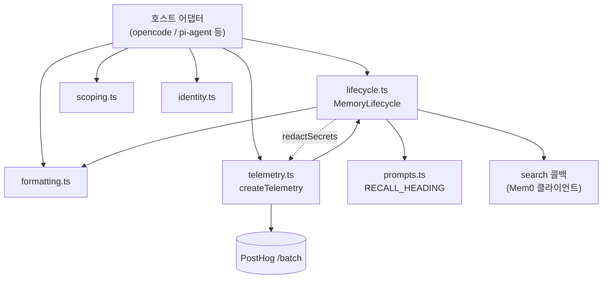
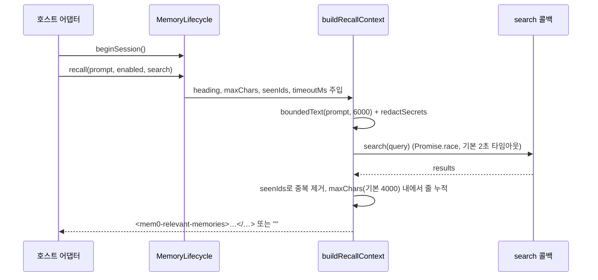
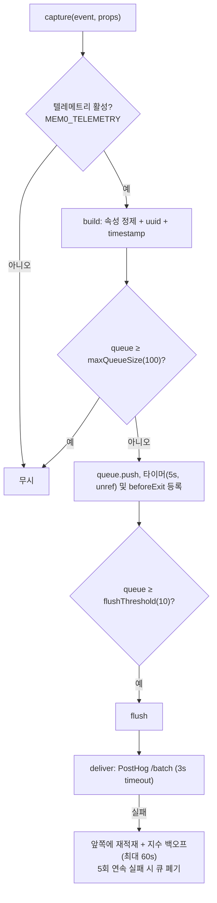

# agent_plugin_core_typescript

`integrations/agent-plugin-core/typescript` (패키지명 `@mem0/agent-plugin-core`, `private: true`, 버전 `0.0.0`)는 TypeScript로 작성된 코딩 에이전트 메모리 플러그인용 **공유 코어 라이브러리**입니다. 호스트별 어댑터(예: opencode, pi-agent 등)가 각자 구현하던 정책(비밀 마스킹, 회상(recall) 컨텍스트 생성, 엔티티/스코프 해석, 출력 포맷, 텔레메트리)을 한곳에 모아, 어댑터는 "호스트 네이티브 이벤트 → 이 코어의 연산" 변환만 담당하도록 합니다.

Python 쪽 대응물은 [agent_plugin_core_python](agent_plugin_core_python.md)이며, 빌드/적합성 검증은 [agent_plugin_core_build_conformance](agent_plugin_core_build_conformance.md)를 참고하세요. 텔레메트리의 재시도 정책은 Python 코어와 의도적으로 맞추거나 차이를 두었고, 그 근거가 코드 주석에 남아 있습니다.

## 1. 패키지 구성

| 파일 | 역할 | 주요 export |
|---|---|---|
| `src/prompts.ts` | 도구 설명/회상 제목 등 고정 문구 | `SEARCH_WHEN`, `SEARCH_TOOL_DESCRIPTION`, `RECALL_HEADING`, `USER_*` 변형 |
| `src/formatting.ts` | 메모리 목록·추가 결과의 텍스트 포맷, 출력 절단 | `formatAddResult`, `formatMemoryCompact`, `formatMemoryList`, `groupByCategory`, `truncateOutput`, `formatAge` |
| `src/identity.ts` | user/agent/run 엔티티 파라미터 정규화 | `entitySearchFilters`, `entityAddParams`, `parseProjectFromRemote` |
| `src/scoping.ts` | `project`/`session`/`global` 스코프 해석 및 검증 | `normalizeScope`, `resolveToolScope`, `scopeSearchFilters`, `scopeAddParams` |
| `src/lifecycle.ts` | 비밀 마스킹, 대화 추출, 회상 컨텍스트 빌드 | `redactSecrets`, `boundedText`, `extractConversation`, `createMemoryLifecycle`, `buildRecallContext` |
| `src/telemetry.ts` | PostHog 배치 텔레메트리(메모리 내 재시도) | `createTelemetry`, `isTelemetryEnabled`, `errorKind` |

빌드 설정(artifact 근거):

- `package.json`: ESM(`"type": "module"`), 스크립트 `test`(`node --test tests/*.test.ts`), `typecheck`(`tsc --noEmit`). 런타임 의존성은 없고 `@types/node`, `typescript`만 devDependency입니다.
- `tsconfig.json`: `ES2022`, `moduleResolution: bundler`, `strict`, `allowImportingTsExtensions`, `noEmit`. 번들링 없이 `.ts` 소스를 그대로 소비(`import ... from "./x.ts"`)하는 구조입니다.
- 테스트는 `tests/` 아래 `formatting|identity|lifecycle|prompts|scoping|telemetry.test.ts`가 있습니다.
- CI는 `.github/workflows/agent-plugins-typescript-checks.yml`에서 실행됩니다([root_ci_cd_pipeline](CI_CD_and_Repository_Governance.md) 참고).

## 2. 아키텍처



의존 방향은 단방향입니다: `telemetry → lifecycle → (formatting, prompts)`. `lifecycle.ts`의 `redactSecrets`가 텔레메트리 속성 정제에도 재사용되어, 비밀 마스킹 규칙이 한 곳에서만 관리됩니다.

## 3. 컴포넌트 상세

### 3.1 formatting.ts — `formatAddResult`

`add` 호출 결과(배열, `{results: []}` 객체, 단일 객체, `null`)를 사람이 읽는 문자열로 변환합니다.

- 항목 중 `status === "PENDING"`이 있으면 비동기 추출 대기 메시지(`eventId`/`event_id` 모두 허용)를 반환합니다.
- 결과가 비면 `"Memory stored."`, 아니면 `Stored N memory/memories:` + 번호 목록.
- 각 줄 형식: `[카테고리] 본문 (나이) [mem0:<id>]` (`formatMemoryCompact`). 카테고리가 없으면 `uncategorized`.
- `truncateOutput`은 기본 200줄 / 50,000자 한도(`MAX_OUTPUT_LINES`, `MAX_OUTPUT_CHARS`)를 넘으면 잘라내고 사유를 덧붙입니다.

### 3.2 identity.ts — `entitySearchFilters`, `entityAddParams`

같은 입력(`EntityParams`: `userId`, `agentId`, `runId`)에서 두 가지 키 규약을 만듭니다.

| 함수 | 용도 | 키 형식 |
|---|---|---|
| `entitySearchFilters` | 검색 필터 | `user_id`, `agent_id`, `run_id` (snake_case) |
| `entityAddParams` | 추가(add) 파라미터 | `userId`, `agentId`, `runId` (camelCase) |

공백뿐인 값은 `undefined`로 취급되며, `userId`가 비면 `defaultUserId`로 대체됩니다. `parseProjectFromRemote`는 git remote URL(`git@host:owner/repo.git` 또는 https)에서 `owner-repo` 형태의 프로젝트 이름을 뽑습니다.

### 3.3 scoping.ts

스코프에 따라 식별자 조합이 달라집니다.

| scope | 필수 컨텍스트 | 필터 |
|---|---|---|
| `global` | `userId` | `user_id` |
| `project` (기본) | `userId`, `appId` | `user_id`, `app_id` |
| `session` | `userId`, `appId`, `runId` | `user_id`, `app_id`, `run_id` |

- `normalizeScope`: 알 수 없는 값은 `project`로 폴백.
- `resolveToolScope`: 도구가 `global`을 요청해도 설정이 `global`이 아니면 예외를 던집니다(사용자가 명시적으로 허용해야 함).
- `validateContext`: 빈 문자열이거나 `*`만으로 이루어진 값은 와일드카드 누수 방지를 위해 `Invalid memory scope <key>`로 거부합니다.

### 3.4 lifecycle.ts — `MemoryLifecycle.recall`



핵심 동작:

- `createMemoryLifecycle(options)`가 `MemoryLifecycle` 인스턴스를 반환합니다. 인스턴스는 세션 내 `#seenMemoryIds`를 보관하여 같은 메모리가 반복 주입되지 않게 합니다. `beginSession()`이 이를 초기화합니다.
- `recall`은 `enabled=false`, 빈 쿼리, 타임아웃, 검색 오류, 새 메모리 없음 중 어느 경우에도 **예외 없이 빈 문자열**을 반환합니다(회상 실패가 에이전트 동작을 막지 않음).
- 출력은 `<mem0-relevant-memories>` 태그로 감싸고 제목(`RECALL_HEADING`)을 앞에 둡니다. 각 줄은 마스킹·공백 정규화되며, 첫 줄이 한도를 넘으면 `…`로 잘라 넣습니다.
- `redactSecrets`는 Authorization 헤더, API 키/토큰/비밀번호 키-값, `sk-`/`m0-`/`mem0_sk-` 접두 키, AWS(`AKIA`/`ASIA`), GitHub/Slack 토큰, PEM 개인키 블록을 `[REDACTED]`로 치환합니다.
- `extractConversation`은 `user`/`assistant` 역할의 텍스트(문자열 또는 `type: "text"` 블록 배열)만 남기고 마스킹합니다.
- `boundedText`는 마스킹 후 길이 제한을 적용하고 `...[truncated N chars]`를 붙입니다.

### 3.5 telemetry.ts — `createTelemetry`

`createTelemetry(config: TelemetryConfig)`는 `{ build, capture, flush, resetForTesting, queueForTesting }`를 반환합니다.



설계 포인트(코드 주석에 근거 명시):

- **프라이버시**: `PRIVATE_KEYS`(query, prompt, text, memory, path, userid, appid, filters 등)에 해당하는 키는 속성에서 제거하고, 문자열 값은 `redactSecrets`로 마스킹합니다. 이벤트는 `$process_person_profile: false`로 보냅니다.
- **옵트아웃**: 환경변수 `MEM0_TELEMETRY`가 `false|0|no|off`이면 비활성(`isTelemetryEnabled`). `config.enabled`로 덮어쓸 수 있습니다.
- **재시도는 메모리 내**: Python 코어는 훅이 별도 프로세스라 디스크 스풀을 쓰지만, 이 코어는 세션 내내 사는 호스트에 로드되므로 큐 재적재로 충분하다고 판단했습니다.
- **중복 방지**: 이벤트마다 캡처 시점에 `uuid`와 `timestamp`를 부여하여 재전송 시 PostHog에서 중복이 제거됩니다.
- **순서 정책**: 큐가 차면 새 이벤트를 버리고(백로그 보존), 재시도 배치는 큐 앞에 둡니다. 동시 `flush`는 `flushing` 플래그로 직렬화됩니다.
- **종료 처리**: `beforeExit`에서 한 번만 강제 flush(백오프 무시)하여 종료 지연을 제한합니다.
- `errorKind(error)`는 오류를 `timeout`/`auth`/`rate-limited`/`server-error`/`bad-request`/`network` 등 거친 분류로 바꿔 메시지 노출 없이 전송합니다.
- 어떤 예외도 플러그인 동작에 영향을 주지 않도록 `capture`와 `build`는 모두 try/catch로 감쌉니다.

## 4. 사용 예

```typescript
import { createMemoryLifecycle } from "./lifecycle.ts";
import { scopeSearchFilters } from "./scoping.ts";

const lifecycle = createMemoryLifecycle({ maxContextChars: 4000 });
lifecycle.beginSession();

const context = await lifecycle.recall(userPrompt, true, (query) =>
  mem0.search(query, { filters: scopeSearchFilters("project", scopeCtx) }),
);
```

## 5. 다른 모듈과의 관계

- 같은 정책의 Python 구현: [agent_plugin_core_python](agent_plugin_core_python.md) (`memory_core.py`, `telemetry.py`)
- 스키마/빌드/적합성 검증: [agent_plugin_core_build_conformance](agent_plugin_core_build_conformance.md)
- 이 코어를 소비하는 TS 호스트 플러그인: [opencode_plugin](Framework_and_Workflow-Tool_Integrations.md), [pi_agent_plugin](Framework_and_Workflow-Tool_Integrations.md)
- 호출 대상 메모리 API: [ts_hosted_client](TypeScript_SDK_Core_(Hosted_Client_and_OSS_Engine).md)

## 6. 유지보수 시 참고

- 새 비밀 패턴은 `SECRET_PATTERNS`에만 추가하면 회상·텔레메트리 양쪽에 적용됩니다.
- 텔레메트리 재시도 상수(`MAX_DELIVERY_ATTEMPTS`, `RETRY_BACKOFF_CEILING_MS`)를 바꿀 때는 Python 코어와의 정합성 주석을 함께 검토하세요.
- `src/`는 `.ts` 확장자 import를 사용하므로, 소비하는 번들러가 이를 지원해야 합니다.
