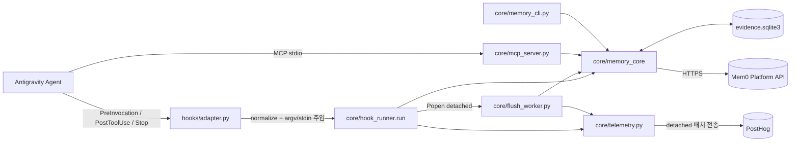
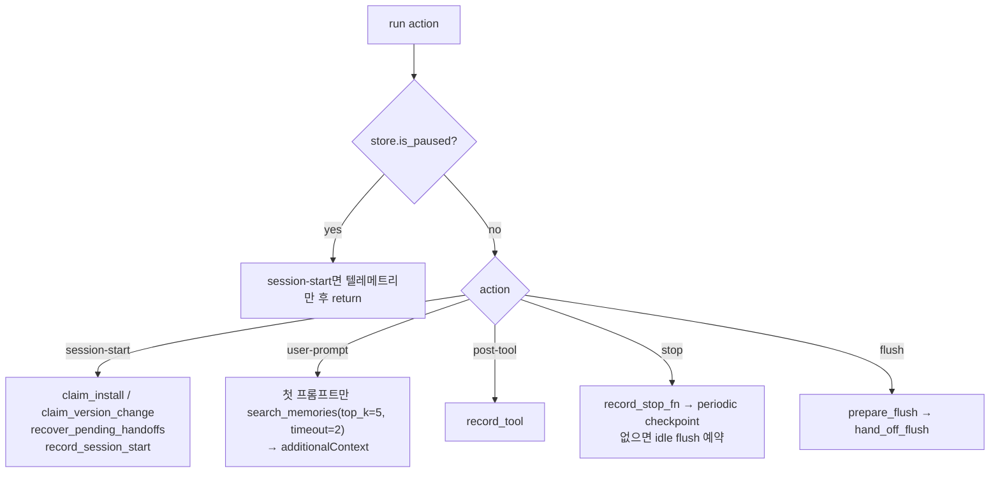
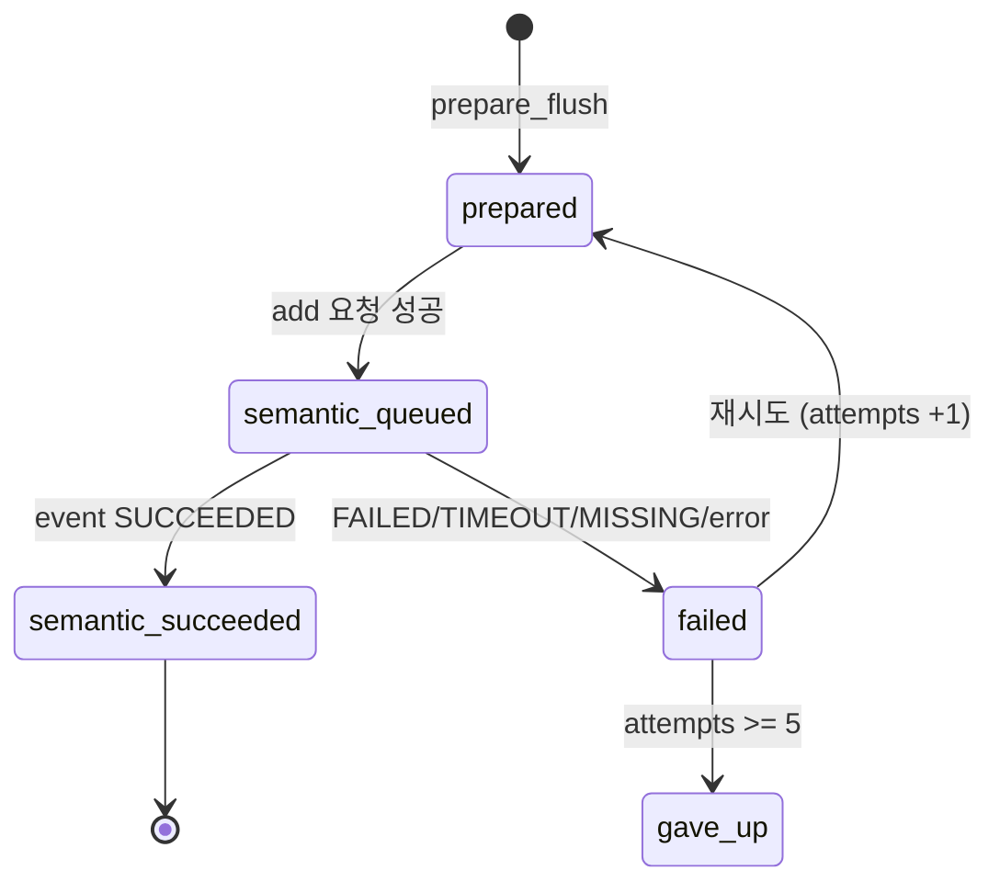
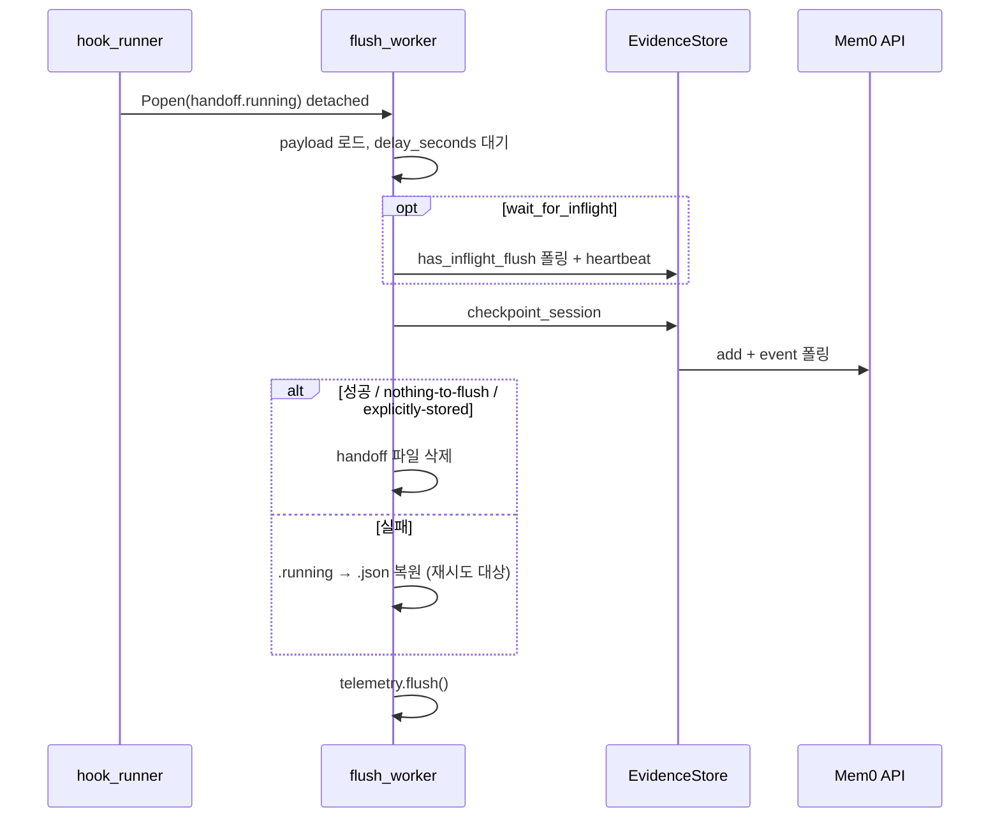

# antigravity_plugin 모듈

`integrations/antigravity-plugin`은 Google **Antigravity** 코딩 에이전트에 Mem0 장기 메모리를 붙이는 플러그인이다. Antigravity의 훅(`PreInvocation`, `PostToolUse`, `Stop`)을 공유 Mem0 런타임(`core/`)이 이해하는 형태로 변환하고, 세션 중 발생한 이벤트를 로컬 SQLite에 기록한 뒤 체크포인트 시점에 Mem0 플랫폼(`/v3/memories/add/`)으로 보내 메모리를 추출한다. 이후 작업에서는 첫 프롬프트 자동 검색과 MCP 도구 `search_memories`로 메모리를 되살린다.

> `core/*.py`는 [agent_plugin_core_python](agent_plugin_core_python.md)의 공유 소스를 빌드 시 복사한 것이며 [claude_code_plugin](claude_code_plugin.md), [codex_plugin](codex_plugin.md), [cursor_plugin](cursor_plugin.md), [kimi_plugin](kimi_plugin.md), [mem0_agent_plugin](mem0_agent_plugin.md)과 동일한 구조다. Antigravity 고유 코드는 `hooks/adapter.py`뿐이다. 빌드/검증은 [agent_plugin_core_build_conformance](agent_plugin_core_build_conformance.md)를 참고한다.

## 1. 파일 구성

| 파일 | 역할 |
|---|---|
| `hooks/adapter.py` | Antigravity 훅 페이로드 정규화, 트랜스크립트 파싱, 공유 `hook_runner.run` 호출 |
| `core/hook_runner.py` | 액션 디스패치(`session-start`, `user-prompt`, `post-tool`, `stop`, `flush`), 핸드오프 파일 관리 |
| `core/memory_core.py` | 저장소 식별, `EvidenceStore`(SQLite), 에피소드 구성, 플랫폼 API 호출, 검색/삭제/`doctor` |
| `core/flush_worker.py` | 분리(detached) 프로세스로 실행되는 원격 체크포인트 워커 |
| `core/mcp_server.py` | stdio JSON-RPC MCP 서버, 도구 `search_memories` 1개 노출 |
| `core/memory_cli.py` | `status`/`doctor`/`pause`/`resume`/`forget` 진단·제어 CLI |
| `core/telemetry.py` | 로컬 스풀 기반 PostHog 사용 텔레메트리 |

## 2. 아키텍처



## 3. 훅 어댑터 (`hooks/adapter.py`)

`main()`은 `argv[1]`로 이벤트명을 받고(`PreInvocation`/`PostToolUse`/`Stop` 외에는 종료코드 2), stdin JSON을 `normalize()`로 공유 형식에 맞춘다.

- `conversationId` → `session_id`, `workspacePaths[0]`(없으면 `MEM0_CWD`) → `cwd`, `transcriptPath` → `transcript_path`
- `toolCall.name/args` → `tool_name/tool_input`, `error` → `tool_response`
- 트랜스크립트(JSONL)에서 `status == "DONE"`인 `USER_INPUT`(`<USER_REQUEST>` 태그 내용)과 `PLANNER_RESPONSE`(source `MODEL`)를 읽어 마지막 사용자/어시스턴트 메시지를 `prompt`/`last_assistant_message`로 채운다. 모든 내용은 `redact`를 거친다.
- `cwd`를 알 수 없으면 아무 일도 하지 않고 빈 응답(`{"injectSteps": []}`, `{"decision": "allow"}`, `{}`)을 출력한다.

| Antigravity 이벤트 | 동작 | 출력 |
|---|---|---|
| `PreInvocation` (`invocationNum == 0`만) | `session-start` → `user-prompt` 실행, 첫 프롬프트 검색 결과를 추출 | `{"injectSteps":[{"ephemeralMessage": context}]}` |
| `PostToolUse` | `error` 있으면 `post-tool-failure`(`record_tool(failed=True)`), 없으면 `post-tool` | `{}` |
| `Stop` | `flush --reason session-end` | `{"decision":"allow"}` |

`_record_stop`은 기본 `default_record_stop` 대신 트랜스크립트 전체를 읽어, 이전 `assistant_stop` 이벤트에 저장된 `transcript_count` 오프셋 이후의 새 메시지만 `assistant_stop` 이벤트(`transcript_messages`)로 기록한다(`BEGIN IMMEDIATE`로 직렬화). 트랜스크립트가 비어 있으면 `default_record_stop`으로 폴백한다. `_run_shared`는 `sys.argv`/`sys.stdin`/stdout을 바꿔치기해 `hook_runner.run`을 프로세스 내부에서 호출한다. 최상위 예외는 `log_failure` 후 `{}` 출력, 종료코드 0으로 처리한다(훅은 항상 fail-open).

## 4. 훅 오케스트레이션 (`core/hook_runner.py`)



핵심 규칙:
- 첫 프롬프트에서만 검색하며, 프롬프트 길이가 `MEM0_CODE_MIN_QUERY_CHARS`(기본 20) 미만이면 건너뛴다. 결과는 `format_context`로 4000자(설정 1000–10000) 이내로 포맷된다.
- **핸드오프**: 훅은 입력을 `data_dir()/pending/*.json`에 원자적으로 기록한 뒤 `.running`으로 이름을 바꾸고 `flush_worker.py`를 `detached_process_kwargs()`(POSIX `start_new_session`, Windows `DETACHED_PROCESS`)로 실행한다. 훅이 종료 중 취소되어도 작업이 유지된다.
- `recover_pending_handoffs`: 300초 넘게 갱신 없는 `.running`을 `.json`으로 되돌리고, 7일 넘은 것은 삭제, 오래된 순으로 최대 5개 재실행.
- `schedule_periodic_checkpoint`(교환 5회/메시지 10개/원문 40000자 도달 시) 와 `schedule_idle_flush`(`MEM0_CODE_IDLE_FLUSH_SECONDS`, 기본 300초 지연 후 flush)가 `stop`에서 동작한다. `MEM0_CODE_AUTO_FLUSH=false`로 자동 flush를 끌 수 있다.
- `MEM0_CODE_SYNC_FLUSH=1`이면 핸드오프 없이 동기 실행한다. 이미 진행 중인 flush가 있는 `session-end`는 `wait_for_inflight=True`로 넘긴다.

## 5. 핵심 코어 (`core/memory_core.py`)

### 저장소/스코프 식별
`resolve_repo`는 git remote(정규화)로 `identity`를, 없으면 `local:<root>`를 만든다. `app_id`(레거시 프로젝트 이름), `project_id`(호스트 해시 포함 공유 네임스페이스), `directory`(루트 기준 상대 경로)를 가진 `RepoContext`를 반환한다. `directory_app_id`는 `repo/path` 형태를 만든다. `*` 와일드카드 ID는 `_scope_value`가 거부한다.

### EvidenceStore (SQLite, WAL)
테이블: `events`, `session_scopes`, `flushes`, `retrievals`, `operations`, `sidekick_runs`(서브에이전트 실행), `settings`. 데이터베이스가 손상되면 `_quarantine`으로 `.corrupt-<ts>`로 옮기고 다시 만든다.



`prepare_flush`는 아직 flush되지 않은 이벤트를 `select_checkpoint_events`로 한 블록 고르고 `packet_id`(sha256)로 멱등하게 묶는다. 실패 상태의 기존 패킷은 이벤트를 재사용해 재개한다.

### 플러시와 검색
- `flush_session`: `build_episode`로 구조화 에피소드를 만들고 `build_extraction_messages`로 user/assistant 메시지를 구성, `extraction_message_batches`로 24000 토큰 예산에 맞춰 분할한다. `POST /v3/memories/add/`에 `agent_id=project_id`, `user_id`, `app_id`, `run_id=session_id`, `infer=True`, 프로젝트/개인용 `custom_instructions`, 5개 `custom_categories`(`project_knowledge`, `decisions_and_constraints`, `workflows`, `problems_and_fixes`, `results`)를 보낸다. 반환된 `event_id`는 `/v1/event/{id}/`를 폴링(`MEM0_CODE_EXTRACTION_WAIT_SECONDS` 기본 120초)해 완료를 확인한다.
- `search_memories`: `/v3/memories/search/`, 필터는 `repo`(공유+개인, 기본), `dir`(디렉터리 한정), `mine`(개인) 스코프를 `_search_filters`가 조합한다. `task_episode` 레코드는 제외하고, 세션 내 이미 보여준 메모리는 `unseen`/`mark_injected`로 중복을 막는다.
- `record_subagent_start`는 메인 대화에 주입된 메모리를 서브에이전트에 한 번만 재사용 전달한다.
- `forget_remote_repo`: 사용자 메모리(옵션으로 프로젝트 공유 메모리)를 페이지 조회 후 삭제.
- `doctor`: Python ≥ 3.10, 데이터 디렉터리 쓰기, API 키, 저장소, user_id, 인증(읽기 전용 검색 1회) 점검.

### 보안/프라이버시
`redact`가 Authorization 헤더, API 키, 토큰, AWS/GitHub/Slack 키, PEM 개인키, JSON 비밀 필드를 `[REDACTED]`로 치환한다. 모든 저장 텍스트는 `bounded`로 길이가 제한된다. API 키는 `cache_plugin_api_key`가 `0600` 권한 `api-key` 파일로 원자적 저장하고, 키 원천이 사라지면 `clear_stale_api_key_cache`가 삭제한다. 요청에는 `X-Mem0-Source`, `X-Mem0-Client`(`mem0-plugin/<PLUGIN_VERSION>`) 헤더가 붙는다.

### 하네스 설정
`configure_harness(name, env_prefix, data_dir_name, source_tag)`가 전역 값을 설정한다. 어댑터는 `configure_harness("antigravity", data_dir_name="antigravity-plugin", source_tag="antigravity_plugin")`를 호출하므로 데이터는 기본적으로 `~/.mem0/antigravity-plugin`에 저장된다(`MEM0_CODE_DATA_DIR` 등으로 재정의).

## 6. 플러시 워커 (`core/flush_worker.py`)



`touch_handoff_heartbeat`가 파일 mtime을 갱신해 복구 로직이 살아 있는 워커를 중복 실행하지 않게 한다. 지연 flush 중 핸드오프 파일이 사라지면(다른 flush가 대체) 조용히 종료한다.

## 7. MCP 서버 (`core/mcp_server.py`)

stdin 한 줄당 JSON-RPC 메시지를 처리한다(`initialize`, `ping`, `tools/list`, `tools/call`). 도구 `search_memories`의 입력: `query`(1–2000자, 필수), `top_k`(1–20), `category`, `scope`(`repo`/`dir`/`mine`), `run_id`. `ToolInputError`는 `isError` 응답으로, 기타 예외는 "Memory search failed."로 돌려준다. 읽기 전용·멱등 어노테이션이 붙는다. 종료 시 `telemetry.spawn_flush()`를 호출한다.

## 8. 진단 CLI (`core/memory_cli.py`)

```
python3 memory_cli.py [--plugin-data-dir DIR] [--harness NAME] <command>
  status [--json]   doctor [--json]   pause   resume
  forget --yes [--remote] [--include-project-memory]
```
`pause`는 `settings.paused`를 true로 하여 훅이 저장·검색을 모두 중단하게 한다. `forget`은 `--yes` 없이는 거부(종료코드 2)하며, 로컬 데이터 삭제 후 `--remote`일 때 원격 메모리도 삭제한다.

## 9. 텔레메트리 (`core/telemetry.py`)

- `record()`는 네트워크를 쓰지 않고 `telemetry.jsonl` 스풀(최대 256KB)에 한 줄을 추가할 뿐이다. 전송은 분리된 `python3 telemetry.py`(`spawn_flush`)가 PostHog 배치(100건)로 수행한다.
- `MEM0_TELEMETRY=false`(또는 0/no/off)로 비활성화한다.
- 프롬프트·메모리 텍스트·경로·저장소명·API 키는 보내지 않는다(`_PRIVATE_KEYS` 필터). 저장소/세션 ID는 설치별 랜덤 salt로 해시(`repo_hash`, `session_hash`)하며 salt를 저장하지 못하면 해시를 생략한다.
- 신원: API 키가 있으면 `/v1/ping/`으로 계정 이메일을 해석, 없으면 `code-anon-*` 익명 ID. 키가 바뀌면 익명 ID를 회전해 계정 오귀속을 막는다.
- `claim_install`/`claim_version_change`는 `O_CREAT|O_EXCL` 마커(`install-state.json`, `upgraded-<version>`)로 `install`/`upgrade` 이벤트를 세션 동시 시작에서도 한 번만 기록한다.
- 스풀은 `.sending` 클레임 파일로 원자적으로 인수되며, 실패 시 남은 부분만 재기록하고 시도 횟수(최대 3회)와 쿨다운을 파일명/mtime에 담아 재시도한다. 복구 불가능한 파일은 `.corrupt`로 격리, 7일 후 정리한다.

## 10. 주요 환경 변수

| 변수 | 의미 |
|---|---|
| `MEM0_API_KEY` | API 키(`PLUGIN_OPTION_API_KEY` 등도 인식) |
| `MEM0_API_URL` | 기본 `https://api.mem0.ai` |
| `MEM0_CODE_DATA_DIR` / `MEM0_PLUGIN_DATA_DIR` | 데이터 디렉터리 |
| `MEM0_CODE_AUTO_FLUSH`, `MEM0_CODE_SYNC_FLUSH`, `MEM0_CODE_IDLE_FLUSH_SECONDS` | flush 동작 제어 |
| `MEM0_CODE_SEARCH_SCOPE`, `MEM0_CODE_TOP_K`, `MEM0_CODE_MAX_CONTEXT_CHARS`, `MEM0_CODE_MIN_QUERY_CHARS` | 검색/컨텍스트 |
| `MEM0_CODE_EXTRACTION_WAIT_SECONDS`, `MEM0_CODE_EVENT_POLL_SECONDS` | 추출 이벤트 대기 |
| `MEM0_USER_ID`, `MEM0_CODE_USER_ID` | 사용자 스코프(미설정 시 `USER`) |
| `MEM0_TELEMETRY` | 텔레메트리 on/off |

## 11. 설계 포인트

- **Fail-open**: 훅/MCP 오류가 에이전트를 막지 않는다(예외는 `plugin-errors.log`에 기록, 종료코드 0).
- **Detached 처리**: 3–6초 훅 예산 안에서 네트워크 작업을 하지 않고 로컬 기록 + 핸드오프로 분리한다.
- **멱등/재개**: `packet_id`, 이벤트 ID 목록(`semantic_event_id` JSON)으로 중단된 flush를 이어간다.
- **스코프 격리**: 저장소(`app_id`, `agent_id=project_id`)와 사용자(`user_id`) 레인을 분리하여 공유 지식과 개인 선호를 따로 다룬다.
