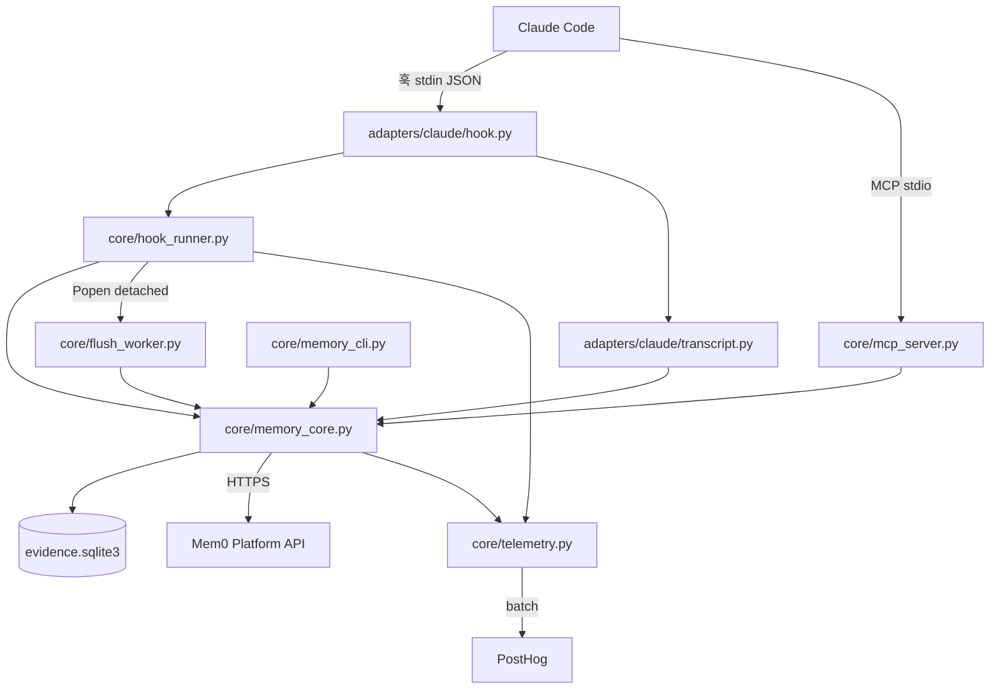
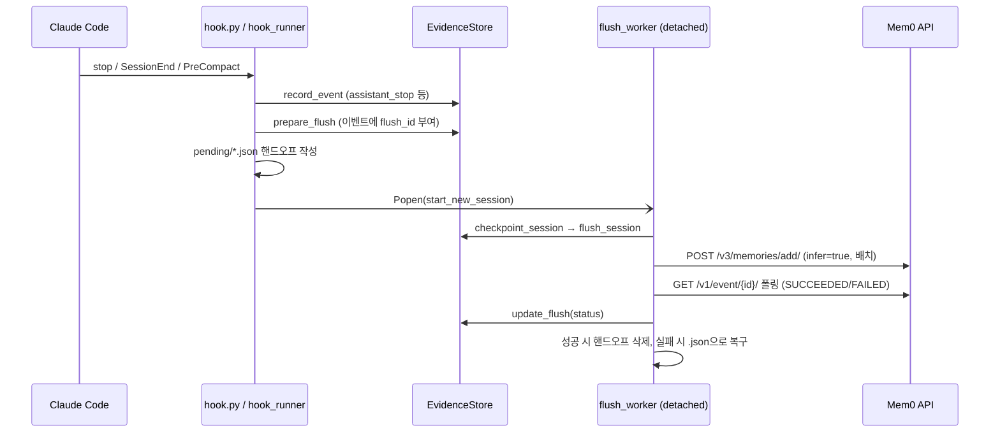

# claude_code_plugin 모듈

`integrations/claude-code-plugin`은 Claude Code 세션에서 일어나는 일을 로컬에 기록하고, 세션이 끝나거나 압축될 때 유용한 부분만 Mem0 플랫폼(`/v3/memories/add/`)으로 보내 메모리를 만들고, 이후 작업에서 검색(`search_memories`)해 주입하는 **Claude Code 전용 메모리 플러그인**입니다. 공유 코어(`core/`)와 Claude 전용 어댑터(`adapters/claude/`)로 구성됩니다.

공유 코어는 다른 하니스 플러그인과 같은 소스에서 빌드된 복사본입니다. 공통 원본은 [agent_plugin_core_python](agent_plugin_core_python.md)이고, 빌드와 적합성 검증은 [agent_plugin_core_build_conformance](agent_plugin_core_build_conformance.md)를 참고하세요. 형제 플러그인: [codex_plugin](codex_plugin.md), [cursor_plugin](cursor_plugin.md), [kimi_plugin](kimi_plugin.md), [antigravity_plugin](antigravity_plugin.md), [mem0_agent_plugin](mem0_agent_plugin.md).

## 1. 구성 요소

| 파일 | 역할 |
|---|---|
| `adapters/claude/hook.py` | Claude Code 훅 진입점. `configure_harness("claude-code", ...)` 후 `hook_runner.entry_point` 호출. `_sidekick_start`/`_sidekick_stop` 추가 액션 정의 |
| `adapters/claude/transcript.py` | Claude 트랜스크립트(JSONL) 파싱. `record_stop`이 `assistant_stop` 이벤트를 기록 |
| `core/hook_runner.py` | 훅 액션 디스패처(`run`), 핸드오프 파일 관리, 주기/유휴 플러시 스케줄링 |
| `core/memory_core.py` | `EvidenceStore`(SQLite), 저장소 식별, 비밀 마스킹, 플러시/검색/삭제/doctor |
| `core/flush_worker.py` | 분리(detached) 프로세스로 원격 체크포인트 수행 |
| `core/mcp_server.py` | stdio JSON-RPC MCP 서버. 도구 `search_memories` 하나 노출 |
| `core/memory_cli.py` | `status`/`doctor`/`pause`/`resume`/`forget` 사용자 제어 |
| `core/telemetry.py` | 로컬 스풀 기반 PostHog 텔레메트리 |

## 2. 아키텍처

`hook.py`는 `sys.path`에 번들된 `core`(없으면 `core/python`)를 삽입해 import하고, `telemetry.init(harness="claude-code", source_tag="CLAUDE_CODE_PLUGIN")`로 식별자를 설정합니다. 데이터 디렉터리는 `MEM0_CODE_DATA_DIR` 등으로 지정하며 기본값은 `~/.mem0/claude-code-plugin`입니다.

## 3. 훅 액션

`hook_runner.run`이 받는 액션: `session-start`, `user-prompt`, `post-tool`, `stop`, `flush` + Claude 추가 액션 `post-tool-failure`, `sidekick-start`, `sidekick-stop`.

| 액션 | 동작 |
|---|---|
| `session-start` | API 키 캐시 정리, install/upgrade 이벤트 claim, 미완료 핸드오프 복구(`recover_pending_handoffs`), `session_start` 이벤트 기록 |
| `user-prompt` | 프롬프트 기록. 세션 첫 프롬프트이고 길이가 `MEM0_CODE_MIN_QUERY_CHARS`(기본 20) 이상이면 top_k=5 검색 후 `UserPromptSubmit`의 `additionalContext`로 주입 |
| `post-tool` / `post-tool-failure` | `record_tool`로 도구 호출 요약(명령은 test/build/shell 분류, 결과는 길이 제한) 기록 |
| `stop` | `record_stop`(트랜스크립트 파싱) 후 주기 체크포인트 또는 유휴 플러시 예약 |
| `flush` | `session-end`/`pre-compact` 등에서 핸드오프 생성 후 분리 워커 실행 |
| `sidekick-start/stop` | `mem0:sidekick` 서브에이전트 시작 시 메인 대화에 이미 주입된 메모리를 재사용해 컨텍스트 제공, 종료 시 최종 메시지 기록 |

모든 예외는 `entry_point`에서 `plugin-errors.log`에 기록하고 exit 0으로 종료합니다(훅은 실패해도 에이전트를 막지 않음).

## 4. 메모리 쓰기 흐름 (플러시)

핵심 설계:

- **분리 워커**: SessionEnd 훅이 print 모드 종료 시 취소될 수 있어, 입력을 먼저 `pending/`에 저장하고 새 세션 프로세스에서 전송합니다(`detached_process_kwargs`가 POSIX/Windows 차이 처리). `.running` 파일이 300초(`STALE_RUNNING_SECONDS`) 넘게 갱신되지 않으면 재시작 시 복구되며, 7일이 지난 핸드오프는 삭제됩니다.
- **체크포인트 단위**(`select_checkpoint_events`): 완료된 교환 5개, 메시지 10개, 원문 40,000자 중 하나에 도달하면 주기 플러시. 세션 종료 시에는 강제(force).
- **재시도**: `flushes` 테이블의 `attempts`가 `MAX_FLUSH_ATTEMPTS`(5)에 도달하면 `gave-up`. 이미 큐잉된 `semantic_event_id`는 재사용해 중복 전송을 피합니다.
- **토큰 예산**: `extraction_message_batches`가 24,000 토큰 추정치 단위로 교환(exchange)을 유지하며 분할합니다.
- **유휴 플러시**: `MEM0_CODE_IDLE_FLUSH_SECONDS`(기본 300) 지연 후 실행. 자동 플러시는 `MEM0_CODE_AUTO_FLUSH`로 끌 수 있습니다.
- **쓰기 범위**: `agent_id`=project_id(공유 저장소 레인), `user_id`, `app_id`(저장소 이름), `run_id`=세션. `metadata.dirs`에 디렉터리 체인 저장. 저장소용(`PROJECT_MEMORY_INSTRUCTIONS`)과 개인용(`PERSONAL_MEMORY_INSTRUCTIONS`) 지침 및 5개 `CODING_MEMORY_CATEGORIES` 사용.
- 와일드카드(`*`) 식별자는 `_scope_value`가 거부해 범위 확장을 방지합니다.

## 5. 트랜스크립트 파싱 (`transcript.py`)

`record_stop`은 이전 `assistant_stop`의 `transcript_offset`/`transcript_leaf_uuid`를 이어받아 증분 파싱합니다.

1. `_transcript_rows`: 바이트 오프셋부터 완결된 줄만 읽고 `uuid`가 있는 행만 수집.
2. `_active_transcript_chain`: 사이드체인이 아닌 최신 leaf에서 `parentUuid`를 따라 현재 대화 분기 복원.
3. `transcript_extraction_messages`: 사람 프롬프트, 어시스턴트 텍스트, `Agent` 서브에이전트 지시/응답, `AskUserQuestion` 답변, `ExitPlanMode` 승인 계획만 추출. 시스템 리마인더·로컬 명령 래퍼는 제외. 최종 응답에는 `Main Claude response:` 라벨.
4. 모든 텍스트는 `redact`를 거칩니다.

## 6. 메모리 읽기 (검색)

`search_memories`는 `/v3/memories/search/`를 `rerank=false`, `latest_only=true`로 호출합니다. 범위(`SEARCH_SCOPES`):

| scope | 대상 |
|---|---|
| `repo`(기본) | 저장소 공유 메모리 + 내 개인 메모리 |
| `dir` | 공유 부분을 현재 디렉터리(`metadata.dirs`)로 제한 |
| `mine` | 개인 메모리만 |

`category`, `run_id`는 필터에 AND로 추가됩니다. 세션 내 이미 주입한 메모리는 `retrievals` 테이블로 중복 제거하며, `task_episode` 레코드는 제외합니다. 컨텍스트는 `format_context`가 `max_context_chars`(기본 4000, 1000~10000)로 자릅니다. 네트워크 오류는 한 번 재시도합니다.

MCP 서버(`mcp_server.py`)는 `initialize`, `ping`, `tools/list`, `tools/call`을 처리하고, 인자(`query` ≤2000자, `top_k` 1~20, `category`, `scope`, `run_id`)를 엄격히 검증합니다. 도구는 read-only/idempotent 주석이 붙습니다.

## 7. 로컬 저장소 `EvidenceStore`

SQLite(WAL, busy_timeout 10s). 손상 시 `.corrupt-<ts>`로 격리 후 재생성합니다.

| 테이블 | 용도 |
|---|---|
| `events` | 세션 이벤트(`flush_id`로 플러시 패킷에 귀속) |
| `session_scopes` | 세션별 저장소 범위 고정 |
| `flushes` | 패킷 상태·시도 횟수·`semantic_event_id` |
| `retrievals` | 주입된 메모리(중복 방지, 서브에이전트 재사용) |
| `operations` | 작업 지표(상태 표시용) |
| `sidekick_runs` | 서브에이전트 실행 |
| `settings` | `paused` 등 |

## 8. 사용자 제어 (`memory_cli.py`)

- `status [--json]`: 일시정지 여부, 저장소, 로컬 통계, 마지막 작업.
- `doctor [--json]`: Python≥3.10, 데이터 디렉터리 쓰기, API 키, 저장소, user_id, 인증(읽기 전용 검색 1회). 실패 시 exit 1.
- `pause` / `resume`: `paused` 설정. 일시정지 시 훅은 기록·검색 없이 종료.
- `forget --yes [--remote] [--include-project-memory]`: 로컬 데이터 삭제, `--remote`면 해당 사용자·저장소 메모리 삭제(공유 프로젝트 메모리는 명시 요청 시에만).

## 9. 보안·프라이버시

- `SECRET_PATTERNS`로 Authorization, API 키, 토큰, 비밀번호, AWS/GitHub/Slack 키, 개인키, JSON 값을 `[REDACTED]` 처리.
- API 키는 `MEM0_API_KEY` 또는 호스트의 `PLUGIN_OPTION_*`에서 읽고, 훅 전용 설정은 `api-key` 파일(0600)에 캐시. 모든 소스가 사라지면 `clear_stale_api_key_cache`가 삭제.
- 요청 헤더: `Authorization: Token`, `X-Mem0-Source`, `X-Mem0-Client`(`mem0-plugin/<PLUGIN_VERSION>`), 선택적 `X-Application`.
- 텔레메트리: `MEM0_TELEMETRY=false`로 비활성화. 프롬프트, 메모리 텍스트, 쿼리, 경로, 키는 전송하지 않으며(`_PRIVATE_KEYS` 필터), 저장소/세션은 설치별 랜덤 salt로 해시합니다. `record`는 네트워크 없이 `telemetry.jsonl`에 한 줄 추가만 하고, 분리된 `telemetry.py`가 PostHog에 배치 전송합니다. 클레임 파일(`.sending`)로 단일 송신자 보장, 시도 3회 초과 시 폐기, 설치/업그레이드 이벤트는 `O_EXCL` 마커로 1회만 기록합니다.

## 10. 주요 환경 변수

`MEM0_API_KEY`, `MEM0_API_URL`, `MEM0_CODE_DATA_DIR`, `MEM0_CODE_USER_ID`, `MEM0_CODE_TOP_K`, `MEM0_CODE_SEARCH_SCOPE`, `MEM0_CODE_SEARCH_ONCE_PER_SESSION`, `MEM0_CODE_MAX_CONTEXT_CHARS`, `MEM0_CODE_MIN_QUERY_CHARS`, `MEM0_CODE_AUTO_FLUSH`, `MEM0_CODE_IDLE_FLUSH_SECONDS`, `MEM0_CODE_SYNC_FLUSH`, `MEM0_CODE_EXTRACTION_WAIT_SECONDS`, `MEM0_CODE_EVENT_POLL_SECONDS`, `MEM0_TELEMETRY`.

## 11. 빌드·CI

- 공유 코어의 단일 원본은 `integrations/agent-plugin-core/python`이며, 빌드가 `core/`와 호스트별 `_harness_id.py`를 생성합니다. 스키마: `agent-plugin-core/build/schemas/plugin.schema.json`, `mcp.schema.json`. 마켓플레이스 등록은 `marketplace.json`.
- CI: `.github/workflows/agent-plugins-python-checks.yml`(ci-gate의 `agent-plugins-python` 잡에서 호출). 자세한 내용은 [integrations_ci_cd](integrations_ci_cd.md), [root_ci_cd_pipeline](root_ci_cd_pipeline.md) 참고.
- 내부적으로 `core/` 파일은 형제 플러그인과 거의 동일하므로 수정은 원본에서 하고 재빌드하세요(`antigravity`, `codex` 등에는 `_collect_memory_ids`·`combine_context`가 이미 반영됨).

## 12. Mem0 SDK와의 관계

이 플러그인은 `mem0ai` SDK를 사용하지 않고 stdlib `urllib`로 호스티드 플랫폼 REST API를 직접 호출합니다(의존성 없음, 훅 시간 제한 내 동작). 동일 API의 SDK 구현은 [py_hosted_client](py_hosted_client.md)와 [ts_hosted_client](ts_hosted_client.md)를 참고하세요.
