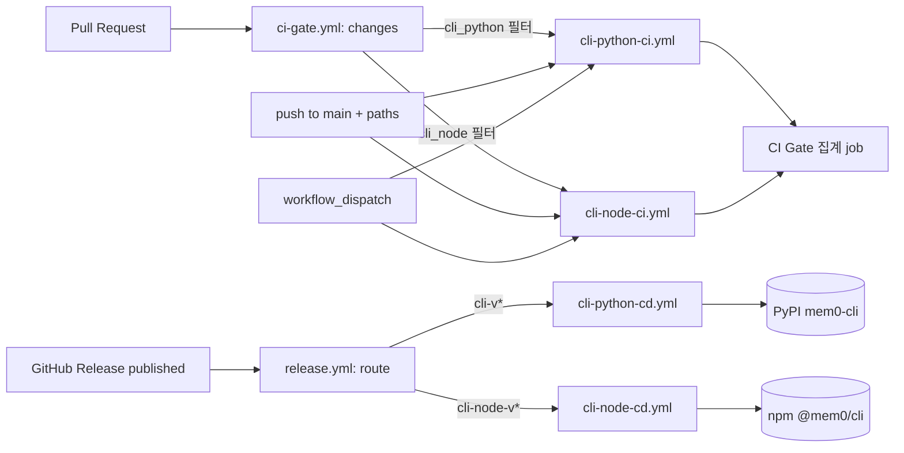
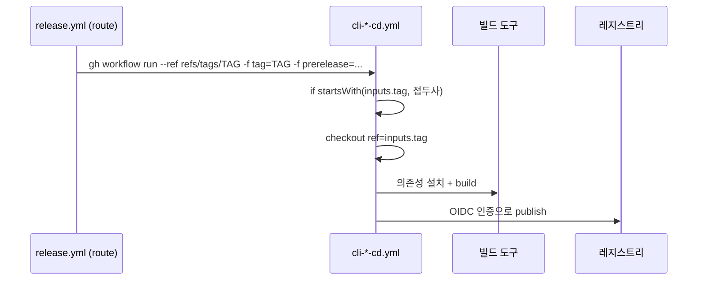
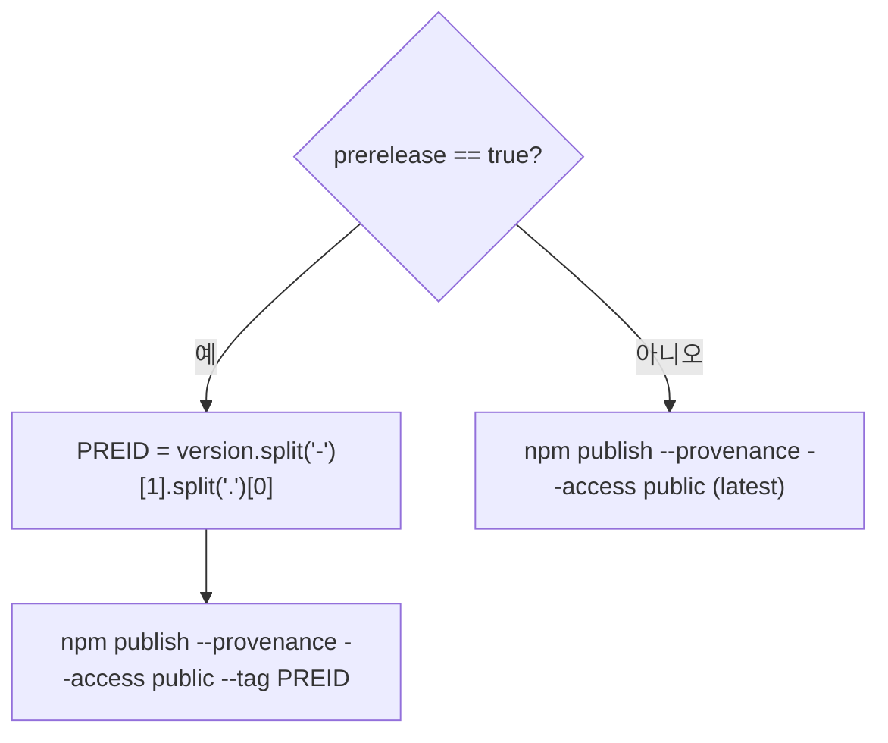
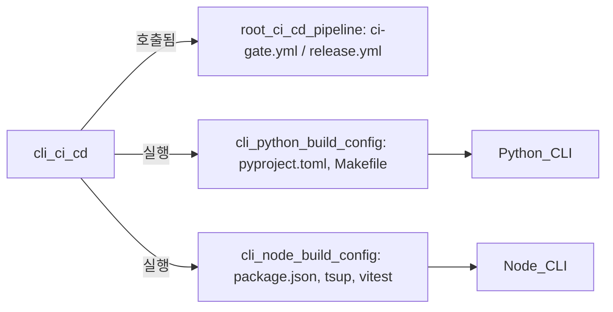

# cli_ci_cd 모듈

`cli_ci_cd`는 mem0의 두 CLI 패키지, 즉 Python CLI(`mem0-cli`, PyPI)와 Node CLI(`@mem0/cli`, npm)의 **CI(검증)와 CD(배포) GitHub Actions 워크플로우** 네 개를 담당한다.

| 파일 | 역할 | 대상 패키지 |
|------|------|-------------|
| `.github/workflows/cli-python-ci.yml` | lint / test / build 검증 | `cli/python` |
| `.github/workflows/cli-python-cd.yml` | 빌드 후 PyPI 배포 | `mem0-cli` |
| `.github/workflows/cli-node-ci.yml` | lint+typecheck / test / build 검증 | `cli/node` |
| `.github/workflows/cli-node-cd.yml` | 빌드 후 npm 배포 | `@mem0/cli` |

상위 모듈은 CI_CD_and_Repository_Governance이며, 형제 모듈은 [root_ci_cd_pipeline](root_ci_cd_pipeline.md)(ci-gate, release 라우터), [repo_governance_workflows](repo_governance_workflows.md), [integrations_ci_cd](integrations_ci_cd.md)이다. 검증 대상 CLI 코드는 [Python_CLI](Python_CLI.md)와 [Node_CLI](Node_CLI.md), 빌드 설정은 [cli_python_build_config](cli_python_build_config.md)와 [cli_node_build_config](cli_node_build_config.md)를 참고한다.

---

## 1. 아키텍처 개요

CI는 `ci-gate.yml`이 호출하는 **재사용 워크플로우(`workflow_call`)**이고, CD는 `release.yml`(Release Router)이 **`workflow_dispatch`로 디스패치**하는 워크플로우다. 두 CLI 모두 같은 구조를 따른다.



### 설계 원칙
- **PR용 `pull_request` 트리거가 없다.** PR 검증은 `ci-gate.yml`의 경로 필터(`cli/python/**`, `cli/node/**`, 해당 워크플로우 파일, `ci-gate.yml`)가 결정한다. 변경이 없으면 해당 파이프라인은 skip되며, 게이트는 skip을 통과로 처리한다.
- **CD는 태그 접두사로 라우팅**된다. `release.yml`은 구체적인 접두사를 먼저 매칭하며 `cli-node-v*` → `cli-node-cd.yml`, `cli-v*` → `cli-python-cd.yml`이다. 각 CD의 `if: startsWith(inputs.tag, ...)`가 잘못된 태그의 이중 방어선 역할을 한다.
- **OIDC trusted publishing**을 사용한다. 두 CD 모두 `permissions: id-token: write`만 있고 토큰/시크릿이 없다. 레지스트리의 trusted publisher 설정은 **워크플로우 파일명**에 묶여 있으므로 파일명을 바꾸면 배포가 깨진다.

---

## 2. CI 워크플로우

### 2.1 `cli-python-ci.yml` (CLI Python CI)

트리거: `workflow_dispatch`, `workflow_call`, `push`(main, `cli/python/**` 및 자기 자신 변경 시).

```mermaid
flowchart TD
    subgraph lint[lint · Python 3.12]
        L1[pip install -e .\[dev\]] --> L2[ruff check .] --> L3[ruff format --check .]
    end
    subgraph test[test · matrix 3.10 / 3.11 / 3.12]
        T1[pip install -e .\[dev\]] --> T2[pytest]
    end
    subgraph build[build · Python 3.12]
        B1[pip install hatch] --> B2[hatch build --clean] --> B3[dist/*.whl, *.tar.gz 존재 검증]
    end
```

| job | 핵심 단계 | 비고 |
|-----|-----------|------|
| `lint` | `ruff check .`, `ruff format --check .` | `cli/python`의 line length는 100(루트 120과 다름) |
| `test` | `pytest` | 3.10 이상이 CLI의 최소 버전 |
| `build` | `hatch build --clean` 후 wheel·sdist 존재 확인 | 산출물이 없으면 실패 |

세 job은 서로 `needs`가 없어 병렬 실행된다. 로컬 대응 명령은 `cli/python/Makefile`(`lint`, `format`, `test`, `build`)에 있다.

### 2.2 `cli-node-ci.yml` (CLI Node CI)

트리거는 Python과 동일하되 경로가 `cli/node/**`이다.

| job | Node | 핵심 단계 |
|-----|------|-----------|
| `lint` | 20 | `pnpm install --frozen-lockfile` → `pnpm run lint`(Biome) → `pnpm run typecheck` |
| `test` | matrix 20, 22 | `pnpm run test`(vitest) |
| `build` | 20 | `pnpm run build`(tsup) → `cli/node/dist/index.js` 존재 검증 |

모든 job은 pnpm 10(`pnpm/action-setup@v4`)과 `cache-dependency-path: cli/node/pnpm-lock.yaml`을 쓴다. 이 저장소는 TypeScript 패키지에서 pnpm만 허용한다.

---

## 3. CD 워크플로우

두 CD 모두 `workflow_dispatch` 전용이며 입력은 `tag`(필수), `prerelease`(선택, 기본 false)이다. 체크아웃은 `ref: ${{ inputs.tag }}`로 **태그된 커밋 그대로** 빌드하며, 이것이 provenance의 근거가 된다.



### 3.1 `cli-python-cd.yml` → PyPI `mem0-cli`
- 가드: `startsWith(inputs.tag, 'cli-v')`, 작업 디렉터리 `cli/python`.
- Python 3.11 + `pip install hatch` → `hatch build --clean` → `pypa/gh-action-pypi-publish@release/v1` (`packages-dir: cli/python/dist/`).
- `prerelease` 입력은 **사용되지 않는다**. PyPI는 프리릴리스를 버전 문자열(예: `0.2.0rc1`)로 표현하며, 이 입력은 라우터 인터페이스 통일을 위해서만 받는다.

### 3.2 `cli-node-cd.yml` → npm `@mem0/cli`
- 가드: `startsWith(inputs.tag, 'cli-node-v')`, 작업 디렉터리 `cli/node`.
- pnpm 10 + Node 22(`registry-url: https://registry.npmjs.org`) → `pnpm install --frozen-lockfile` → `pnpm run build`.
- 게시는 `npx npm@latest publish --provenance --access public`이며(OIDC 지원을 위해 최신 npm 사용), `prerelease=true`이면 `package.json`의 버전에서 preid를 추출해 dist-tag로 쓴다.



예를 들어 버전이 `0.2.0-beta.1`이면 `beta` dist-tag로 게시되어 `latest`를 덮어쓰지 않는다. `prerelease=true`인데 버전에 `-`가 없으면 `split('-')[1]`이 `undefined`가 되어 스크립트가 실패하므로, 프리릴리스 태그는 반드시 버전에 preid를 포함해야 한다.

---

## 4. 운영 가이드

| 상황 | 방법 |
|------|------|
| Python CLI 릴리스 | `cli-v0.2.0` 태그로 GitHub Release 발행 → 라우터가 `cli-python-cd.yml` 디스패치 |
| Node CLI 릴리스 | `cli-node-v0.2.0` 태그로 Release 발행 → `cli-node-cd.yml` 디스패치 |
| 재배포 | Release를 지우지 말고 `gh workflow run cli-node-cd.yml --ref refs/tags/<tag> -f tag=<tag>` (Python은 `cli-python-cd.yml`) |
| 접두사 주의 | Python CLI는 `cli-v*`, Node CLI는 `cli-node-v*`. 둘은 서로 다르며 라우터가 `cli-node-v*`를 먼저 매칭한다 |
| 신규 npm 패키지 | 최초 게시는 수동, OIDC는 두 번째 버전부터 동작 |

### 변경 시 주의
- `.github/workflows/` 수정은 **메인테이너의 명시적 승인**이 필요하다(루트 `CLAUDE.md` 규칙).
- CD 파일명 변경 금지(trusted publisher 설정이 파일명에 고정).
- CI 워크플로우에 `pull_request` 트리거를 추가하지 말고, 새 경로는 `ci-gate.yml`의 `changes` 필터에 등록한다.
- 버전은 `cli/python/pyproject.toml` 또는 `cli/node/package.json`에서 올린 뒤 태그를 발행한다.

---

## 5. 의존 관계



- 호출 측: [root_ci_cd_pipeline](root_ci_cd_pipeline.md) (`ci-gate.yml`의 `cli-python`, `cli-node` job, 그리고 `release.yml`의 `route` job).
- 빌드/테스트 정의: `cli/python/pyproject.toml`(hatch, ruff, pytest 설정), `cli/node/package.json`의 `lint`, `typecheck`, `test`, `build` 스크립트, `cli/node/tsup.config.ts`, `cli/node/vitest.config.ts`.
