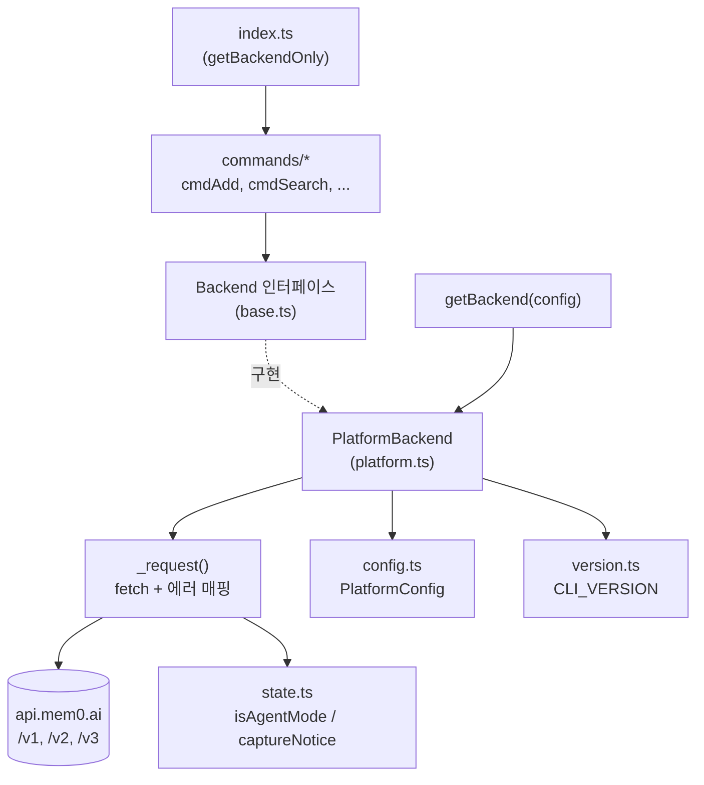
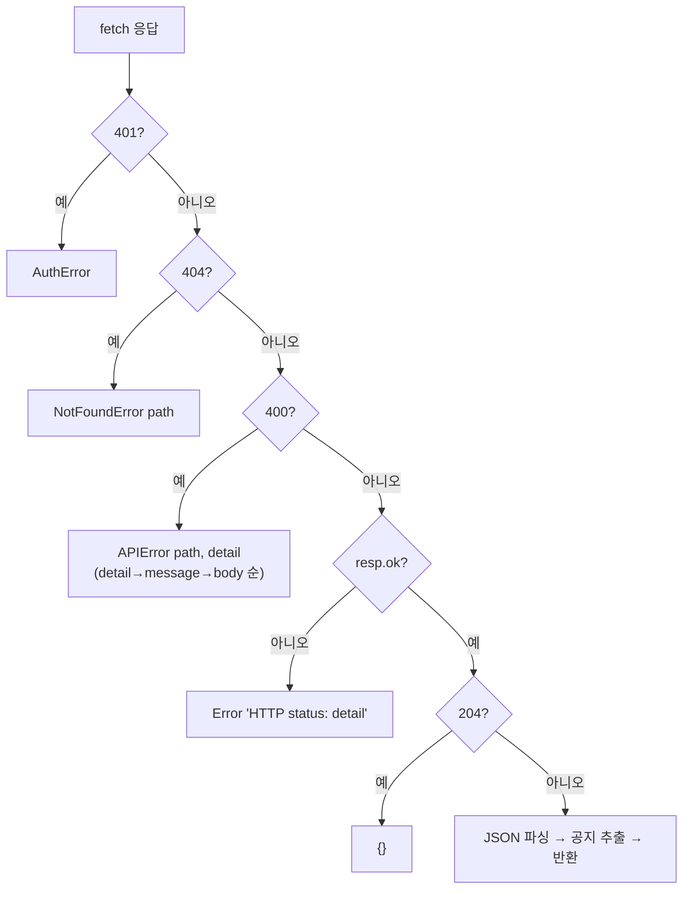
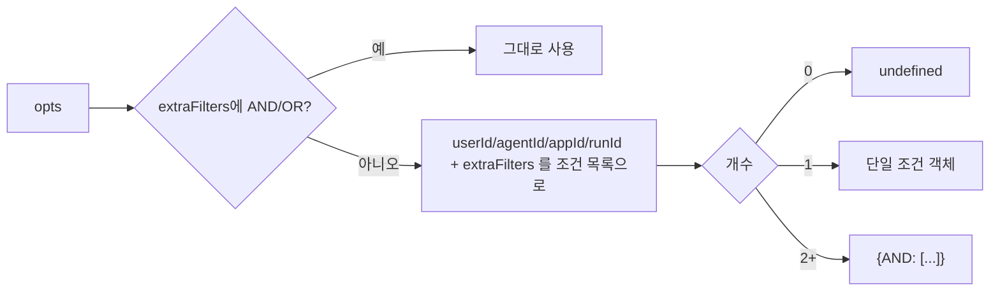
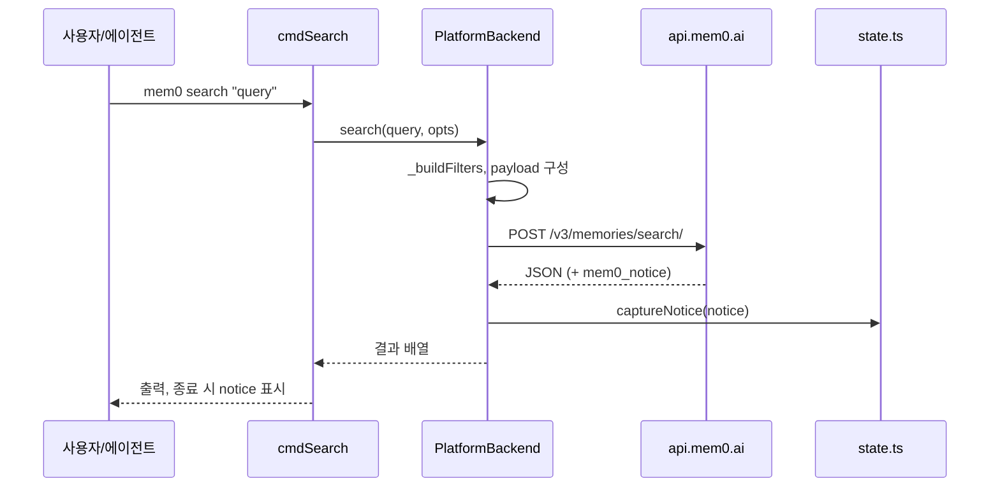

# cli_node_backend 모듈

`cli_node_backend`는 Node CLI(`@mem0/cli`, `cli/node/`)가 Mem0 Platform(SaaS, `api.mem0.ai`)과 통신하는 HTTP 백엔드 계층이다. 핵심 구현은 `cli/node/src/backend/platform.ts`의 `PlatformBackend`이며, 계약(인터페이스·옵션 타입·에러 클래스·팩토리)은 `cli/node/src/backend/base.ts`에 있다. 명령 계층([cli_node_commands](cli_node_commands.md))은 이 모듈을 통해서만 원격 API를 호출한다.

## 1. 아키텍처

- `Backend` 인터페이스: `add`, `search`, `get`, `listMemories`, `update`, `delete`, `deleteEntities`, `ping`, `status`, `entities`, `listEvents`, `getEvent`.
- `getBackend(config)`는 현재 항상 `new PlatformBackend(config.platform)`을 반환한다. (OSS 모드는 Node CLI에 없음. Python CLI의 대응 구현은 [cli_python_backend](cli_python_backend.md) 참고.)
- `init.ts`는 `PlatformBackend`를 직접 생성하여 키 검증에 사용한다.

## 2. 공통 요청 처리: `_request`

모든 메서드는 private `_request(method, path, {json, params})`를 거친다.

**헤더** (생성자에서 구성)
| 헤더 | 값 |
|---|---|
| `Authorization` | `Token <apiKey>` |
| `X-Mem0-Source` | `CLI` |
| `X-Mem0-Client` | `mem0-cli-node/<CLI_VERSION>` |
| `X-Mem0-Client-Language` / `-Version` | `node` / `CLI_VERSION` |
| `X-Mem0-Caller-Type` | 요청마다 `isAgentMode() ? "agent" : "user"` |

`baseUrl`의 끝 슬래시는 제거된다. 타임아웃은 `AbortSignal.timeout(30_000)`(30초).

**상태 코드 → 에러 매핑**

**Agent Mode 공지(notice) 처리**: 응답 본문(객체의 `mem0_notice` 또는 배열 첫 요소의 `mem0_notice`)에서 공지를 꺼내 **본문에서 삭제**하고, 없으면 `X-Mem0-Notice-Message` 헤더를 사용한다. 결과는 `captureNotice()`로 저장되어 명령 종료 시 `index.ts`의 `surfaceNotice`가 (Agent Mode가 아닐 때) 출력한다.

`encodePathSegment`는 경로에 들어가는 ID를 `encodeURIComponent`로 인코딩해 경로 주입을 방지한다.

## 3. 메서드별 API 매핑

| 메서드 | HTTP | 엔드포인트 | 비고 |
|---|---|---|---|
| `add` | POST | `/v3/memories/add/` | `messages` 우선, 없으면 `content`를 `[{role:"user",content}]`로 변환. `source:"CLI"` |
| `search` | POST | `/v3/memories/search/` | 기본 `top_k=10`, `threshold=0.3`. 결과가 배열 또는 `results`/`memories` 키 |
| `get` | GET | `/v1/memories/{id}/?source=CLI` | |
| `listMemories` | POST | `/v3/memories/?page&page_size` | 기본 page 1, size 100. category/after/before를 필터로 변환 |
| `update` | PUT | `/v1/memories/{id}/` | `content`→`text`, `expirationDate`→`expiration_date` |
| `delete` | DELETE | `/v1/memories/{id}/` 또는 `/v1/memories/` | `all`이면 엔티티 ID를 쿼리로 전달, `deleteLinked`→`delete_linked=true`. 둘 다 없으면 Error |
| `deleteEntities` | DELETE | `/v2/entities/{type}/{id}/` | 제공된 user/agent/app/run별로 순차 호출, 타입별 키로 결과 반환. ID가 없으면 Error |
| `ping` | GET | `/v1/ping/` | |
| `status` | — | `ping()` 래핑 | 예외를 던지지 않고 `{connected, backend:"platform", base_url \| error}` 반환 |
| `entities` | GET | `/v1/entities/` | `users/agents/apps/runs`를 `type`으로 클라이언트 측 필터 |
| `listEvents` | GET | `/v1/events/` | |
| `getEvent` | GET | `/v1/event/{id}/` | |

### 필터 구성 `_buildFilters`

## 4. 데이터 흐름 예시: `mem0 search`

## 5. 에러 타입 (`base.ts`)

| 클래스 | 메시지 |
|---|---|
| `AuthError` | "Authentication failed. Your API key may be invalid or expired." |
| `NotFoundError` | `Resource not found: <path>` |
| `APIError` | `Bad request to <path>: <detail>` |

명령 계층은 이 타입으로 사용자 친화적 오류를 분기한다.

## 6. 관련 모듈 및 설정

- 명령 구현: [cli_node_commands](cli_node_commands.md), 진입점/백엔드 생성: [cli_node_entrypoint](cli_node_entrypoint.md)
- 빌드/테스트 설정(`cli/node/package.json`, `tsup.config.ts`, `vitest.config.ts`): [Build_Configuration_and_Tooling](Build_Configuration_and_Tooling.md). 린터는 Biome, 테스트는 vitest, 빌드는 tsup(ESM), Node 18+.
- CI/CD: `cli-node-ci.yml`, 태그 `cli-node-v*` → `cli-node-cd.yml` ([CI_CD_and_Repository_Governance](CI_CD_and_Repository_Governance.md)).
- 동일한 구조의 다른 구현: `integrations/openclaw/backend/platform.ts` ([Framework_and_Workflow-Tool_Integrations](Framework_and_Workflow-Tool_Integrations.md)), Python 쪽 [Python_CLI](Python_CLI.md).

## 7. 유의사항

- `_request`는 `opts.json`이 truthy일 때만 본문을 보낸다.
- 재시도 로직은 없으며, 타임아웃(30초)은 일반 `Error`/AbortError로 전파된다.
- `status`는 연결 실패를 값으로 반환하므로 호출자가 `connected`를 확인해야 한다.
- `deleteEntities`는 순차 실행이라 중간 실패 시 앞선 삭제는 이미 적용된 상태가 된다.
