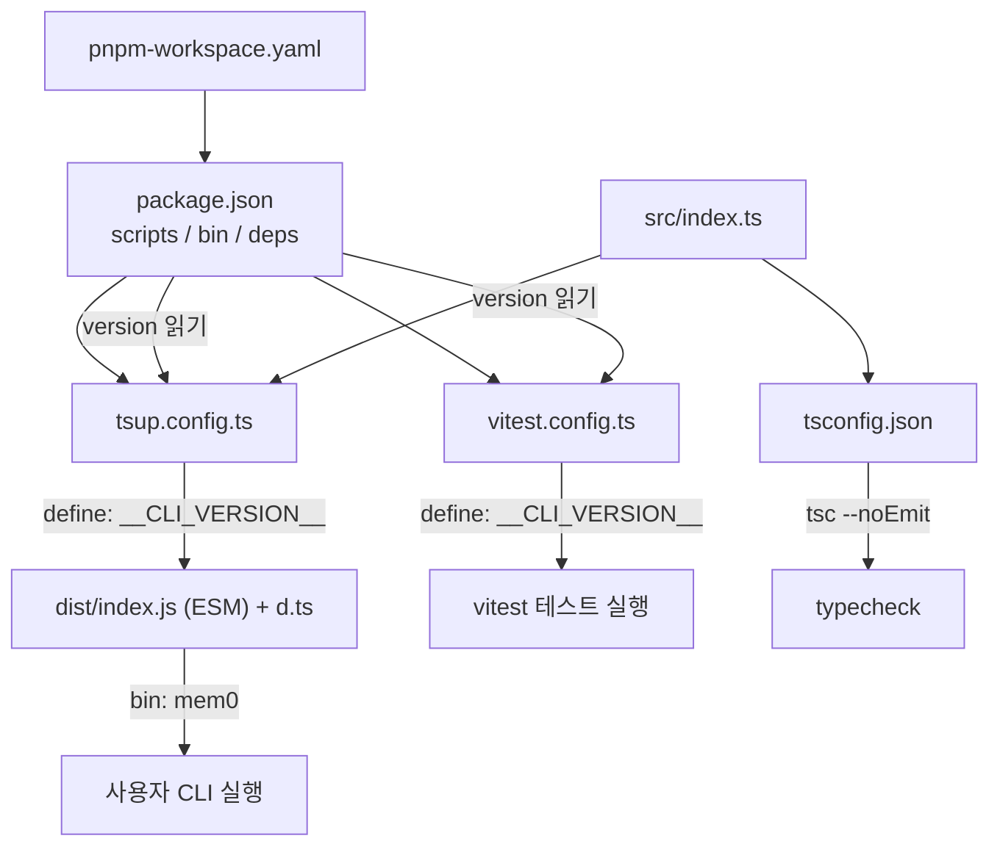
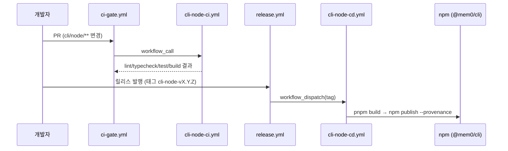

# cli_node_build_config 모듈

`cli_node_build_config`는 Node 기반 mem0 CLI(`@mem0/cli`, 실행 파일 `mem0`)의 **빌드·타입 검사·린트·테스트·패키징 설정**을 모아 둔 모듈이다. 소스 코드(명령어, 백엔드)는 [Node_CLI](Node_CLI.md) 모듈이 담당하고, 이 모듈은 그 코드를 어떻게 빌드하고 검증하고 배포 가능한 형태로 만드는지를 정의한다.

구성 파일은 모두 `cli/node/` 아래에 있다.

| 파일 | 역할 |
|------|------|
| `cli/node/package.json` | 패키지 메타데이터, `bin` 진입점, 스크립트, 의존성, pnpm overrides |
| `cli/node/pnpm-workspace.yaml` | pnpm 워크스페이스 정의, 빌드 스크립트 허용 목록, overrides |
| `cli/node/tsconfig.json` | TypeScript 컴파일러 옵션 (타입 검사 전용) |
| `cli/node/tsup.config.ts` | 번들링 설정 (ESM, d.ts, 버전 주입) |
| `cli/node/vitest.config.ts` | 테스트 러너 설정 (버전 주입, 타임아웃) |

## 아키텍처

핵심 설계: 버전 문자열의 **단일 출처가 `package.json`** 이다. `tsup.config.ts`와 `vitest.config.ts`가 각각 `createRequire`로 `package.json`을 읽어 전역 상수 `__CLI_VERSION__`을 `define`으로 주입한다. 따라서 빌드 결과물과 테스트 환경 모두 `printVersion`(`cli/node/src/index.ts`) 등에서 같은 버전을 본다.

## 구성 요소 상세

### `package.json`

- 패키지명 `@mem0/cli`, 버전 `0.2.14`, `"type": "module"`(ESM 전용), 라이선스 Apache-2.0.
- `bin.mem0` → `./dist/index.js`. 빌드 산출물이 실행 파일이 된다.
- `engines.node >= 18.0.0`, `publishConfig.access = public`.
- 런타임 의존성: `commander`(명령어 파싱), `chalk`, `cli-table3`, `ora`, `boxen`(출력 장식).
- 개발 의존성: `typescript`, `tsup`, `tsx`, `vite`, `vitest`, `@biomejs/biome`, `@types/node`.

| 스크립트 | 명령 | 설명 |
|----------|------|------|
| `build` | `tsup` | `dist/` 생성 |
| `dev` | `tsx src/index.ts` | 빌드 없이 소스를 직접 실행 |
| `test` | `vitest run` | 단발성 테스트 |
| `test:watch` | `vitest` | 감시 모드 |
| `lint` | `biome check src/` | Biome 린트/포맷 검사 |
| `lint:fix` | `biome check --write src/` | 자동 수정 |
| `typecheck` | `tsc --noEmit` | 타입 검사만 수행 |

### `pnpm-workspace.yaml`

- `packages: ['.']` — 워크스페이스는 `cli/node` 자신 하나뿐이다.
- `onlyBuiltDependencies`: `@biomejs/biome`, `esbuild`만 설치 시 빌드/postinstall 스크립트 실행을 허용한다(공급망 보안).
- `overrides`: `jws`, `langsmith`, `tar-fs`, `picomatch`, `esbuild`(`>=0.28.1`), `postcss` 등 전이 의존성의 취약 버전을 상향 고정한다. 같은 내용이 `package.json`의 `pnpm.overrides`에도 있으므로 **두 곳을 함께 수정**해야 어긋나지 않는다.

### `tsconfig.json`

- `target: ES2022`, `module: ESNext`, `moduleResolution: bundler`, `strict: true`.
- `rootDir: src`, `outDir: dist`, `declaration: true`, `isolatedModules: true`, `resolveJsonModule: true`.
- `include: src/**/*.ts`, `exclude`에 `node_modules`, `dist`, `tests`.
- 실제 JS 생성은 tsup이 하므로, `tsc`는 `typecheck` 스크립트(`--noEmit`)에서만 쓰인다.

### `tsup.config.ts`

- `entry: ['src/index.ts']`, `format: ['esm']`, `dts: true`, `clean: true`.
- `define.__CLI_VERSION__`에 `package.json`의 버전을 JSON 문자열로 주입.

### `vitest.config.ts`

- tsup과 동일하게 `__CLI_VERSION__`을 주입해, 소스를 번들 없이 import하는 테스트에서도 상수가 정의되게 한다.
- `testTimeout: 30_000`. 통합 테스트가 `npx tsx`로 CLI를 서브프로세스로 띄우며(개별 15초 타임아웃), CI 러너의 콜드 스타트가 기본 5초를 넘길 수 있기 때문이다.

## 개발 및 검증 흐름

로컬에서는 `pnpm dev`로 즉시 실행하고, 커밋 전 `lint`, `typecheck`, `test`를 돌린다. 저장소 규칙상 이 패키지는 **pnpm 전용**이며 린터는 Biome이다(루트 Python/ `mem0-ts`와 설정이 다르다).

## CI/CD 연계

이 설정은 아래 워크플로(`.github/workflows/`)가 그대로 소비한다. 워크플로 자체의 상세는 [CI_CD_and_Repository_Governance](CI_CD_and_Repository_Governance.md)를 참고한다.

- **`cli-node-ci.yml`** (`workflow_call`, `cli/node/**` 푸시, 수동 실행; PR은 `ci-gate.yml`이 호출)
  - `lint` 잡: Node 20, `pnpm run lint` + `pnpm run typecheck`
  - `test` 잡: Node 20·22 매트릭스, `pnpm run test`
  - `build` 잡: `pnpm run build` 후 `cli/node/dist/index.js` 존재 검증
  - 전 잡이 pnpm 10, `--frozen-lockfile`, `cli/node/pnpm-lock.yaml` 캐시 사용
- **`cli-node-cd.yml`** (`workflow_dispatch`, 릴리스 라우터 `release.yml`이 태그 `cli-node-v*`로 디스패치)
  - Node 22에서 빌드 후 `npm publish --provenance --access public` (OIDC 신뢰 게시, 토큰 없음)
  - `prerelease` 입력이 true면 버전의 preid(예: `0.3.0-beta.1` → `beta`)를 dist-tag로 사용

## 수정 시 주의사항

- **버전 변경**은 `package.json`의 `version`만 고친다. `__CLI_VERSION__`은 자동으로 따라간다.
- **overrides**는 `package.json`과 `pnpm-workspace.yaml` 양쪽을 동기화한다.
- **새 `postinstall` 빌드가 필요한 의존성**을 추가하면 `onlyBuiltDependencies`에도 등록해야 한다.
- 출력 형식을 ESM 외로 늘리면 `"type": "module"`, `bin` 경로, Node 엔진 요건을 함께 검토해야 한다.
- `.github/workflows/` 변경은 메인테이너 승인 없이 하지 않는다. CD 워크플로 파일명은 npm 신뢰 게시자 설정에 묶여 있어 이름을 바꾸면 게시가 깨진다.

## 관련 모듈

- [Node_CLI](Node_CLI.md): 이 설정으로 빌드되는 실제 CLI 소스(`src/index.ts`, 명령어, `PlatformBackend`).
- [CI_CD_and_Repository_Governance](CI_CD_and_Repository_Governance.md): `cli-node-ci.yml`, `cli-node-cd.yml`, `ci-gate.yml`, `release.yml`.
- [Build_Configuration_and_Tooling](Build_Configuration_and_Tooling.md): 다른 패키지(`mem0-ts`, `cli/python`, 대시보드)의 빌드 설정. 특히 Python 쪽은 [Python_CLI](Python_CLI.md)와 짝을 이룬다.
