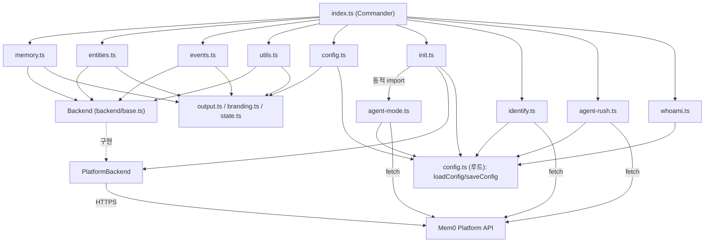
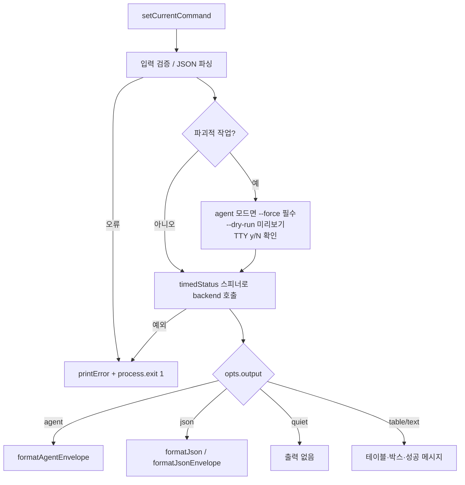
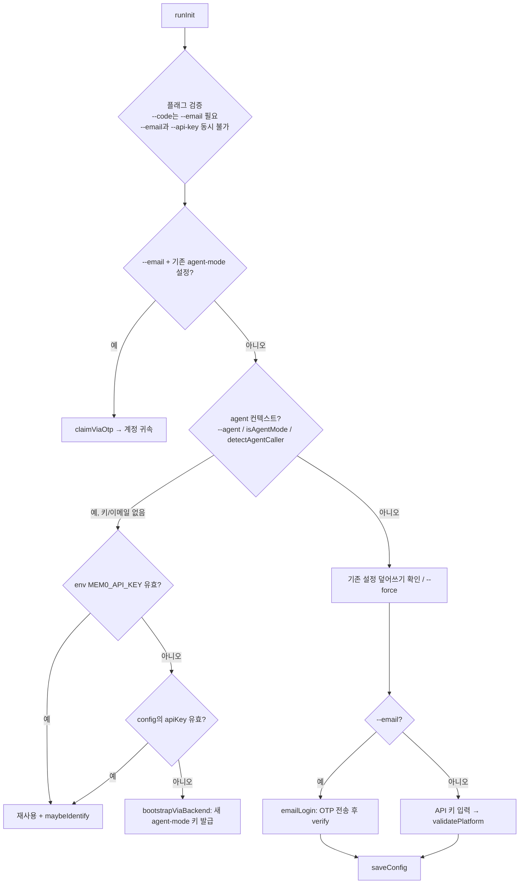
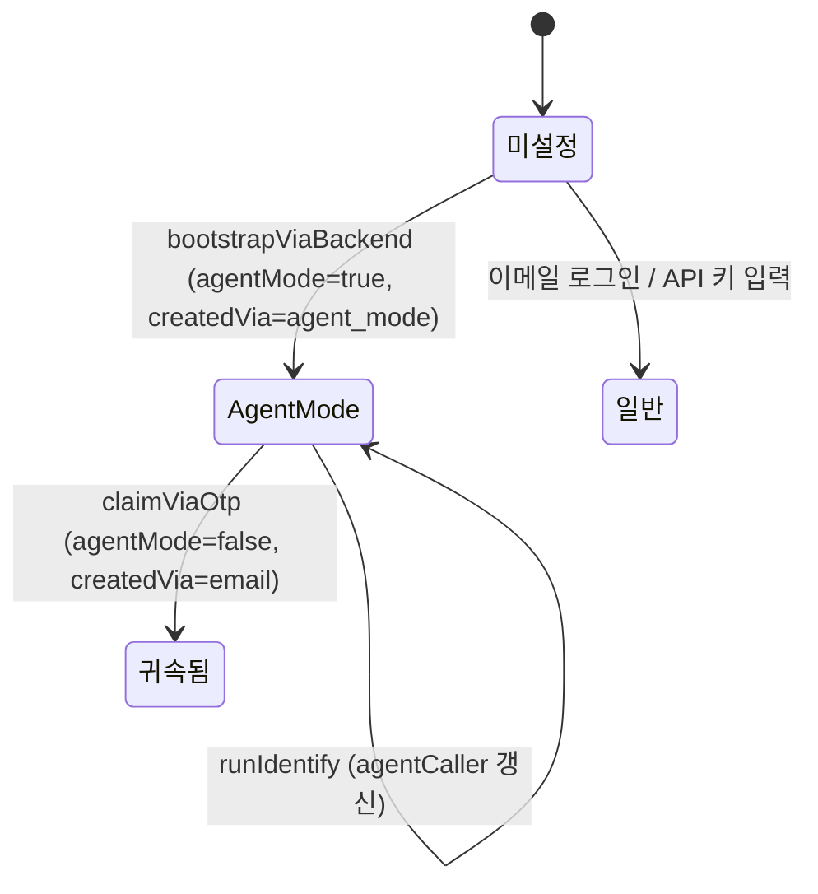

# cli_node_commands 모듈

`cli/node/src/commands/` 아래의 커맨드 핸들러 모음입니다. `@mem0/cli`(Commander 기반, 엔트리 포인트 `mem0`)의 각 서브커맨드가 실제로 하는 일을 구현합니다. 커맨드 파서와 백엔드 선택은 [cli_node_entrypoint](cli_node_entrypoint.md)가, 실제 HTTP 호출은 [cli_node_backend](cli_node_backend.md)가 맡습니다. 이 모듈은 그 사이에서 입력 검증, 확인 프롬프트, 출력 포맷 분기를 담당합니다.

관련 빌드/테스트 설정은 `cli/node/package.json`, `cli/node/tsup.config.ts`, `cli/node/vitest.config.ts`를 참고하세요([cli_node_build_config](Build_Configuration_and_Tooling.md)). 이 패키지의 린터는 Biome이며 pnpm만 사용합니다(루트 `CLAUDE.md` 참고).

## 1. 파일과 커맨드 매핑

| 파일 | 핵심 함수 | CLI 커맨드 | `Backend` 사용 |
|------|-----------|-----------|:---:|
| `memory.ts` | `cmdAdd`, `cmdSearch`, `cmdGet`, `cmdList`, `cmdUpdate`, `cmdDelete`, `cmdDeleteAll` | `add`, `search`, `get`, `list`, `update`, `delete` | O |
| `entities.ts` | `cmdEntitiesList`, `cmdEntitiesDelete` | `entity list`, `entity delete` | O |
| `events.ts` | `cmdEventList`, `cmdEventStatus` | `event list`, `event status` | O |
| `utils.ts` | `cmdStatus`, `cmdImport` | `status`, `import` | O |
| `config.ts` | `cmdConfigShow`, `cmdConfigGet`, `cmdConfigSet` | `config show/get/set` | X (로컬 설정만) |
| `init.ts` | `runInit` | `init` | 일부(`PlatformBackend`를 직접 생성) |
| `agent-mode.ts` | `bootstrapViaBackend`, `claimViaOtp`, `BootstrapEnvelope` | `init --agent`, `init --email` (내부 호출) | X (직접 `fetch`) |
| `identify.ts` | `runIdentify` | `identify <name>` | X (직접 `fetch`) |
| `agent-rush.ts` | `cmdAgentRushAdd`, `cmdAgentRushSearch` | `agent-rush add/search` | X (직접 `fetch`) |
| `whoami.ts` | `cmdWhoami` | `whoami` | X (로컬 설정만) |

## 2. 아키텍처

핸들러는 두 부류로 나뉩니다.

1. **Backend 추상화 사용**: `memory.ts`, `entities.ts`, `events.ts`, `utils.ts`. 첫 인자로 `Backend`를 받으므로 테스트에서 대체하기 쉽습니다.
2. **인증·부트스트랩 계열**: `init.ts`, `agent-mode.ts`, `identify.ts`, `agent-rush.ts`. 아직 API 키가 없거나 에이전트 모드 전용 엔드포인트를 쓰기 때문에 `fetch`를 직접 호출합니다. 공통 헤더는 `X-Mem0-Source: cli`, `X-Mem0-Client-Language: node`입니다.

## 3. 공통 핸들러 패턴

모든 `cmd*` 함수는 거의 같은 흐름을 따릅니다.

- `setCurrentCommand(name)`: 텔레메트리와 에이전트 엔벨로프에 쓰이는 현재 커맨드명을 기록합니다(`state.ts`).
- 출력 모드는 `agent`, `json`, `quiet`, `table`, `text`입니다. `agent`는 `formatAgentEnvelope`로 `command`, `data`, `scope`, `count`, `durationMs`를 담은 구조화 출력을 냅니다.
- 오류는 던지지 않고 `printError` 후 `process.exit(1)`로 종료합니다. 핸들러를 함수로 재사용하는 경우 이 점에 주의해야 합니다.

## 4. 파일별 상세

### 4.1 `memory.ts`

| 함수 | 핵심 동작 |
|------|-----------|
| `cmdAdd` | 입력 소스 우선순위는 `--file` → `--messages` → 텍스트 인자 → 파이프된 stdin(`stdinIsPiped()`)입니다. `--metadata`, `--custom-categories`, `--structured-data-schema`는 JSON으로 파싱하고, `--expires`는 `_validateExpires`로 미래의 `YYYY-MM-DD`인지 확인합니다. `--categories`는 거부하며 `--custom-categories`를 쓰라고 안내합니다. `infer`는 기본 true입니다. 결과 중 같은 `event_id`를 가진 `PENDING` 항목은 중복 제거합니다. |
| `cmdSearch` | `--top-k >= 1`, `0 <= --threshold <= 1`을 검증합니다. `--filter`는 JSON으로, `--fields`는 쉼표 구분 목록으로 변환합니다. `rerank`, `keyword`, `showExpired`, `referenceDate`, `latestOnly`를 백엔드로 전달합니다. |
| `cmdGet` / `cmdList` | `cmdList`는 `--page`, `--page-size >= 1`을 검증하고 `category`, `after`, `before` 필터를 지원합니다. |
| `cmdUpdate` | 텍스트, 메타데이터, 만료일, 타임스탬프를 수정합니다. |
| `cmdDelete` | `--dry-run`이면 `backend.get`으로 대상 메모리를 보여주기만 합니다. `--delete-linked`를 지원합니다. |
| `cmdDeleteAll` | agent 모드에서는 `--force`가 필수입니다. `--all`이면 와일드카드 `*`로 프로젝트 전체를 삭제하며, 이때 `--dry-run`은 무시됩니다(카운트 API 없음). 그 외에는 지정한 스코프(user/agent/app/run)만 삭제하며, dry-run은 `listMemories`로 개수를 셉니다. |

### 4.2 `entities.ts`

- `cmdEntitiesList`: 유효한 타입은 `users`, `agents`, `apps`, `runs`입니다.
- `cmdEntitiesDelete`: 엔티티와 그 메모리를 함께 삭제합니다. user/agent/app/run ID 중 하나는 반드시 필요하고, agent 모드에서는 `--force`가 필수입니다.

### 4.3 `events.ts`

비동기 처리 이벤트를 조회합니다. `statusStyled`가 `SUCCEEDED`, `PENDING`, `FAILED`, `PROCESSING`에 색을 입힙니다. `cmdEventStatus`는 결과 목록과 함께 `boxen` 박스로 출력합니다.

### 4.4 `utils.ts`

- `cmdStatus`: `backend.status()`를 호출합니다. 예외가 나도 `connected: false`로 변환해 결과를 출력합니다. 인증 실패면 `mem0 init` 재실행을 안내합니다.
- `cmdImport`: JSON 파일(배열 또는 단일 객체)을 읽어 항목마다 `backend.add`를 호출합니다. 내용은 `memory`, `text`, `content` 순으로 찾으며, 10건마다 진행률을 표시합니다. 실패는 건수만 집계합니다.

### 4.5 `config.ts`

`~/.mem0/config.json`을 다룹니다. `getNestedValue`/`setNestedValue`로 점 표기 키(`defaults.user_id`, `platform.api_key` 등)에 접근합니다. API 키는 `redactKey`로 마스킹해서 출력합니다.

### 4.6 `init.ts`, `agent-mode.ts`, `identify.ts`

`runInit`은 인증 방식을 고르는 마법사입니다.

핵심 규칙은 다음과 같습니다.

- **키 재사용 우선**: `pingKey`는 HTTP 401/403일 때만 false를 반환합니다. 네트워크 오류, 타임아웃, 5xx는 "유효"로 간주해, 일시적 장애로 새 키가 만들어지고 설정이 덮어써지는 일을 막습니다.
- **`bootstrapViaBackend`**: `POST /api/v1/auth/agent_mode/`를 호출하고 `BootstrapEnvelope`(`api_key`, `default_user_id`, `org_id`, `project_id` 등)를 받아 설정에 저장합니다. 429, 503, 403(일일 가입 한도)에 대한 전용 메시지가 있으며, `api_key`나 `default_user_id`가 비어 있으면 거부합니다(`isValidEnvelope`).
- **`claimViaOtp`**: `/api/v1/auth/email_code/`로 코드를 보내고 `/verify/`에 `agent_mode_api_key`와 함께 제출해 계정으로 귀속합니다. 비TTY에서 `--code`가 없으면 오류로 종료합니다. 성공하면 `agentMode=false`, `createdVia="email"`로 바뀌며 API 키는 그대로입니다.
- **`runIdentify`**: 미귀속 agent-mode 키에서만 동작하며, `PATCH /api/v1/auth/agent_mode/caller/`로 `agent_caller`를 설정합니다(멱등). `maybeIdentify`는 같은 일을 init 중에 최선 노력으로 수행하고 실패해도 조용히 넘어갑니다.
- `agent_caller`는 `--agent-caller`로 자가 선언한 값만 사용하며 환경 변수로 추정해 채우지 않습니다. `detectAgentCaller()`는 에이전트 컨텍스트 판별에만 쓰입니다.
- `captureEvent("cli.init", ...)`로 모드(`agent`, `email`, `api_key`, `existing_key`)를 텔레메트리에 기록합니다.

### 4.7 `agent-rush.ts`와 `whoami.ts`

- `cmdAgentRushAdd` → `POST /v1/agent-rush/memories/`, `cmdAgentRushSearch` → `POST /v1/agent-rush/memories/search/`입니다. 헤더에 `X-Mem0-Mode: agent-rush`가 붙습니다.
- AGENTRUSH 메모리는 **공개**됩니다. `ensureWarningAcknowledged`는 TTY에서 y/N 동의를 받고 `agentRush.acknowledgedAt`을 저장합니다. 비TTY에서는 stderr에 경고만 출력하고 진행합니다.
- 서버 오류 코드는 `ERROR_HINTS`로 사용자 안내 문구에 매핑합니다(예: `agentrush_search_quota`, `agentrush_length`).
- 검색 결과는 최대 5건만 출력합니다.
- `cmdWhoami`는 네트워크 호출 없이 `platform.defaultUserId`를 출력합니다.

## 5. 설정 상태 변화 (agent mode)

## 6. 유지보수 시 주의점

- 파괴적 커맨드를 추가할 때는 `cmdDeleteAll`과 `cmdEntitiesDelete`처럼 agent 모드 `--force` 필수, `--dry-run`, TTY 확인 프롬프트를 일관되게 적용하세요.
- 새 커맨드는 `setCurrentCommand`를 호출하고 `agent`/`json`/`quiet` 출력 분기를 모두 구현해야 합니다.
- `BootstrapEnvelope`는 서버 응답 계약입니다. 필드를 바꾸면 `isValidEnvelope`도 함께 수정하세요.
- 동일 기능의 Python 구현은 [Python_CLI](Python_CLI.md)에 있으며(`app.py`의 `agent_rush_*`, `init`, `identify` 등), 두 CLI의 동작은 맞춰 두어야 합니다.
- `init.ts`, `memory.ts`의 `agent-mode`/`state` 모듈은 동적 `import()`를 사용합니다. 의도된 지연 로딩이므로 정적 import로 바꾸기 전에 순환 의존성을 확인하세요.
