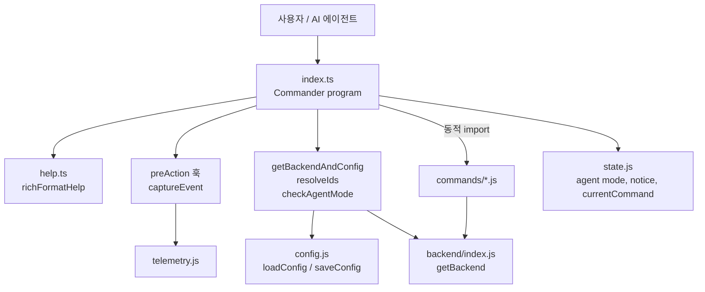
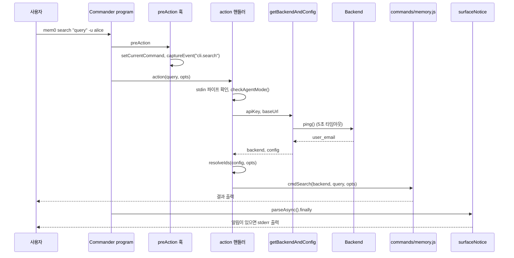
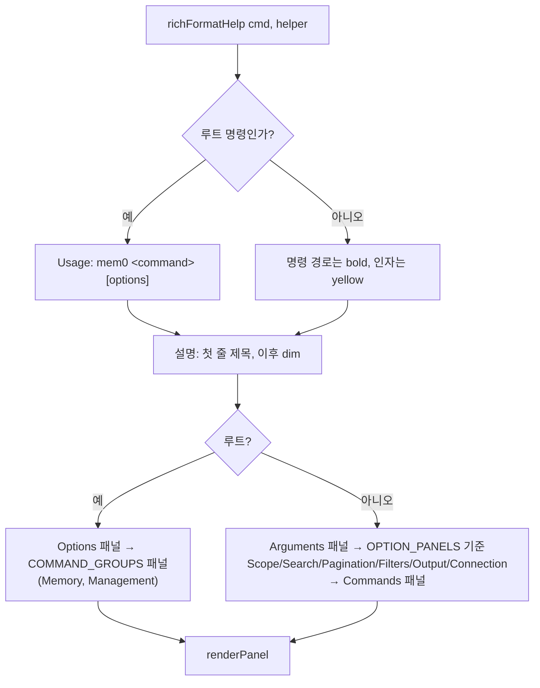

# cli_node_entrypoint 모듈

`cli/node/src/index.ts`와 `cli/node/src/help.ts`로 구성된 Node CLI(`@mem0/cli`, 실행 파일 `mem0`)의 진입점 모듈입니다. Commander 프로그램을 조립하고, 전역 옵션·텔레메트리 훅·백엔드 초기화·ID 해석을 처리한 뒤 실제 작업은 [cli_node_commands](cli_node_commands.md)와 [cli_node_backend](cli_node_backend.md)에 위임합니다. `help.ts`는 Python CLI(Typer + Rich)와 동일한 모양의 도움말을 만들어 줍니다.

빌드·테스트 설정은 `cli/node/package.json`, `cli/node/tsup.config.ts`, `cli/node/vitest.config.ts`를 참고하세요 ([cli_node_build_config](cli_node_build_config.md)). Python 쪽 대응 모듈은 [cli_python_app](cli_python_app.md)입니다.

## 구성 요소

| 파일 | 컴포넌트 | 역할 |
|------|----------|------|
| `cli/node/src/index.ts` | `getBackendAndConfig` (내부), `getBackendOnly` | 설정 로드, API 키 검증, `Backend` 생성 |
| | `resolveIds` | 엔티티 ID(user/agent/app/run) 결정 |
| | `checkAgentMode` | `--json`/`--agent` 전역 플래그를 에이전트 모드 상태로 반영 |
| | `printVersion` | 버전 배너 출력 |
| | `surfaceNotice` | 종료 시 미확인 Agent Mode 알림을 stderr에 출력 |
| `cli/node/src/help.ts` | `richFormatHelp` | Commander `formatHelp` 대체 (둥근 박스 패널, 색상) |
| | `sortCommands` | `COMMAND_ORDER` 기준 명령 정렬 |

## 아키텍처

모든 명령 모듈은 `await import("./commands/....js")`로 **지연 로딩**되어, 사용하지 않는 명령의 코드는 시작 시 로드되지 않습니다.

## 명령 트리

`program`은 `.enablePositionalOptions()`를 사용하므로 서브커맨드 뒤에 오는 플래그는 해당 서브커맨드에 속합니다. 예를 들어 `mem0 init --agent`의 `--agent`는 전역 별칭이 아니라 `init`의 Agent Mode 부트스트랩 플래그입니다.

| 그룹 | 명령 | 위임 대상 |
|------|------|-----------|
| 설정 | `init`, `identify <name>`, `whoami` | `runInit`, `runIdentify`, `cmdWhoami` |
| 메모리 | `add`, `search`, `get`, `list`, `update`, `delete` | `cmdAdd`, `cmdSearch`, `cmdGet`, `cmdList`, `cmdUpdate`, `cmdDelete`/`cmdDeleteAll`/`cmdEntitiesDelete` |
| 관리 | `status`, `version`, `import`, `help` | `cmdStatus`, `printVersion`, `cmdImport`, 내장 핸들러 |
| 하위 그룹 | `config show/get/set`, `entity list/delete`, `event list/status`, `agent-rush add/search` | `cmdConfig*`, `cmdEntities*`, `cmdEvent*`, `cmdAgentRush*` |

`delete`는 하나의 명령이 `<memoryId>`, `--all`, `--entity` 세 모드를 가집니다. 세 모드는 상호 배타적이며, 조합하거나 아무것도 지정하지 않으면 `printError` 후 `process.exit(1)`로 종료합니다. `--all --project`는 기본 ID를 모두 비워 프로젝트 전체 삭제로 동작합니다.

## 핵심 흐름

### 일반 명령 실행 (예: `mem0 search`)

### `getBackendAndConfig`의 동작

1. `loadConfig()` 후 `--api-key`, `--base-url`이 있으면 덮어씁니다.
2. API 키가 없으면 안내 메시지와 함께 종료합니다 (`mem0 init` 또는 `MEM0_API_KEY`).
3. `backend.ping()`을 5초 타임아웃과 `Promise.race`로 경쟁시킵니다.
   - `AuthError` → "Invalid or expired API key." 후 종료.
   - 그 외(네트워크 오류, 타임아웃) → 경고만 출력하고 계속 진행.
4. `ping` 응답의 `user_email`을 모듈 변수 `_validatedUserEmail`에 저장하고, 설정과 다르면 `saveConfig`로 갱신합니다 (저장 실패는 무시).

`getBackendOnly`는 이 함수의 `backend`만 반환하는 래퍼로, 기본 ID가 필요 없는 명령(`get`, `update`, `entity`, `event`)이 사용합니다.

### `resolveIds` 우선순위

`CLI 플래그 > config.defaults > undefined`. 명시적 ID가 하나라도 있으면 **명시된 것만** 사용하고 기본값을 섞지 않습니다. 다른 엔티티 타입의 기본값이 섞여 결과가 과도하게 필터링되는 것을 막기 위해서입니다. 명시적 ID가 없을 때만 `defaults`의 4개 값을 모두 사용합니다.

### 출력 모드와 에이전트 모드

`checkAgentMode()`는 루트 옵션 `--json` 또는 `--agent`가 있으면 `setAgentMode(true)`를 호출하고 `true`를 반환합니다. 각 액션은 이 값이 참이면 `output = "agent"`로 덮어써 JSON 봉투 형식을 사용합니다. `init`과 `help`는 자체 `--json` 옵션도 받습니다.

### 텔레메트리 훅

`program.hook("preAction", ...)`가 모든 명령 실행 전에 다음을 수행합니다.

- 전체 명령명 계산 (하위 명령은 `parent.child`, 예: `entity.list`).
- `setCurrentCommand(fullCommand)`로 `printError`의 JSON 오류 봉투가 실패한 명령을 보고하게 함.
- `init`은 `runInit`에서 더 풍부한 속성으로 직접 이벤트를 보내므로 건너뜀(중복 집계 방지).
- 그 외에는 `captureEvent("cli.<command>", { command, is_agent }, _validatedUserEmail)`.
- 훅 내부의 모든 예외는 삼켜서 명령 실행에 영향을 주지 않음.

주의: 훅은 액션보다 먼저 실행되므로 `_validatedUserEmail`은 첫 호출 시점에는 아직 `undefined`입니다.

### 종료 시 알림

`program.parseAsync().finally(surfaceNotice)`가 `takeNotice()`로 미확인 Agent Mode 알림을 꺼내 stderr에 노란색으로 출력합니다. 에이전트 모드에서는 `formatJsonEnvelope`가 이미 JSON에 포함하므로 중복을 피하기 위해 출력하지 않습니다.

### stdin 입력

`search`와 `update`는 인자가 없고 `stdinIsPiped()`가 참이면 `fs.readFileSync(0)`으로 stdin을 읽습니다. `search`는 쿼리가 끝내 없으면 오류로 종료하고, `update`는 텍스트 없이 `--metadata` 등만으로도 진행할 수 있습니다.

### `help` 명령

`mem0 help --json`(또는 전역 `--json`/`--agent`)은 `cli/node` 기준 상위 두 단계의 `cli-spec.json`을 읽어 출력하고, 파일이 없으면 `name`, `version`, `description`만 담은 최소 JSON을 출력합니다. 플래그가 없으면 하드코딩된 텍스트 도움말을 출력합니다. 이 목록은 명령을 추가할 때 수동으로 갱신해야 합니다 (현재 `init` 외의 `identify`, `whoami`, `agent-rush`, `version`은 이 텍스트에 없음).

## help.ts: 도움말 포매터

`program`과 `agent-rush`, `entity`, `event` 그룹은 `.configureHelp({ formatHelp: richFormatHelp })`로 이 포매터를 사용합니다. 반면 `config` 그룹은 설정하지 않아 Commander 기본 형식으로 출력됩니다.

주요 상수와 함수:

- `COMMAND_GROUPS`: 루트 도움말의 `Memory`(add, search, get, list, update, delete)와 `Management`(init, status, version, import, help, entity, event, config) 패널. 여기에 없는 명령(`identify`, `whoami`, `agent-rush`)은 루트 도움말에 표시되지 않습니다.
- `OPTION_PANELS`: 명령별로 옵션을 패널에 매핑. 목록에 없는 옵션은 `Options` 패널로 들어갑니다.
- `PANEL_ORDER`: `Scope → Search → Pagination → Filters → Output → Connection`.
- `renderPanel`: `╭─ Title ─╮` 형태의 박스를 그립니다. 폭은 `process.stdout.columns || 80`이며, ANSI 코드를 제거(`stripAnsi`)한 길이로 패딩을 계산합니다.
- `sortCommands`: `COMMAND_ORDER`(그룹에서 평탄화) 순으로 정렬하고 미등록 명령은 뒤에 원래 순서대로 둡니다. 이 파일 내에서 `export`되지 않으며 현재 이 모듈 안에서 호출되지 않습니다.
- 색상은 `chalk`를 사용하며 Typer/Rich 기본값과 맞춥니다 (cyan bold = 플래그/명령, yellow = Usage·인자, dim = 기본값·테두리).

## 새 명령 추가 시 체크리스트

1. `commands/<name>.ts`에 `cmdXxx` 구현 ([cli_node_commands](cli_node_commands.md)).
2. `index.ts`에 `program.command(...)`를 추가하고, 액션에서 `checkAgentMode()` → `getBackendAndConfig`/`getBackendOnly` → `resolveIds` → `cmdXxx` 순서를 따름. 모듈은 동적 import.
3. 루트 도움말에 보이려면 `help.ts`의 `COMMAND_GROUPS`, 옵션 그룹화를 원하면 `OPTION_PANELS`에 추가.
4. `help` 명령의 하드코딩 텍스트와 `cli-spec.json` 갱신.
5. 린트는 Biome(`cli/node/`), 테스트는 vitest를 사용합니다.
