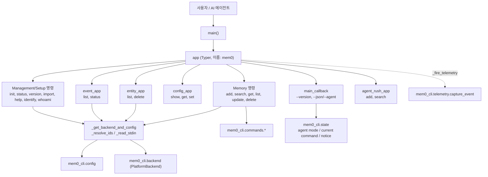
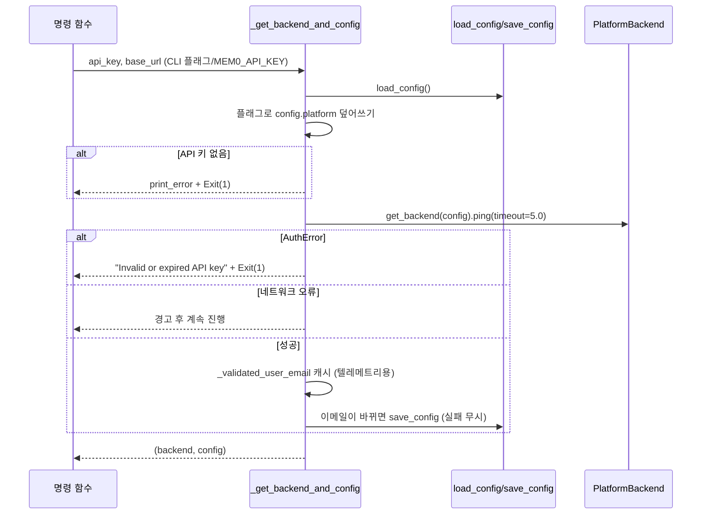
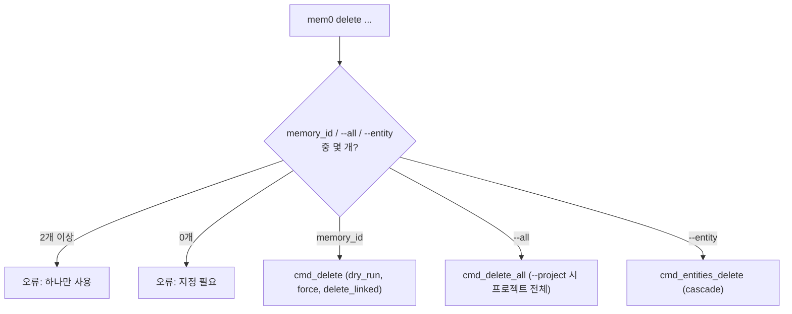
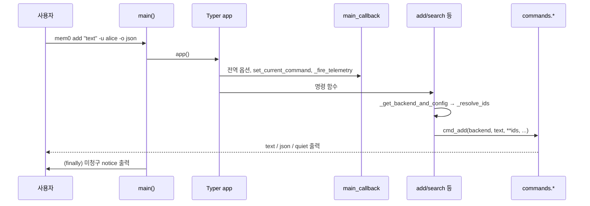

# cli_python_app

`cli/python/src/mem0_cli/app.py`는 Python CLI(`mem0-cli`, 엔트리 포인트 `mem0`)의 진입점입니다. [Typer](https://typer.tiangolo.com/) 기반으로 명령어 트리를 정의하고, 전역 옵션·인증 검증·엔티티 ID 해석·텔레메트리 호출을 담당합니다. 실제 비즈니스 로직은 `mem0_cli.commands.*` 모듈에 위임하며, 이 모듈은 얇은 "라우팅/검증 레이어"입니다.

상위 모듈: Python_CLI. 관련 모듈:
- [cli_python_backend](cli_python_backend.md): `PlatformBackend`, `APIError` (Platform REST 호출)
- [cli_python_config](cli_python_config.md): `load_config`/`save_config`, `PlatformConfig`, `DefaultsConfig`
- [cli_python_telemetry](cli_python_telemetry.md): `capture_event`
- [cli_python_build_config](cli_python_build_config.md): `cli/python/pyproject.toml`, `cli/python/Makefile`
- 동일 기능의 Node 구현: [Node_CLI](Node_CLI.md)

> 참고: `search`, `update`, `delete`, `version` 명령도 `app.py`에 정의되어 있으나 코어 컴포넌트 목록에는 포함되지 않았습니다.

## 1. 아키텍처

모든 `commands.*` 임포트는 함수 내부에서 지연(lazy) 수행되어 CLI 시작 시간을 줄입니다.

## 2. 명령어 구성

| 패널 | 명령 | 위임 대상 |
|---|---|---|
| Memory | `add` | `commands.memory.cmd_add` |
| Memory | `search` | `commands.memory.cmd_search` (쿼리 없으면 stdin 폴백) |
| Memory | `get` | `commands.memory.cmd_get` |
| Memory | `list` | `commands.memory.cmd_list` |
| Memory | `update` | `commands.memory.cmd_update` (텍스트 stdin 폴백) |
| Memory | `delete` | `cmd_delete` / `cmd_delete_all` / `commands.entities.cmd_entities_delete` |
| Management | `entity list/delete` | `commands.entities.*` |
| Management | `event list/status` | `commands.events_cmd.*` |
| Management | `config show/get/set` | `commands.config_cmd.*` (백엔드 불필요) |
| Management | `init`, `status`, `version`, `import`, `help` | `init_cmd.run_init`, `utils.cmd_status/cmd_version/cmd_import` |
| Setup | `identify`, `whoami`, `agent-rush add/search` | `identify_cmd`, `whoami_cmd`, `agent_rush_cmd` |

서브 그룹(`config_app`, `entity_app`, `event_app`, `agent_rush_app`)은 모듈 상단에서 정의하되 `app.add_typer`는 나중에 등록하여 `--help`의 패널 순서를 제어합니다. 각 그룹의 `callback`(`_config_callback`, `_entity_callback`, `_event_callback`, `_agent_rush_callback`)은 서브커맨드 호출 시 `"<group>."` 이름으로 텔레메트리를 발생시킵니다.

## 3. 핵심 헬퍼

### `_get_backend_and_config(api_key, base_url)`

- `_get_backend`는 config를 버리고 backend만 반환하는 래퍼입니다.
- API 키 우선순위: `--api-key`(또는 `MEM0_API_KEY` 환경변수) > 저장된 config.

### `_resolve_ids(config, user_id, agent_id, app_id, run_id)`
CLI 플래그 > config 기본값 순입니다. **하나라도 명시된 ID가 있으면 기본값을 섞지 않고** 명시된 것만 사용합니다(과도한 필터링 방지). 아무 것도 없으면 `config.defaults.*` 전체를 사용합니다.

### stdin 처리
`_stdin_is_piped()`는 stdin이 FIFO 또는 일반 파일(리다이렉트)일 때만 True이며, 에이전트 모드에서는 항상 False입니다(대기 방지). `_read_stdin()`이 이를 이용해 `search`의 query, `update`의 text를 보완합니다.

### `_fire_telemetry(command_name, extra)`
`capture_event("cli.<command>", props, pre_resolved_email=...)`를 호출하며 모든 예외를 삼킵니다(명령 실행에 영향 없음). 자세한 전송 방식은 [cli_python_telemetry](cli_python_telemetry.md) 참조.

## 4. 전역 옵션과 에이전트 모드

- `main_callback`: `--version`, `--json`/`--agent`를 처리합니다. `--json`이면 `state.set_agent_mode(True)`, 서브커맨드 이름은 `set_current_command`로 저장되어 JSON 에러 봉투에 사용됩니다. `init`은 자체적으로 텔레메트리를 발생시키므로 여기서 제외됩니다.
- `main()`: `--json`/`--agent`를 argv 어디에 있든 인식하도록 `sys.argv`에서 제거 후 agent mode를 켭니다. 단 `init`이 포함된 경우 `--agent`는 Agent Mode 부트스트랩용 서브커맨드 플래그이므로 남겨둡니다. `finally` 블록에서 `take_notice()`로 미청구 Agent Mode 알림을 stderr로 한 번 출력합니다(JSON 모드에서는 봉투에 포함되므로 생략).
- `help --json`(또는 agent mode)은 `_build_help_json()`이 생성한 기계 판독용 명령 스키마를 출력합니다. 이 딕셔너리는 수동 관리되므로 명령/옵션 변경 시 함께 갱신해야 합니다(예: `--graph/--no-graph`는 help JSON에는 있으나 현재 Typer 옵션에는 없음).

## 5. `delete` 명령 디스패치

## 6. 일반적인 명령 실행 흐름

## 7. 개발 시 참고

- 코드 스타일: ruff, 줄 길이 **100** (루트 Python의 120과 다름). `cli/python/Makefile`의 `lint`, `format`, `test` 타깃 사용 ([cli_python_build_config](cli_python_build_config.md)).
- 새 명령 추가 시: (1) `@app.command(rich_help_panel=...)` 정의, (2) 지연 임포트로 `commands.*` 위임, (3) `_build_help_json`과 `help` 텍스트 갱신, (4) 공개 동작 변경이면 `docs/` 업데이트.
- 출력 포맷은 `-o/--output` (`text`, `json`, `quiet`, `table`)로 통일되어 있으며 기본값은 명령별로 다릅니다(`list`/`entity list`/`event list`는 `table`).
