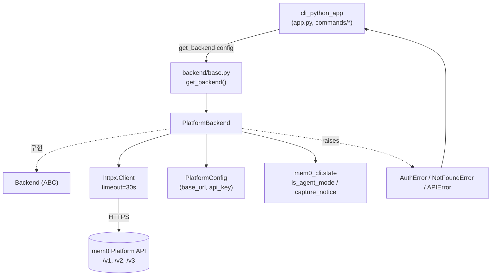
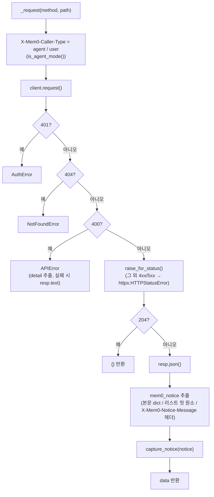
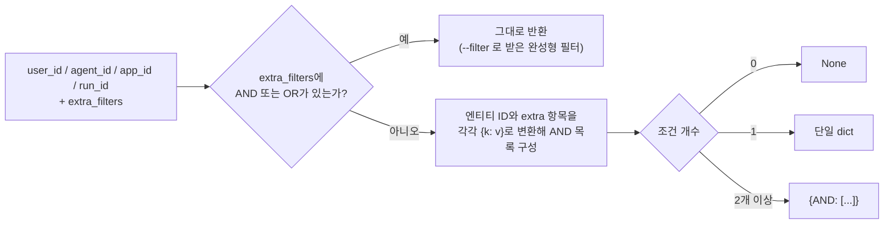
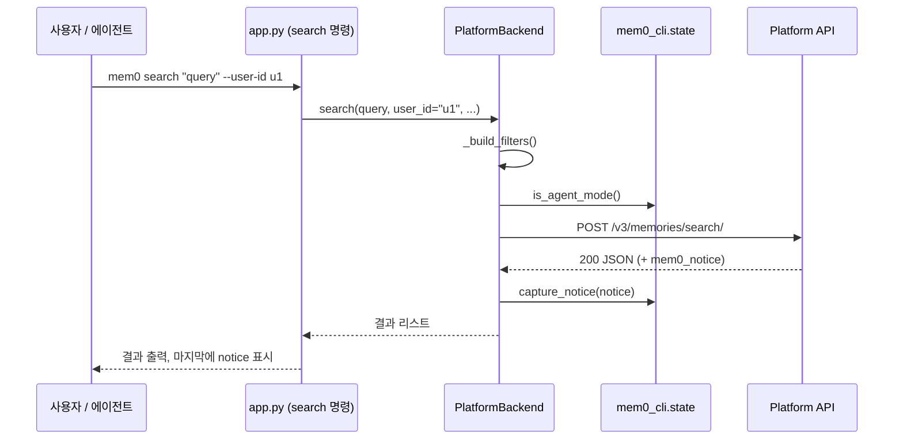

# cli_python_backend 모듈

`cli/python/src/mem0_cli/backend/platform.py`에 있는 Python CLI(`mem0-cli`)의 **백엔드 계층**입니다. CLI 명령(`add`, `search`, `list`, `delete` 등)을 mem0 Platform API(`api.mem0.ai`)의 HTTP 호출로 변환하고, 응답과 오류를 CLI가 다루기 쉬운 형태로 정리합니다.

구성 요소는 다음 두 가지입니다.

- `PlatformBackend`: 추상 클래스 `Backend`(`backend/base.py`)의 구현체. `httpx.Client`를 감싼 HTTP 클라이언트입니다.
- `APIError`: 400 응답에 대해 발생하는 예외. 같은 파일에 `AuthError`(401), `NotFoundError`(404)도 정의되어 있습니다.

관련 모듈: 명령 정의는 [cli_python_app](cli_python_app.md), 설정 모델(`PlatformConfig`)은 [cli_python_config](cli_python_config.md), 텔레메트리는 [cli_python_telemetry](cli_python_telemetry.md)를 참고하세요. 같은 API를 호출하는 Node 구현은 [cli_node_backend](cli_node_backend.md)에 있습니다. 패키징과 빌드는 `cli/python/pyproject.toml`, `cli/python/Makefile`을 참고하세요([build 설정 개요](Build_Configuration_and_Tooling.md)).

---

## 1. 아키텍처

- `get_backend()`는 `config.platform`으로 `PlatformBackend`를 만들어 반환합니다. 현재 Python CLI의 백엔드 구현은 Platform 하나뿐입니다.
- `commands/init_cmd.py`는 `PlatformBackend`를 직접 생성해 API 키를 검증합니다. `app.py`는 `AuthError`를 잡아 사용자에게 안내합니다.

## 2. 클라이언트 초기화

`__init__`은 `base_url`의 끝 `/`를 제거하고, 다음 공통 헤더를 가진 `httpx.Client`를 만듭니다. 타임아웃은 30초입니다.

| 헤더 | 값 |
|---|---|
| `Authorization` | `Token {api_key}` |
| `Content-Type` | `application/json` |
| `X-Mem0-Source` | `CLI` |
| `X-Mem0-Client` | `mem0-cli-python/{__version__}` |
| `X-Mem0-Client-Language` | `python` |
| `X-Mem0-Client-Version` | `__version__` |
| `X-Mem0-Caller-Type` | 요청마다 `agent` 또는 `user`로 설정 (아래 참조) |

## 3. 요청 처리 흐름 (`_request`)

모든 API 호출은 `_request`를 거칩니다.

동작상 알아둘 점은 다음과 같습니다.

- **Agent Mode 안내(notice)**: 본문에 `mem0_notice` 키가 있으면 `pop`으로 제거해 데이터에 섞이지 않게 합니다. 본문에 없으면 `X-Mem0-Notice-Message` 헤더를 사용합니다. 추출한 값은 `capture_notice`로 보관하고, 명령이 끝날 때 한 번에 표시합니다. 표시는 `app.py` 쪽 `surfaceNotice` 계열 흐름이 맡습니다.
- 401, 404, 400 외의 오류는 `httpx.HTTPStatusError`로 그대로 전파됩니다. 호출자는 이 경우도 처리해야 합니다.
- 경로 세그먼트(`memory_id`, `entity_id` 등)는 `_encode_path_segment`(`urllib.parse.quote(..., safe="")`)로 인코딩해, `/` 같은 문자가 경로를 깨뜨리지 않게 합니다.

## 4. 공개 메서드와 API 엔드포인트

| 메서드 | HTTP | 엔드포인트 | 비고 |
|---|---|---|---|
| `add` | POST | `/v3/memories/add/` | `content` 또는 `messages`를 `messages` 배열로 구성. `source="CLI"` |
| `search` | POST | `/v3/memories/search/` | 기본 `top_k=10`, `threshold=0.3` |
| `get` | GET | `/v1/memories/{id}/` | |
| `list_memories` | POST | `/v3/memories/` | `page`, `page_size`는 쿼리 파라미터. 기본 `page_size=100` |
| `update` | PUT | `/v1/memories/{id}/` | `content`는 `text` 필드로 전송 |
| `delete` (단건) | DELETE | `/v1/memories/{id}/` | `delete_linked`면 `delete_linked=true` |
| `delete` (`all=True`) | DELETE | `/v1/memories/` | 엔티티 ID는 쿼리 파라미터로 전달 |
| `delete_entities` | DELETE | `/v2/entities/{type}/{id}/` | 지정한 엔티티마다 한 번씩 호출. 결과는 타입별 dict |
| `ping` | GET | `/v1/ping/` | `timeout`을 지정하면 `_request`를 거치지 않고 직접 호출 |
| `status` | GET | `/v1/ping/` | 예외를 잡아 `{"connected": bool, ...}` 반환 |
| `entities` | GET | `/v1/entities/` | 타입(`users/agents/apps/runs`) 필터는 클라이언트 측에서 수행 |
| `list_events` | GET | `/v1/events/` | |
| `get_event` | GET | `/v1/event/{id}/` | |

### 필터 구성 (`_build_filters`)

- `list_memories`는 `--category`를 `{"categories": {"contains": ...}}`로, `--after`/`--before`를 `created_at`의 `gte`/`lte`로 변환해 `extra_filters`에 넣습니다.
- 값이 없는 옵션은 페이로드에서 생략합니다. 불리언 옵션도 `True`일 때만 보내고, `infer`는 `False`일 때만 `infer: false`를 보냅니다.
- `search`와 `list_memories`는 응답이 리스트가 아니면 `results`, 없으면 `memories` 키에서 목록을 꺼냅니다.

## 5. 예외

| 예외 | 발생 조건 | 처리 위치 |
|---|---|---|
| `AuthError` | 401 (`_request`, `ping(timeout=...)`) | `app.py`가 잡아 사용자에게 안내 |
| `NotFoundError` | 404 | 호출 명령 계층 |
| `APIError` | 400. 메시지에 API의 `detail` 포함 | 호출 명령 계층 |
| `ValueError` | `delete()`에 `memory_id`와 `all`이 모두 없음, `delete_entities()`에 엔티티 ID가 없음 | 호출 명령 계층 |

세 예외 클래스(`AuthError`, `NotFoundError`, `APIError`)는 모두 `Exception`을 직접 상속하는 빈 클래스입니다. 파일 맨 아래에 정의되어 있지만, 메서드가 실행되는 시점에 참조하므로 정상 동작합니다.

## 6. 호출 시퀀스 예시 (`mem0 search`)

## 7. 구현 시 유의점

- `ping(timeout=...)`은 `_request`를 거치지 않으므로 `X-Mem0-Caller-Type` 갱신, notice 추출, 400/404 변환이 적용되지 않습니다. 401만 `AuthError`로 변환합니다.
- `status()`는 모든 예외를 삼켜 `connected: False`와 오류 문자열로 바꿉니다.
- `entities()`는 전체 목록을 받은 뒤 클라이언트에서 거릅니다. 엔티티 수가 많으면 비효율적일 수 있습니다.
- `from __future__ import annotations`를 사용하므로 `str | None` 같은 타입 표기가 Python 3.10 미만 문법 제약과 무관하게 쓰입니다. 다만 CLI 자체는 Python 3.10+가 필요합니다.
- 이 패키지는 ruff 줄 길이 **100**을 따릅니다(저장소 루트의 120이 아닙니다).
- 새 백엔드를 추가하려면 `Backend`의 모든 추상 메서드를 구현하고 `get_backend()`에 분기를 추가합니다.
- Node CLI의 `PlatformBackend`([cli_node_backend](cli_node_backend.md))와 엔드포인트, 헤더 규약을 맞춰 두는 것이 좋습니다.
