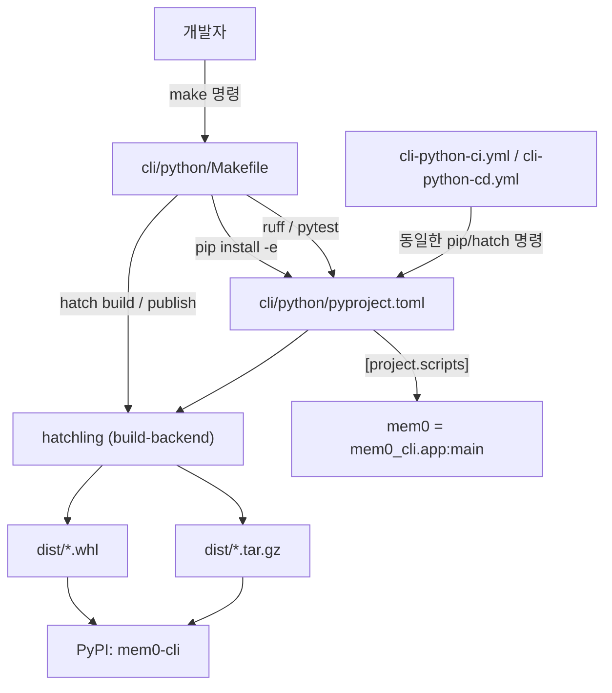
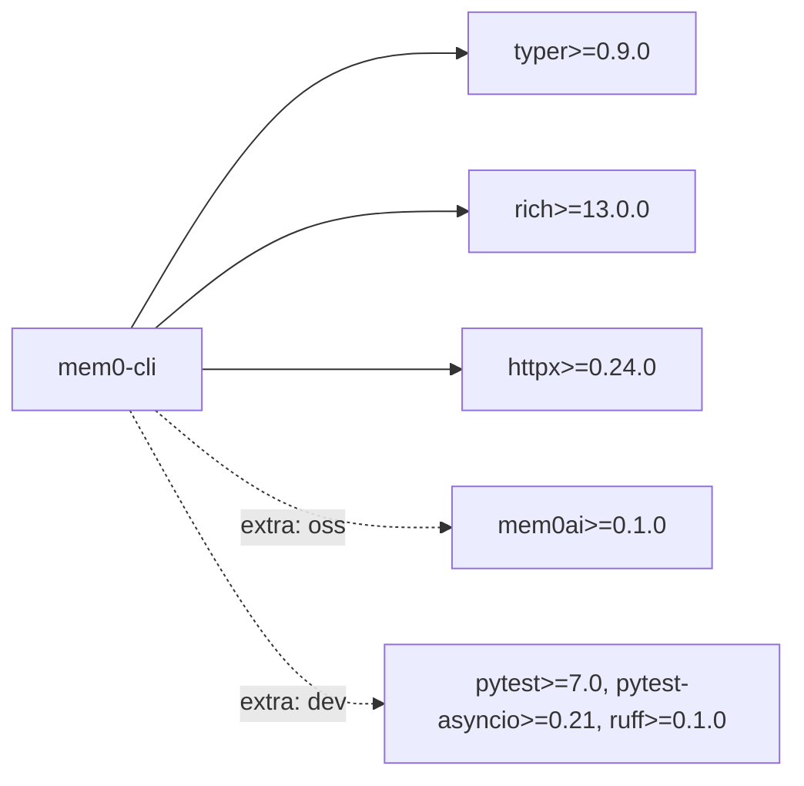
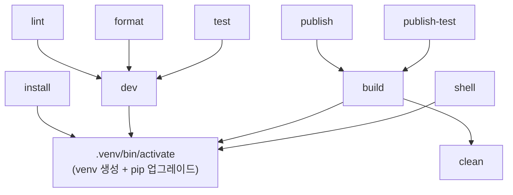
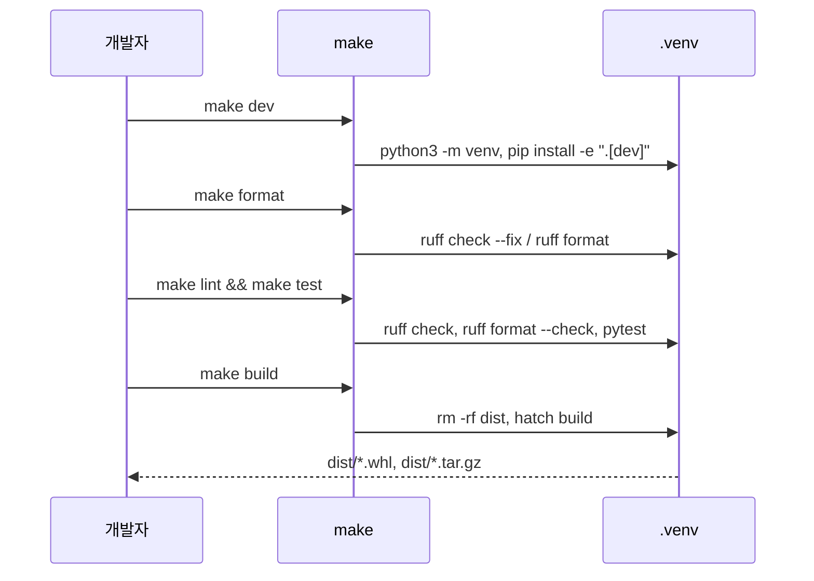

# cli_python_build_config 모듈

`cli/python/`에 있는 Python CLI(`mem0-cli`, 진입점 `mem0`)의 **빌드·패키징·개발 워크플로우 설정**을 다루는 모듈입니다. 구성 파일은 두 개입니다.

- `cli/python/pyproject.toml` — 패키지 메타데이터, 의존성, 엔트리 포인트, hatch 빌드 대상, ruff 설정
- `cli/python/Makefile` — venv 생성, 설치, lint/format/test, 빌드, PyPI 배포를 감싸는 개발자용 명령 모음

CLI 소스 코드 자체(`mem0_cli.app`, 백엔드, 설정, 텔레메트리)는 [Python_CLI](Python_CLI.md) 문서를, 같은 계열의 Node 쪽 설정은 [cli_node_build_config](cli_node_build_config.md)를 참고하세요. CI/CD 워크플로우는 [cli_ci_cd](cli_ci_cd.md)에서 다룹니다.

---

## 1. 아키텍처 개요



`Makefile`은 로컬 개발의 단일 진입점이고, 실제 설정의 원천(source of truth)은 `pyproject.toml`입니다. CI도 Makefile을 쓰지 않고 같은 명령(`pip install -e ".[dev]"`, `ruff`, `pytest`, `hatch build --clean`)을 직접 호출합니다.

---

## 2. `pyproject.toml`

### 2.1 빌드 시스템과 패키지 메타데이터

| 항목 | 값 |
|------|-----|
| build-backend | `hatchling.build` (`requires = ["hatchling"]`) |
| 패키지명 | `mem0-cli` |
| 버전 | `0.2.13` (릴리스 시 이 값을 직접 올림) |
| Python 요구 | `>=3.10` |
| 라이선스 | `Apache-2.0` |
| 분류자 | Beta, Console, Python 3.10/3.11/3.12 |

### 2.2 의존성



- **핵심 의존성**: `typer`(CLI 프레임워크), `rich`(터미널 출력), `httpx`(플랫폼 API 호출)만 포함합니다. 저장소 규칙(루트 `CLAUDE.md`)대로 무거운 의존성은 core에 넣지 않고 optional group으로 분리합니다.
- **`oss` extra**: 자체 호스팅(OSS) 모드에서만 필요한 `mem0ai` SDK. `pip install "mem0-cli[oss]"`로 설치합니다.
- **`dev` extra**: 테스트·린트 도구. `make dev`와 CI가 사용합니다.

### 2.3 엔트리 포인트

```toml
[project.scripts]
mem0 = "mem0_cli.app:main"
```

설치하면 `mem0` 명령이 생성되어 [Python_CLI](Python_CLI.md)의 `mem0_cli.app.main`(Typer 앱)을 실행합니다.

### 2.4 hatch 빌드 대상

| 대상 | 설정 | 설명 |
|------|------|------|
| wheel | `packages = ["src/mem0_cli"]` | `src` 레이아웃에서 `mem0_cli` 패키지만 포함 |
| sdist | `include = ["src/mem0_cli"]` | 소스 배포본에도 패키지 디렉터리만 포함 |

### 2.5 ruff 설정 (라인 길이 **100**)

루트 Python(120)과 달리 이 패키지는 `line-length = 100`, `target-version = "py310"`입니다. 린터 설정을 섞으면 CI가 실패하므로 주의하세요.

- 활성 규칙: `E`, `F`, `I`(isort), `W`, `UP`, `B`, `SIM`, `RUF`
- 무시 규칙:
  - `E501` — 줄 길이는 formatter가 처리
  - `B008` — Typer의 `Option`/`Argument`가 기본 인자에서 함수를 호출하는 패턴이 필수
  - `SIM108` — 삼항 연산자가 오히려 가독성을 해칠 때가 있음
- isort: `known-first-party = ["mem0_cli"]`
- format: 큰따옴표, 공백 들여쓰기, `docstring-code-format = true`

---

## 3. `Makefile`

모든 작업은 `.venv`(`VENV := .venv`) 가상환경 안에서 실행됩니다.

### 3.1 타깃 의존 관계



### 3.2 타깃 설명

| 타깃 | 동작 |
|------|------|
| `install` | `pip install -e .` — 런타임 의존성만 editable 설치 |
| `dev` | `pip install -e ".[dev]"` — 개발 도구 포함 설치 |
| `lint` | `ruff check .` + `ruff format --check .` (수정 없이 검사만) |
| `format` | `ruff check --fix .` + `ruff format .` (자동 수정) |
| `test` | `pytest` |
| `build` | `clean` 후 `hatch` 설치, `hatch build`로 wheel/sdist 생성 |
| `clean` | `rm -rf dist/` |
| `publish` | `build` 후 `hatch publish` (PyPI) |
| `publish-test` | `build` 후 `hatch publish --repo test` (TestPyPI) |
| `shell` | venv가 활성화된 새 셸을 띄움 (`VIRTUAL_ENV`, `PATH` 설정 후 `exec $(SHELL)`) |

### 3.3 일반적인 개발 흐름



---

## 4. CI/CD와의 관계

설정 파일은 `.github/workflows`의 워크플로우와 같은 도구 체인을 공유합니다.

| 워크플로우 | 동작 | 본 모듈과의 연결 |
|-----------|------|------------------|
| `cli-python-ci.yml` | `lint`(3.12: `ruff check`, `ruff format --check`), `test`(3.10/3.11/3.12 매트릭스: `pytest`), `build`(`hatch build --clean` 후 whl·tar.gz 존재 확인) | `pyproject.toml`의 `dev` extra, ruff 설정, hatch 대상 |
| `cli-python-cd.yml` | `cli-v*` 태그 릴리스 시 Python 3.11에서 `hatch build --clean` 후 `pypa/gh-action-pypi-publish`로 OIDC 신뢰 게시 | `[project]` 메타데이터와 version |

참고:
- PR에서는 `ci-gate.yml`이 이 CI를 reusable workflow로 호출하며, push-to-main과 수동 실행은 단독 트리거입니다.
- CD는 `release.yml`(Release Router)이 `cli-v*` 태그를 보고 dispatch합니다. 레지스트리 신뢰 설정이 **워크플로우 파일명**에 묶여 있으므로 `cli-python-cd.yml` 이름을 바꾸면 게시가 깨집니다.
- 따라서 `make publish`는 수동 비상용이고, 정식 릴리스는 태그 → CD 경로를 사용합니다. 자세한 내용은 [cli_ci_cd](cli_ci_cd.md), [CI_CD_and_Repository_Governance](CI_CD_and_Repository_Governance.md)를 참고하세요.

---

## 5. 유지보수 시 유의사항

1. **버전 올리기**: `pyproject.toml`의 `version`을 수정하고 `cli-v<version>` 태그로 릴리스합니다.
2. **의존성 추가**: 선택적 기능은 optional group에 추가하고, `dependencies`는 최소로 유지합니다.
3. **패키지 구조 변경**: 새 최상위 패키지를 `src/` 아래에 추가하면 `[tool.hatch.build.targets.wheel]`/`sdist` 목록도 갱신해야 합니다.
4. **린터 혼용 금지**: 이 디렉터리는 ruff 100, 루트는 ruff 120입니다.
5. **Python 하한**: CLI는 3.10 이상이며(루트 SDK는 3.9+), CI 매트릭스와 classifiers, `target-version`을 함께 맞춰야 합니다.
6. **워크플로우 수정 금지**: `.github/workflows/`는 메인테이너 승인 없이 변경하지 않습니다.
