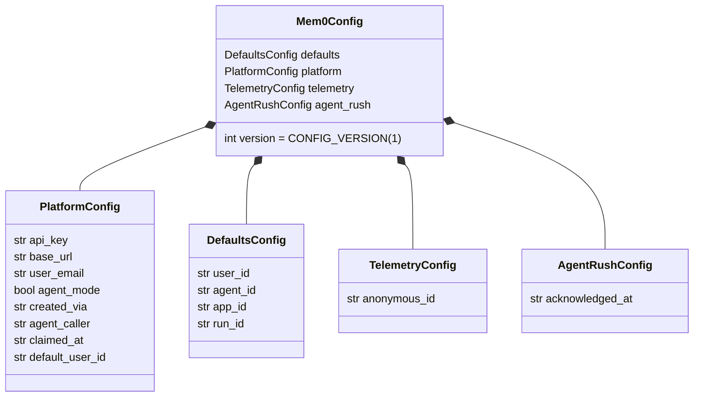
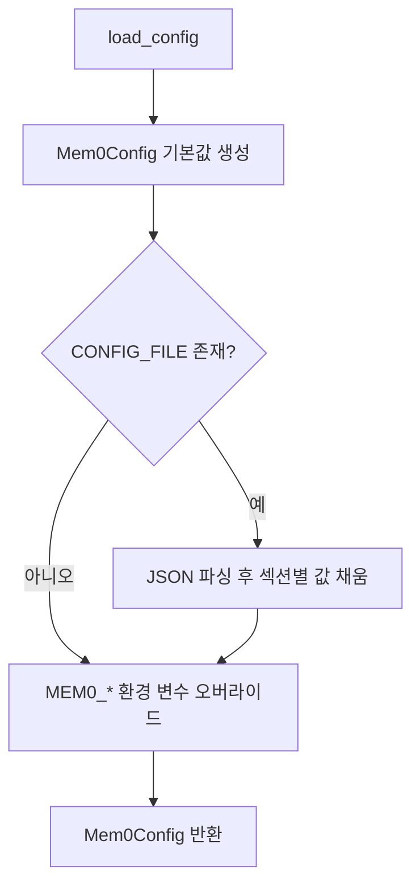
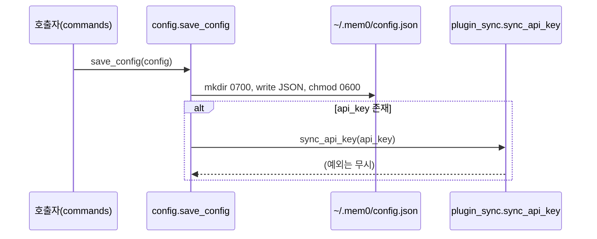
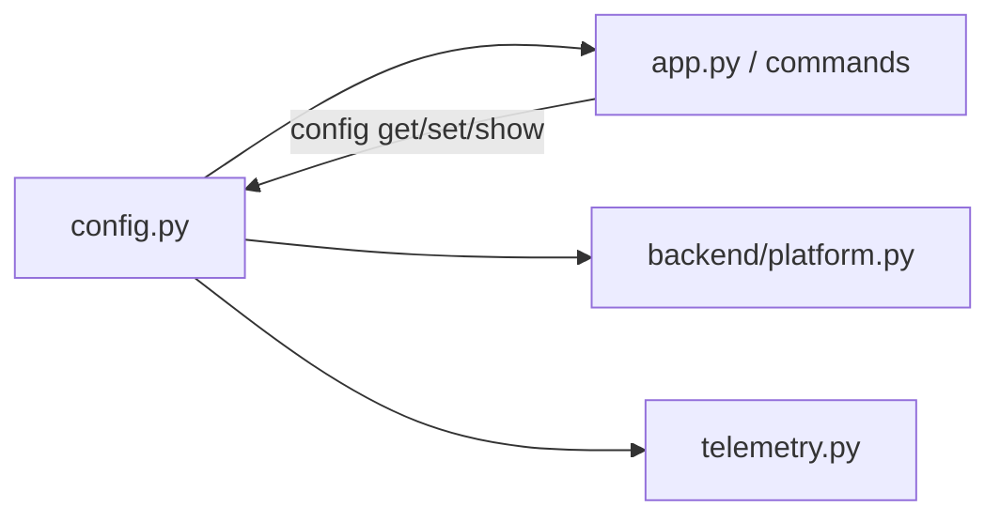

# cli_python_config

`cli/python/src/mem0_cli/config.py`는 Python CLI(`mem0-cli`, 진입점 `mem0`)의 설정을 관리하는 모듈이다. `~/.mem0/config.json`의 읽기/쓰기, 환경 변수 오버라이드, 점 표기법(dotted key) 기반 값 조회·수정, API 키 마스킹을 담당한다.

관련 모듈: [cli_python_app](cli_python_app.md) · [cli_python_backend](cli_python_backend.md) · [cli_python_telemetry](cli_python_telemetry.md) · 빌드/패키징: [cli_python_build_config](cli_python_build_config.md)

## 1. 설정 우선순위

모듈 docstring 기준 (높음 → 낮음):

1. CLI 플래그 (`--api-key`, `--base-url` 등) — 호출 측(`app.py`/commands)에서 처리
2. 환경 변수 (`MEM0_API_KEY`, `MEM0_BASE_URL`, `MEM0_USER_ID`, `MEM0_AGENT_ID`, `MEM0_APP_ID`, `MEM0_RUN_ID`)
3. 설정 파일 `~/.mem0/config.json`
4. 기본값 (`DEFAULT_BASE_URL = "https://api.mem0.ai"`)

`load_config()`는 2~4번을 합성한다. 1번은 이 모듈 밖에서 적용된다.

## 2. 데이터 모델

모두 `@dataclass`이며 중첩 섹션은 `field(default_factory=...)`로 생성된다.

| 클래스 | 역할 |
|---|---|
| `PlatformConfig` | 플랫폼 접속 정보. `agent_mode`는 키가 아직 사람에게 claim되지 않은 에이전트 모드 키인지 표시. `created_via`는 `"agent_mode" \| "email" \| "api_key" \| "existing_key"`. `agent_caller`는 `created_via == "agent_mode"`일 때의 에이전트 이름(예: `claude-code`). `claimed_at`은 claim 시각(ISO). `default_user_id`는 bootstrap이 반환한 `user_<slug>`로 자동 기본값에 사용 |
| `DefaultsConfig` | 명령에서 생략 시 쓰이는 `user_id`/`agent_id`/`app_id`/`run_id` |
| `TelemetryConfig` | 익명 텔레메트리 ID(`anonymous_id`) |
| `AgentRushConfig` | `mem0 agent-rush add` 최초 실행 시 "메모리가 공개됨" 경고를 사람이 승인한 시각(`acknowledged_at`) |
| `Mem0Config` | 위 섹션을 묶는 루트 + `version` |

## 3. 함수

| 함수 | 설명 |
|---|---|
| `ensure_config_dir()` | `~/.mem0` 생성 후 `chmod 0700` |
| `load_config()` | 파일이 있으면 섹션별로 `.get(..., 기본값)`으로 읽고(누락 키 허용), 이후 환경 변수로 덮어씀. 파일이 없으면 기본값 + env |
| `save_config(config)` | 디렉터리 보장 → JSON(indent=2) 기록 → `chmod 0600`. `api_key`가 있으면 `mem0_cli.plugin_sync.sync_api_key`로 기존 플러그인/셸 rc 항목에 키 전파(실패는 무시, best-effort) |
| `redact_key(key)` | 빈 값 `(not set)`, 8자 이하 `ab***`, 그 외 `xxxx...xxxx` |
| `get_nested_value(config, key)` | 짧은 별칭 → 점 경로 변환 후 `getattr` 순회. 없으면 `None` |
| `set_nested_value(config, key, value)` | 경로 검증 후 현재 타입에 맞춰 변환(`bool`: `true/1/yes`, `int`: 파싱 실패 시 `False`). 성공 `True` |

`SHORT_KEY_ALIASES`: `api_key`, `base_url`, `user_email` → `platform.*`; `user_id`, `agent_id`, `app_id`, `run_id` → `defaults.*`.

### 로드 흐름

### 저장 흐름

## 4. 시스템 내 위치

- 명령 계층: `commands/config_cmd.py`(`config get/set/show`, `get_nested_value`/`set_nested_value`/`redact_key` 사용), `init_cmd.py`, `whoami_cmd.py`, `identify_cmd.py`, `agent_mode_cmd.py`(에이전트 키 bootstrap/claim 후 `save_config`), `agent_rush_cmd.py` — [cli_python_app](cli_python_app.md)
- 텔레메트리: `telemetry.py`가 `anonymous_id`를 생성·저장하고 identified 전환 시 비움, 이벤트에 `agent_mode` 첨부 — [cli_python_telemetry](cli_python_telemetry.md)
- 백엔드는 로드된 `platform` 값으로 API 호출 — [cli_python_backend](cli_python_backend.md)

## 5. 유의 사항

- API 키가 평문으로 저장되므로 권한(0700/0600)이 보안의 핵심이다. 출력 시 항상 `redact_key`를 사용한다.
- `load_config()`가 env를 합성하므로, 이후 `save_config()`하면 env 값이 파일에 기록된다(영속화됨).
- `set_nested_value`는 기존 속성 타입만 기준으로 변환하므로 `str` 필드는 검증 없이 대입된다. 알 수 없는 키는 `False`.
- `config.json`이 손상된 JSON이면 `load_config()`는 예외를 그대로 전파한다.
- 이 패키지는 `ruff` line length 100 규칙을 따른다(`cli/python/AGENTS.md`).
