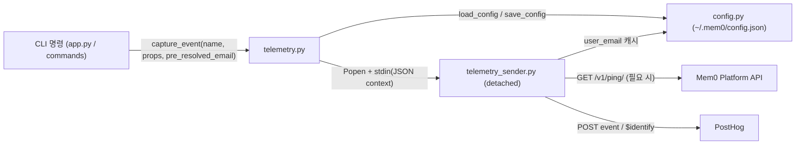
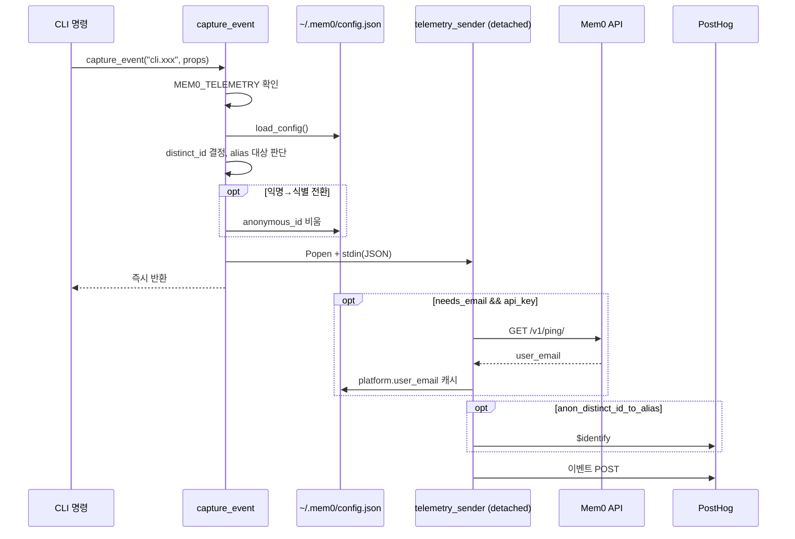
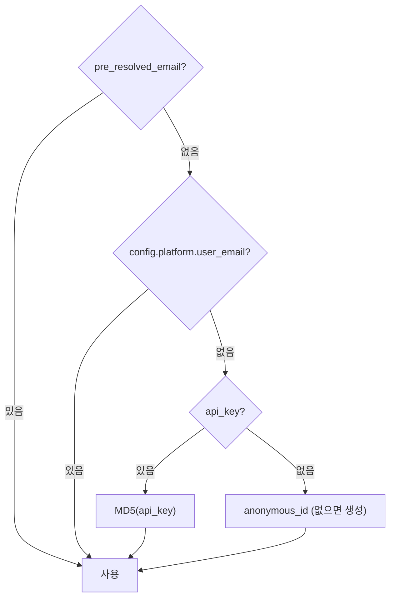

# cli_python_telemetry 모듈

Python CLI(`mem0-cli`, 엔트리포인트 `mem0`)의 익명 사용량 수집 모듈이다. 두 파일로 구성된다.

- `cli/python/src/mem0_cli/telemetry.py` — `capture_event`: 이벤트 페이로드를 만들고 분리된 서브프로세스를 띄운다.
- `cli/python/src/mem0_cli/telemetry_sender.py` — `main`: 서브프로세스에서 실행되며 이메일 해석·캐시·PostHog 전송을 수행한다.

핵심 설계는 **fire-and-forget**이다. 부모 CLI 프로세스는 네트워크를 기다리지 않고 즉시 종료하며, 모든 오류는 조용히 무시된다. `MEM0_TELEMETRY=false`(또는 `0`, `no`)로 끌 수 있다.

## 아키텍처

설정 모델(`TelemetryConfig.anonymous_id`, `PlatformConfig.user_email/api_key/agent_mode/base_url`)은 [cli_python_config](cli_python_config.md)에 정의되어 있다. 호출 측은 [cli_python_app](cli_python_app.md), Platform API 호출은 [cli_python_backend](cli_python_backend.md)를 참고한다.

## 컴포넌트

### `telemetry.py`

| 함수 | 역할 |
|---|---|
| `_is_telemetry_enabled()` | `MEM0_TELEMETRY` 환경변수 확인(기본 `true`). |
| `_get_or_create_anonymous_id()` | `telemetry.anonymous_id`를 읽거나 `cli-anon-<uuid4 hex>`를 생성해 config에 저장(저장 실패는 무시). |
| `_get_distinct_id()` | distinct ID 결정. 우선순위: `platform.user_email` → `MD5(api_key)` → 익명 ID → 임시 UUID. |
| `capture_event(event_name, properties, pre_resolved_email)` | 공개 진입점. 페이로드 구성 후 서브프로세스 스폰. 전체가 `try/except`로 감싸져 예외를 전파하지 않는다. |

`capture_event`가 하는 일:

1. 텔레메트리가 꺼져 있으면 즉시 반환.
2. config를 로드하고 distinct ID 결정(`pre_resolved_email`이 있으면 우선 사용 — 이 경우 sender는 `/v1/ping/`을 다시 호출하지 않음).
3. **익명 → 식별 전환 감지**: 실제 신원(`cli-anon-` 접두사가 아님)으로 해석되었고 저장된 `anonymous_id`가 있으면 `anon_distinct_id_to_alias`로 넘기고, config의 `anonymous_id`를 비워 재-alias를 방지.
4. 페이로드 구성. 기본 속성: `source="CLI"`, `language="python"`, `cli_version`, `agent_mode`, `python_version`, `os`, `os_version`, `$process_person_profile=False`, `$lib="posthog-python"`, 그리고 호출자가 준 `properties`(동일 키는 덮어씀).
5. `subprocess.Popen([sys.executable, "-m", "mem0_cli.telemetry_sender"], start_new_session=True, close_fds=True, stdout/stderr=DEVNULL)`로 실행하고 stdin에 JSON 컨텍스트를 기록.

stdin으로 전달되는 컨텍스트 필드: `payload`, `posthog_host`, `needs_email`(distinct ID가 비었거나 `@`가 없을 때 true), `mem0_api_key`, `mem0_base_url`(기본 `https://api.mem0.ai`), `config_path`, `anon_distinct_id_to_alias`.

> 컨텍스트를 argv가 아닌 stdin으로 전달하는 이유는 API 키가 프로세스 목록에 노출되지 않게 하기 위함으로 보인다(sender는 argv를 레거시 폴백으로만 허용).

### `telemetry_sender.py`

| 함수 | 역할 |
|---|---|
| `_load_context()` | stdin(TTY가 아닐 때)에서 JSON 읽기, 비어 있으면 `argv[1]` 폴백. |
| `main()` | 전체 흐름 제어. |
| `_resolve_and_cache_email(ctx, payload)` | `GET {base_url}/v1/ping/`(헤더 `Authorization: Token <key>`, 타임아웃 10초)로 `user_email` 획득 → `payload["distinct_id"]` 교체 및 캐시. |
| `_cache_email(config_path, email)` | config JSON을 직접 열어 `platform.user_email`을 기록. |
| `_send_identify_event(ctx, payload, anon_id)` | `$identify` 이벤트(`$anon_distinct_id`)로 익명 ID를 최종 신원에 연결. |
| `_send_posthog_event(host, payload)` | PostHog(`https://us.i.posthog.com/i/v0/e/`)에 JSON POST, 타임아웃 10초. |

`if __name__ == "__main__"` 블록에서 `contextlib.suppress(Exception)`로 `main()`을 감싸 어떤 출력도 내지 않는다. 표준 라이브러리(`urllib`, `json`)만 사용해 의존성이 없다.

## 데이터 흐름

### distinct ID 결정

MD5 해시 ID에는 `@`가 없으므로 `needs_email=true`가 되어 sender가 `/v1/ping/`으로 이메일을 얻으면 distinct ID가 이메일로 교체되고 다음 실행부터는 캐시를 사용한다.

## 운영상 유의점

- **끄는 법**: `MEM0_TELEMETRY=false|0|no`.
- **개인정보**: 이메일이 distinct ID로 쓰일 수 있으므로(해석된 경우) 문서/정책 변경 시 주의. 기본 속성에는 `$process_person_profile=False`가 설정되어 있다.
- **Agent Mode**: 모든 이벤트에 `agent_mode`(미청구 agent-mode 키 여부)가 포함되어 init → add → search 퍼널 분석에 쓰인다.
- **경쟁 조건**: sender가 config JSON을 부모와 별개로 읽고 덮어쓰므로(`_cache_email`), 동시 실행 시 마지막 쓰기가 이긴다. 실패는 무시된다.
- **PostHog 키**: `POSTHOG_API_KEY`는 소스에 하드코딩된 공개 프로젝트 키이다.
- **개발 규칙**: `cli/python/`은 ruff 라인 길이 **100**을 사용한다(`cli/python/AGENTS.md` 참조).

## 관련 문서

- [cli_python_config](cli_python_config.md) — `TelemetryConfig`, `PlatformConfig`
- [cli_python_app](cli_python_app.md) — 이벤트를 발생시키는 Typer 명령
- [cli_python_backend](cli_python_backend.md) — Platform API 백엔드
- [cli_node_commands](cli_node_commands.md) — Node CLI 대응 구현
