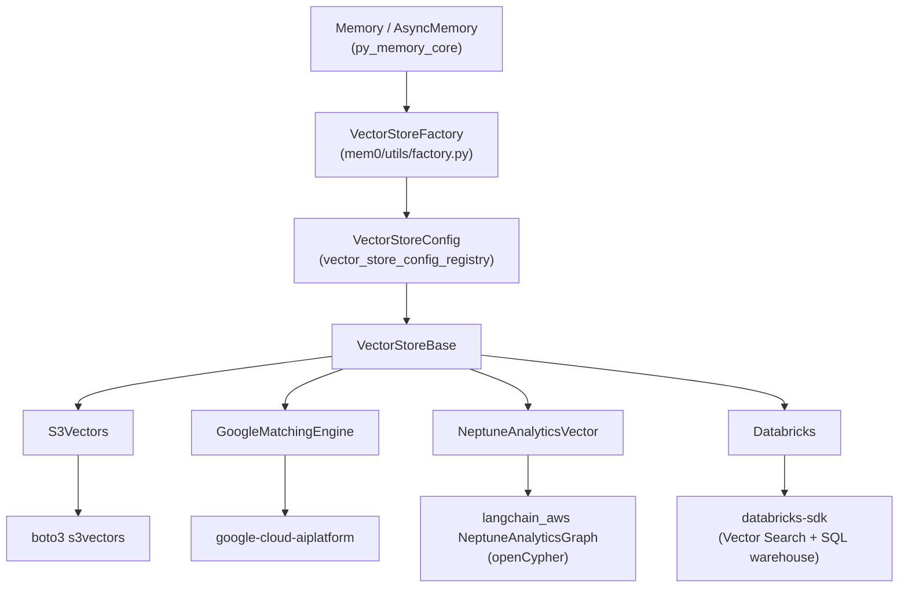
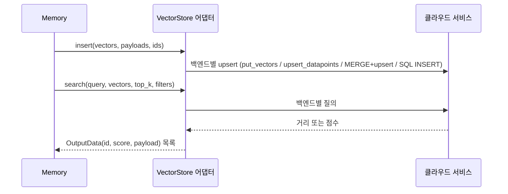

# cloud_platform_vector_stores

## 개요

`cloud_platform_vector_stores`는 Mem0 Python SDK의 벡터 스토어 계층(`py_vector_stores`) 중 **클라우드 플랫폼이 관리하는 벡터 서비스**를 백엔드로 쓰는 어댑터 모음입니다. 모든 어댑터는 `mem0.vector_stores.base.VectorStoreBase`를 상속하고, 각 어댑터에는 Pydantic 설정 클래스가 짝으로 있습니다.

| 백엔드 | 어댑터 | 설정 클래스 | 클라우드 |
|---|---|---|---|
| Amazon S3 Vectors | `S3Vectors` (`mem0/vector_stores/s3_vectors.py`) | `S3VectorsConfig` (`mem0/configs/vector_stores/s3_vectors.py`) | AWS |
| Vertex AI Vector Search (Matching Engine) | `GoogleMatchingEngine` (`mem0/vector_stores/vertex_ai_vector_search.py`) | `GoogleMatchingEngineConfig` (`mem0/configs/vector_stores/vertex_ai_vector_search.py`) | GCP |
| Amazon Neptune Analytics | `NeptuneAnalyticsVector` (`mem0/vector_stores/neptune_analytics.py`) | `NeptuneAnalyticsConfig` (`mem0/configs/vector_stores/neptune.py`) | AWS |
| Databricks Vector Search | `Databricks` (`mem0/vector_stores/databricks.py`) | `DatabricksConfig` (`mem0/configs/vector_stores/databricks.py`) | Databricks (AWS/Azure/GCP) |

이 모듈은 파일 수가 적고 서브모듈로 나눌 만큼 독립된 단위가 없어 별도의 서브모듈 문서는 만들지 않고, 이 문서 하나에 모두 기술합니다.

관련 문서(같은 `py_vector_stores` 계층의 다른 모듈):
- [vector_store_config_registry](vector_store_config_registry.md): `VectorStoreConfig`, provider 이름 → 설정/클래스 매핑
- [local_and_adapter_vector_stores](local_and_adapter_vector_stores.md)
- [dedicated_vector_database_stores](dedicated_vector_database_stores.md)
- [search_engine_and_keyvalue_stores](search_engine_and_keyvalue_stores.md)
- [database_backed_vector_stores](database_backed_vector_stores.md)
- TypeScript 대응 구현: [ts_oss_vector_stores_cloud_platform_vector_stores](ts_oss_vector_stores_cloud_platform_vector_stores.md)

## 아키텍처

`Memory`는 `VectorStoreFactory`로 provider 이름에 맞는 어댑터를 생성하고, 어댑터는 공통 인터페이스(`insert`, `search`, `get`, `update`, `delete`, `list`, `list_cols`, `create_col`, `delete_col`, `col_info`, `reset`)를 구현합니다. 각 어댑터는 클라우드 SDK를 모듈 import 시점에 로드하므로 SDK가 없으면 `ImportError`가 납니다. `S3Vectors`는 `boto3`, `NeptuneAnalyticsVector`는 `langchain_aws`가 필요하다는 메시지를 직접 냅니다.

모든 어댑터가 `OutputData`(또는 `MemoryResult`)로 `id`, `score`, `payload`를 반환하므로 상위 계층은 백엔드를 구분하지 않고 결과를 처리합니다.

## 컴포넌트별 설명

### S3Vectors / S3VectorsConfig

- **설정**: `vector_bucket_name`(필수), `collection_name`(기본 `mem0`), `embedding_model_dims`(기본 1536), `distance_metric`(`cosine` 또는 `euclidean`), `region_name`. `validate_extra_fields`가 정의되지 않은 필드를 거부합니다.
- **초기화**: `boto3.client("s3vectors")`를 만든 뒤 `_ensure_bucket_exists()`로 벡터 버킷을, `create_col()`로 인덱스를 없으면 생성합니다(`NotFoundException`일 때만).
- **점수 변환** (`_distance_to_score`): cosine은 `max(0, 1 - distance)`, euclidean은 거리가 무한대로 커질 수 있어 `1 / (1 + distance)`를 씁니다.
- **update**: `put_vectors` 덮어쓰기로 구현됩니다. `vector=None`이면(메타데이터만 갱신하는 경우) 기존 벡터를 `get_vectors(returnData=True)`로 가져와 다시 씁니다. boto3가 `None` 값을 거부하기 때문입니다. 기존 벡터를 찾지 못하면 경고만 남기고 건너뜁니다.
- **list**: `list_vectors` 페이지네이터로 전부 가져온 뒤 클라이언트 측에서 `filters`를 적용합니다(대규모 인덱스에서는 비용이 큽니다). 반환값은 `[results]` 형태입니다.
- **reset**: 인덱스를 삭제하고 다시 만듭니다.

### GoogleMatchingEngine / GoogleMatchingEngineConfig

- **설정**: `project_id`, `project_number`, `region`, `endpoint_id`, `index_id`, `deployment_index_id`(모두 필수), 선택 항목 `collection_name`(없으면 `index_id`), `credentials_path`, `service_account_json`, `vector_search_api_endpoint`. `extra="forbid"`입니다.
- **초기화**: `collection_name`과 `deployment_index_id` 중 하나만 주어지면 서로 복사합니다. 인증은 서비스 계정 파일, 서비스 계정 JSON 딕셔너리 순으로 확인하고, 둘 다 없으면 기본 자격 증명을 씁니다. 이후 `aiplatform.init`으로 `MatchingEngineIndex`와 `MatchingEngineIndexEndpoint`를 만듭니다.
- **메타데이터 저장 방식**: payload를 `IndexDatapoint.Restriction`(namespace=key, allow_list=[str(value)])으로 변환합니다. 값이 문자열로 저장되므로 조회 시 타입이 복원되지 않습니다. 필터는 `Namespace`로 변환되며, dict 값에는 `include`/`exclude`를 쓸 수 있습니다.
- **인덱스 관리**: 인덱스는 Google Cloud 쪽에서 미리 만들어 둬야 합니다. `create_col`은 no-op이고, `delete_col`과 `reset`은 경고만 남기고 지원하지 않습니다.
- **제약**: `keyword_search`는 `None`을 반환합니다. `get`은 `vector_search_api_endpoint`가 필요하고, 해당 ID를 질의로 `find_neighbors`를 호출하는 방식입니다. `list`는 768차원 영벡터로 검색하는 우회 방식이라 차원이 다르면 맞지 않습니다. `update`는 `vector`가 없으면 빈 벡터로 upsert하므로 주의가 필요합니다.
- **LangChain 호환 메서드**: `add_texts`, `from_texts`, `similarity_search(_with_score)`, `add`가 있지만 `self.embedder`가 별도로 주입되어야 동작합니다.
- **오류 처리**: `delete`는 이미 삭제된 경우(`NotFound`)를 성공으로 보고, 권한 오류 등은 예외 대신 `False`를 반환합니다.

### NeptuneAnalyticsVector / NeptuneAnalyticsConfig

- **설정**: `collection_name`(기본 `mem0`), `endpoint`(`neptune-graph://<graphid>` 형식). `collection_name`은 `^[A-Za-z_][A-Za-z0-9_]*$`로 검증합니다. 이 값이 openCypher 쿼리 문자열에 f-string으로 들어가므로 인젝션 방어 목적입니다.
- **저장 모델**: 벡터는 노드로 저장됩니다. 노드 레이블은 `MEM0_VECTOR_<collection_name>`이고, `MERGE`로 노드와 속성을 쓴 뒤 `neptune.algo.vectors.upsert`로 임베딩을 넣습니다. 컬렉션이 암묵적으로 생성되므로 `create_col`은 no-op입니다.
- **검색**: `neptune.algo.vectors.topKByEmbeddingWithFiltering`을 호출합니다. 필터는 `_validate_filter`(키 정규식, 값 타입 검사)와 `_escape_cypher`를 거쳐 `nodeFilter`로 변환됩니다.
- **update 보상 로직**: payload와 vector를 동시에 갱신할 때는 기존 속성을 먼저 저장해 둡니다. 임베딩 upsert가 실패하거나 `success`가 `True`가 아니면 기존 속성으로 복원합니다. Neptune 벡터 인덱스가 트랜잭션을 지원하지 않기 때문에 이는 롤백이 아니라 최선 노력 보상이며, 같은 `vector_id`에 단일 작성자를 가정합니다.
- **기타**: `col_info`는 no-op, `reset`은 `delete_col`(레이블이 같은 노드 전체를 `DETACH DELETE`)과 같습니다.

### Databricks / DatabricksConfig

- **설정**: `workspace_url`, `endpoint_name`, `catalog`, `schema`, `table_name`은 필수이고 `collection_name`(기본 `mem0`), `index_type`(`DELTA_SYNC`/`DIRECT_ACCESS`), `endpoint_type`, `pipeline_type`, `query_type`(`ANN`/`HYBRID`), `embedding_dimension`, `embedding_model_endpoint_name`, `warehouse_name` 등이 있습니다. `validate_authentication`은 `access_token`, 서비스 프린시펄(`client_id`/`client_secret`), Azure AD(`azure_client_id`/`azure_client_secret`) 중 하나가 없으면 오류를 냅니다.
- **초기화**: `WorkspaceClient`를 만들고 이름으로 SQL warehouse ID를 찾은 뒤, 엔드포인트가 없으면 만들고(`_ensure_endpoint_exists`), 인덱스가 없으면 소스 Delta 테이블(`_ensure_source_table_exists`, 변경 데이터 피드 활성화, `memory_id` 기본 키)과 인덱스를 생성합니다. `catalog`, `schema`, `table_name`, `collection_name`은 `_validate_identifier`로 검증합니다.
- **쓰기 경로**: 인덱스가 아니라 **Delta 테이블에 SQL**로 씁니다. `insert`, `update`, `delete`가 `statement_execution.execute_statement`로 실행되고, 값은 `StatementParameterListItem` 바인딩을 씁니다. 배열(임베딩)만 `_format_sql_value`로 인라인합니다. `DELTA_SYNC`는 테이블 변경이 인덱스에 동기화되고, 반영 시점은 `pipeline_type`에 따라 달라집니다.
- **읽기 경로**: `vector_search_indexes.query_index`를 호출합니다. 모델 엔드포인트가 있는 `DELTA_SYNC`는 `query_text`를, 그 외에는 `query_vector`를 씁니다. `keyword_search`는 `FULL_TEXT` 질의이며 `DIRECT_ACCESS`에서는 `None`을 반환합니다. `get`과 `list`는 영벡터 또는 공백 텍스트로 질의하는 우회 방식입니다.
- **reset**: 인덱스와 소스 테이블을 삭제하고 둘 다 다시 만듭니다. 데이터가 모두 사라집니다.
- **참고**: `update`는 `excluded_keys`(`user_id`, `data` 등)에 속한 payload 키를 건너뜁니다.

## 공통 동작 비교

| 항목 | S3Vectors | GoogleMatchingEngine | NeptuneAnalyticsVector | Databricks |
|---|---|---|---|---|
| 컬렉션 생성 | 버킷·인덱스 자동 생성 | 사전 생성 필요(no-op) | 암묵적 생성(no-op) | 엔드포인트·테이블·인덱스 자동 생성 |
| `keyword_search` | 정의 없음 | `None` | 정의 없음 | `FULL_TEXT`(`DELTA_SYNC`만) |
| `reset` | 인덱스 재생성 | 미지원 | 노드 전체 삭제 | 테이블·인덱스 재생성 |
| 필터 처리 | 서버 측 `filter` / `list`는 클라이언트 측 | `Namespace` 제한 | `nodeFilter` | `filters_json` |

## 사용상 유의점

- 각 SDK(`boto3`, `google-cloud-aiplatform`, `langchain_aws`, `databricks-sdk`)는 선택 의존성입니다. 루트 `CLAUDE.md` 규칙에 따라 코어 `dependencies`에 넣지 않습니다. 어떤 optional 그룹이 있는지는 루트 `pyproject.toml`을 확인하세요.
- 설정은 [vector_store_config_registry](vector_store_config_registry.md)의 `VectorStoreConfig`를 통해 provider 이름으로 선택됩니다. 이 문서의 코드만으로는 provider 이름 문자열을 확인할 수 없어 적지 않았습니다.
- 인젝션 방어는 백엔드마다 다릅니다. Neptune은 식별자·필터 검증과 이스케이프, Databricks는 식별자 검증과 파라미터 바인딩을 씁니다. 새 필터 경로를 추가할 때는 같은 방식으로 검증해야 합니다.
