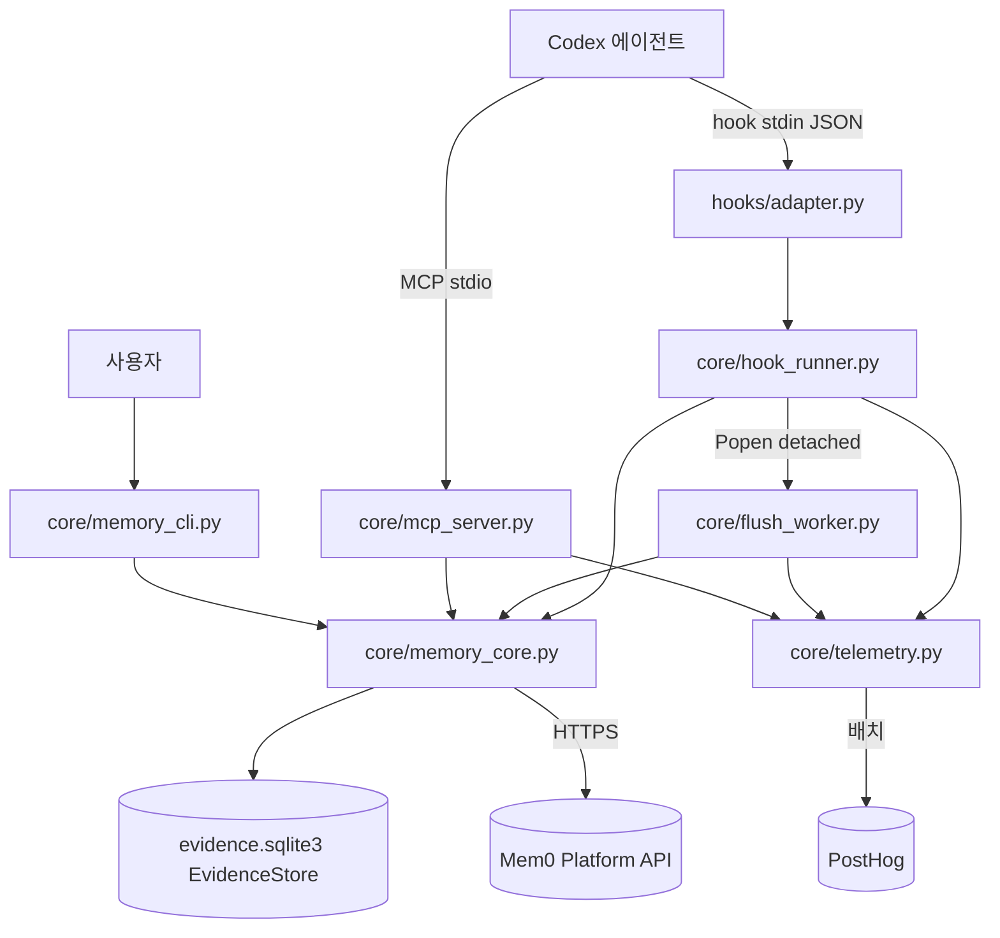
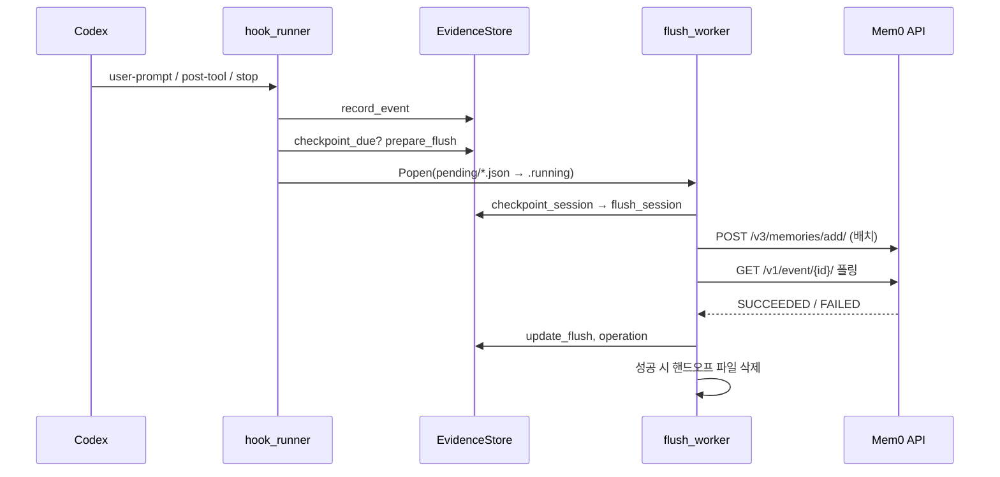

# codex_plugin 모듈

`integrations/codex-plugin`은 OpenAI **Codex** 코딩 에이전트에 Mem0 장기 메모리를 붙이는 플러그인이다. 세션 중 발생하는 프롬프트·도구 호출·응답·서브에이전트 결과를 로컬 SQLite에 기록하고, 체크포인트 시점에 Mem0 플랫폼(`/v3/memories/add/`)으로 보내 메모리를 추출시키며, 이후 작업에서 `search_memories` MCP 도구 및 첫 프롬프트 자동 주입으로 회상한다.

`core/` 아래 파일은 공통 코어(`integrations/agent-plugin-core/python`)를 빌드 단계에서 복사한 것이며, Codex 고유 로직은 `hooks/adapter.py` 한 파일뿐이다. 공통 코어와 빌드/적합성 검사는 [agent_plugin_core_python](agent_plugin_core_python.md), [agent_plugin_core_build_conformance](agent_plugin_core_build_conformance.md)를 참고한다. 형제 플러그인([claude_code_plugin](claude_code_plugin.md), [cursor_plugin](cursor_plugin.md), [antigravity_plugin](antigravity_plugin.md), [kimi_plugin](kimi_plugin.md), [mem0_agent_plugin](mem0_agent_plugin.md))도 동일한 코어를 공유한다.

## 구성 요소

| 파일 | 역할 |
|---|---|
| `hooks/adapter.py` | Codex 훅 진입점. 하니스 설정, 서브에이전트/도구 훅 매핑 (`_subagent_start`, `_subagent_stop`, `_post_tool`) |
| `core/hook_runner.py` | 훅 액션 디스패처 (`entry_point`, `default_record_stop`), 핸드오프 스케줄링 |
| `core/memory_core.py` | `EvidenceStore`(SQLite), 저장소 식별, 에피소드 구성, 플랫폼 호출, `doctor`, `forget_remote_repo` |
| `core/flush_worker.py` | 분리(detached) 프로세스로 실행되는 원격 체크포인트 워커 |
| `core/mcp_server.py` | stdio JSON-RPC MCP 서버, 도구 `search_memories` 1개 노출 |
| `core/memory_cli.py` | `status`/`doctor`/`pause`/`resume`/`forget` 사용자 제어 CLI |
| `core/telemetry.py` | 로컬 스풀 기반 사용 텔레메트리 (PostHog 배치 전송) |

## 아키텍처



## hooks/adapter.py

- `sys.path`에 번들된 `core/`(없으면 `../../core/python`)를 넣고 `configure_harness("codex", data_dir_name="codex-plugin", source_tag="codex_plugin")`, `telemetry.init(harness="codex", source_tag="CODEX_PLUGIN")`를 호출한다.
- `hook_runner.entry_point()`에 추가 액션 `subagent-start`, `subagent-stop`, `codex-post-tool`을 등록하고 `automatic_flush_reasons={"session-end", "pre-compact"}`를 지정한다.
- CLI 인자 `post-tool`은 `codex-post-tool`로 치환되어 Codex 전용 `_post_tool`이 실행된다. 이 함수는 `tool_response`의 `exit_code` → `isError` → `success` 순으로 실패 여부를 판정(알 수 없으면 `None`)하고 `record_tool`로 기록한다.
- `_subagent_start`는 메인 대화에서 이미 주입된 메모리를 `SubagentStart`의 `additionalContext`로 최초 1회만 전달한다.

## 훅 액션 흐름 (`hook_runner.run`)

| 액션 | 동작 |
|---|---|
| `session-start` | API 키 캐시 정리, 설치/업그레이드 이벤트 청구, 미완료 핸드오프 복구(`recover_pending_handoffs`), 세션 시작 기록 |
| `user-prompt` | 프롬프트 기록. 세션 첫 프롬프트이고 길이가 `MEM0_CODE_MIN_QUERY_CHARS`(기본 20) 이상이면 검색 후 `UserPromptSubmit` 컨텍스트 주입 |
| `post-tool` | 도구 호출을 요약·삭제(redact)하여 기록 |
| `stop` | 응답 기록 후 주기적 체크포인트 또는 유휴(idle) 플러시 예약 |
| `flush` | `--reason`에 따라 분리 워커 실행 (`session-end`, `pre-compact` 등) |

일시정지(`store.is_paused()`) 상태이면 세션 시작 외에는 아무것도 하지 않는다. 최상위 `entry_point`는 모든 예외를 `plugin-errors.log`에 기록하고 종료 코드 0으로 끝내 **훅이 에이전트를 막지 않도록(fail-open)** 한다.



## 핸드오프와 flush_worker

- 종료 시 훅이 취소될 수 있으므로 `hand_off_flush`가 입력을 `data_dir()/pending/<digest>-<uuid>.json`에 원자적으로 저장하고 `.running`으로 이름을 바꾼 뒤 `detached_process_kwargs()`로 워커를 분리 실행한다(POSIX는 `start_new_session`, Windows는 `DETACHED_PROCESS`).
- 워커는 `delay_seconds`(유휴 플러시)만큼 대기하다 파일이 사라지면 종료하고, `wait_for_inflight`이면 진행 중 플러시가 끝날 때까지 `touch_handoff_heartbeat`로 파일 mtime을 갱신하며 기다린다(`MEM0_CODE_EXTRACTION_WAIT_SECONDS`, 기본 120초).
- `semantic-succeeded`/`explicitly-stored`/`nothing-to-flush`이면 파일을 삭제하고, 아니면 `.running`을 `.json`으로 되돌려 재시도 대상으로 남긴다. 300초 넘게 갱신되지 않은 `.running`은 복구되며, 7일 지난 대기 파일은 삭제된다. 한 번에 최대 5개를 재실행한다.

## memory_core 핵심

**저장소 식별** — `resolve_repo`는 git remote를 정규화해 `identity`, `app_id`, `project_id`(호스트 해시 포함), 하위 `directory`를 만든다. `repo_for_session`은 세션의 첫 스코프를 `session_scopes`에 고정해 모든 훅이 동일 범위를 쓰게 한다. 와일드카드(`*`) 식별자는 `_scope_value`가 거부한다.

**EvidenceStore 테이블** — `events`, `session_scopes`, `flushes`, `retrievals`, `operations`, `sidekick_runs`(서브에이전트 실행), `settings`. WAL 모드이며 손상된 DB는 `.corrupt-<ts>`로 격리 후 재생성한다.

**체크포인트 선택** — `select_checkpoint_events`는 완료된 교환 5개(`CHECKPOINT_EXCHANGES`), 메시지 10개, 원문 40,000자 중 하나를 넘으면 한 블록을 잘라낸다(`force`이면 전부). `flushes.attempts`가 5회(`MAX_FLUSH_ATTEMPTS`)에 이르면 `gave-up` 처리한다.

**flush_session** — `build_episode`로 구조화 에피소드를 만들고 `build_extraction_messages`로 메시지를 구성, `extraction_message_batches`로 24,000 토큰 예산에 맞춰 분할 후 `/v3/memories/add/`에 `infer: true`와 함께 전송한다. 본문에는 `agent_id`(project_id), `user_id`, `app_id`, `run_id`(세션), 커스텀 카테고리 5종(`project_knowledge`, `decisions_and_constraints`, `workflows`, `problems_and_fixes`, `results`)과 프로젝트/개인 메모리 지침이 포함된다. 이벤트 ID는 `flushes.semantic_event_id`에 JSON 목록으로 저장되어 재시도 시 이어서 진행한다.

**search_memories** — `_search_filters`가 범위(`repo` 기본, `dir`, `mine`)에 따라 공유 레인(`agent_id`+`app_id`)과 개인 레인(`user_id`+`app_id`)을 OR로 결합한다. `category`, `run_id` 필터를 추가할 수 있고 `top_k`는 1–20으로 제한된다. 세션 내 이미 보여준 메모리는 `retrievals`로 중복 제거한다. `task_episode` 레코드는 제외된다.

**보안/프라이버시** — `redact`가 API 키, 토큰, 비밀번호, 개인 키 블록 등을 `[REDACTED]`로 치환한다. API 키는 `cache_plugin_api_key`가 `0600` 권한 파일로 보관하고 `clear_stale_api_key_cache`가 원본이 사라지면 지운다. 플랫폼 요청 헤더에는 `X-Mem0-Source`, `X-Mem0-Client: mem0-plugin/<버전>`이 포함된다(`platform_headers`).

**운영 도구** — `doctor`는 Python≥3.10, 데이터 디렉터리, API 키, 저장소, user_id, 인증(읽기 전용 검색 1회)을 점검한다. `forget_remote_repo`는 해당 사용자·저장소 메모리를 페이지 단위로 조회해 삭제하며 `include_project_memory`일 때만 공유 프로젝트 메모리도 지운다.

## MCP 서버 (`core/mcp_server.py`)

stdin 한 줄당 JSON-RPC 한 메시지를 처리한다. `initialize`, `ping`, `tools/list`, `tools/call`을 지원하고 도구 `search_memories`(`readOnlyHint`, `idempotentHint`)만 노출한다. 인자는 `query`(필수, ≤2000자), `top_k`, `category`, `scope`, `run_id`이며 알 수 없는 인자는 거부한다. 작업 디렉터리는 요청 `_meta["x-codex-turn-metadata"].workspaces`의 첫 경로를 우선 사용한다. 종료 시 `telemetry.spawn_flush()`를 호출한다.

## CLI (`core/memory_cli.py`)

```
memory_cli.py [--plugin-data-dir DIR] [--harness NAME] <status|doctor|pause|resume|forget>
forget --yes [--remote] [--include-project-memory]
```
`forget`은 `--yes` 없이는 삭제를 거부하며(종료 코드 2), 로컬 데이터는 `forget_local_repo`로 지운다. `doctor`는 실패 항목이 있으면 종료 코드 1을 반환한다.

## 텔레메트리 (`core/telemetry.py`)

- `record`는 네트워크를 건드리지 않고 `telemetry.jsonl` 스풀에 한 줄을 추가한다(256KB 상한). 전송은 분리된 `python3 telemetry.py`(`spawn_flush`)가 `flush`로 100건 단위 배치 처리한다.
- 프롬프트, 메모리 텍스트, 경로, 키 등은 `_PRIVATE_KEYS`로 제거되고, 저장소/세션 식별자는 설치별 랜덤 솔트로 해시한 값(`repo_hash`, `session_hash`)만 전송한다. 솔트를 저장할 수 없으면 해시를 생략한다.
- `claim_install`/`claim_version_change`는 `O_CREAT|O_EXCL`로 설치·업그레이드 이벤트를 한 번만 기록한다. 전송 실패 시 claim 파일(`*.sending`)은 시도 횟수를 파일명에 담아 최대 3회까지 재시도하며, 7일이 지나면 폐기된다.
- `MEM0_TELEMETRY=false`로 비활성화한다. 계정 이메일(`/v1/ping/`)과 연결되므로 익명이 아니다.

## 주요 환경 변수

| 변수 | 의미 |
|---|---|
| `MEM0_API_KEY`, `PLUGIN_OPTION_API_KEY` | API 키 |
| `MEM0_API_URL` | 기본 `https://api.mem0.ai` |
| `MEM0_CODE_DATA_DIR` / `MEM0_PLUGIN_DATA_DIR` | 데이터 디렉터리 (기본 `~/.mem0/codex-plugin`) |
| `MEM0_CODE_AUTO_FLUSH` | 자동 플러시 on/off (기본 true) |
| `MEM0_CODE_IDLE_FLUSH_SECONDS` | 유휴 플러시 지연 (기본 300) |
| `MEM0_CODE_SYNC_FLUSH` | `1`이면 동기 플러시 |
| `MEM0_CODE_SEARCH_SCOPE`, `MEM0_CODE_TOP_K`, `MEM0_CODE_MAX_CONTEXT_CHARS` | 검색 범위/개수/컨텍스트 길이 |
| `MEM0_TELEMETRY` | 텔레메트리 on/off |

## 참고

- `core/` 파일은 공통 코어의 생성물이므로 수정은 `integrations/agent-plugin-core/python`에서 하고 빌드로 반영한다. 빌드/검증은 [agent_plugin_core_build_conformance](agent_plugin_core_build_conformance.md)를 참고한다.
- 호스팅 플랫폼 클라이언트 계약은 [py_hosted_client](py_hosted_client.md)와 비교해 볼 수 있다.
- CI는 `.github/workflows/agent-plugins-python-checks.yml`에서 수행된다([integrations_ci_cd](integrations_ci_cd.md)).
