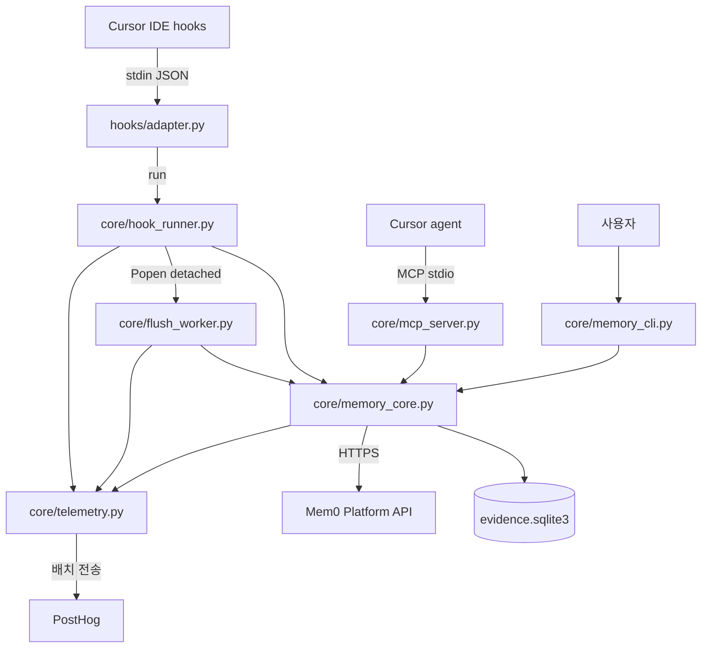
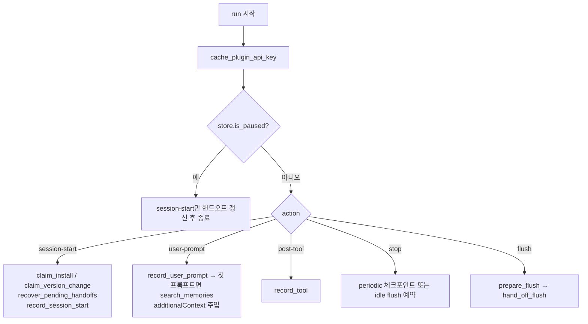
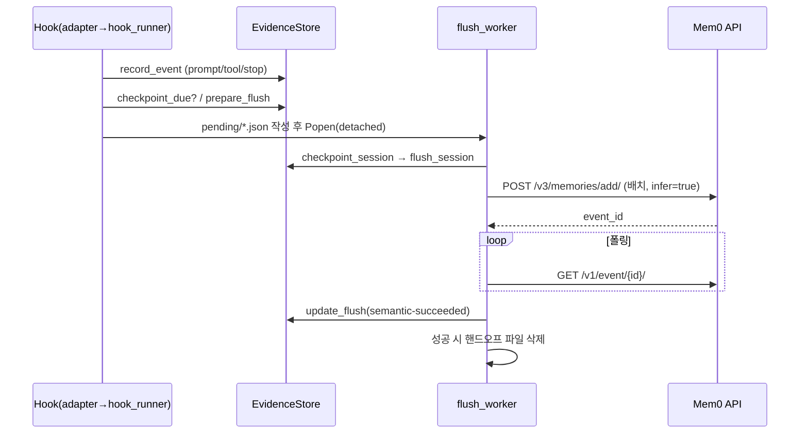

# cursor_plugin 모듈

`integrations/cursor-plugin`은 **Cursor IDE**의 네이티브 훅을 공유 Mem0 에이전트 플러그인 런타임에 연결하는 어댑터입니다. 코딩 세션 중 발생한 사건(프롬프트, 도구 호출, 어시스턴트 응답, 서브에이전트)을 로컬 SQLite에 기록하고, 세션 경계(`session-end`, `pre-compact`, 주기/유휴 체크포인트)에서 Mem0 플랫폼(`/v3/memories/add/`)으로 보내 메모리를 추출합니다. 이후 첫 프롬프트 자동 검색과 MCP 도구 `search_memories`로 해당 저장소의 과거 작업을 회상합니다.

`core/` 하위 파일은 [agent_plugin_core_python](Coding-Agent_Memory_Plugins_and_Shared_Plugin_Core.md)의 공유 소스를 빌드 시 복사·생성한 것이며([agent_plugin_core_build_conformance](Coding-Agent_Memory_Plugins_and_Shared_Plugin_Core.md) 참조), Cursor 고유 코드는 `hooks/adapter.py` 하나뿐입니다. 형제 모듈: [claude_code_plugin](Coding-Agent_Memory_Plugins_and_Shared_Plugin_Core.md), [codex_plugin](Coding-Agent_Memory_Plugins_and_Shared_Plugin_Core.md), [antigravity_plugin](Coding-Agent_Memory_Plugins_and_Shared_Plugin_Core.md), [kimi_plugin](Coding-Agent_Memory_Plugins_and_Shared_Plugin_Core.md).

## 구성 요소

| 파일 | 역할 | 핵심 심볼 |
|------|------|-----------|
| `hooks/adapter.py` | Cursor 훅 이벤트 → 공유 런타임 액션 변환 | `main`, `normalize`, `_record_failure`, `_record_response` |
| `core/hook_runner.py` | 훅 오케스트레이션(액션 분기, 핸드오프, 복구) | `run`, `entry_point`, `default_record_stop` |
| `core/memory_core.py` | 증거 저장소, 저장소 식별, 추출/검색/삭제, doctor | `EvidenceStore`, `checkpoint_session`, `search_memories`, `forget_remote_repo`, `doctor` |
| `core/flush_worker.py` | 분리(detached) 체크포인트 워커 | `main` |
| `core/mcp_server.py` | stdio JSON-RPC MCP 서버(`search_memories` 도구 1개) | `main`, `handle_request` |
| `core/memory_cli.py` | `status`/`doctor`/`pause`/`resume`/`forget` CLI | `main` |
| `core/telemetry.py` | 로컬 스풀 기반 PostHog 텔레메트리 | `record`, `spawn_flush`, `claim_install`, `claim_version_change` |

## 아키텍처

## 훅 어댑터 (`hooks/adapter.py`)

`EVENTS` 매핑으로 Cursor 이벤트를 공유 액션으로 바꿉니다.

| Cursor 이벤트 | 액션 |
|---|---|
| `sessionStart` | `session-start` |
| `beforeSubmitPrompt` | `user-prompt` |
| `postToolUse` | `post-tool` |
| `postToolUseFailure` | `post-tool-failure` (`extra_actions`) |
| `afterAgentResponse` | `assistant-stop` (`extra_actions`) |
| `stop` | `stop` |
| `sessionEnd` / `preCompact` | `flush --reason session-end` / `pre-compact` |

`normalize`가 Cursor 필드를 공유 필드로 맞춥니다: `conversation_id`→`session_id`, `workspace_roots[0]`→`cwd`, `tool_output`/`error_message`→`tool_response`, `text`/`summary`→`last_assistant_message`. 이후 `configure_harness("cursor", data_dir_name="cursor-plugin", source_tag="cursor_plugin")`와 `telemetry.init`을 호출하고, `sys.argv`/`sys.stdin`을 재작성해 `hook_runner.run(...)`을 stdout 억제 상태로 실행합니다. `sessionStart`에서는 `PLUGIN_OPTION_*` 환경변수(API 키, user id, top_k 등)를 `{"env": ...}` JSON으로 출력해 이후 훅에 전달합니다. 최상위에서 예외는 `log_failure`로 기록하고 종료 코드 0을 반환합니다(훅은 항상 fail-open).

## 훅 오케스트레이션 (`core/hook_runner.py`)

핵심 정책:
- **첫 프롬프트 검색**: 프롬프트가 `MEM0_CODE_MIN_QUERY_CHARS`(기본 20) 이상일 때 `top_k=5`, 타임아웃 2초로 검색하고 `hookSpecificOutput.additionalContext`로 반환.
- **핸드오프**: `pending/*.json`에 입력을 먼저 영속화한 뒤 `flush_worker.py`를 새 세션/프로세스 그룹으로 실행(`detached_process_kwargs`). 호스트가 훅을 취소해도 유실되지 않습니다. 복구: `.running` 파일이 300초(`STALE_RUNNING_SECONDS`) 넘게 갱신 안 되면 `.json`으로 되돌리고, 7일 초과분은 삭제, 한 번에 최대 5개(`PENDING_LAUNCH_LIMIT`) 재실행.
- **자동 플러시**: `MEM0_CODE_AUTO_FLUSH`(기본 true), 유휴 플러시 `MEM0_CODE_IDLE_FLUSH_SECONDS`(기본 300), 동기 모드 `MEM0_CODE_SYNC_FLUSH=1`. Cursor는 `automatic_flush_reasons={"session-end","pre-compact"}`로 지정.

## 증거 저장소와 추출 (`core/memory_core.py`)

`EvidenceStore`는 `data_dir()`(기본 `~/.mem0/cursor-plugin`)의 `evidence.sqlite3`(WAL)를 관리합니다. 테이블: `events`, `session_scopes`, `flushes`, `retrievals`, `operations`, `sidekick_runs`(서브에이전트), `settings`. DB가 손상되면 `_quarantine`으로 `.corrupt-<ts>`로 옮기고 새로 시작합니다.

- **체크포인트 기준**: 완료된 교환 5개, 메시지 10개 또는 원문 40,000자 중 하나 충족(`select_checkpoint_events`). 교환을 쪼개지 않습니다. 강제(`force`) 시 남은 전부.
- **재시도**: `flushes.attempts`가 5회(`MAX_FLUSH_ATTEMPTS`) 이상이면 `gave-up`. 추출 이벤트는 `MEM0_CODE_EXTRACTION_WAIT_SECONDS`(기본 120)까지 대기. 입력은 토큰 추정 24,000 기준으로 `extraction_message_batches`가 분할.
- **쓰기 스코프**: `agent_id`=project_id(공유 프로젝트 메모리), `user_id`=개인 선호, `app_id`=저장소, `run_id`=세션. `PROJECT_MEMORY_INSTRUCTIONS`/`PERSONAL_MEMORY_INSTRUCTIONS`와 5개 `CODING_MEMORY_CATEGORIES`(project_knowledge, decisions_and_constraints, workflows, problems_and_fixes, results)를 함께 전송. 와일드카드(`*`) 식별자는 `_scope_value`가 거부.
- **검색**: `search_memories`가 `/v3/memories/search/`에 호출. 범위 `repo`(기본)/`dir`/`mine`(`_search_filters`), `category`·`run_id` 필터, `task_episode` 제외, 세션 내 중복 제거(`unseen`, `mark_injected`), 결과는 `format_context`로 예산(기본 4000자, 1000~10000) 내 포맷.
- **저장소 식별**: git remote 정규화 → `identity`, 없으면 `local:<root>`. `_legacy_project_id`가 이전 플러그인 네임스페이스와 호환.
- **보안**: `redact`가 API 키·토큰·개인키 패턴을 마스킹, `bounded`로 길이 제한. API 키 캐시 파일은 `0600`(`cache_plugin_api_key`), 키 소스가 사라지면 `clear_stale_api_key_cache`.
- **서브에이전트**: `record_subagent_start/stop`이 메인 턴에 주입된 메모리를 재사용(`combine_context`로 중복 제거). Cursor 어댑터의 `EVENTS`에는 연결돼 있지 않아 이 경로는 현재 Cursor 훅에서 호출되지 않습니다(공유 코드 보유).

## MCP 서버 (`core/mcp_server.py`)

프로토콜 `2024-11-05`, stdio 한 줄당 JSON-RPC 1건. 메서드: `initialize`, `ping`, `tools/list`, `tools/call`. 도구 `search_memories`(read-only, idempotent) 입력: `query`(필수, ≤2000자), `top_k`(1–20), `category`, `scope`(`repo`/`dir`/`mine`), `run_id`. 검증 실패는 `isError` 응답, 알 수 없는 메서드는 `-32601`. 종료 시 `telemetry.spawn_flush()`.

## 관리 CLI (`core/memory_cli.py`)

| 명령 | 동작 |
|---|---|
| `status [--json]` | 일시정지 여부, 저장소, 이벤트/플러시/회수 수, 마지막 작업 |
| `doctor [--json]` | Python≥3.10, 데이터 디렉터리, API 키, 저장소, user_id, 인증(읽기 전용 검색) 점검. 실패 시 종료 코드 1 |
| `pause` / `resume` | `settings.paused` 토글(일시정지 시 훅은 기록·검색 중단) |
| `forget --yes [--remote] [--include-project-memory]` | 로컬 저장소 데이터 삭제, `--remote`면 Mem0의 사용자/저장소 범위 메모리도 삭제. 공유 프로젝트 메모리는 옵션 지정 시에만 |

## 텔레메트리 (`core/telemetry.py`)

- `record`는 네트워크를 쓰지 않고 `telemetry.jsonl` 스풀(256KB 상한)에 한 줄 추가. 분리 프로세스 `python3 telemetry.py`(`spawn_flush`)가 100건 단위로 PostHog에 배치 전송.
- 프롬프트·메모리 본문·경로·키는 전송하지 않으며(`_PRIVATE_KEYS` 필터) 저장소/세션 ID는 설치별 랜덤 솔트로 해시. 솔트를 저장할 수 없으면 해시 속성을 생략.
- 클레임 파일(`telemetry-*-aN.sending`)로 단일 송신자 보장, 최대 3회 재시도(`MAX_CLAIM_ATTEMPTS`), 쿨다운 후 재획득.
- `claim_install`/`claim_version_change`는 `O_CREAT|O_EXCL`로 install/upgrade 이벤트를 1회만 기록. `error_kind`는 오류를 내용 없는 분류로 축약.
- 비활성화: `MEM0_TELEMETRY=false`. 계정 키가 있으면 `/v1/ping/`으로 이메일을 해석해 식별(익명이 아님).

## 주요 환경변수

| 변수 | 용도 |
|---|---|
| `MEM0_API_KEY` / `PLUGIN_OPTION_API_KEY` | API 키 |
| `MEM0_API_URL` | 기본 `https://api.mem0.ai` |
| `MEM0_CODE_DATA_DIR` / `MEM0_PLUGIN_DATA_DIR` | 데이터 디렉터리 |
| `MEM0_CODE_USER_ID`, `MEM0_USER_ID` | 사용자 식별 |
| `MEM0_CODE_TOP_K`, `MEM0_CODE_MAX_CONTEXT_CHARS`, `MEM0_CODE_SEARCH_SCOPE` | 검색 설정 |
| `MEM0_CODE_SEARCH_ONCE_PER_SESSION` | 세션당 1회 검색 제한 |
| `MEM0_TELEMETRY` | 텔레메트리 on/off |

## 유지보수 참고

- `core/*.py`는 공유 소스의 빌드 산출물입니다. 수정은 `integrations/agent-plugin-core/python/`에서 하고 `build/build.py`, `build/validate.py`, `conformance/run.py`로 검증하세요(스키마: `build/schemas/plugin.schema.json`, `mcp.schema.json`, 마켓플레이스: 루트 `marketplace.json`). CI는 `.github/workflows/agent-plugins-python-checks.yml`(관련: [CI_CD_and_Repository_Governance](CI_CD_and_Repository_Governance.md)).
- `_harness_id` 모듈(`PLATFORM_SOURCE`, `PLATFORM_APPLICATION`, `HARNESS_ID`)은 빌드가 호스트별로 생성하며 `X-Mem0-Source`/`X-Application` 헤더와 텔레메트리 `source`를 결정합니다.
- 모든 훅 경로는 fail-open이어야 합니다: 예외는 `plugin-errors.log`에 기록하고 호스트에는 0을 반환합니다.
