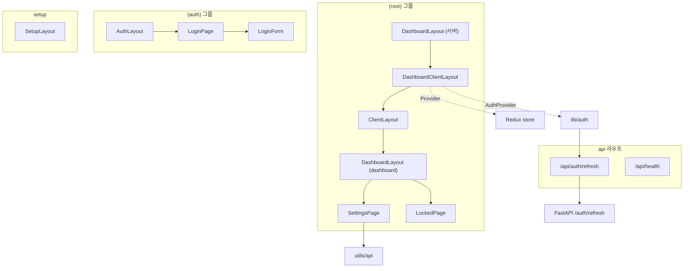
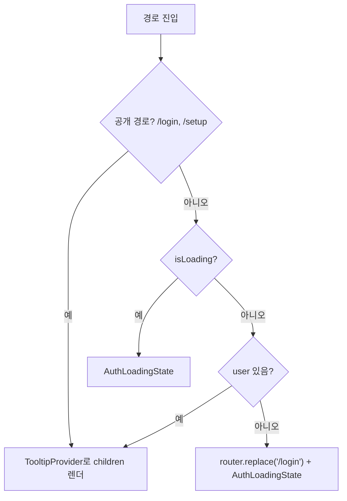
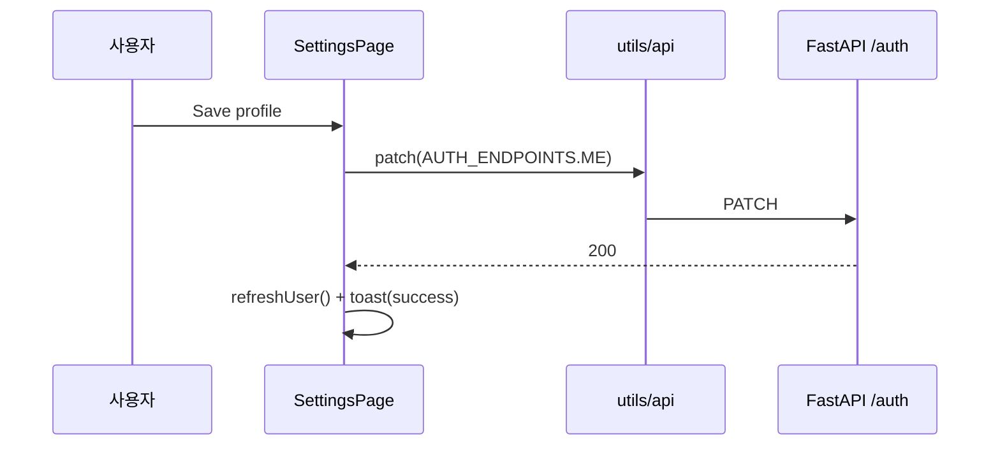
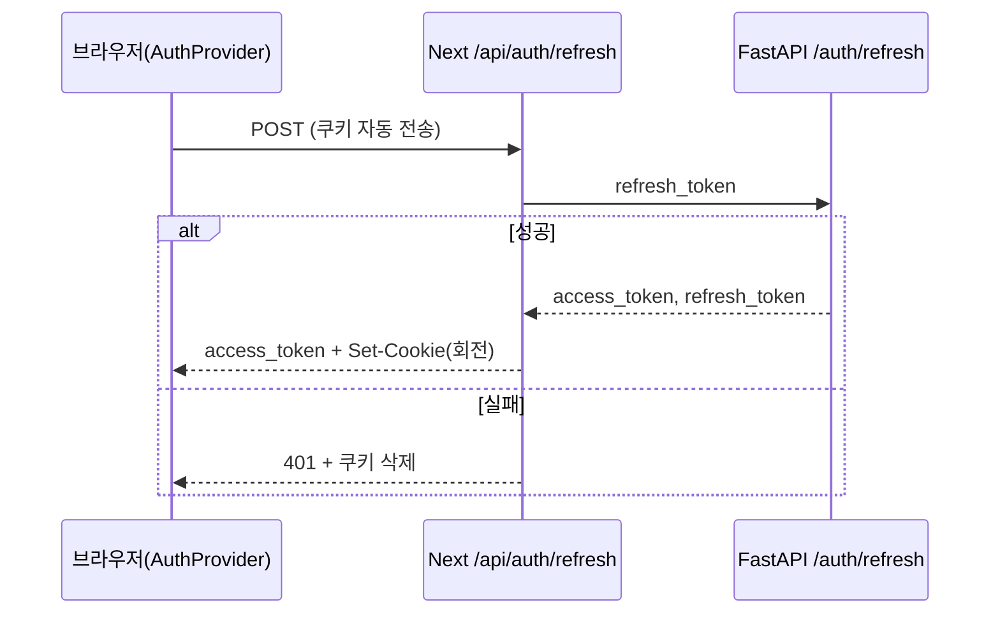

# dashboard_app_pages

`dashboard_app_pages`는 셀프호스팅 관리자 대시보드(`server/dashboard`, Next.js App Router)의 **라우트 레이어**입니다. 루트/인증/셋업 레이아웃, 인증 가드, 설정 페이지, 리프레시 토큰 쿠키 프록시 API, 헬스체크, 클라우드 전용 기능 잠금 화면을 담당합니다.

관련 모듈:
- [dashboard_ui_components](dashboard_ui_components.md): `Button`, `Card`, `ScrollArea`, `Toaster`, `ThemeProvider` 등 UI 컴포넌트
- [dashboard_client_lib](dashboard_client_lib.md): `AuthProvider`, `api` 클라이언트, `layoutReducer`, 타입 정의
- [server_auth_and_routers](server_auth_and_routers.md): 이 모듈이 호출하는 백엔드 인증 API (`/auth/*`)
- [server_deployment](server_deployment.md), [dashboard_build_config](dashboard_build_config.md): 컨테이너/빌드 (`server/dashboard/Dockerfile`, `entrypoint.sh`)

## 구성 요소 개요

| 파일 | 컴포넌트 | 역할 |
|---|---|---|
| `src/app/(root)/layout.tsx` | `DashboardLayout` | 서버 컴포넌트. 메타데이터 지정 후 `DashboardClientLayout` 렌더 |
| `src/app/(root)/dashboard-client-layout.tsx` | `DashboardClientLayout` | `<html>/<body>`, Redux `Provider`, `AuthProvider`, `ThemeProvider`, `ClientLayout`, `Toaster`(동적 import, `ssr:false`) |
| `src/app/(root)/clientLayout.tsx` | `ClientLayout` | 클라이언트 인증 가드, 사이드바 폭 상수 |
| `src/app/(root)/dashboard/layout.tsx` | `DashboardLayout` | 사이드바 접힘 상태에 따른 본문 영역 배치 |
| `src/app/(root)/dashboard/settings/page.tsx` | `SettingsPage` | 프로필/비밀번호/테마 설정 |
| `src/app/(auth)/layout.tsx` | `AuthLayout` | 로그인 라우트용 독립 루트 레이아웃 |
| `src/app/(auth)/login/page.tsx` | `LoginPage` | `Suspense`로 `LoginForm` 감쌈 |
| `src/app/setup/layout.tsx` | `SetupLayout` | 최초 설정(온보딩) 라우트용 루트 레이아웃 |
| `src/app/api/auth/refresh/route.ts` | `POST`/`PUT`/`DELETE`, `shouldUseSecureCookie` | httpOnly 리프레시 토큰 쿠키 관리 |
| `src/app/api/health/route.ts` | `GET` | 컨테이너 헬스체크 |
| `src/components/self-hosted/locked-page.tsx` | `LockedPage` | Cloud/Enterprise 전용 기능 안내 |

## 아키텍처

Next.js 라우트 그룹 `(root)`, `(auth)`, `setup`은 각각 **자체 `<html>` 루트 레이아웃**을 가집니다. 공통 프로바이더(`AuthProvider`, `ThemeProvider`)는 세 곳에서 반복 구성되며, Redux `Provider`와 `ClientLayout` 가드는 `(root)`에만 있습니다.

### 프로바이더 구성 차이

| 레이아웃 | Redux | AuthProvider | ThemeProvider 기본값 | 비고 |
|---|---|---|---|---|
| `DashboardClientLayout` | O | O | `light` + system | `Toaster` 포함 |
| `AuthLayout` | X | O | `system` | |
| `SetupLayout` | X | O | `light` (system 비활성) | |

## 인증 가드 (`ClientLayout`)

`useAuth()`의 `user`, `isLoading`을 사용합니다. `/login`, `/setup`으로 시작하는 경로는 공개 페이지로 취급합니다. 보호된 경로에서 로딩이 끝났는데 `user`가 없으면 `router.replace("/login")`로 이동하며, 그 사이에는 `AuthLoadingState`(로고 + `LinearProgress`)를 보여줍니다. 또한 사이드바 폭 상수(`SIDEBAR_WIDTH=180`, `COLLAPSED_SIDEBAR_WIDTH=64` 등)를 export하여 `dashboard/layout.tsx`가 사용합니다.

## 대시보드 셸 (`dashboard/layout.tsx`)

`NavWrapper`(같은 디렉터리 `components/nav-wrapper`)를 렌더하고, Redux의 `state.layout.isSidebarCollapsed`에 따라 본문 컨테이너의 `left`/`width`를 인라인 스타일로 계산합니다. 본문은 `ScrollArea` 안에 배치되고 `transition-all duration-300`으로 접힘 애니메이션이 적용됩니다. 상태는 `layoutReducer`/`toggleSidebar` ([dashboard_client_lib](dashboard_client_lib.md))가 관리합니다.

## 설정 페이지 (`SettingsPage`)

세 개의 카드로 구성됩니다.

- **Profile**: `name`/`email` 편집. 변경이 있고 비어 있지 않을 때만 저장 가능. `api.patch(AUTH_ENDPOINTS.ME)` 후 `refreshUser()`.
- **Password**: `current_password`/`new_password`로 `api.post(AUTH_ENDPOINTS.CHANGE_PASSWORD)`. 새 비밀번호는 8자 이상이어야 버튼이 활성화되며, 확인 값 불일치 시 토스트로 거절합니다. 성공 시 입력 초기화.
- **Appearance**: `next-themes`의 `setTheme`으로 light/dark/system 전환.

오류는 `getErrorMessage`로 변환해 destructive 토스트로 표시합니다. 대응 백엔드는 `server/routers/auth.py`의 `update_me`, `change_password` ([server_auth_and_routers](server_auth_and_routers.md)).

## 리프레시 토큰 쿠키 라우트 (`/api/auth/refresh`)

브라우저 JS가 리프레시 토큰을 직접 보관하지 않도록, 토큰을 `mem0_refresh_token` **httpOnly 쿠키**에 저장하고 Next 서버가 백엔드로 중계합니다.

| 메서드 | 동작 |
|---|---|
| `PUT` | body의 `refresh_token`을 쿠키로 저장 (로그인 직후). 없으면 400 |
| `POST` | 쿠키의 토큰으로 `${getServerApiUrl()}${AUTH_ENDPOINTS.REFRESH}` 호출 → 새 토큰 쿠키 갱신(회전), `access_token`만 응답. 쿠키 없으면 401, 백엔드 실패 시 쿠키 삭제 후 401 |
| `DELETE` | 쿠키 삭제 (로그아웃) |

쿠키 옵션: `httpOnly`, `sameSite: "lax"`, `path: "/"`, `maxAge` 30일. `secure`는 `shouldUseSecureCookie()`가 결정합니다: `DASHBOARD_URL`이 있으면 프로토콜이 `https:`인지, 없거나 파싱 실패 시 `NODE_ENV === "production"` 여부. 따라서 HTTP로 접근하는 프로덕션 배포는 `DASHBOARD_URL`을 `http://...`로 명시해야 쿠키가 저장됩니다. 참고로 `COOKIE_OPTIONS`는 모듈 로드 시 한 번 계산됩니다.

## 헬스체크 (`/api/health`)

항상 `{"status":"ok"}`(200)을 반환합니다. 컨테이너 헬스체크/대기 용도이며 (예: `server/Makefile`의 `wait-dashboard`, `server/docker-compose.yaml`의 `mem0-dashboard`), 백엔드 연결 상태는 확인하지 않는 단순 liveness입니다.

## LockedPage

오픈소스(셀프호스팅) 대시보드에서 제공하지 않는 기능 화면에 사용합니다. props: `title`, `description`, `previewContent`, `utmMedium`. 미리보기는 `opacity-60 pointer-events-none select-none`으로 비활성 표시되고, 하단 카드에 `utm_source=oss&utm_medium=<utmMedium>`이 붙은 Cloud(`https://app.mem0.ai`)와 Enterprise 영업(`/enterprise`) 링크를 제공합니다.

## 유의 사항

- 일부 import(`@/hooks/use-auth`, `@/components/ui/linearProgress`, `@/lib/server-api-url`, `@/utils/api-endpoints`, `./login-form`, `../(root)/fonts`)는 이 모듈의 핵심 컴포넌트 목록에는 없지만 의존합니다. 각각 [dashboard_client_lib](dashboard_client_lib.md) 및 [dashboard_ui_components](dashboard_ui_components.md) 계열에 속합니다.
- `(auth)`와 `setup`은 `../(root)/fonts`를 공유하므로 해당 파일 이동 시 세 레이아웃이 모두 영향받습니다.
- 서버 측 API 주소는 `getServerApiUrl()`로 해석되며, 컨테이너 환경 변수는 `server/dashboard/Dockerfile`/`entrypoint.sh`와 `server/docker-compose.yaml`에서 설정됩니다.
