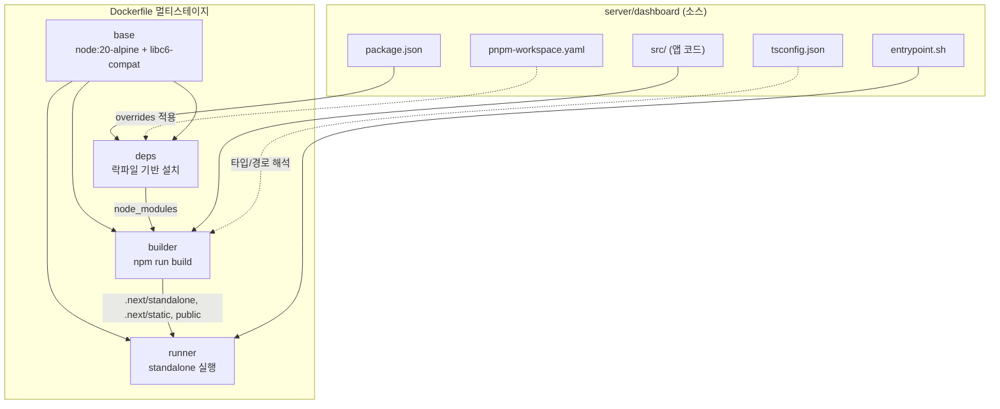
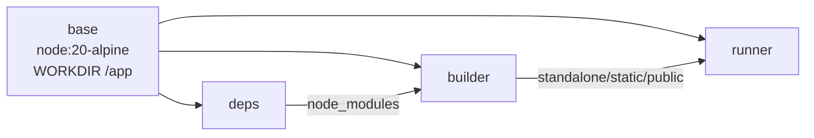
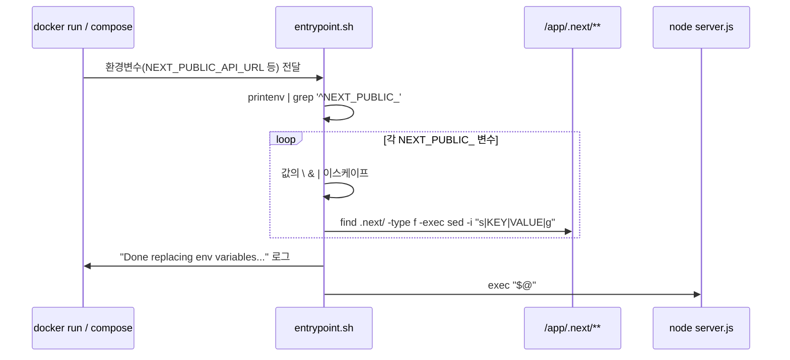
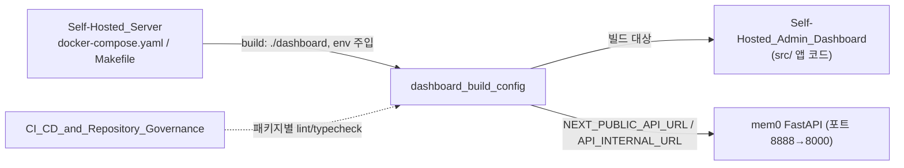

# dashboard_build_config 모듈

`server/dashboard/`에 있는 셀프호스티드 관리자 대시보드(Next.js 15 / React 19)의 **빌드·패키징·런타임 설정**을 담당하는 모듈입니다. 애플리케이션 코드(페이지, 컴포넌트, 클라이언트 라이브러리)는 [Self-Hosted_Admin_Dashboard](Self-Hosted_Admin_Dashboard.md)에서 다루고, 이 문서는 그 코드를 빌드해 컨테이너 이미지로 만들고 실행하는 파일들만 다룹니다.

| 파일 | 역할 |
|------|------|
| `server/dashboard/Dockerfile` | 4단계(`base` → `deps` → `builder` → `runner`) 멀티스테이지 이미지 빌드 |
| `server/dashboard/entrypoint.sh` | 컨테이너 시작 시 `NEXT_PUBLIC_*` 플레이스홀더를 실제 환경변수 값으로 치환 |
| `server/dashboard/package.json` | 의존성, 스크립트(`dev`, `build`, `start`, `lint`, `format`, `typecheck`), `packageManager` 고정 |
| `server/dashboard/pnpm-workspace.yaml` | 단일 패키지 워크스페이스 + 보안 `overrides` |
| `server/dashboard/tsconfig.json` | TypeScript 설정(`strict`, `@/*` 경로 별칭, Next 플러그인) |

> 참고: `next.config.*`는 이 모듈의 핵심 컴포넌트에 포함되지 않았습니다. `Dockerfile`이 `.next/standalone`을 복사하므로 `output: 'standalone'` 설정이 있다고 전제하는 구조입니다(이 문서에서는 확인하지 않은 전제).

---

## 1. 아키텍처 개요



이 모듈은 코드가 아니라 **파이프라인 정의**입니다. 핵심 설계 결정은 한 가지입니다. Next.js는 `NEXT_PUBLIC_*` 값을 빌드 시점에 번들에 인라인하므로, 이미지를 하나만 만들어 여러 환경에 배포하려면 런타임에 값을 바꿔치기해야 합니다. 이를 **플레이스홀더 치환** 방식으로 해결합니다(3절).

---

## 2. Dockerfile 스테이지



| 스테이지 | 내용 |
|----------|------|
| `base` | `node:20-alpine`, `libc6-compat` 설치(Alpine에서 일부 네이티브 모듈 호환), `WORKDIR /app` |
| `deps` | `package.json`과 `yarn.lock`/`package-lock.json`/`pnpm-lock.yaml`만 복사해 레이어 캐시를 최대화. 존재하는 락파일에 따라 `yarn --frozen-lockfile`, `npm ci`, `corepack enable pnpm && pnpm i` 중 하나 실행, 없으면 `npm install` |
| `builder` | `deps`의 `node_modules`와 전체 소스를 복사. `NEXT_TELEMETRY_DISABLED=1`, 플레이스홀더 ENV 설정 후 `npm run build` |
| `runner` | `NODE_ENV=production`. 비루트 사용자 `nextjs`(uid 1001, 그룹 `nodejs` gid 1001)로 실행. `public`, `.next/standalone`, `.next/static`, `entrypoint.sh` 복사. 포트 `3000`, `HOSTNAME=0.0.0.0` |

실행부는 다음과 같습니다.

```dockerfile
ENTRYPOINT ["/home/nextjs/entrypoint.sh"]
CMD ["node", "server.js"]
```

`server.js`는 `.next/standalone`에 포함된 Next.js 독립 실행 서버입니다.

### 주의할 점

- `deps`는 세 가지 패키지 매니저를 모두 지원하지만, `builder`는 항상 `npm run build`를 호출합니다. 저장소 전체 규칙은 pnpm 전용이고(`package.json`의 `packageManager: pnpm@10.34.2`), pnpm으로 설치한 경우에도 빌드 스크립트 호출 자체는 `npm run`을 거칩니다.
- `pnpm i`는 `--frozen-lockfile` 없이 실행되므로, 락파일과 `package.json`이 어긋나도 CI에서 실패하지 않고 조용히 갱신될 수 있습니다. 재현 가능한 빌드가 필요하면 이 부분을 점검하세요.
- `COPY . .`는 `.dockerignore`에 의존해 로컬 `node_modules`나 `.next` 유입을 막아야 합니다(이 문서에서는 확인하지 않음).

---

## 3. 런타임 환경변수 주입 (`entrypoint.sh`)

### 문제
`NEXT_PUBLIC_*` 변수는 `next build` 시점에 클라이언트 번들 리터럴로 고정됩니다. 그대로 두면 이미지가 빌드 환경의 값에 묶입니다.

### 해결
1. `Dockerfile`의 `builder` 단계에서 **변수 이름 자체를 값으로** 설정합니다.
   ```dockerfile
   ENV NEXT_PUBLIC_API_URL=NEXT_PUBLIC_API_URL
   ENV NEXT_PUBLIC_INSTANCE_NAME=NEXT_PUBLIC_INSTANCE_NAME
   ```
   그 결과 `.next/` 안에는 `NEXT_PUBLIC_API_URL`이라는 문자열이 리터럴로 박힙니다.
2. 컨테이너 시작 시 `entrypoint.sh`가 현재 환경의 `NEXT_PUBLIC_*`를 순회하며 `.next/` 아래 모든 파일에서 해당 이름을 실제 값으로 `sed -i` 치환합니다.
3. 마지막에 `exec "$@"`로 `CMD`(`node server.js`)에 제어를 넘깁니다.



### 규칙과 제약

| 항목 | 설명 |
|------|------|
| 새 변수 추가 | 새 `NEXT_PUBLIC_FOO`를 쓰려면 `Dockerfile`에 `ENV NEXT_PUBLIC_FOO=NEXT_PUBLIC_FOO`를 **반드시** 추가해야 합니다. 그렇지 않으면 번들에 리터럴 이름이 없어 치환되지 않습니다. |
| 이스케이프 | 값에서 `\`, `&`, `|`를 이스케이프합니다(`sed` 구분자가 `|`이므로). 줄바꿈이 포함된 값은 처리되지 않습니다. |
| 이름 충돌 | 치환은 단순 문자열 매칭입니다. 한 변수 이름이 다른 변수 이름의 접두사면(예: `NEXT_PUBLIC_API` vs `NEXT_PUBLIC_API_URL`) 잘못 치환될 수 있으므로 이름을 서로 겹치지 않게 지으세요. |
| 쓰기 권한 | `runner`에서 `.next/standalone`은 `nextjs:nodejs` 소유이므로 비루트 사용자가 `sed -i`로 수정할 수 있습니다. |
| 시작 비용 | 매 컨테이너 시작마다 `.next/` 전체를 변수 개수만큼 스캔합니다. |
| 서버 전용 변수 | `API_INTERNAL_URL` 같은 비-`NEXT_PUBLIC_` 변수는 치환 대상이 아니며 Node 프로세스가 런타임에 직접 읽습니다. |

`server/docker-compose.yaml`의 `mem0-dashboard` 서비스는 다음 값을 주입합니다.

| 변수 | 값(compose 기본) | 용도 |
|------|------------------|------|
| `NEXT_PUBLIC_API_URL` | `http://localhost:8888` | 브라우저가 호출하는 mem0 API 주소 |
| `API_INTERNAL_URL` | `http://mem0:8000` | 서버 측(컨테이너 간) 호출용 내부 주소 |
| `NEXT_PUBLIC_INSTANCE_NAME` | `Mem0` | UI에 표시되는 인스턴스 이름 |

헬스체크는 `wget -qO- http://127.0.0.1:3000/api/health`이며, 해당 라우트는 `src/app/api/health/route.ts`(`GET`)에서 제공됩니다. 자세한 내용은 [Self-Hosted_Admin_Dashboard](Self-Hosted_Admin_Dashboard.md)를 참고하세요.

---

## 4. `package.json`

- 이름 `mem0-dashboard`, `private: true`, `packageManager: pnpm@10.34.2`.
- 주요 의존성: `next 15.5.24`, `react`/`react-dom ^19`, Radix UI, `@tanstack/react-table`, `@reduxjs/toolkit` / `react-redux`, `axios`, `react-hook-form` + `zod`, `recharts`, `tailwind-merge`, `sonner`, `next-themes`, `framer-motion`.
- devDependencies: TypeScript 5.6, Tailwind 3 + typography, PostCSS/Autoprefixer, Prettier 3, ESLint 8 + `eslint-config-next`.

| 스크립트 | 명령 | 설명 |
|----------|------|------|
| `dev` | `next dev` | 개발 서버 |
| `build` | `next build` | 프로덕션 빌드(`Dockerfile` `builder`에서 호출) |
| `start` | `next start` | 비-standalone 방식 실행 |
| `lint` | `prettier --check .` | 포맷 검사(ESLint가 아닌 Prettier) |
| `format` | `prettier --write .` | 포맷 적용 |
| `typecheck` | `tsc --noEmit` | 타입 검사 |

`lint`가 Prettier라는 점은 [CI_CD_and_Repository_Governance](CI_CD_and_Repository_Governance.md)의 린트 규칙과 맞춰 이해해야 합니다. 루트 `CLAUDE.md`는 패키지마다 린터가 다르다고 명시합니다.

---

## 5. `pnpm-workspace.yaml`

```yaml
packages:
  - '.'
overrides: ...
```

- `packages: ['.']`: 모노레포 내 독립 단일 패키지 워크스페이스입니다.
- `overrides`: 전이 의존성의 취약 버전을 강제 상향합니다. 대상은 `form-data`, `prismjs`, `uuid`, `axios`, `brace-expansion`, `js-yaml`, `postcss`, `nanoid`, `sharp`, `browserslist`입니다. 예: `"axios@<1.18.0": ">=1.18.0 <2.0.0"`.
- 의존성 보안 패치를 추가할 때는 이 파일에 범위를 한정한 override를 넣는 패턴을 따릅니다.
- 주의: `overrides`는 pnpm에서만 적용됩니다. `Dockerfile`이 `yarn.lock`이나 `package-lock.json`을 먼저 감지해 yarn/npm으로 설치하면 이 override는 무시됩니다. 현재 디렉터리의 락파일 구성(pnpm 전용인지)이 이를 결정합니다.

---

## 6. `tsconfig.json`

| 옵션 | 값 | 의미 |
|------|----|------|
| `strict` | `true` | 엄격 모드(저장소 규칙) |
| `noEmit` | `true` | 타입 검사 전용, 출력은 Next.js가 담당 |
| `module` / `moduleResolution` | `esnext` / `bundler` | 번들러 해석 방식 |
| `jsx` | `preserve` | JSX 변환을 Next.js(SWC)에 위임 |
| `isolatedModules` | `true` | 파일 단위 트랜스파일 호환 |
| `incremental` | `true` | 증분 컴파일 |
| `plugins` | `[{ "name": "next" }]` | Next 타입 플러그인 |
| `paths` | `"@/*": ["./src/*"]` | `@/lib/utils` 같은 절대 경로 import |
| `target` | `ES2017` | |
| `include` | `next-env.d.ts`, `**/*.ts(x)`, `.next/types/**/*.ts`, `src/types` | |

`@/*` 별칭은 [dashboard_client_lib](Self-Hosted_Admin_Dashboard.md)의 `@/utils/api`, `@/lib/auth` 등 모든 내부 import가 의존합니다.

---

## 7. 시스템 내 위치와 의존 관계



- **빌드 대상**: [Self-Hosted_Admin_Dashboard](Self-Hosted_Admin_Dashboard.md)의 소스.
- **배포 오케스트레이션**: [Self-Hosted_Server_(API,_Auth,_Persistence,_Deployment)](Self-Hosted_Server_(API,_Auth,_Persistence,_Deployment).md)의 `server/docker-compose.yaml`이 `mem0-dashboard` 서비스(`build: ./dashboard`, 포트 `3000:3000`)를 정의하고, `server/Makefile`의 `wait-dashboard` 등이 이 서비스 상태를 확인합니다. 대시보드는 `mem0` 서비스가 시작된 뒤(`condition: service_started`)에 올라옵니다.
- **형제 빌드 설정 모듈**: 같은 계열의 구성으로 [ts_build_and_config](ts_build_and_config.md), [cli_node_build_config](cli_node_build_config.md)가 있으며, 이들도 pnpm 워크스페이스와 tsconfig 규칙을 공유합니다.

---

## 8. 작업 가이드

| 작업 | 방법 |
|------|------|
| 로컬 개발 | `cd server/dashboard && pnpm install && pnpm dev` |
| 타입/포맷 검사 | `pnpm typecheck`, `pnpm lint` (수정은 `pnpm format`) |
| 이미지 빌드 | `docker compose -f server/docker-compose.yaml build mem0-dashboard` 또는 `server/Makefile`의 `build` |
| API 주소 변경 | 이미지 재빌드 없이 컨테이너의 `NEXT_PUBLIC_API_URL` 환경변수만 변경 |
| 새 공개 변수 추가 | `Dockerfile`에 `ENV NAME=NAME` 추가 → 코드에서 `process.env.NAME` 사용 → 배포 시 값 주입 |
| 취약 의존성 대응 | `pnpm-workspace.yaml`의 `overrides`에 범위 한정 규칙 추가 후 락파일 갱신 |

### 흔한 문제
- **플레이스홀더가 그대로 화면/요청에 노출됨**: `Dockerfile`에 해당 `ENV NAME=NAME`이 빠졌거나 컨테이너에 변수가 주입되지 않은 경우입니다.
- **`next start`로 실행 시 치환 안 됨**: 치환은 컨테이너 `entrypoint.sh`에서만 일어나므로 컨테이너 밖 실행 시 실제 값이 빌드 시점에 필요합니다.
- **`.env`나 자격 증명 커밋 금지**: 루트 규칙을 따르세요.
