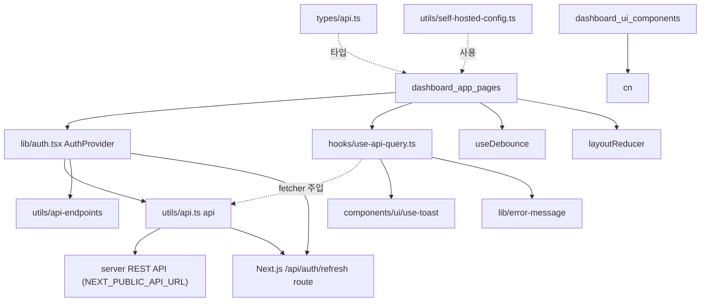
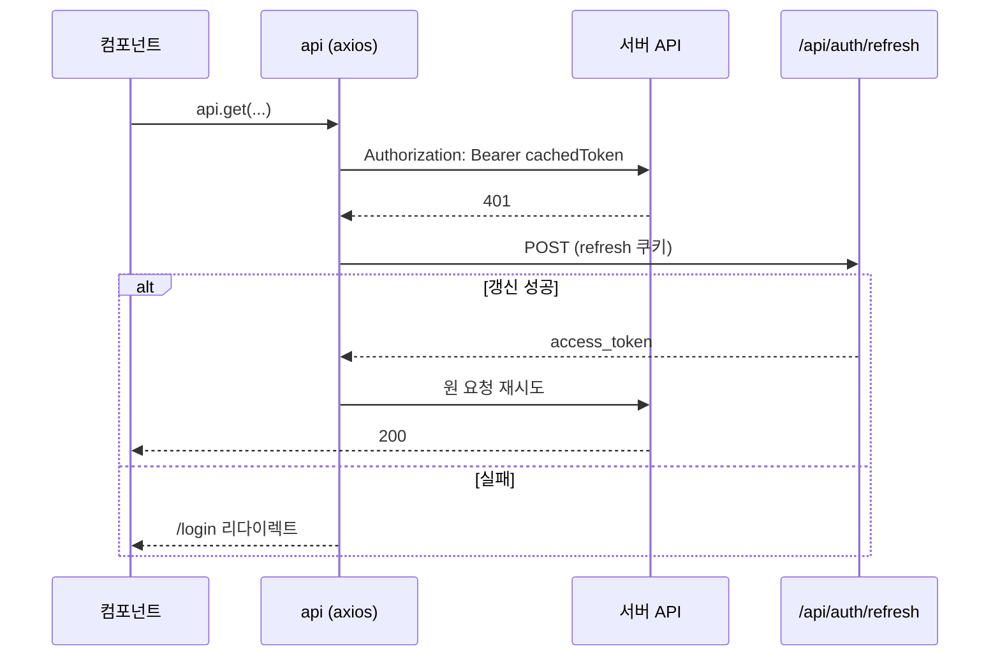
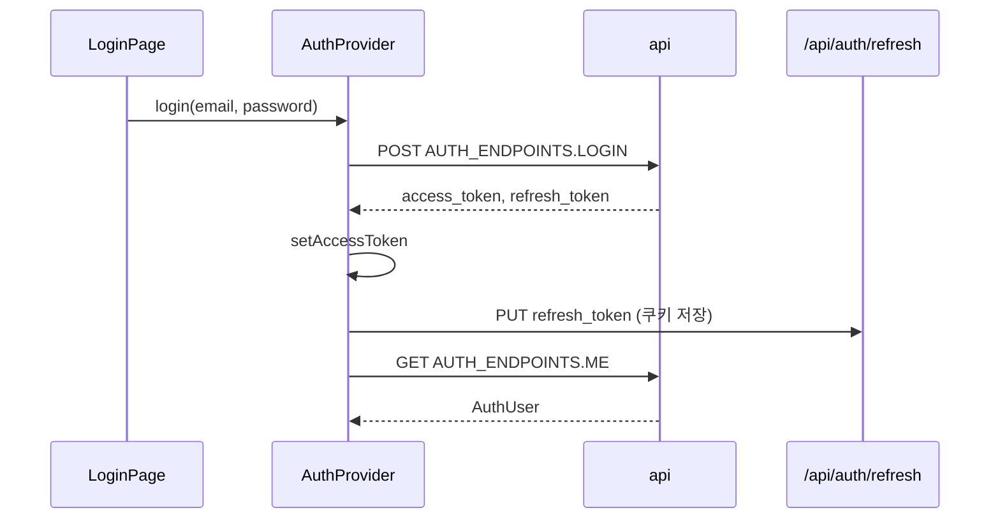

# dashboard_client_lib

`server/dashboard/src`의 클라이언트 측 공용 라이브러리 계층입니다. 셀프호스팅 관리 대시보드(Next.js)의 페이지와 UI 컴포넌트가 공통으로 사용하는 **API 클라이언트, 인증 컨텍스트, 데이터 조회 훅, API 응답 타입, 작은 유틸리티**를 담고 있습니다.

- 페이지/레이아웃: [dashboard_app_pages](dashboard_app_pages.md)
- UI 컴포넌트: [dashboard_ui_components](dashboard_ui_components.md)
- 대시보드가 호출하는 백엔드: [server_auth_and_routers](server_auth_and_routers.md), [server_api_core](server_api_core.md)
- 빌드/배포 설정: [Build_Configuration_and_Tooling](Build_Configuration_and_Tooling.md) (`dashboard_build_config`)

## 구성 요소

| 파일 | 핵심 export | 역할 |
|------|-------------|------|
| `utils/api.ts` | `api`, `setAccessToken`, `getAccessToken`, `postStream` | axios 인스턴스, Bearer 토큰 주입, 401 시 자동 갱신 |
| `lib/auth.tsx` | `AuthProvider`, `AuthContext`, `AuthUser` | 로그인 상태·토큰 수명주기 관리 |
| `hooks/use-api-query.ts` | `useApiQuery` | 로딩/에러/데이터 상태를 가진 조회 훅 |
| `hooks/useDebounce.ts` | `useDebounce` (default export) | 값 디바운스 |
| `types/api.ts` | `Memory`, `ApiKey`, `ApiKeyCreateResponse`, `ApiRequestLog`, `Entity`, `EntityType` | 서버 응답 형태 |
| `utils/self-hosted-config.ts` | `getEffectiveConfig`, `buildProviderConfig` | 서버 설정 응답 파싱 및 LLM/임베더 설정 페이로드 생성 |
| `store/reducers/layoutReducer.ts` | `layoutReducer`, `toggleSidebar` | 사이드바 접힘 상태 |
| `lib/utils.ts` | `cn`, `formatCompactNumber` | Tailwind 클래스 병합, 숫자 축약 |
| `lib/validators.ts` | `isValidEmail` | 이메일 정규식 검증 |
| `utils/helpers.ts` | `toTitleCase` | 문자열 타이틀 케이스 |

> 참고: 모듈 트리에는 `createApi`가 핵심 컴포넌트로 나오지만, 코드상 `createApi`는 `utils/api.ts` 내부 함수이며 외부에서는 `api` 싱글턴과 `setAccessToken`/`getAccessToken`을 사용합니다.
> 또한 `useApiQuery`, `AuthProvider`는 이 모듈 밖의 `@/lib/error-message`, `@/components/ui/use-toast`, `@/utils/api-endpoints`에 의존하며, 해당 파일의 내용은 이번 분석 범위에 포함되지 않았습니다.

## 아키텍처



## 핵심 동작

### 1. API 클라이언트 (`utils/api.ts`)

- 액세스 토큰은 **모듈 메모리 변수(`cachedToken`)** 에만 보관됩니다. localStorage에 저장하지 않습니다.
- 요청 인터셉터: 토큰이 있으면 `Authorization: Bearer <token>` 부착.
- 응답 인터셉터: 401이면 토큰을 비우고 `POST /api/auth/refresh`(쿠키 포함)로 새 액세스 토큰을 받아 원 요청을 **재시도**합니다. 실패하면 `/login`으로 리다이렉트합니다.
- 서버가 `{ error: "..." }`를 돌려주면 reject 값이 에러 객체가 아니라 **문자열**이 됩니다. 호출 측에서 이 점을 고려해야 합니다.
- `postStream(url, data)`: 스트리밍용 `fetch` 래퍼. axios 인터셉터를 거치지 않으므로 401 시 갱신 없이 바로 로그인으로 이동합니다.
- `baseURL`은 `process.env.NEXT_PUBLIC_API_URL`입니다. 빌드/런타임 주입은 `server/dashboard/Dockerfile`, `entrypoint.sh`를 참고하세요.



### 2. 인증 (`lib/auth.tsx`)

`AuthProvider`는 `AuthContext`로 `user`, `isLoading`, `isAdmin`(`role === "admin"`), `login`, `register`, `logout`, `refreshUser`를 제공합니다.

- **마운트 시**: `refreshSession()`으로 refresh 쿠키 기반 세션 복원 → 성공하면 `AUTH_ENDPOINTS.ME` 조회. 언마운트 후 상태 업데이트를 막기 위해 `active` 플래그를 사용합니다.
- **login/register**: 액세스 토큰은 메모리에, 리프레시 토큰은 `PUT /api/auth/refresh`로 Next.js 라우트에 넘겨 쿠키로 저장(서버 쪽 처리는 [dashboard_app_pages](dashboard_app_pages.md)의 `api/auth/refresh/route.ts`).
- **logout**: `DELETE /api/auth/refresh`로 쿠키 제거 → 토큰/유저 초기화 → `/login`으로 이동.



### 3. 데이터 조회 훅 (`useApiQuery`)

`useApiQuery(fetcher, { enabled, errorToast, initialData })` → `{ data, isLoading, error, refetch }`.

- `fetcher`는 `useRef`에 보관되어 매 렌더의 새 함수가 재조회를 유발하지 않습니다. 재조회는 `enabled`/`errorToast` 변경 또는 `refetch()` 호출로만 일어납니다.
- 실패 시 `error` 문자열을 설정하고, `errorToast`가 있을 때만 destructive 토스트를 띄웁니다.
- 주의: 요청 취소/경쟁 상태 처리가 없어, 빠르게 `refetch`를 연달아 호출하면 마지막으로 **끝난** 응답이 반영됩니다.
- `enabled`의 초기 `isLoading` 값은 `enabled`를 따릅니다.

```tsx
const { data, isLoading } = useApiQuery(
  () => api.get<Memory[]>("/memories").then((r) => r.data),
  { errorToast: "메모리를 불러오지 못했습니다" },
);
```

### 4. 기타 유틸리티

- `useDebounce(value, delay = 500)`: 검색 입력 등에서 사용. default export임에 유의하세요(`import useDebounce from ...`).
- `layoutReducer`: `TOGGLE_SIDEBAR` 액션 하나만 처리하는 순수 리듀서. `toggleSidebar()`는 액션 생성자입니다.
- `getEffectiveConfig(data)`: 설정 응답에서 `effective_config` → `config` → 객체 자체 순으로 폴백해 `EffectiveConfig`(`llm`, `embedder`)를 반환합니다. 객체가 아니면 `null`.
- `buildProviderConfig({ provider, model, apiKey })`: `provider`가 비면 `undefined`, 빈 `model`/`apiKey`는 `undefined`로 바꿔 JSON 직렬화 시 제외되게 합니다. 설정 페이지(`SettingsPage`)가 서버의 `set_config` 엔드포인트로 보낼 때 사용하는 형태입니다. 엔드포인트 정의는 [server_api_core](server_api_core.md)를 참고하세요.
- `cn(...)`: `clsx` + `tailwind-merge`. `formatCompactNumber`: 유한하지 않은 값은 `"0"`, 그 외 `Intl.NumberFormat("en", compact)`.
- `isValidEmail`: 공백 제거 후 `^[^\s@]+@[^\s@]+\.[^\s@]+$` 검사(형식 수준의 가벼운 검증이며 서버 검증을 대체하지 않음).
- `toTitleCase`: 소문자화 후 단어 첫 글자를 대문자화.

## 타입 (`types/api.ts`)

`Memory`, `Entity`(`type: "user" | "agent" | "run"`), `ApiRequestLog`, `ApiKey`, `ApiKeyCreateResponse`는 서버의 라우터 응답과 맞춰 수작업으로 유지되는 타입입니다. 서버 스키마가 바뀌면 함께 수정해야 합니다. 관련 서버 측: `server/routers/api_keys.py`, `entities.py`, `requests.py` ([server_auth_and_routers](server_auth_and_routers.md)). `ApiKeyCreateResponse.key`는 생성 시 한 번만 평문으로 내려오는 값으로 간주하고 저장하지 않는 것이 안전합니다.

## 유지보수 메모

- 토큰이 메모리에만 있으므로 새로고침 때마다 `AuthProvider`가 refresh 쿠키로 세션을 복원합니다. 이 경로가 깨지면 모든 페이지가 로그인으로 돌아갑니다.
- 401 갱신 로직이 `utils/api.ts`와 `lib/auth.tsx`에 각각(`refreshAccessToken`, `refreshSession`) 중복 구현되어 있습니다. 변경 시 양쪽을 함께 확인하세요.
- 의존성(`axios`, `clsx`, `tailwind-merge`)과 스크립트(`build`, `dev`, `lint`, `typecheck`)는 `server/dashboard/package.json`에서 확인할 수 있습니다.
